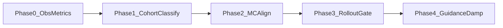

# GNC implementation roadmap (replay, staged, low regression)

**Canonical copy in repo:** [docs/gnc_implementation_roadmap_41a8c5bb.plan.md](docs/gnc_implementation_roadmap_41a8c5bb.plan.md) — ใช้เป็นเอกสารอ้างอิงใน git; แผน Cursor นี้สรุปเนื้อเดียวกันและเลข Phase เป็น 0–4 ให้ตรงกันทั้งเอกสาร

**Principles:** observability first; small diffs; keep [`guidance_lib.solve_intercept_time`](src/gazebo_target_sim/gazebo_target_sim/guidance_lib.py) / [`compute_intercept`](src/gazebo_target_sim/gazebo_target_sim/guidance_lib.py) unless A/B proves fault; reuse [`simulate_intercept_once`](src/gazebo_target_sim/gazebo_target_sim/interception_logic_node.py), [`_monte_carlo_kinematic_hit_rollout`](src/gazebo_target_sim/gazebo_target_sim/interception_logic_node.py), [`estimate_hit_probability`](src/gazebo_target_sim/gazebo_target_sim/interception_logic_node.py), `t_go_filter_alpha` / `_t_go_filtered` (~L1534, ~L4528 in [`interception_logic_node.py`](src/gazebo_target_sim/gazebo_target_sim/interception_logic_node.py)), [`filter_t_go`](src/gazebo_target_sim/gazebo_target_sim/guidance_lib.py).

---

## Phase 0 — Structured metrics (no control change)

| What | Where |
|------|--------|
| Periodic `[ENG_METRIC] key=value ...` | New helper in [`interception_logic_node.py`](src/gazebo_target_sim/gazebo_target_sim/interception_logic_node.py) near feasibility / `t_hit` / `[FEAS_WARN]` (~L3119+). |
| Gate default off | `eng_metrics_period_s` default `0`. |
| First fields | `range_m`, `v_closing` (derive if needed), `t_go_raw`, `t_go_filt`, `feasible_geom`, `selected_iid`, cmd omega/speed pre-sat if available. |

**Tests:** [`scripts/ci_eval.sh`](scripts/ci_eval.sh) `tier0`; `tier1`; `rg '\[ENG_METRIC\]'` only when param on.

**Success:** Lines appear when enabled; ~5× tier1 with param off unchanged vs baseline.

---

## Phase 1 — Cohorts + failure classification (offline-first)

| What | Where |
|------|--------|
| Cohort tag at capture | [`scripts/run_capture.py`](scripts/run_capture.py): optional `--cohort` → `.meta.json` field or `notes`. |
| Aggregate filter | [`scripts/monte_carlo.py`](scripts/monte_carlo.py) `aggregate`: `--meta-cohort` or `--notes-substring`. |
| CI docs / defaults | [`scripts/ci_eval.sh`](scripts/ci_eval.sh) + [`scripts/evaluation/README.md`](scripts/evaluation/README.md): avoid naked `*.log` for tier3 examples. |
| Classifier | New [`scripts/evaluation/classify_run.py`](scripts/evaluation/classify_run.py) → `failure_class` F1..F5 (timeout, geom-not-dyn, track instability, assignment, unknown). |
| Matrix column (optional) | [`run_scenario_matrix.py`](scripts/run_scenario_matrix.py) after `evaluation_row`. |

**Tests:** Pytest on 2–3 synthetic log strings; `tier0`.

**Success:** Filtered `n_runs` matches cohort; matrix CSV can carry `failure_class`.

---

## Phase 2 — Monte Carlo / heatmap vs Gazebo dynamics

**Fact:** Live heatmap already uses `estimate_hit_probability(..., use_kinematic_rollout=True, rollout_max_turn_rate_rad_s=self._max_turn_rate, rollout_max_accel_m_s2=self._max_accel)` (~L2392–L2410 same file).

| What | Where |
|------|--------|
| Fix offline mismatch | [`scripts/render_intercept_heatmap_prob_offline.py`](scripts/render_intercept_heatmap_prob_offline.py): replace hardcoded `1.5` rad/s with CLI args aligned to [`gazebo_target.launch.py`](src/gazebo_target_sim/launch/gazebo_target.launch.py) defaults. |
| Doc invariant | [`scripts/evaluation/README.md`](scripts/evaluation/README.md): rollout limits must match node. |
| Eval policy | Document: official P(hit) = rollout branch; light model = debug only. |

**Tests:** Fixture dry-run; spot-check 3 cells vs node export if available.

**Success:** Documented command; P(hit) within agreed tolerance on spot-checks.

---

## Phase 3 — Dynamics-aware feasibility gating (default OFF)

| What | Where |
|------|--------|
| Params | `eng_rollout_feasibility_gate` (false), `eng_rollout_gate_horizon_s`. |
| Logic | Same file: before hard engage / alongside `is_intercept_feasible`, optional `simulate_intercept_once(..., use_kinematic_rollout=True, ...)` with same limits as heatmap. |
| Log | `[ENG_GATE] rollout_ok=...`. |

**Tests:** Unit synthetic; tier1 gate off vs on (off identical).

**Success:** Stress cohort: fewer false engages / oracle mismatch; baseline cohort not worse >5% on N≥20 tagged runs.

---

## Phase 4 — Guidance damping / terminal blending (no-op defaults)

| What | Where |
|------|--------|
| Aim slew | `guidance_u_max_step_rad` default π (no-op) in command assembly (search `align_speed` / intercept consumers in [`interception_logic_node.py`](src/gazebo_target_sim/gazebo_target_sim/interception_logic_node.py)). |
| Terminal blend | `guidance_terminal_range_m`, `guidance_terminal_pn_weight` — blend to pursuit/PN in terminal; reuse `_true_pn_acceleration` / existing PN flags. |

**Tests:** `tier0`; compare `[ENG_METRIC]` jerk before/after when enabled.

**Success:** Lower `delta_t_go` / heading variance; P95 miss not worse on `matrix_v1` cohort N≥30.

---

## Risk table

| Class | Risk |
|-------|------|
| Logging, cohort meta, classify offline, monte_carlo filters | Low |
| Offline heatmap CLI | Low–medium |
| Rollout gate (default off) | Medium |
| u slew + terminal blend | Medium–high |

---

## Commands after each phase

- After 0–1: `./scripts/ci_eval.sh tier0`; `tier1`; `tier3-aggregate --pattern '<cohort-scoped>'`; `pytest`.
- After 2: `python3 scripts/render_intercept_heatmap_prob_offline.py --help` + fixture.
- After 3–4: `tier2-smoke` A/B; review matrix CSV + `[ENG_METRIC]`.

---

## Todos (implementation)

- phase0-eng-metrics: `[ENG_METRIC]` + param default off
- phase1-cohort-classify: `run_capture` cohort, `monte_carlo` filter, `classify_run.py` + tests
- phase2-mc-align: offline heatmap CLI = launch limits; README
- phase3-rollout-gate: param-off rollout gate
- phase4-guidance-damp: u slew + terminal blend, no-op defaults
