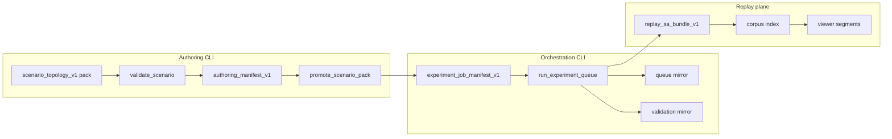

# Authoring Workflow Continuity (v1)

**Phase:** PLAN-SA-A1 — authoring workstation foundations  
**Extends:** [experiment_workflow_continuity_v1.md](experiment_workflow_continuity_v1.md), [experiment_workflow_scenario_to_replay_v1.md](experiment_workflow_scenario_to_replay_v1.md)

End-to-end continuity from **scenario pack authoring** through **orchestration mirrors** to **replay/corpus viewer segments**. CLI/CI remains execution authority; the browser consumes frozen mirrors only.

---

## Full continuity chain

**Narrative path:**

`draft pack` → `lint` → `validate` → `promote` → `[catalog sync]` → `orchestration manifest` → `queue mirror` → `bundle` → `corpus lineage` → `viewer segments`

---

## Maintainer path (CLI)

| Step | Artifact | Script |
|------|----------|--------|
| 1 | `fixtures/scenarios/<pack_id>/` | Manual edit / fork |
| 2 | Lint result | `validate_scenario.py` |
| 3 | `authoring_manifest.json` | `promote_scenario_pack.py` (PLAT-SA-A1) |
| 4 | `validation_mirrors/*.json` | Queue step `validation_mirror` or validate helper |
| 5 | `fixtures/scenarios/index.json` | `sync_sa_catalog.py` |
| 6 | `fixtures/orchestration/manifests/*.json` | Maintainer-authored manifest |
| 7 | `fixtures/orchestration/queues/*_queue.json` | `run_experiment_queue.py` |
| 8 | `fixtures/sa_r0/demo_*/` | Pipeline bundle steps |
| 9 | Corpus index / release | `run_replay_corpus_regen.py` (optional) |

Sync mirrors to viewer: `sync_orchestration_mirrors.py` and `sync_authoring_mirrors.py` → `platform/sa-r0-viewer/public/demo/` (includes `authoring/integrity_report.json` per PLAT-SA-A2).

**Catalog coverage (PLAT-SA-A2):** all 11 packs in `fixtures/scenarios/index.json` SHOULD have `authoring_manifest.json`, validation mirror, and viewer mirror after backfill.

---

## Reviewer path (browser)

Extends H4 five-segment path with **authoring cognition** on Scenario segment.

| Segment | Authoring continuity | Replay continuity (H4) |
|---------|----------------------|-------------------------|
| **Scenario** | Topology inspector, validation mirror, promotion status, lineage, orchestration handoff refs, integrity mirror (A2) | Pack pick; validation + queue mirrors read-only |
| **Replay** | — | Bundle load; experiment lineage hops |
| **Compare** | — | Pair catalog; A/B divergence |
| **Corpus** | — | Index browser; evolution chronology |
| **Report** | — | Storyboard / walkthrough |

CLI still runs `run_experiment_queue.py`; the viewer never launches simulation.

### URL param precedence (unchanged)

| Param | Effect |
|-------|--------|
| `corpus_entry` | Corpus entry first |
| `sweep` | Sweep workstation |
| `pair` / `compare` | Compare mode |
| `presentation` / `walkthrough` | Report mode |
| `demo` | Single replay bundle |
| `orchestration_queue` | Queue mirror id (explanatory) |

Authoring-specific deep links (PLAT-SA-A1): optional `?authoring_pack=<pack_id>` loads scenario segment with authoring mirrors (read-only).

### Deep links from mirrors

| Mirror field | Navigation |
|--------------|------------|
| `scenario_pack_id` | Scenario segment + pack context |
| `validation_snapshot_ref` | Validation mirror panel |
| `manifest_id` / `job_id` | Orchestration handoff panel |
| `bundle_path` / `demo` | Replay segment |
| `corpus_ref` | Corpus segment when indexed |

Queue job provenance navigation unchanged ([experiment_workflow_continuity_v1.md](experiment_workflow_continuity_v1.md)).

---

## Plane boundaries in the viewer

| Panel | Lineage plane | See |
|-------|---------------|-----|
| `authoring.lineage` | Topology derivation | [scenario_lineage_provenance_v1.md](scenario_lineage_provenance_v1.md) §2 |
| `authoring.promotion_status` | Authoring promotion | §3 |
| `workflow.lineage` | Replay / corpus | §4 |

Do not present a single merged “authority tree” across planes.

---

## Handoff gates

| Transition | Gate |
|------------|------|
| Promote → catalog sync | `promotion_status >= promoted` |
| Promote → orchestration job | `promotion_status >= promoted`; fresh validation mirror |
| Orchestration → bundle | Queue step success (CLI); mirror `status` explanatory in viewer |
| Bundle → corpus | Regen workflow; separate F1d release gate |

---

## Related

- [scenario_authoring_workflow_v1.md](scenario_authoring_workflow_v1.md)
- [h4_sandbox_replay_workstation_integration_plan.md](../platform/h4_sandbox_replay_workstation_integration_plan.md)
- [sa_a1_authoring_workstation_foundations_plan.md](../platform/sa_a1_authoring_workstation_foundations_plan.md)
- [scenario_authoring_operations_v1.md](scenario_authoring_operations_v1.md) (PLAT-SA-A2)
- [sa_a2_authoring_operations_plan.md](../platform/sa_a2_authoring_operations_plan.md)

*End of authoring workflow continuity v1.*
