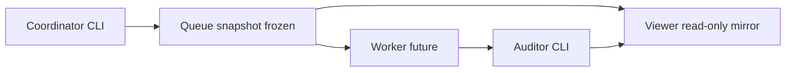

# Experiment Orchestration Async Model (`experiment_orchestration_async_model_v1`)

**Phase:** PLAN-SA-I2 — async orchestration planning (docs only)  
**Authority:** [AGENTS.md](../../AGENTS.md); [sa_i2_async_orchestration_plan.md](../platform/sa_i2_async_orchestration_plan.md)

Defines the **governance-safe future model** for async orchestration on frozen H3/I1 foundations. **Not** parser-visible. **Not** implemented in PLAN-SA-I2.

---

## 1. Worker topology (conceptual)

Three roles; no deployment in this wave.

| Role | Authority | Responsibility |
|------|-----------|----------------|
| **Coordinator** | CLI (`run_experiment_queue.py`, `promote_experiment_manifest.py`) | Publishes immutable `experiment_run_queue_v1` snapshots; records ops sidecar transitions; never mutates in-flight snapshots |
| **Worker** | Future CLI/daemon (PLAT-SA-I2+) | Claims `(queue_id, manifest_fingerprint, snapshot_hash)`; executes steps from frozen `experiment_job_manifest_v1` only |
| **Auditor** | CLI (`audit_orchestration_integrity.py`, future async audit) | Corpus-wide reconciliation; workers **cannot** self-certify integrity |



**Scaling boundaries (planning):**

- Single-tenant queue claim per manifest snapshot unless federation wave explicitly authorizes multi-corpus design
- Workers are stateless relative to queue content: all state in snapshots, reports, and additive sidecars
- No worker-to-viewer direct writes; mirrors refreshed only via `sync_orchestration_mirrors.py`

---

## 2. Queue isolation

| Rule | Rationale |
|------|-----------|
| One active claim per `(snapshot_hash, manifest_id)` | Prevents duplicate execution of same frozen inputs |
| Supersession = new snapshot + new claim record | Append-only lineage; old snapshot marked `superseded` (read-only) |
| No cross-manifest queue writes | Manifest boundaries remain H3/I1 authoritative |
| No viewer-initiated queue refresh | Browser observes mirrors only |
| No hidden mutation | All queue changes via CLI with `experiment_run_report_v1` audit trail |

Immutable snapshot rule: once a queue snapshot is published for ops `queued`/`executed`, in-place step or job edits are forbidden. Corrections require a new snapshot and reconciliation per [experiment_orchestration_async_governance_v1.md](experiment_orchestration_async_governance_v1.md).

---

## 3. Replay generation boundaries

Async replay generation must preserve the I1 continuity chain in [experiment_orchestration_continuity_v1.md](experiment_orchestration_continuity_v1.md):

```
scenario_topology_v1 → authoring → validation_mirror → job_manifest → ops_sidecar → queue → report → demo bundle → corpus
```

| Boundary | Rule |
|----------|------|
| Default path | Validation-only manifests (`*_validation.json`) remain default for 12-pack |
| Reference pipeline | Full synthetic replay remains `ridge_defense_synthetic` reference only |
| Determinism | Nondeterministic capture (undeclared seeds, wall-clock coupling, env drift) forbidden unless manifest declares seed policy and records fingerprint |
| Bundle authority | Replay bundles under `fixtures/sa_r0/` remain CLI-produced; async workers do not bypass `verify_replay_outputs` |

---

## 4. Deterministic execution model

Builds on I1 `manifest_fingerprint` ([experiment_orchestration_ops_manifest_v1.md](experiment_orchestration_ops_manifest_v1.md)).

### Proposed `execution_fingerprint`

SHA-256 over canonical JSON of:

- `manifest_id` + current job manifest hash
- `queue_snapshot_hash` (hash of frozen `experiment_run_queue_v1` file)
- Per-step outcome hashes from `experiment_run_report_v1`
- Manifest `outputs` paths when `replay_generated`

**Idempotency:** Re-execution of the same frozen snapshot must yield the same `execution_fingerprint`, or transition to explicit `failed` / `quarantined` with a stable reason code (never silent drift).

**Dry-run vs live:** Queue job/step `status` (`dry_run`, `running`, `completed`, `failed`) remains H3 run bookkeeping. `operations_status` remains I1 maintainer lifecycle. Async plane uses proposed `async_execution_status` (§5) — three planes must not be conflated in viewer copy.

### Deterministic async constraints (I2.3)

| Guarantee | Mechanism |
|-----------|-----------|
| Replay fingerprint | SHA-256 over bundle `index.json` + manifest `outputs` refs |
| Execution reproducibility | Frozen inputs → recorded step hashes in audit report |
| Queue replayability | Re-run from same `queue_snapshot_ref` produces comparable report or explicit failure |
| Audit continuity | I1 cross-plane checks + proposed `worker_execution_record_ref` |
| Worker provenance | Future required: `worker_id`, `claim_token`, `started_at`, `snapshot_hash` |
| Artifact lineage | Additive-only; mirrors ≠ authority |

---

## 5. Lifecycle expansion (read-only semantics — I2.4)

**Do not modify** frozen `operations_status` in I1. Proposed parallel plane **`async_execution_status`** (future sidecar field or queue extension):

| Status | Meaning | Viewer (future) |
|--------|---------|-----------------|
| `retrying` | CLI re-queued after bounded failure | Explanatory badge only |
| `failed` | Terminal step or manifest failure | Read-only |
| `quarantined` | Integrity hold; block forward promote | Read-only + audit link |
| `superseded` | Replaced by newer snapshot/claim | Read-only lineage |

Transitions are **CLI-only** when PLAT-SA-I2+ implements. Browser never sets async status.

Coarse mapping to I1 groups (explanatory, not authoritative):

| I1 `operations_status` | Async plane may add |
|------------------------|---------------------|
| `executed` | `retrying`, `failed` on worker fault |
| `replay_generated` | `quarantined` if bundle fingerprint stale |
| `archived` | `superseded` when new snapshot chain exists |

---

## 6. Failure and recovery semantics

| Failure class | Detection | Recovery posture |
|---------------|-----------|------------------|
| Partial step completion | Report terminal state ≠ queue step state | New snapshot; never patch in-place |
| Stale manifest fingerprint | I1 `is_manifest_stale` | Downgrade ops to `pending`; block promote |
| Orphan worker claim | `queue_claim_token_v1` without queue closure | `quarantined`; audit flag |
| Stale replay bundle | Bundle hash ≠ ops-recorded fingerprint | Read-only warning; regen via new scoped wave |
| Worker crash mid-job | Step `running` without report closure | `retrying` via CLI re-queue only |
| Duplicate claim | Second worker same `(snapshot_hash, manifest_id)` | Reject claim; audit error |

Recovery principle: **reconcile forward** (new snapshot, new report, additive lineage), never mutate historical snapshots or reports.

---

## 7. Async artifacts (PLAT-SA-I2 + I3 extensions)

| `artifact_type` | Phase | Purpose |
|-----------------|-------|---------|
| `queue_claim_token_v1` | I2 | Records worker claim against snapshot hash |
| `worker_execution_record_v1` | I2 | Per-worker step execution provenance |
| `orchestration_async_integrity_report_v1` | I2 | Corpus async dimension audit |
| `orchestration_recovery_report_v1` | I3 | Per-manifest recovery/reconciliation report |
| `orchestration_async_batch_audit_v1` | I3 | Corpus batch async review summary |
| `orchestration_reconciliation_lineage_index_v1` | I3 | Supersede/retry lineage index |

Each artifact must include `governance.notice` and `governance.anti_claims` per platform lint rules.

---

## 8. Async continuity extensions

Extends [experiment_orchestration_continuity_v1.md](experiment_orchestration_continuity_v1.md) additively:

```
… → experiment_run_report_v1
  → [proposed] queue_claim_token_v1
  → [proposed] worker_execution_record_v1
  → replay demo bundle
  → …
```

Cross-plane checks (future PLAT-SA-I2+):

- `claim_token.manifest_id` ↔ job manifest
- `claim_token.snapshot_hash` ↔ queue file hash
- `worker_record.claim_token` ↔ open or terminal claim
- `execution_fingerprint` ↔ ops sidecar when `replay_generated`

---

## Related

- [experiment_orchestration_async_safety_v1.md](experiment_orchestration_async_safety_v1.md)
- [experiment_orchestration_async_governance_v1.md](experiment_orchestration_async_governance_v1.md)
- [experiment_orchestration_ops_manifest_v1.md](experiment_orchestration_ops_manifest_v1.md)
- [experiment_run_queue_v1.md](experiment_run_queue_v1.md)

*End of experiment orchestration async model v1.*
