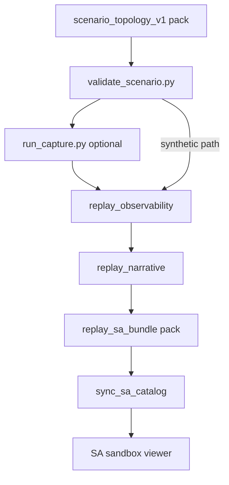

# Experiment Workflow: Scenario → Replay (`experiment_workflow_scenario_to_replay_v1`)

**Phase:** PLAT-SA-H3 — offline foundations

## End-to-end flow



## Execution surfaces

| Surface | Role |
|---------|------|
| `experiment_job_manifest_v1` | Declares jobs and pipeline steps |
| `run_experiment_queue.py` | Offline runner (maintainer/CI) |
| `experiment_run_queue_v1` | Frozen status mirror for viewer |
| SA sandbox viewer | Read-only status — **never** launches sim |

## Default CI path (deterministic)

1. Validate scenario pack  
2. `validation_mirror` artifact  
3. `synthetic_demo_regen` via `sync_sa_catalog.py` (existing demo logs)  
4. Optional `corpus_regen --dry-run`  

No Gazebo in default tier0 H3 checks.

## Live capture path (maintainer only)

1. `run_capture.py` with aligned launch args  
2. `replay_observability` + `narrative` on `runs/logs/*.log`  
3. `replay_sa_bundle.py pack --scenario-pack`  
4. `sync_sa_catalog.py`  

Requires `run_experiment_queue.py --allow-runtime-capture` when manifest includes `runtime_capture` steps.

## Provenance

Queue job records carry `scenario_pack_id`, `run_id`, `log_path`, `bundle_path`, and optional `corpus_ref`. These mirror F1 corpus lineage — they do not certify operational effectiveness.

## Commands

```bash
python3 scripts/evaluation/lint_experiment_manifest.py fixtures/orchestration/manifests/
python3 scripts/evaluation/run_experiment_queue.py --manifest fixtures/orchestration/manifests/ridge_defense_synthetic.json --dry-run
python3 scripts/evaluation/run_experiment_queue.py --manifest fixtures/orchestration/manifests/valley_ingress_validation.json --job valley_ingress_validate
```

## Related

- [sa_platform_maintainer_checklist.md](sa_platform_maintainer_checklist.md)
- [replay_corpus_regen_workflow_v1.md](replay_corpus_regen_workflow_v1.md)
