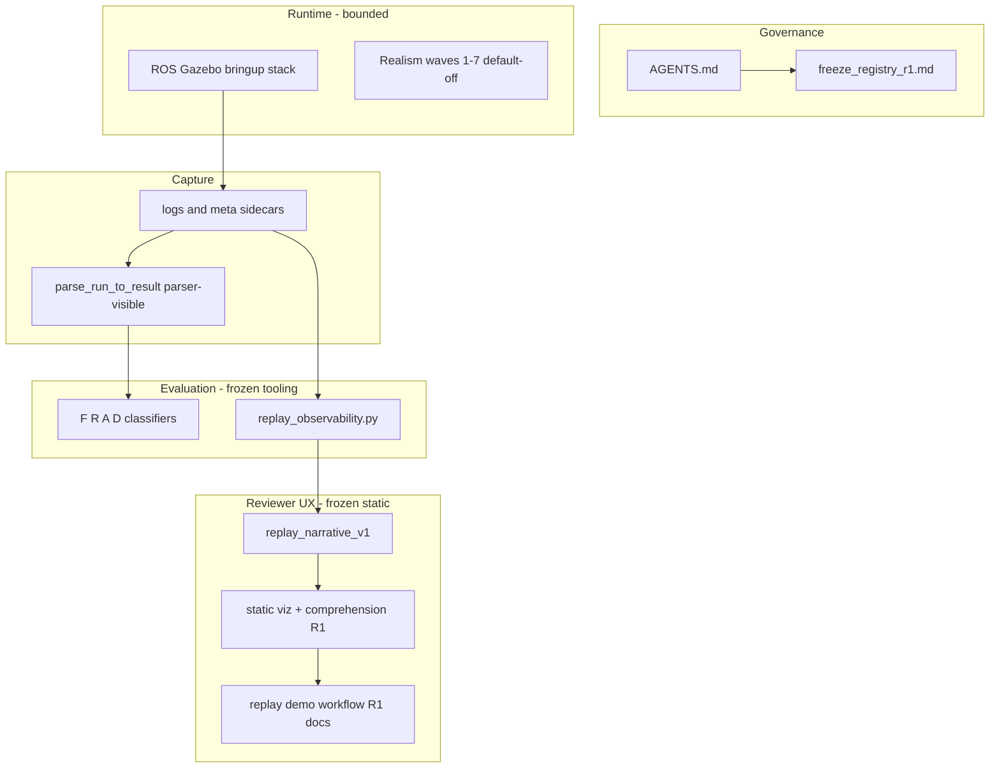
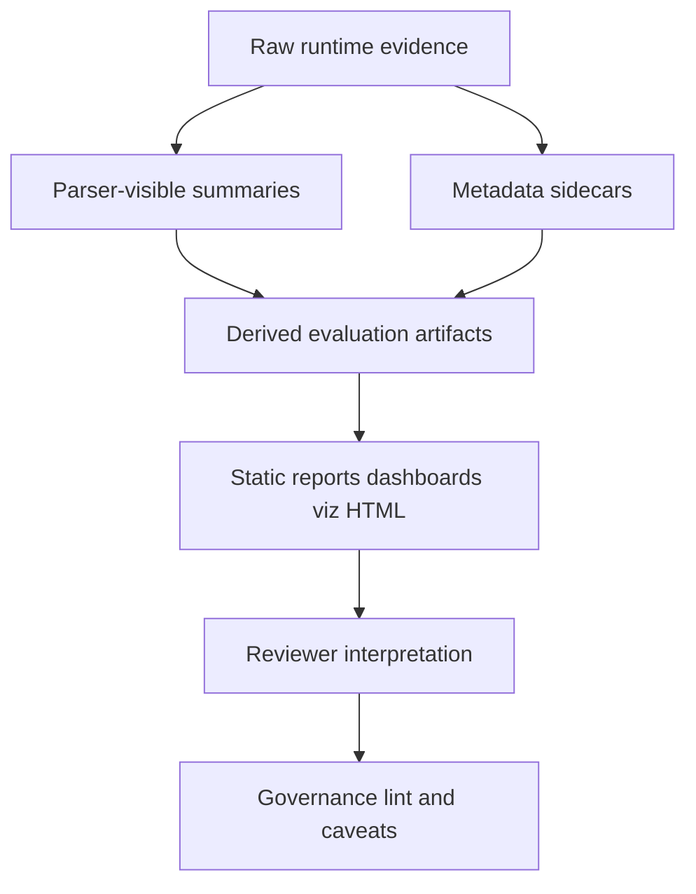

# Freeze Registry and Layer Map R1

**Maintained index** for frozen governance and evaluation layers. This document indexes existing freezes; it does **not** replace [AGENTS.md](../../AGENTS.md), parser contracts, runtime contracts, or scoped freeze audits.

When adding a new freeze: add one row to the registry table and link the audit — do not copy full wave narratives here.

## Authority and maintenance

| Document | Role |
|----------|------|
| [AGENTS.md](../../AGENTS.md) | Primary governance authority (philosophy, boundaries, workflow) |
| Scoped `*_freeze_audit.md` files | Authoritative scope and validation for that wave only |
| This registry | Index + layer map; descriptive summaries only |
| [reviewer_interpretation_guide.md](reviewer_interpretation_guide.md) | Reviewer-facing layer and wording rules |

**Registry rule:** On conflict, prefer `AGENTS.md` for project philosophy, the relevant freeze audit for artifact scope, and parser/evaluation README sections for field definitions.

## Architecture layer map

## Evidence layer map

Correct reading: [reviewer_interpretation_guide.md](reviewer_interpretation_guide.md).

## Freeze registry

| ID | Layer / wave | Status | Freeze audit | Key artifact surfaces |
|----|----------------|--------|--------------|------------------------|
| GOV-0 | Primary governance | active | — | [AGENTS.md](../../AGENTS.md) |
| RT-1..5 | Runtime realism waves 1–5 | frozen stable | — (narrative in [realism README](../scenarios/realism/README.md)) | fixture CSVs, [README.md](../../README.md) |
| RT-4o | Passive observability tap | frozen stable | — | observer summaries, realism docs |
| RT-5e | Threshold envelope / phase | frozen stable | — | Wave 5 fixtures, realism docs |
| RT-6 | Topology index surface | frozen stable | — | `topology-index`, wave6 fixtures |
| RT-7 | Selection/oracle divergence | frozen stable | — | D0–D5 classifier, frozen parser fields |
| EVAL-RO | Replay observability tooling | frozen | [replay_observability_freeze_audit.md](replay_observability_freeze_audit.md) | `replay_observability.py`, `replay_observability_v1` |
| EVAL-RI | Reviewer interpretation hardening R1 | frozen | [reviewer_interpretation_hardening_freeze_audit.md](reviewer_interpretation_hardening_freeze_audit.md) | static report wording, governance lint |
| EVAL-RN-UX | Replay narrative UX phase 2 | superseded | [replay_narrative_ux_freeze_audit.md](replay_narrative_ux_freeze_audit.md) | planning only |
| EVAL-RN-T1 | Replay narrative tooling R1 | frozen | [replay_narrative_tooling_r1_freeze_audit.md](replay_narrative_tooling_r1_freeze_audit.md) | `replay_narrative_v1`, narrative builder |
| EVAL-RN-V3 | Replay narrative validation phase 3 | frozen | [replay_narrative_validation_phase3_freeze_audit.md](replay_narrative_validation_phase3_freeze_audit.md) | validation review matrix |
| EVAL-VIZ-R1 | Static replay visualization R1 | frozen | [replay_static_visualization_r1_freeze_audit.md](replay_static_visualization_r1_freeze_audit.md) | `replay_static_visualization_v1`, PNG pipeline |
| EVAL-VIZ-C1 | Visualization comprehension R1 | frozen | [replay_static_visualization_comprehension_r1_freeze_audit.md](replay_static_visualization_comprehension_r1_freeze_audit.md) | `static_viz_comprehension_r1_v1`, comprehension manifest |
| EVAL-VIZ-UX-R2 | Replay UX refinement R2 | frozen | [replay_ux_refinement_r2_freeze_audit.md](replay_ux_refinement_r2_freeze_audit.md) | `static_viz_ux_refinement_r2_v1`, salient timeline, collapsed selection |
| EVAL-DEMO-R1 | Replay demo & review workflow R1 | docs frozen | — (see [replay_demo_review_workflow_r1.md](replay_demo_review_workflow_r1.md)) | runbook, [demo_cases/](demo_cases/) |
| META-GOV-R1 | Meta-governance maturity review R1 | frozen | [meta_governance_maturity_review_r1_freeze_audit.md](meta_governance_maturity_review_r1_freeze_audit.md) | this registry, risk map |
| PLAN-VIZ-R2 | Static visualization R2 | planning | [replay_static_visualization_r2_plan.md](replay_static_visualization_r2_plan.md) | not implemented |
| PLAN-SA-R1 | Situational awareness UI planning R1 | docs frozen | [situational_awareness_ui_planning_r1_freeze_audit.md](situational_awareness_ui_planning_r1_freeze_audit.md) | plan-only boundaries |
| PLAT-SA-R0 | SA-R0 replay platform | frozen | [sa_r0_freeze_audit.md](sa_r0_freeze_audit.md) | `replay_sa_bundle.py`, `platform/sa-r0-viewer/`, `fixtures/sa_r0/` |
| PLAT-SA-B1 | Geometry-aware replay realism | frozen | [sa_b1_geometry_freeze_audit.md](sa_b1_geometry_freeze_audit.md) | `replay_sa_geometry.py`, LOS overlays, `demo_valley_ingress` |
| PLAT-SA-C1a | Scenario topology schema foundation | frozen | [sa_c1a_scenario_schema_freeze_audit.md](sa_c1a_scenario_schema_freeze_audit.md) | `scenario_schema_v1.md`, `fixtures/scenarios/`, `replay_sa_scenario.py`, `validate_scenario.py` |
| PLAT-SA-B2 | Rich replay scenario packs | frozen | [sa_b2_rich_scenario_freeze_audit.md](sa_b2_rich_scenario_freeze_audit.md) | B2 scenario library, `gen_b2_scenarios.py`, multi-track bundle parsing, `demo_*` bundles |
| PLAT-SA-C1b | Scenario authoring refinement | frozen | [sa_c1b_scenario_authoring_refinement_freeze_audit.md](sa_c1b_scenario_authoring_refinement_freeze_audit.md) | C1b metadata, catalog picker, provenance panel, comparison foundations |
| PLAT-SA-D1 | Comparative replay & topology experiments | frozen | [sa_d1_comparative_replay_freeze_audit.md](sa_d1_comparative_replay_freeze_audit.md) | Compare viewer, topology/outcome diff, experiment packs, `replay_compare_v1.md` |
| PLAT-SA-D2 | Monte Carlo spatial analytics | frozen | [sa_d2_monte_carlo_spatial_analytics_freeze_audit.md](sa_d2_monte_carlo_spatial_analytics_freeze_audit.md) | `replay_mc_sweep_v1`, spatial overlays, sweep catalog, `gen_d2_sweep_fixtures.py` |
| PLAT-SA-D3 | Replay narrative intelligence & review workstation | frozen | [sa_d3_replay_narrative_intelligence_freeze_audit.md](sa_d3_replay_narrative_intelligence_freeze_audit.md) | Narrative/cohort enrichment, filmstrip, pattern taxonomy, review exports |
| PLAT-SA-E1 | Research presentation & reviewer experience | frozen | [sa_e1_research_presentation_freeze_audit.md](sa_e1_research_presentation_freeze_audit.md) | Presentation mode, chapters, storyboards, storytelling exports, cognition indicators |
| PLAT-SA-E2 | Replay knowledge synthesis & research publication | frozen | [sa_e2_replay_knowledge_synthesis_freeze_audit.md](sa_e2_replay_knowledge_synthesis_freeze_audit.md) | Cross-sweep synthesis, linkage index, publication packets, research bundles, E2 viewer panels |
| PLAT-SA-STAB | Platform stabilization & integrity audits | frozen | [sa_stabilization_freeze_audit.md](sa_stabilization_freeze_audit.md) | `audit_sa_platform_integrity.py`, `governance_lint_sa.py`, `tier0-sa-r0` integrity gate |

## Platform vs runtime frontiers

| Frontier | Owner doc | Current focus |
|----------|-----------|---------------|
| **Platform** (replay analysis, demo, SA viewer) | [AGENTS.md](../../AGENTS.md) § Platform frontier; [replay_demo_review_workflow_r1.md](replay_demo_review_workflow_r1.md) | Demo workflow, SA-R0 replay viewer (PLAT-SA-R0), registry discipline |
| **Runtime research** (realism / lifecycle) | [AGENTS.md](../../AGENTS.md) § Runtime research frontier; realism README | Threshold-sensitive lifecycle activation on existing tracking path |

Do not merge these frontiers in a single implementation wave.

## Artifact type quick reference

| `artifact_type` / schema | Producer | Authority |
|--------------------------|----------|-----------|
| `replay_evidence_bundle` | `replay_observability.py bundle` | derived |
| `single_run_replay_observability_report` | `single-run-report` | derived |
| `replay_narrative_report` (`replay_narrative_v1`) | `narrative` | derived, sequence not causal |
| `matched_seed_comparison_report` | `paired-comparison` | derived |
| `topology_timing_analytics_index` | `topology-index` | derived |
| `governance_lint_result` | `governance-lint` | checks wording only |
| `replay_static_visualization_manifest` | `replay_static_visualization.py` | explanatory viz |
| `render_profile: static_viz_comprehension_r1_v1` | composite/figures | presentation profile |
| `replay_sa_bundle` (`replay_sa_bundle_v1`) | `replay_sa_bundle.py pack` | derived, read-only viewer input |
| `replay_mc_sweep_v1` | `gen_d2_sweep_fixtures.py` | derived, sweep experiment family |
| `scenario_sweeps_index_v1` | `fixtures/scenarios/sweeps_index_v1.json` | catalog index for sweeps |
| `replay_compare_report_v1` | `export_replay_analytics_report.py` | derived, static export |
| `cross_sweep_synthesis_v1` | `build_cross_sweep_synthesis.py` | derived, corpus rollup |
| `replay_linkage_index_v1` | `build_replay_linkage.py` | derived, rule-based linkage |
| `replay_research_bundle_v1` | `export_research_bundle.py` | derived, portable archive |
| `replay_publication_report_v1` | `export_presentation_pack.py` | derived, print-ready export |
| `scenario_topology_v1` | `fixtures/scenarios/<id>/` | explanatory topology source (not a bundle) |

## Structural risks (summary)

See [meta_governance_maturity_review_r1.md](meta_governance_maturity_review_r1.md) §3 for detail. Top risks:

- Semantic overlap across README, realism docs, evaluation README
- Derived artifacts mistaken for authority
- Freeze fragmentation without registry updates
- Replay artifact proliferation
- Premature live UI or scoring layers

## Post-freeze update checklist

When closing a new freeze wave:

1. Add registry row with audit link and artifact surfaces.
2. Update [scripts/evaluation/README.md](../../scripts/evaluation/README.md) pointer line (one line + audit link).
3. Do **not** duplicate full wave history into README or AGENTS.md.
4. Run scoped regression named in the freeze audit.
5. If reviewer copy changed, cross-check [reviewer_interpretation_guide.md](reviewer_interpretation_guide.md).

## Related planning (not frozen implementation)

- [replay_static_visualization_r2_plan.md](replay_static_visualization_r2_plan.md) — planning only

## Related planning (docs frozen; no implementation)

- [situational_awareness_ui_planning_r1.md](situational_awareness_ui_planning_r1.md) — SA UI architecture boundaries; see PLAN-SA-R1

## SA-R0 replay platform (frozen implementation)

- [sa_r0_implementation_plan.md](sa_r0_implementation_plan.md) — scope and boundaries
- [platform/sa-r0-viewer/](../../platform/sa-r0-viewer/) — read-only Cesium viewer
- [fixtures/sa_r0/demo_ridge_defense/](../../fixtures/sa_r0/demo_ridge_defense/) — committed demo bundle

## Registry freeze status

Freeze Registry and Layer Map R1 is **documentation-only** and frozen as an index. It does not authorize runtime, parser, or tooling changes. Tooling behavior remains governed by per-wave freeze audits listed above.
