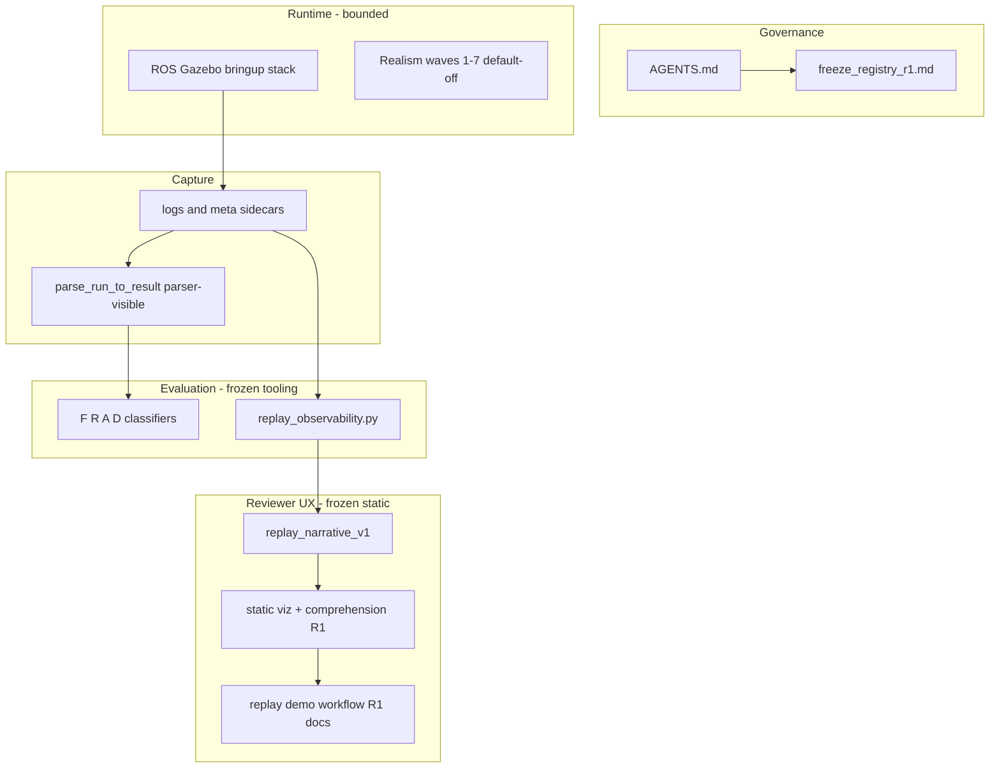
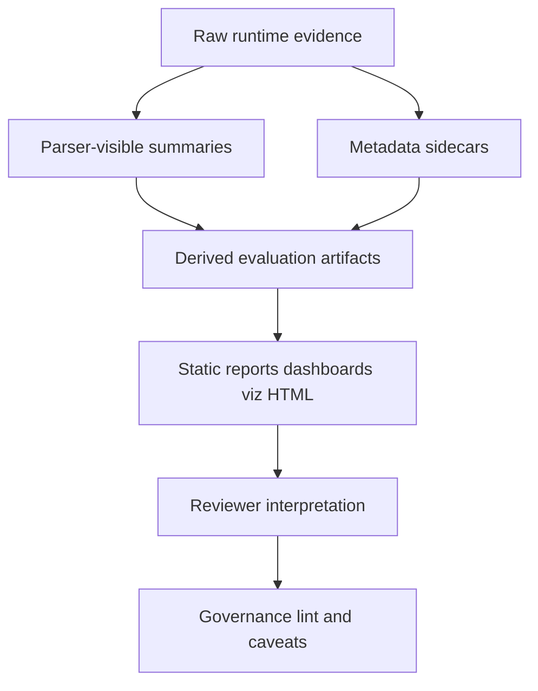

# Freeze Registry and Layer Map R1

**Maintained index** for frozen governance and evaluation layers. This document indexes existing freezes; it does **not** replace [AGENTS.md](../../AGENTS.md), parser contracts, runtime contracts, or scoped freeze audits.

When adding a new freeze: add one row to the registry table and link the audit — do not copy full wave narratives here.

## Authority and maintenance

| Document | Role |
|----------|------|
| [AGENTS.md](../../AGENTS.md) | Primary governance authority (philosophy, boundaries, workflow) |
| Scoped `*_freeze_audit.md` files | Authoritative scope and validation for that wave only |
| This registry | Index + layer map; descriptive summaries only |
| [reviewer_interpretation_guide.md](reviewer_interpretation_guide.md) | Reviewer-facing layer and wording rules |

**Registry rule:** On conflict, prefer `AGENTS.md` for project philosophy, the relevant freeze audit for artifact scope, and parser/evaluation README sections for field definitions.

## Architecture layer map

## Evidence layer map

Correct reading: [reviewer_interpretation_guide.md](reviewer_interpretation_guide.md).

## Freeze registry

| ID | Layer / wave | Status | Freeze audit | Key artifact surfaces |
|----|----------------|--------|--------------|------------------------|
| GOV-0 | Primary governance | active | — | [AGENTS.md](../../AGENTS.md) |
| RT-1..5 | Runtime realism waves 1–5 | frozen stable | — (narrative in [realism README](../scenarios/realism/README.md)) | fixture CSVs, [README.md](../../README.md) |
| RT-4o | Passive observability tap | frozen stable | — | observer summaries, realism docs |
| RT-5e | Threshold envelope / phase | frozen stable | — | Wave 5 fixtures, realism docs |
| RT-6 | Topology index surface | frozen stable | — | `topology-index`, wave6 fixtures |
| RT-7 | Selection/oracle divergence | frozen stable | — | D0–D5 classifier, frozen parser fields |
| EVAL-RO | Replay observability tooling | frozen | [replay_observability_freeze_audit.md](replay_observability_freeze_audit.md) | `replay_observability.py`, `replay_observability_v1` |
| EVAL-RI | Reviewer interpretation hardening R1 | frozen | [reviewer_interpretation_hardening_freeze_audit.md](reviewer_interpretation_hardening_freeze_audit.md) | static report wording, governance lint |
| EVAL-RN-UX | Replay narrative UX phase 2 | superseded | [replay_narrative_ux_freeze_audit.md](replay_narrative_ux_freeze_audit.md) | planning only |
| EVAL-RN-T1 | Replay narrative tooling R1 | frozen | [replay_narrative_tooling_r1_freeze_audit.md](replay_narrative_tooling_r1_freeze_audit.md) | `replay_narrative_v1`, narrative builder |
| EVAL-RN-V3 | Replay narrative validation phase 3 | frozen | [replay_narrative_validation_phase3_freeze_audit.md](replay_narrative_validation_phase3_freeze_audit.md) | validation review matrix |
| EVAL-VIZ-R1 | Static replay visualization R1 | frozen | [replay_static_visualization_r1_freeze_audit.md](replay_static_visualization_r1_freeze_audit.md) | `replay_static_visualization_v1`, PNG pipeline |
| EVAL-VIZ-C1 | Visualization comprehension R1 | frozen | [replay_static_visualization_comprehension_r1_freeze_audit.md](replay_static_visualization_comprehension_r1_freeze_audit.md) | `static_viz_comprehension_r1_v1`, comprehension manifest |
| EVAL-VIZ-UX-R2 | Replay UX refinement R2 | frozen | [replay_ux_refinement_r2_freeze_audit.md](replay_ux_refinement_r2_freeze_audit.md) | `static_viz_ux_refinement_r2_v1`, salient timeline, collapsed selection |
| EVAL-DEMO-R1 | Replay demo & review workflow R1 | docs frozen | — (see [replay_demo_review_workflow_r1.md](replay_demo_review_workflow_r1.md)) | runbook, [demo_cases/](demo_cases/) |
| META-GOV-R1 | Meta-governance maturity review R1 | frozen | [meta_governance_maturity_review_r1_freeze_audit.md](meta_governance_maturity_review_r1_freeze_audit.md) | this registry, risk map |
| PLAN-VIZ-R2 | Static visualization R2 | planning | [replay_static_visualization_r2_plan.md](replay_static_visualization_r2_plan.md) | not implemented |
| PLAN-SA-R1 | Situational awareness UI planning R1 | docs frozen | [situational_awareness_ui_planning_r1_freeze_audit.md](situational_awareness_ui_planning_r1_freeze_audit.md) | plan-only boundaries |
| PLAN-SA-H1 | Sandbox UX architecture & information hierarchy | docs frozen | [sa_h1_sandbox_ux_freeze_audit.md](sa_h1_sandbox_ux_freeze_audit.md) | [h1_sandbox_ux_architecture_plan.md](../platform/h1_sandbox_ux_architecture_plan.md), layout notes |
| PLAN-RT-S1 | RT interactive sandbox architecture (**not** RT-1..7 realism) | docs frozen | [rt_s1_freeze_audit.md](rt_s1_freeze_audit.md) | [rt_s1_interactive_sandbox_architecture_plan.md](../platform/rt_s1_interactive_sandbox_architecture_plan.md), [rt_s1_architecture_readiness_review_r1.md](rt_s1_architecture_readiness_review_r1.md), `rt_*_v1` contracts |
| PLAT-RT-S2 | Local runtime bridge prototype | frozen | [rt_s2_freeze_audit.md](rt_s2_freeze_audit.md) | `platform/rt-sandbox-bridge/`, `scripts/rt/`, `runs/rt_sandbox/audit/` |
| PLAT-RT-S3 | Interactive entity sandbox foundations | frozen | [rt_s3_freeze_audit.md](rt_s3_freeze_audit.md) | `entity_registry.py`, `world_state.py`, entity commands, `scripts/rt/rt_world_viz.py` |
| PLAT-RT-S4 | Runtime telemetry and sandbox visualization | frozen | [rt_s4_freeze_audit.md](rt_s4_freeze_audit.md) | `telemetry_subscriptions.py`, GET `/v1/telemetry/pull`, `scripts/rt/rt_telemetry_viz.py` |
| PLAT-RT-S5 | Runtime capture and replay boundary foundations | frozen | [rt_s5_freeze_audit.md](rt_s5_freeze_audit.md) | `capture.py`, `export_boundary.py`, `capture_session`, `scripts/rt/rt_capture_*.py`, `runs/rt_sandbox/captures/` |
| PLAT-RT-S6 | Sandbox templates and multi-step runtime workflows | frozen | [rt_s6_freeze_audit.md](rt_s6_freeze_audit.md) | `template_catalog.py`, `templates.py`, `workflow.py`, `scripts/rt/rt_workflow_inspect.py`, workflow/template bridge commands |
| PLAN-RT-G1 | Gazebo/ROS integration boundary planning (**not** PLAT-RT-G3+ implementation) | docs frozen | [rt_g1_freeze_audit.md](rt_g1_freeze_audit.md) | [rt_g1_gazebo_ros_integration_plan.md](../platform/rt_g1_gazebo_ros_integration_plan.md), [rt_gazebo_ros_boundary_v1.md](rt_gazebo_ros_boundary_v1.md), [rt_runtime_synchronization_v1.md](rt_runtime_synchronization_v1.md), [rt_roadmap_g2_g5_v1.md](rt_roadmap_g2_g5_v1.md) |
| PLAT-RT-G2 | Local Gazebo runtime adapter prototype (mock default) | frozen | [rt_g2_freeze_audit.md](rt_g2_freeze_audit.md) | `runtime_adapter.py`, `adapter_worker.py`, `ros_allowlist.py`, `enable_gazebo_adapter` flag, `scripts/rt/rt_adapter_inspect.py` |
| PLAT-RT-G3 | Transient pose synchronization (feedback mirror, stale sync) | frozen | [rt_g3_freeze_audit.md](rt_g3_freeze_audit.md) | `pose_sync.py`, `poll_feedback` IPC, sync audit events, `world_summary` sync fields, `scripts/rt/rt_adapter_inspect.py sync-status` |
| PLAT-RT-G4 | Runtime telemetry bridge (adapter-fed mirrors) | frozen | [rt_g4_freeze_audit.md](rt_g4_freeze_audit.md) | `telemetry_bridge.py`, `poll_telemetry` IPC, adapter-fed `entity_pose_mirror`, telemetry audit events, `scripts/rt/rt_adapter_inspect.py telemetry-status` |
| PLAT-RT-G5 | Runtime capture normalization (replay-ready staging) | frozen | [rt_g5_freeze_audit.md](rt_g5_freeze_audit.md) | `capture_normalize.py`, normalized/provenance/validation artifacts, capture-time normalization, `scripts/rt/rt_capture_normalize.py`, `rt_capture_inspect normalization-status` |
| PLAT-RT-G6 | Gazebo runtime visual fidelity & live sync | frozen | [rt_g6_freeze_audit.md](rt_g6_freeze_audit.md) | `src/rt_sandbox_gz/`, `live_ros_client.py`, `entity_model_map.py`, sync cognition UI, `rt_adapter_inspect world-health` |
| PLAN-RT-R1 | RT architecture stabilization review (**not** RT-1..7 realism) | docs frozen | [rt_r1_freeze_audit.md](rt_r1_freeze_audit.md) | [rt_r1_runtime_architecture_stabilization_plan.md](../platform/rt_r1_runtime_architecture_stabilization_plan.md), [rt_r1_architecture_stabilization_review_r1.md](rt_r1_architecture_stabilization_review_r1.md), [rt_roadmap_post_g5_v1.md](rt_roadmap_post_g5_v1.md) |
| PLAT-RT-R1a | RT vocabulary & authority hardening (P0 closure) | frozen | [rt_r1a_freeze_audit.md](rt_r1a_freeze_audit.md) | [rt_revision_vocabulary_v1.md](rt_revision_vocabulary_v1.md), [rt_authority_model_v1.md](rt_authority_model_v1.md), [rt_audit_event_vocabulary_v1.md](rt_audit_event_vocabulary_v1.md), `authority_labels.py`, `audit_vocabulary.py` |
| PLAT-RT-R1b | Adapter poll & telemetry path consolidation (P1 closure) | frozen | [rt_r1b_freeze_audit.md](rt_r1b_freeze_audit.md) | [rt_poll_sync_semantics_v1.md](rt_poll_sync_semantics_v1.md), `adapter_poll.py`, `time_utils.py` |
| PLAT-RT-R2d | Template adapter resync policy (P1 closure) | frozen | [rt_r2d_freeze_audit.md](rt_r2d_freeze_audit.md) | [rt_template_resync_policy_v1.md](rt_template_resync_policy_v1.md), `template_resync.py` |
| PLAT-RT-R2e | Capture pose cognition & export semantics (P1 closure) | frozen | [rt_r2e_freeze_audit.md](rt_r2e_freeze_audit.md) | [rt_capture_pose_cognition_v1.md](rt_capture_pose_cognition_v1.md), [rt_runtime_export_semantics_v1.md](rt_runtime_export_semantics_v1.md), `capture_pose_cognition.py` |
| PLAN-RT-R2f | RT→SA bridge planning — manual import only (P1 closure) | docs frozen | [rt_r2f_freeze_audit.md](rt_r2f_freeze_audit.md) | [rt_rt_sa_bridge_handoff_v1.md](rt_rt_sa_bridge_handoff_v1.md), [rt_manual_sa_import_workflow_v1.md](rt_manual_sa_import_workflow_v1.md), [rt_sa_lineage_protection_v1.md](rt_sa_lineage_protection_v1.md) |
| PLAT-RT-R3a | Session manager decomposition (P2 maintenance) | frozen | [rt_r3a_freeze_audit.md](rt_r3a_freeze_audit.md) | [rt_session_manager_ownership_v1.md](rt_session_manager_ownership_v1.md), `session_*` handler modules, `session_manager.py` facade |
| PLAT-RT-R3b | Lifecycle documentation hardening (P2 maintenance) | frozen | [rt_r3b_freeze_audit.md](rt_r3b_freeze_audit.md) | [rt_lifecycle_transitions_v1.md](rt_lifecycle_transitions_v1.md), `lifecycle.py` `transition_rules()`, lifecycle transition tests |
| PLAT-RT-R3c | Runtime subcommand governance lint (P2 maintenance) | frozen | [rt_r3c_freeze_audit.md](rt_r3c_freeze_audit.md) | [rt_runtime_subcommand_registry_v1.md](rt_runtime_subcommand_registry_v1.md), `runtime_subcommand_governance.py`, `scripts/rt/lint_rt_runtime_subcommands.py`, `tier0` lint gate |
| PLAT-RT-R3d | World revision hint policy (P2 maintenance) | frozen | [rt_r3d_freeze_audit.md](rt_r3d_freeze_audit.md) | [rt_world_revision_hint_policy_v1.md](rt_world_revision_hint_policy_v1.md), [rt_revision_vocabulary_v1.md](rt_revision_vocabulary_v1.md) §4, `revision_hint_policy.py` |
| PLAT-RT-T1 | RT telemetry UI (loopback browser consumer) | frozen | [rt_t1_freeze_audit.md](rt_t1_freeze_audit.md) | `platform/rt-sandbox-ui/`, GET `/v1/telemetry/pull` consumer, governance banners, [rt_telemetry_ui_v1.md](rt_telemetry_ui_v1.md) |
| PLAT-RT-T2 | RT world editing UI (drag/drop entity editing) | frozen | [rt_t2_freeze_audit.md](rt_t2_freeze_audit.md) | `platform/rt-sandbox-ui/` world editor, POST entity commands, [rt_world_editing_ui_v1.md](rt_world_editing_ui_v1.md) |
| PLAT-RT-T3 | RT Cesium runtime visualization (3D mirror view) | frozen | [rt_t3_freeze_audit.md](rt_t3_freeze_audit.md) | `platform/rt-sandbox-ui/src/cesium/`, fictional georef, [rt_cesium_runtime_ui_v1.md](rt_cesium_runtime_ui_v1.md) |
| PLAT-RT-T4 | RT runtime session workstation UX polish | frozen | [rt_t4_freeze_audit.md](rt_t4_freeze_audit.md) | `platform/rt-sandbox-ui/src/workstation/`, workflow strip, cognition hub, capture/handoff panel, [rt_runtime_workstation_ui_v1.md](rt_runtime_workstation_ui_v1.md) |
| PLAT-RT-T5 | RT Cesium interactive editing | frozen | [rt_t5_freeze_audit.md](rt_t5_freeze_audit.md) | `platform/rt-sandbox-ui/src/cesium/cesiumEditing.ts`, camera helpers, dual-surface edit, [rt_cesium_interactive_editing_ui_v1.md](rt_cesium_interactive_editing_ui_v1.md) |
| PLAT-RT-SA1 | RT→SA manual import bridge | frozen | [rt_sa1_freeze_audit.md](rt_sa1_freeze_audit.md) | `sa_handoff.py`, `rt_handoff_review.py`, `rt_sa_import.py`, [rt_sa_import_bridge_v1.md](rt_sa_import_bridge_v1.md) |
| PLAT-RT-SA2 | Multi-session RT→SA handoff workflow UX (read-only mirror) | frozen | [rt_sa2_freeze_audit.md](rt_sa2_freeze_audit.md) | `capture_handoff_mirror.py`, `list_capture_handoff_status`, [rt_sa2_multi_session_handoff_ui_v1.md](rt_sa2_multi_session_handoff_ui_v1.md) |
| PLAT-RT-SA3 | SA replay tactical continuity visibility (read-only viewer) | frozen | [rt_sa3_freeze_audit.md](rt_sa3_freeze_audit.md) | `rt_tactical_replay_continuity.py`, SA viewer `TacticalReplayContinuityPanel`, [rt_sa3_sa_replay_visibility_plan.md](../platform/rt_sa3_sa_replay_visibility_plan.md) |
| PLAT-RT-V1 | Runtime visualization fidelity (Cesium + cognition chrome) | frozen | [rt_v1_freeze_audit.md](rt_v1_freeze_audit.md) | `cesium/visualStyle.ts`, camera presets, session accents, [rt_v1_runtime_visualization_v1.md](rt_v1_runtime_visualization_v1.md) |
| PLAT-RT-V2 | Terrain / visual realism (RT UI fictional terrain + overlays) | frozen | [rt_v2_freeze_audit.md](rt_v2_freeze_audit.md) | `rtFictionalTerrain.ts`, terrain mesh/overlays, sensor domes, [rt_v2_terrain_realism_v1.md](rt_v2_terrain_realism_v1.md) |
| PLAT-RT-X1 | Experimentation workbench (compare + batch CLI) | frozen | [rt_x1_freeze_audit.md](rt_x1_freeze_audit.md) | `src/experiment/`, `rt_experiment_batch.py`, [rt_experiment_workbench_v1.md](rt_experiment_workbench_v1.md) |
| PLAN-RT-R2 | Runtime platform maturity review (**not** PLAT-RT-R2d–f) | docs frozen | [rt_r2_platform_maturity_freeze_audit.md](rt_r2_platform_maturity_freeze_audit.md) | [rt_r2_runtime_platform_maturity_plan.md](../platform/rt_r2_runtime_platform_maturity_plan.md), [rt_r2_platform_maturity_review_r1.md](rt_r2_platform_maturity_review_r1.md), [rt_r2_technical_debt_audit_r1.md](rt_r2_technical_debt_audit_r1.md), [rt_roadmap_next_frontiers_v1.md](rt_roadmap_next_frontiers_v1.md) |
| PLAN-RT-F1 | Experiment analytics & template sweep catalog (**not** PLAT-RT-F1 impl) | docs frozen | [rt_f1_freeze_audit.md](rt_f1_freeze_audit.md) | [rt_f1_experiment_analytics_plan.md](../platform/rt_f1_experiment_analytics_plan.md), [rt_experiment_analytics_v1.md](rt_experiment_analytics_v1.md), [rt_experiment_sweep_catalog_v1.md](rt_experiment_sweep_catalog_v1.md), [rt_roadmap_plat_rt_f1_v1.md](rt_roadmap_plat_rt_f1_v1.md) |
| PLAT-RT-F1 | Experiment analytics + sweep catalog UI | frozen | [rt_plat_f1_freeze_audit.md](rt_plat_f1_freeze_audit.md) | `analyticsDerive.ts`, `sweepCompile.ts`, `rt_experiment_analytics.py`, [rt_experiment_analytics_v1.md](rt_experiment_analytics_v1.md) |
| PLAN-RT-F2 | Runtime platform hardening (docs) | docs frozen | [rt_f2_freeze_audit.md](rt_f2_freeze_audit.md) | [rt_f2_platform_hardening_plan.md](../platform/rt_f2_platform_hardening_plan.md), [rt_runtime_cleanup_hardening_v1.md](rt_runtime_cleanup_hardening_v1.md), [rt_roadmap_plat_rt_f2_v1.md](rt_roadmap_plat_rt_f2_v1.md) |
| PLAT-RT-F2 | Runtime platform hardening (teardown + import + UI) | frozen | [rt_plat_f2_freeze_audit.md](rt_plat_f2_freeze_audit.md) | `clear_tactical_state`, `experimentImportGuards.ts`, `rt_staging_integrity_audit.py` |
| PLAN-RT-F3 | Tactical annex & continuity review (docs) | docs frozen | [rt_f3_freeze_audit.md](rt_f3_freeze_audit.md) | [rt_experiment_annex_review_ui_v1.md](rt_experiment_annex_review_ui_v1.md), [rt_experiment_continuity_review_v1.md](rt_experiment_continuity_review_v1.md) |
| PLAT-RT-F3 | Tactical annex & continuity review UI | frozen | [rt_plat_f3_freeze_audit.md](rt_plat_f3_freeze_audit.md) | `tacticalAnnexSchema.ts`, `ExperimentContinuityReviewPanel.tsx`, `rt_experiment_annex_pack.py` |
| PLAN-RT-F4 | Runtime realism expansion (docs; **not** registry RT-1..7) | docs frozen | [rt_f4_freeze_audit.md](rt_f4_freeze_audit.md) | [rt_f4_runtime_realism_expansion_plan.md](../platform/rt_f4_runtime_realism_expansion_plan.md), [rt_runtime_realism_expansion_v1.md](rt_runtime_realism_expansion_v1.md), [rt_roadmap_plat_rt_f4_v1.md](rt_roadmap_plat_rt_f4_v1.md) |
| PLAT-RT-F4 | Runtime realism expansion (terrain contours, cognition, Cesium polish) | frozen | [rt_plat_f4_freeze_audit.md](rt_plat_f4_freeze_audit.md) | `terrainContourLayer.ts`, `losSegmentLayer.ts`, [rt_runtime_realism_expansion_v1.md](rt_runtime_realism_expansion_v1.md) |
| PLAN-RT-F5 | Advanced runtime experiments (**not** PLAT-RT-F5 impl; **not** registry RT-1..7) | docs frozen | [rt_f5_freeze_audit.md](rt_f5_freeze_audit.md) | [rt_f5_advanced_runtime_experiments_plan.md](../platform/rt_f5_advanced_runtime_experiments_plan.md), [rt_experiment_model_v1.md](rt_experiment_model_v1.md), [rt_experiment_metrics_v1.md](rt_experiment_metrics_v1.md), [rt_roadmap_plat_rt_f5_v1.md](rt_roadmap_plat_rt_f5_v1.md) |
| PLAT-RT-F5 | Advanced runtime experiments P0 (spec compile + metrics derive; **not** registry RT-1..7) | frozen (P0) | [rt_plat_f5_freeze_audit.md](rt_plat_f5_freeze_audit.md) | `experimentSpecCompile.ts`, `metricsDerive.ts`, `rt_experiment_spec_compile.py`, [rt_experiment_metrics_v1.md](rt_experiment_metrics_v1.md) |
| PLAT-RT-F5 P1 | Advanced experiment UI (matrix, extended compare, filters, handoff strip; **not** registry RT-1..7) | frozen (P1) | [rt_plat_f5_p1_freeze_audit.md](rt_plat_f5_p1_freeze_audit.md) | F5 panels in `platform/rt-sandbox-ui/src/experiment/`, [rt_experiment_advanced_ui_v1.md](rt_experiment_advanced_ui_v1.md) |
| PLAT-RT-F5 P2 | Metrics CLI + repeatability trend ( **not** registry RT-1..7) | frozen (P2) | [rt_plat_f5_p2_freeze_audit.md](rt_plat_f5_p2_freeze_audit.md) | `rt_experiment_metrics.py`, `ExperimentRepeatabilityTrendStrip.tsx` |
| PLAN-RT-F5b | Runtime fidelity coupling (Gazebo/sensor-truth; **not** PLAT-RT-F5b impl; **not** registry RT-1..7) | docs frozen | [rt_f5b_freeze_audit.md](rt_f5b_freeze_audit.md) | [rt_f5b_runtime_fidelity_coupling_plan.md](../platform/rt_f5b_runtime_fidelity_coupling_plan.md), [rt_runtime_fidelity_coupling_v1.md](rt_runtime_fidelity_coupling_v1.md), [rt_runtime_fidelity_cognition_v1.md](rt_runtime_fidelity_cognition_v1.md), [rt_roadmap_plat_rt_f5b_v1.md](rt_roadmap_plat_rt_f5b_v1.md) |
| PLAT-RT-F5b P0 | Fidelity coupling foundations (adapter truth + capture block; **not** registry RT-1..7) | frozen (P0) | [rt_plat_f5b_p0_freeze_audit.md](rt_plat_f5b_p0_freeze_audit.md) | `fidelity_coupling.py`, `capture_fidelity_coupling.py`, `enable_fidelity_coupling`, [rt_adapter_telemetry_v1.md](rt_adapter_telemetry_v1.md) §2 |
| PLAT-RT-F5b P1 | Fidelity truth cognition UI (workstation + Cesium strips; **not** registry RT-1..7) | frozen (P1) | [rt_plat_f5b_p1_freeze_audit.md](rt_plat_f5b_p1_freeze_audit.md) | `fidelityCognition.ts`, `FidelityTruthCognitionStrip.tsx`, `BANNER_FIDELITY_TRUTH`, pull passthrough in `telemetry_bridge.py` |
| PLAT-RT-F5b P2 | Fidelity experiment metrics + compare strip (**not** registry RT-1..7) | frozen (P2) | [rt_plat_f5b_p2_freeze_audit.md](rt_plat_f5b_p2_freeze_audit.md) | `fidelityMetricsDerive.ts`, `rt_experiment_fidelity_metrics.py`, `ExperimentFidelityCompareStrip.tsx`, [rt_experiment_metrics_v1.md](rt_experiment_metrics_v1.md) §11 |
| PLAN-RT-F6 | SA workflow automation advisory (**not** PLAT-RT-F6 impl; **not** auto-import; **not** PLAT-RT-SA1/SA2/SA3 replacement) | docs frozen | [rt_f6_freeze_audit.md](rt_f6_freeze_audit.md) | [rt_f6_sa_workflow_automation_advisory_plan.md](../platform/rt_f6_sa_workflow_automation_advisory_plan.md), [rt_sa_workflow_automation_v1.md](rt_sa_workflow_automation_v1.md), [rt_sa_workflow_advisory_ui_v1.md](rt_sa_workflow_advisory_ui_v1.md), [rt_roadmap_plat_rt_f6_v1.md](rt_roadmap_plat_rt_f6_v1.md) |
| PLAT-RT-F6 P0 | Advisory readiness mirror (derive + CLI + UI strip; **not** auto-import) | frozen (P0) | [rt_plat_f6_p0_freeze_audit.md](rt_plat_f6_p0_freeze_audit.md) | `advisory_derive.py`, `deriveAdvisoryState.ts`, `rt_handoff_advisory_status.py`, `HandoffAdvisoryMirrorStrip.tsx` |
| PLAT-RT-F6 P1 | Advisory checklist UI (8-item checklist, import strip, per-run badges; **not** auto-import) | frozen (P1) | [rt_plat_f6_p1_freeze_audit.md](rt_plat_f6_p1_freeze_audit.md) | `SaWorkflowAdvisoryPanel.tsx`, `ExperimentImportAdvisoryStrip.tsx`, `BANNER_SA_WORKFLOW_ADVISORY`, `advisoryChecklist.ts` |
| PLAT-RT-F6 P2 | Batch maintainer helpers (scan/report/export, dry-run import preview; **not** auto-import) | frozen (P2) | [rt_plat_f6_p2_freeze_audit.md](rt_plat_f6_p2_freeze_audit.md) | `batch_advisory.py`, `rt_handoff_batch_advisory.py`, `rt_sa_import_dry_run.py` |
| PLAN-RT-C1 | Runtime platform consolidation review (**not** PLAT-RT-C1) | docs frozen | [rt_c1_platform_consolidation_freeze_audit.md](rt_c1_platform_consolidation_freeze_audit.md) | [rt_c1_runtime_platform_consolidation_plan.md](../platform/rt_c1_runtime_platform_consolidation_plan.md), [rt_c1_platform_consolidation_review_r1.md](rt_c1_platform_consolidation_review_r1.md), [rt_c1_platform_governance_review_r1.md](rt_c1_platform_consolidation_review_r1.md), [rt_c1_technical_debt_audit_r1.md](rt_c1_technical_debt_audit_r1.md), [rt_roadmap_next_frontiers_v2.md](rt_roadmap_next_frontiers_v2.md) |
| PLAN-RT-M3 | Local multi-session polish plan (**not** PLAT-RT-M3 P0–P2 bundle; **not** distributed) | docs frozen | [rt_m3_freeze_audit.md](rt_m3_freeze_audit.md) | [rt_m3_local_multi_session_polish_plan.md](../platform/rt_m3_local_multi_session_polish_plan.md), [rt_m3_local_multi_session_ux_review_r1.md](rt_m3_local_multi_session_ux_review_r1.md), [rt_m3_governance_review_r1.md](rt_m3_governance_review_r1.md), [rt_roadmap_plat_rt_m3_v1.md](rt_roadmap_plat_rt_m3_v1.md), [rt_multi_session_poll_policy_v1.md](rt_multi_session_poll_policy_v1.md) |
| PLAT-RT-M3 P0 | Session inspect CLI + per-slot poll UX + background diagnostics polish | frozen | [rt_plat_m3_p0_freeze_audit.md](rt_plat_m3_p0_freeze_audit.md) | `rt_session_inspect.py`, `pullAge.ts`, `useRtSessionWorkspace.ts`, `BackgroundDiagnostics.tsx`, [rt_plat_m3_p0_session_inspect_poll_plan.md](../platform/rt_plat_m3_p0_session_inspect_poll_plan.md) |
| PLAT-RT-M3 P1 | Background poll pause + tab confirm + session display names | frozen | [rt_plat_m3_p1_freeze_audit.md](rt_plat_m3_p1_freeze_audit.md) | `sessionDisplayNameStore.ts`, `sessionMirrorDirty.ts`, `useSessionDisplayNames.ts`, [rt_plat_m3_p1_session_ux_polish_plan.md](../platform/rt_plat_m3_p1_session_ux_polish_plan.md) |
| PLAT-RT-M3 P2 | Tab reorder persistence + richer background diagnostics (**PLAT-RT-M3 complete**) | frozen | [rt_plat_m3_p2_freeze_audit.md](rt_plat_m3_p2_freeze_audit.md) | `sessionTabOrderStore.ts`, `useSessionTabOrder.ts`, `backgroundSessionRowCognition.ts`, [rt_plat_m3_p2_session_reorder_diagnostics_plan.md](../platform/rt_plat_m3_p2_session_reorder_diagnostics_plan.md) |
| PLAN-RT-F7 | Post-F6 advisory expansion (**not** PLAT-RT-F7 P1/P2 bundle; **not** auto-import; **not** distributed) | docs frozen | [rt_f7_freeze_audit.md](rt_f7_freeze_audit.md) | [rt_f7_post_f6_advisory_expansion_plan.md](../platform/rt_f7_post_f6_advisory_expansion_plan.md), [rt_advisory_maintainer_workflow_v1.md](rt_advisory_maintainer_workflow_v1.md), [rt_advisory_contamination_gates_v1.md](rt_advisory_contamination_gates_v1.md), [rt_advisory_aggregation_v1.md](rt_advisory_aggregation_v1.md), [rt_roadmap_plat_rt_f7_v1.md](rt_roadmap_plat_rt_f7_v1.md) |
| PLAN-RT-F8 | Post-F7 advisory maintainer expansion (**not** PLAT-RT-F8 P1/P2 bundle; **not** PLAT-RT-F7 replacement; **not** auto-import) | docs frozen | [rt_f8_freeze_audit.md](rt_f8_freeze_audit.md) | [rt_f8_post_f7_advisory_maintainer_expansion_plan.md](../platform/rt_f8_post_f7_advisory_maintainer_expansion_plan.md), [rt_advisory_maintainer_workflow_v2.md](rt_advisory_maintainer_workflow_v2.md), [rt_advisory_contamination_gates_v2.md](rt_advisory_contamination_gates_v2.md), [rt_advisory_aggregation_v2.md](rt_advisory_aggregation_v2.md), [rt_roadmap_plat_rt_f8_v1.md](rt_roadmap_plat_rt_f8_v1.md), [rt_roadmap_next_frontiers_v8.md](rt_roadmap_next_frontiers_v8.md) |
| PLAT-RT-F8 P0 | Advisory summary v2 + filter presets + focus + template render (**not** auto-import) | frozen (P0) | [rt_plat_f8_p0_freeze_audit.md](rt_plat_f8_p0_freeze_audit.md) | `build_advisory_batch_summary_v2_document`, `advisory_queue.py` presets/focus/v2 rollups, `rt_handoff_batch_advisory.py` `--schema f8`, `advisoryAggregationV2.ts`, F8 handoff UI strips |
| PLAT-RT-F8 P1 | Integrated triage hub: preset/focus/passes/template, cohort v2 grouping (**not** auto-import) | frozen (P1) | [rt_plat_f8_p1_freeze_audit.md](rt_plat_f8_p1_freeze_audit.md) | `AdvisoryTriageQueuePanel` F8 hub, `AdvisoryStandupPassSelector`, `advisoryTriageGroupMemory`, `CaptureHandoffWorkflowPanel` wiring |
| PLAT-RT-F8 P2 | Advisory guardrails + corpus preview refinement (**PLAT-RT-F8 complete**) | frozen (P2) | [rt_plat_f8_p2_freeze_audit.md](rt_plat_f8_p2_freeze_audit.md) | `corpus_preview_for_capture` dest policy, dry-run status buckets, CLI preview messaging, `advisoryBatchExportPreview.ts` rollups |
| PLAT-RT-F7 P0 | Advisory queue + batch summary + UI mirror chips (**not** auto-import) | frozen (P0) | [rt_plat_f7_p0_freeze_audit.md](rt_plat_f7_p0_freeze_audit.md) | `advisory_queue.py`, `build_advisory_batch_summary_document`, `rt_handoff_batch_advisory.py` F7 flags, `advisoryQueue.ts`, `AdvisoryBatchMirrorStrip.tsx` |
| PLAT-RT-F7 P1 | Advisory triage queue UI + grouped blocker strip (**not** auto-import) | frozen (P1) | [rt_plat_f7_p1_freeze_audit.md](rt_plat_f7_p1_freeze_audit.md) | `AdvisoryTriageQueuePanel.tsx`, `AdvisoryGroupedBlockerStrip.tsx`, `advisoryTriageGrouping.ts`, `CaptureHandoffWorkflowPanel` wiring |
| PLAT-RT-F7 P2 | Batch export v2 + dry-run-review + guardrails (**PLAT-RT-F7 complete**) | frozen (P2) | [rt_plat_f7_p2_freeze_audit.md](rt_plat_f7_p2_freeze_audit.md) | `build_advisory_batch_review_v2_document`, `standup-export`, `dry-run-review`, `rt_sa_import_dry_run.py` hardening |
| PLAN-RT-C2 | Runtime platform consolidation review post-F7 (**not** PLAT-RT-C2) | docs frozen | [rt_c2_platform_consolidation_freeze_audit.md](rt_c2_platform_consolidation_freeze_audit.md) | [rt_c2_runtime_platform_consolidation_plan.md](../platform/rt_c2_runtime_platform_consolidation_plan.md), [rt_c2_platform_consolidation_review_r1.md](rt_c2_platform_consolidation_review_r1.md), [rt_c2_platform_governance_review_r1.md](rt_c2_platform_governance_review_r1.md), [rt_c2_technical_debt_audit_r1.md](rt_c2_technical_debt_audit_r1.md), [rt_roadmap_next_frontiers_v4.md](rt_roadmap_next_frontiers_v4.md) |
| PLAN-RT-C3 | Post-X2 platform checkpoint review (**not** PLAT-RT-C3) | docs frozen | [rt_c3_platform_consolidation_freeze_audit.md](rt_c3_platform_consolidation_freeze_audit.md) | [rt_c3_runtime_platform_consolidation_plan.md](../platform/rt_c3_runtime_platform_consolidation_plan.md), [rt_c3_platform_consolidation_review_r1.md](rt_c3_platform_consolidation_review_r1.md), [rt_c3_platform_governance_review_r1.md](rt_c3_platform_governance_review_r1.md), [rt_c3_technical_debt_audit_r1.md](rt_c3_technical_debt_audit_r1.md), [rt_roadmap_next_frontiers_v7.md](rt_roadmap_next_frontiers_v7.md) |
| PLAN-RT-V3 | Runtime visualization fidelity planning (**not** PLAT-RT-V3 P1–P2 bundle; **not** registry RT-1..7) | docs frozen | [rt_v3_freeze_audit.md](rt_v3_freeze_audit.md) | [rt_v3_runtime_visualization_fidelity_plan.md](../platform/rt_v3_runtime_visualization_fidelity_plan.md), [rt_runtime_visualization_fidelity_v3_v1.md](rt_runtime_visualization_fidelity_v3_v1.md), [rt_cesium_workstation_visualization_v3_v1.md](rt_cesium_workstation_visualization_v3_v1.md), [rt_roadmap_plat_rt_v3_v1.md](rt_roadmap_plat_rt_v3_v1.md), [rt_roadmap_next_frontiers_v5.md](rt_roadmap_next_frontiers_v5.md) |
| PLAT-RT-V3 P0 | Visual layer registry + contract tests + grouped toggles (**not** V3 overlays) | frozen | [rt_plat_v3_p0_freeze_audit.md](rt_plat_v3_p0_freeze_audit.md) | `visualLayerRegistry.ts`, `VisualLayerToggleRail.tsx`, [rt_plat_v3_p0_visual_layer_registry_plan.md](../platform/rt_plat_v3_p0_visual_layer_registry_plan.md) |
| PLAT-RT-V3 P1 | Visibility overlays + cognition grouping + budget warn (**not** P2 layout) | frozen | [rt_plat_v3_p1_freeze_audit.md](rt_plat_v3_p1_freeze_audit.md) | `visibilityWedgeLayer.ts`, `horizonHintLayer.ts`, `stackedLosPresentation.ts`, `VisibilityCognitionStrip.tsx`, [rt_plat_v3_p1_visibility_overlays_plan.md](../platform/rt_plat_v3_p1_visibility_overlays_plan.md) |
| PLAT-RT-V3 P2 | Workstation layout + compact diagnostics + session chrome (**PLAT-RT-V3 complete**) | frozen | [rt_plat_v3_p2_freeze_audit.md](rt_plat_v3_p2_freeze_audit.md) | `BackgroundDiagnosticsCompact.tsx`, `sessionLayerVisibilityStore.ts`, cognition rail in `RuntimeWorkstationShell.tsx`, [rt_plat_v3_p2_workstation_layout_plan.md](../platform/rt_plat_v3_p2_workstation_layout_plan.md) |
| PLAN-RT-V4 | Visualization fidelity v4 planning (docs only; **not** PLAT-RT-V4 implementation; **not** runtime/UI/bridge/SA/import changes) | docs frozen | [rt_v4_freeze_audit.md](rt_v4_freeze_audit.md) | [rt_v4_visualization_fidelity_plan.md](../platform/rt_v4_visualization_fidelity_plan.md), [rt_visualization_fidelity_v4.md](rt_visualization_fidelity_v4.md), [rt_visual_density_management_v1.md](rt_visual_density_management_v1.md), [rt_visual_multi_session_cognition_v1.md](rt_visual_multi_session_cognition_v1.md), [rt_roadmap_plat_rt_v4_v1.md](rt_roadmap_plat_rt_v4_v1.md), [rt_roadmap_next_frontiers_v9.md](rt_roadmap_next_frontiers_v9.md) |
| PLAT-RT-V4 P0 | Visual registry v4 + density controls + compare cognition foundations (**not** P1 overlays) | frozen (P0) | [rt_plat_v4_p0_freeze_audit.md](rt_plat_v4_p0_freeze_audit.md) | `visualLayerRegistry.ts`, `VisualLayerToggleRail.tsx`, `sessionComparisonCognition.ts`, `SessionComparisonCognitionStrip.tsx`, [rt_plat_v4_p0_visual_registry_plan.md](../platform/rt_plat_v4_p0_visual_registry_plan.md) |
| PLAT-RT-V4 P1 | Visibility overlays + terrain cognition + compare emphasis (**not** P2 layout) | frozen (P1) | [rt_plat_v4_p1_freeze_audit.md](rt_plat_v4_p1_freeze_audit.md) | `visibilityOverlayV4.ts`, `CesiumRuntimeView.tsx`, `VisibilityCognitionStrip.tsx`, `RuntimeCognitionHub.tsx`, [rt_plat_v4_p1_visibility_overlay_plan.md](../platform/rt_plat_v4_p1_visibility_overlay_plan.md) |
| PLAT-RT-V4 P2 | Workstation layout + density UX + multi-session chrome (**PLAT-RT-V4 complete**) | frozen (P2) | [rt_plat_v4_p2_freeze_audit.md](rt_plat_v4_p2_freeze_audit.md) | `RuntimeWorkstationShell.tsx`, `VisualLayerToggleRail.tsx`, `sessionLayerVisibilityStore.ts`, `SessionComparisonCognitionStrip.tsx`, [rt_plat_v4_p2_workstation_layout_plan.md](../platform/rt_plat_v4_p2_workstation_layout_plan.md) |
| CHECKPOINT-RT-POST-V4 | Post-V4 platform checkpoint review after F8 + V4 (**docs only; no cleanup/X3 authority**) | docs frozen | [rt_checkpoint_post_v4_freeze_audit.md](rt_checkpoint_post_v4_freeze_audit.md) | [rt_checkpoint_post_v4_review.md](../platform/rt_checkpoint_post_v4_review.md), [rt_checkpoint_post_v4_architecture_review_r1.md](rt_checkpoint_post_v4_architecture_review_r1.md), [rt_checkpoint_post_v4_technical_debt_audit_r1.md](rt_checkpoint_post_v4_technical_debt_audit_r1.md), [rt_roadmap_next_frontiers_v10.md](rt_roadmap_next_frontiers_v10.md) |
| PLAN-RT-C4 | Post-V4 checkpoint cleanup planning (**not** PLAT-RT-C4 P1–P2) | docs frozen | [rt_c4_freeze_audit.md](rt_c4_freeze_audit.md) | [rt_c4_checkpoint_cleanup_plan.md](../platform/rt_c4_checkpoint_cleanup_plan.md), [rt_c4_architecture_review_r1.md](rt_c4_architecture_review_r1.md), [rt_c4_governance_review_r1.md](rt_c4_governance_review_r1.md), [rt_c4_technical_debt_audit_r1.md](rt_c4_technical_debt_audit_r1.md), [rt_roadmap_next_frontiers_v11.md](rt_roadmap_next_frontiers_v11.md) |
| PLAT-RT-C4 P0 | Experiment import helper + manifest toolbar (**not** P1 compare/F5 sections) | frozen (P0) | [rt_plat_c4_p0_freeze_audit.md](rt_plat_c4_p0_freeze_audit.md) | `useJsonPromptImport.ts`, `ExperimentManifestToolbar.tsx`, [rt_plat_c4_p0_experiment_workbench_cleanup_plan.md](../platform/rt_plat_c4_p0_experiment_workbench_cleanup_plan.md) |
| PLAT-RT-C4 P1 | Compare + F5 metrics sections (**not** P2 App hooks) | frozen (P1) | [rt_plat_c4_p1_freeze_audit.md](rt_plat_c4_p1_freeze_audit.md) | `ExperimentCompareSection.tsx`, `ExperimentF5MetricsSection.tsx`, [rt_plat_c4_p1_experiment_section_cleanup_plan.md](../platform/rt_plat_c4_p1_experiment_section_cleanup_plan.md) |
| PLAN-RT-X2 | Experiment workbench v2 planning (**not** PLAT-RT-X2 P1–P2; **not** PLAT-RT-X1 replacement) | docs frozen | [rt_x2_freeze_audit.md](rt_x2_freeze_audit.md) | [rt_x2_experiment_workbench_v2_plan.md](../platform/rt_x2_experiment_workbench_v2_plan.md), [rt_experiment_workbench_v2_v1.md](rt_experiment_workbench_v2_v1.md), [rt_experiment_cohort_v1.md](rt_experiment_cohort_v1.md), [rt_experiment_unified_review_v1.md](rt_experiment_unified_review_v1.md), [rt_experiment_compare_workflow_v2_v1.md](rt_experiment_compare_workflow_v2_v1.md), [rt_roadmap_plat_rt_x2_v1.md](rt_roadmap_plat_rt_x2_v1.md), [rt_roadmap_next_frontiers_v6.md](rt_roadmap_next_frontiers_v6.md) |
| PLAT-RT-X2 P0 | Cohort index store + read-only workbench v2 shells (**not** P1 unified review; **not** P2 compare v2) | frozen | [rt_plat_x2_p0_freeze_audit.md](rt_plat_x2_p0_freeze_audit.md) | `cohortIndexStore.ts`, `ExperimentWorkbenchV2Shell.tsx`, [rt_plat_x2_p0_cohort_index_plan.md](../platform/rt_plat_x2_p0_cohort_index_plan.md), [fixtures/rt_experiments/x2_cohort_index_example.json](../../fixtures/rt_experiments/x2_cohort_index_example.json) |
| PLAT-RT-X2 P1 | Unified review lane + report dock + compare wiring (**not** P2 multi-manifest diff) | frozen | [rt_plat_x2_p1_freeze_audit.md](rt_plat_x2_p1_freeze_audit.md) | `ExperimentUnifiedReviewPanel.tsx`, `ExperimentReportDockPanel.tsx`, `reviewPacketPreview.ts`, [rt_plat_x2_p1_unified_review_plan.md](../platform/rt_plat_x2_p1_unified_review_plan.md) |
| PLAT-RT-X2 P2 | Multi-manifest metadata diff + review packet file export (**PLAT-RT-X2 complete**) | frozen | [rt_plat_x2_p2_freeze_audit.md](rt_plat_x2_p2_freeze_audit.md) | `multiManifestDiff.ts`, `reviewPacketExport.ts`, `useExperimentWorkbenchV2.ts`, [rt_plat_x2_p2_multi_manifest_export_plan.md](../platform/rt_plat_x2_p2_multi_manifest_export_plan.md) |
| PLAN-RT-M1 | Multi-session runtime architecture (**not** distributed multi-bridge) | docs frozen | [rt_m1_freeze_audit.md](rt_m1_freeze_audit.md) | [rt_m1_multi_session_architecture_plan.md](../platform/rt_m1_multi_session_architecture_plan.md), `rt_multi_session_*_v1` contracts, [rt_roadmap_m1_m2_v1.md](rt_roadmap_m1_m2_v1.md) |
| PLAT-RT-M2 | Multi-session runtime UI + bridge (local cap=3) | frozen | [rt_m2_freeze_audit.md](rt_m2_freeze_audit.md) | `session_registry.py`, `useRtSessionWorkspace.ts`, `SessionTabBar`, [rt_m2_multi_session_implementation_plan.md](../platform/rt_m2_multi_session_implementation_plan.md) |
| PLAN-RT-TAC1 | Tactical controller architecture (sandbox modes; deny-by-default commands) | docs frozen | [rt_tac1_freeze_audit.md](rt_tac1_freeze_audit.md) | [rt_tac1_tactical_controller_architecture_plan.md](../platform/rt_tac1_tactical_controller_architecture_plan.md), `rt_tac1_*_v1` contracts, [rt_roadmap_tac1_tac5_v1.md](rt_roadmap_tac1_tac5_v1.md) |
| PLAT-RT-TAC2 | Manual tactical controller + UI (assign candidate, tactical_state) | frozen | [rt_tac2_freeze_audit.md](rt_tac2_freeze_audit.md) | `tactical_controller.py`, `session_tactical_handlers.py`, `TacticalManualPanel.tsx`, [rt_tac2_manual_intercept_plan.md](../platform/rt_tac2_manual_intercept_plan.md) |
| PLAT-RT-TAC3 | Assisted recommendation + approval UI (`tactical_recommendation`) | frozen | [rt_tac3_freeze_audit.md](rt_tac3_freeze_audit.md) | `tactical_recommendation.py`, `TacticalAssistedPanel.tsx`, [rt_tac3_assisted_recommendation_plan.md](../platform/rt_tac3_assisted_recommendation_plan.md) |
| PLAT-RT-TAC4 | Autonomous tactical loop + pause/resume UI | frozen | [rt_tac4_freeze_audit.md](rt_tac4_freeze_audit.md) | `tactical_autonomous.py`, `TacticalAutonomousPanel.tsx`, [rt_tac4_autonomous_loop_plan.md](../platform/rt_tac4_autonomous_loop_plan.md) |
| PLAT-RT-TAC5 | Tactical capture continuity annex | frozen | [rt_tac5_freeze_audit.md](rt_tac5_freeze_audit.md) | `tactical_capture_buffer.py`, `tactical_capture_annex.py`, [rt_tac5_tactical_capture_continuity_plan.md](../platform/rt_tac5_tactical_capture_continuity_plan.md) |
| PLAT-SA-H2 | Sandbox workspace shell & UX refactor | frozen | [sa_h2_sandbox_workspace_freeze_audit.md](sa_h2_sandbox_workspace_freeze_audit.md) | `platform/sa-r0-viewer/src/workspace/` |
| PLAT-SA-H3 | Offline experiment orchestration foundations | frozen | [sa_h3_offline_orchestration_freeze_audit.md](sa_h3_offline_orchestration_freeze_audit.md) | `fixtures/orchestration/`, `experiment_orchestration.py`, viewer `orchestration/` |
| PLAT-SA-H4 | Sandbox replay workstation integration | frozen | [sa_h4_workstation_integration_freeze_audit.md](sa_h4_workstation_integration_freeze_audit.md) | `experimentNavigation.ts`, `workflow/`, `CompareWorkspaceView`, `ReportWorkspaceView`, continuity doc |
| PLAT-SA-H5 | Publication / presentation UX polish | frozen | [sa_h5_presentation_ux_polish_freeze_audit.md](sa_h5_presentation_ux_polish_freeze_audit.md) | `sandboxTheme.ts`, `exportPublicationFrame.ts`, presentation/compare/report visual polish |
| PLAN-SA-A1 | Authoring workstation foundations (plan) | docs frozen | [sa_a1_authoring_workstation_freeze_audit.md](sa_a1_authoring_workstation_freeze_audit.md) | [sa_a1_authoring_workstation_foundations_plan.md](../platform/sa_a1_authoring_workstation_foundations_plan.md), workflow/manifest/lineage docs |
| PLAN-SA-A2 | Authoring operations & promotion flow (plan) | docs frozen | [sa_a2_authoring_operations_freeze_audit.md](sa_a2_authoring_operations_freeze_audit.md) | [sa_a2_authoring_operations_plan.md](../platform/sa_a2_authoring_operations_plan.md), [scenario_authoring_operations_v1.md](scenario_authoring_operations_v1.md) |
| PLAT-SA-A2 | Authoring operations layer (implementation) | frozen | [sa_a2_authoring_operations_freeze_audit.md](sa_a2_authoring_operations_freeze_audit.md) | `replay_sa_authoring_integrity.py`, `audit_scenario_authoring_integrity.py`, 12-pack manifests, viewer integrity panel |
| PLAN-SA-I1 | Orchestration operations (plan) | docs frozen | [sa_i1_orchestration_operations_freeze_audit.md](sa_i1_orchestration_operations_freeze_audit.md) | [sa_i1_orchestration_operations_plan.md](../platform/sa_i1_orchestration_operations_plan.md), ops/continuity docs |
| PLAT-SA-I1 | Orchestration operations layer (implementation) | frozen | [sa_i1_orchestration_operations_freeze_audit.md](sa_i1_orchestration_operations_freeze_audit.md) | `replay_sa_orchestration_ops.py`, `audit_orchestration_integrity.py`, ops sidecars, viewer orchestration panels |
| PLAN-SA-I2 | Async orchestration safety & determinism (plan) | docs frozen | [sa_i2_async_orchestration_freeze_audit.md](sa_i2_async_orchestration_freeze_audit.md) | [sa_i2_async_orchestration_plan.md](../platform/sa_i2_async_orchestration_plan.md), async model/safety/governance docs |
| PLAT-SA-I2 | Async orchestration foundations (implementation) | frozen | [sa_i2_async_orchestration_freeze_audit.md](sa_i2_async_orchestration_freeze_audit.md) | `replay_sa_orchestration_async.py`, `audit_orchestration_async_integrity.py`, async/claims/workers fixtures, `OrchestrationAsyncPanel` |
| PLAN-SA-I3 | Async recovery & batch review (plan) | docs frozen | [sa_i3_async_recovery_freeze_audit.md](sa_i3_async_recovery_freeze_audit.md) | [sa_i3_async_recovery_plan.md](../platform/sa_i3_async_recovery_plan.md), recovery/reconciliation docs |
| PLAT-SA-I3 | Async recovery & batch review (implementation) | frozen | [sa_i3_async_recovery_freeze_audit.md](sa_i3_async_recovery_freeze_audit.md) | `replay_sa_orchestration_recovery.py`, `audit_orchestration_recovery.py`, recovery/reconciliation fixtures, `OrchestrationRecoveryPanel`, `OrchestrationBatchReviewPanel` |
| PLAT-SA-A1 | Authoring workstation foundations (implementation) | frozen | [sa_a1_authoring_workstation_freeze_audit.md](sa_a1_authoring_workstation_freeze_audit.md) | `replay_sa_authoring.py`, `promote_scenario_pack.py`, `fixtures/scenarios/*/authoring_manifest.json`, viewer `src/authoring/` |
| PLAT-SA-R0 | SA-R0 replay platform | frozen | [sa_r0_freeze_audit.md](sa_r0_freeze_audit.md) | `replay_sa_bundle.py`, `platform/sa-r0-viewer/`, `fixtures/sa_r0/` |
| PLAT-SA-B1 | Geometry-aware replay realism | frozen | [sa_b1_geometry_freeze_audit.md](sa_b1_geometry_freeze_audit.md) | `replay_sa_geometry.py`, LOS overlays, `demo_valley_ingress` |
| PLAT-SA-C1a | Scenario topology schema foundation | frozen | [sa_c1a_scenario_schema_freeze_audit.md](sa_c1a_scenario_schema_freeze_audit.md) | `scenario_schema_v1.md`, `fixtures/scenarios/`, `replay_sa_scenario.py`, `validate_scenario.py` |
| PLAT-SA-B2 | Rich replay scenario packs | frozen | [sa_b2_rich_scenario_freeze_audit.md](sa_b2_rich_scenario_freeze_audit.md) | B2 scenario library, `gen_b2_scenarios.py`, multi-track bundle parsing, `demo_*` bundles |
| PLAT-SA-C1b | Scenario authoring refinement | frozen | [sa_c1b_scenario_authoring_refinement_freeze_audit.md](sa_c1b_scenario_authoring_refinement_freeze_audit.md) | C1b metadata, catalog picker, provenance panel, comparison foundations |
| PLAT-SA-D1 | Comparative replay & topology experiments | frozen | [sa_d1_comparative_replay_freeze_audit.md](sa_d1_comparative_replay_freeze_audit.md) | Compare viewer, topology/outcome diff, experiment packs, `replay_compare_v1.md` |
| PLAT-SA-D2 | Monte Carlo spatial analytics | frozen | [sa_d2_monte_carlo_spatial_analytics_freeze_audit.md](sa_d2_monte_carlo_spatial_analytics_freeze_audit.md) | `replay_mc_sweep_v1`, spatial overlays, sweep catalog, `gen_d2_sweep_fixtures.py` |
| PLAT-SA-D3 | Replay narrative intelligence & review workstation | frozen | [sa_d3_replay_narrative_intelligence_freeze_audit.md](sa_d3_replay_narrative_intelligence_freeze_audit.md) | Narrative/cohort enrichment, filmstrip, pattern taxonomy, review exports |
| PLAT-SA-E1 | Research presentation & reviewer experience | frozen | [sa_e1_research_presentation_freeze_audit.md](sa_e1_research_presentation_freeze_audit.md) | Presentation mode, chapters, storyboards, storytelling exports, cognition indicators |
| PLAT-SA-E2 | Replay knowledge synthesis & research publication | frozen | [sa_e2_replay_knowledge_synthesis_freeze_audit.md](sa_e2_replay_knowledge_synthesis_freeze_audit.md) | Cross-sweep synthesis, linkage index, publication packets, research bundles, E2 viewer panels |
| PLAT-SA-STAB | Platform stabilization & integrity audits | frozen | [sa_stabilization_freeze_audit.md](sa_stabilization_freeze_audit.md) | `audit_sa_platform_integrity.py`, `governance_lint_sa.py`, `tier0-sa-r0` integrity gate |
| PLAT-SA-F1a | Corpus indexing & lineage foundations | frozen | [sa_f1a_corpus_indexing_freeze_audit.md](sa_f1a_corpus_indexing_freeze_audit.md) | `build_replay_corpus_index.py`, `replay_corpus_index_v1`, corpus lineage panel |
| PLAT-SA-F1b | Corpus audit & provenance operations | frozen | [sa_f1b_corpus_audit_operations_freeze_audit.md](sa_f1b_corpus_audit_operations_freeze_audit.md) | drift report, release diff, regen orchestrator, provenance audit |
| PLAT-SA-F1c | Corpus navigation & reviewer workflows | frozen | [sa_f1c_corpus_navigation_freeze_audit.md](sa_f1c_corpus_navigation_freeze_audit.md) | corpus browser, lineage nav, drift surfacing, `?corpus_entry=` deep links |
| PLAT-SA-F1d | Long-horizon synthesis & publication ops | frozen | [sa_f1d_long_horizon_publication_freeze_audit.md](sa_f1d_long_horizon_publication_freeze_audit.md) | evolution manifest/summary, publication packet, release archive export, chronology panel |
| PLAN-SA-F2A | Multi-corpus federation foundations (plan) | docs frozen | [sa_f2a_multi_corpus_federation_freeze_audit.md](sa_f2a_multi_corpus_federation_freeze_audit.md) | [sa_f2a_multi_corpus_federation_plan.md](sa_f2a_multi_corpus_federation_plan.md), `replay_federation_*_v1` schemas |
| PLAT-SA-F2A | Multi-corpus federation foundations (implementation) | frozen | [sa_f2a_multi_corpus_federation_freeze_audit.md](sa_f2a_multi_corpus_federation_freeze_audit.md) | `replay_federation_lineage.py`, federation fixtures, integrity/recovery audits, federation viewer panels |

## Platform vs runtime frontiers

| Frontier | Owner doc | Current focus |
|----------|-----------|---------------|
| **Platform** (replay analysis, demo, SA viewer) | [AGENTS.md](../../AGENTS.md) § Platform frontier; [replay_demo_review_workflow_r1.md](replay_demo_review_workflow_r1.md) | Demo workflow, SA-R0 replay viewer (PLAT-SA-R0), registry discipline |
| **Runtime research** (realism / lifecycle) | [AGENTS.md](../../AGENTS.md) § Runtime research frontier; realism README | Threshold-sensitive lifecycle activation on existing tracking path |

Do not merge these frontiers in a single implementation wave.

## Artifact type quick reference

| `artifact_type` / schema | Producer | Authority |
|--------------------------|----------|-----------|
| `replay_evidence_bundle` | `replay_observability.py bundle` | derived |
| `single_run_replay_observability_report` | `single-run-report` | derived |
| `replay_narrative_report` (`replay_narrative_v1`) | `narrative` | derived, sequence not causal |
| `matched_seed_comparison_report` | `paired-comparison` | derived |
| `topology_timing_analytics_index` | `topology-index` | derived |
| `governance_lint_result` | `governance-lint` | checks wording only |
| `replay_static_visualization_manifest` | `replay_static_visualization.py` | explanatory viz |
| `render_profile: static_viz_comprehension_r1_v1` | composite/figures | presentation profile |
| `replay_sa_bundle` (`replay_sa_bundle_v1`) | `replay_sa_bundle.py pack` | derived, read-only viewer input |
| `replay_mc_sweep_v1` | `gen_d2_sweep_fixtures.py` | derived, sweep experiment family |
| `scenario_sweeps_index_v1` | `fixtures/scenarios/sweeps_index_v1.json` | catalog index for sweeps |
| `replay_compare_report_v1` | `export_replay_analytics_report.py` | derived, static export |
| `cross_sweep_synthesis_v1` | `build_cross_sweep_synthesis.py` | derived, corpus rollup |
| `replay_linkage_index_v1` | `build_replay_linkage.py` | derived, rule-based linkage |
| `replay_research_bundle_v1` | `export_research_bundle.py` | derived, portable archive |
| `replay_publication_report_v1` | `export_presentation_pack.py` | derived, print-ready export |
| `replay_corpus_index_v1` | `build_replay_corpus_index.py` | derived, corpus inventory + lineage DAG |
| `replay_corpus_release_manifest_v1` | `build_replay_corpus_release.py` | derived, offline release snapshot |
| `replay_corpus_drift_report_v1` | `build_replay_corpus_drift_report.py` | derived, maintainer drift inventory |
| `replay_corpus_release_diff_v1` | `diff_replay_corpus_releases.py` | derived, index snapshot comparison |
| `scenario_topology_v1` | `fixtures/scenarios/<id>/` | explanatory topology source (not a bundle) |

## Structural risks (summary)

See [meta_governance_maturity_review_r1.md](meta_governance_maturity_review_r1.md) §3 for detail. Top risks:

- Semantic overlap across README, realism docs, evaluation README
- Derived artifacts mistaken for authority
- Freeze fragmentation without registry updates
- Replay artifact proliferation
- Premature live UI or scoring layers

## Post-freeze update checklist

When closing a new freeze wave:

1. Add registry row with audit link and artifact surfaces.
2. Update [scripts/evaluation/README.md](../../scripts/evaluation/README.md) pointer line (one line + audit link).
3. Do **not** duplicate full wave history into README or AGENTS.md.
4. Run scoped regression named in the freeze audit.
5. If reviewer copy changed, cross-check [reviewer_interpretation_guide.md](reviewer_interpretation_guide.md).

## G1 platform governance review (docs only; post F1 checkpoint)

Checkpoint `75ea6d5` (PLAT-SA-F1a–F1d). Consolidation assessment — no implementation authority:

- [sa_platform_governance_review_r1.md](sa_platform_governance_review_r1.md) — identity, boundaries, freeze posture, roadmap
- [sa_platform_maturity_assessment_r1.md](sa_platform_maturity_assessment_r1.md) — coherence, determinism, debt, sustainability
- [sa_platform_frontier_review_r1.md](sa_platform_frontier_review_r1.md) — frontier candidate matrix and priorities

## Related planning (not frozen implementation)

- [replay_static_visualization_r2_plan.md](replay_static_visualization_r2_plan.md) — planning only

## Related planning (docs frozen; no implementation)

- [situational_awareness_ui_planning_r1.md](situational_awareness_ui_planning_r1.md) — SA UI architecture boundaries; see PLAN-SA-R1
- [h1_sandbox_ux_architecture_plan.md](../platform/h1_sandbox_ux_architecture_plan.md) — sandbox workstation UX hierarchy; see PLAN-SA-H1
- [h3_offline_experiment_orchestration_plan.md](../platform/h3_offline_experiment_orchestration_plan.md) — offline job/queue orchestration; see PLAT-SA-H3
- [h4_sandbox_replay_workstation_integration_plan.md](../platform/h4_sandbox_replay_workstation_integration_plan.md) — workstation workflow integration; see PLAT-SA-H4
- [h5_publication_presentation_ux_polish_plan.md](../platform/h5_publication_presentation_ux_polish_plan.md) — publication/presentation visual polish; see PLAT-SA-H5
- [sa_a1_authoring_workstation_foundations_plan.md](../platform/sa_a1_authoring_workstation_foundations_plan.md) — authoring workflow, manifest, lineage, AUTHORING profile; see PLAN-SA-A1
- [sa_a2_authoring_operations_plan.md](../platform/sa_a2_authoring_operations_plan.md) — authoring operations; see PLAN-SA-A2
- [sa_i1_orchestration_operations_plan.md](../platform/sa_i1_orchestration_operations_plan.md) — orchestration operations; see PLAN-SA-I1 / PLAT-SA-I1
- [sa_i2_async_orchestration_plan.md](../platform/sa_i2_async_orchestration_plan.md) — async orchestration safety & determinism model; see PLAN-SA-I2 / PLAT-SA-I2
- [sa_i3_async_recovery_plan.md](../platform/sa_i3_async_recovery_plan.md) — async recovery & batch review cognition; see PLAN-SA-I3 / PLAT-SA-I3
- [rt_s1_interactive_sandbox_architecture_plan.md](../platform/rt_s1_interactive_sandbox_architecture_plan.md) — RT interactive sandbox architecture (PLAN-RT-S1, docs frozen; **not** RT-1..7 realism waves); see [rt_s1_freeze_audit.md](rt_s1_freeze_audit.md), [rt_s1_architecture_readiness_review_r1.md](rt_s1_architecture_readiness_review_r1.md)

## SA-R0 replay platform (frozen implementation)

- [sa_r0_implementation_plan.md](sa_r0_implementation_plan.md) — scope and boundaries
- [platform/sa-r0-viewer/](../../platform/sa-r0-viewer/) — read-only Cesium viewer
- [fixtures/sa_r0/demo_ridge_defense/](../../fixtures/sa_r0/demo_ridge_defense/) — committed demo bundle

## Registry freeze status

Freeze Registry and Layer Map R1 is **documentation-only** and frozen as an index. It does not authorize runtime, parser, or tooling changes. Tooling behavior remains governed by per-wave freeze audits listed above.
