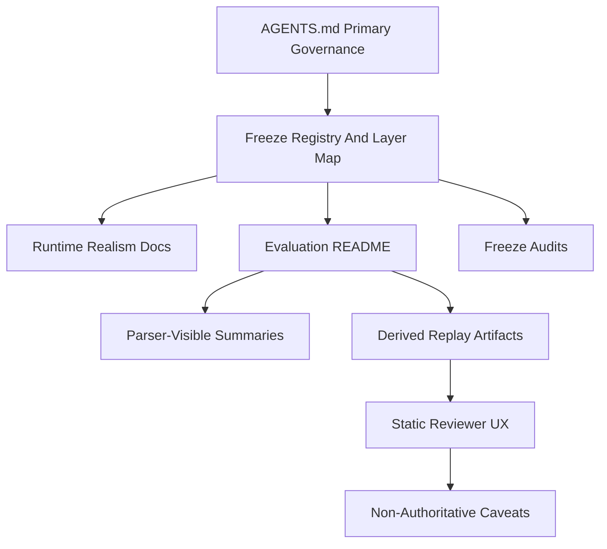
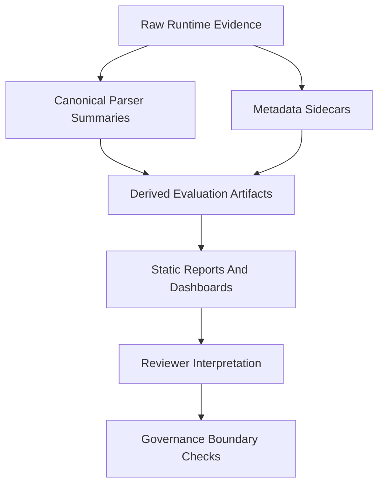

# Meta-Governance Maturity Review R1

Phase name: **Meta-Governance Maturity Review R1: Freeze Registry and Layer Map**

Build recommendation: **no-build**. This review is documentation and audit focused. It does not authorize runtime changes, launch/config/topic/schema changes, parser-contract changes, realism expansion, dashboard redesign, operational semantics, HITL/operator semantics, robustness scoring, or authority reinterpretation.

`AGENTS.md` remains the primary authority for repository direction and frozen governance. This document is an index and review aid; it does not replace source docs, freeze audits, parser contracts, runtime contracts, or scenario documentation.

## 1. Current Repository Maturity Assessment

The repository has crossed from feature growth into governance maturity. It is no longer just a simulation stack with evaluation scripts; it now behaves as a governance-aware replay-analysis and autonomy evaluation platform with frozen runtime-realism waves, parser-safe evaluation surfaces, replay observability artifacts, static reviewer UX, and scoped freeze audits.

Architectural capabilities now include:

- a bounded ROS 2/Gazebo counter-UAS simulation with separate sensing, fusion, tracking, threat, visualization, and engagement paths, described in [README.md](../../README.md);
- compatibility `Point` paths preserved for legacy and deterministic flows, with `/tracks/state` documented as the preferred realism-oriented state path in [CREDIBILITY_REALISM_TECHNICAL_REVIEW.md](../CREDIBILITY_REALISM_TECHNICAL_REVIEW.md);
- additive, default-off runtime realism overlays and wave fixtures documented in [docs/scenarios/realism/README.md](../scenarios/realism/README.md);
- evaluation-side replay analysis, matched-seed comparison discipline, divergence classification, replay observability bundles, static reports, dashboards, and governance linting documented in [scripts/evaluation/README.md](../../scripts/evaluation/README.md).

Governance capabilities now include:

- primary governance principles in [AGENTS.md](../../AGENTS.md): additive-only evolution, replay-safe realism, parser-safe evolution, freeze-before-expansion, governance before implementation, compatibility-path preservation, and no architecture creep;
- scoped freeze audits for replay observability and reviewer interpretation hardening in [replay_observability_freeze_audit.md](replay_observability_freeze_audit.md) and [reviewer_interpretation_hardening_freeze_audit.md](reviewer_interpretation_hardening_freeze_audit.md);
- explicit separation between raw runtime evidence, canonical parser-visible summaries, derived evaluation artifacts, and explanatory visualization layers;
- repeated warnings that replay annotations, lifecycle/churn counters, topology labels, and dashboards are explanatory review aids, not authoritative runtime state or robustness proof.

The dominant risks are now structural: duplicated governance language, wave narrative drift, artifact proliferation, provenance inconsistency, interpretation-layer complexity, and reviewer UX becoming too easy to misread as authority.

## 2. Frozen Layer Inventory

This inventory describes frozen layers as documentation and governance surfaces. It does not redefine them.

### Primary Governance Layer

- Purpose: define repository direction, frozen boundaries, evaluation philosophy, and workflow discipline.
- Authority boundary: `AGENTS.md` is the primary governance authority, but not a runtime implementation spec or parser contract.
- Artifact surfaces: [AGENTS.md](../../AGENTS.md), plus downstream docs that cite or apply it.
- Governance assumptions: mirrors do not imply authority; explanatory evidence is not authoritative state; replay logs are not parser contracts; realism is not hardware readiness; lifecycle degradation is not authority semantics.
- Maintenance implication: downstream docs should remain consistent with `AGENTS.md` or explicitly identify narrower scoped freeze facts from later audits.

### Runtime Realism Waves 1-5

- Purpose: apply default-off, replay-safe realism pressure through existing sensing, fusion, tracking, and evaluation paths.
- Authority boundary: no tracker redesign, no fusion redesign, no `/tracks/state` semantic change, no parser-contract change, no topic/schema change, and no hardware/PX4/MAVLink/HITL assumptions.
- Artifact surfaces: [README.md](../../README.md), [docs/scenarios/realism/README.md](../scenarios/realism/README.md), [scripts/evaluation/README.md](../../scripts/evaluation/README.md), and fixture CSVs under `scripts/evaluation/fixtures/`.
- Governance assumptions: realism refinements remain additive, default-off, parser-safe, and explanatory. Dormant lifecycle counters are not proof of tracker robustness.
- Maintenance implication: wave summaries are repeated across multiple docs; future updates should avoid copying full wave narratives into every surface.

### Wave 4 Passive Observability Layer

- Purpose: expose lifecycle and selection-visibility evidence from the bringup topology without changing runtime authority.
- Authority boundary: passive evidence only; no target assignment semantics, tactical authority, lifecycle truth, or parser-contract change.
- Artifact surfaces: scenario realism docs, evaluation README, observer-aware evaluation summaries, and replay reports that preserve raw evidence lineage.
- Governance assumptions: observability improves reviewability while remaining non-authoritative.
- Maintenance implication: lifecycle/churn caveats must stay consistent wherever observer evidence appears.

### Wave 5 Threshold-Envelope Layer

- Purpose: document confirmed-track reachability and bounded recovery behavior under phase-sensitive fragmentation timing.
- Authority boundary: empirical timing-envelope evidence only; no broader robustness claim and no monotonic claim that stronger silence improves recovery.
- Artifact surfaces: [docs/scenarios/realism/README.md](../scenarios/realism/README.md), [scripts/evaluation/README.md](../../scripts/evaluation/README.md), and Wave 5 fixture CSVs.
- Governance assumptions: bounded recovery evidence remains geometry- and cadence-sensitive; phase comparisons must remain explicit in profile IDs or cohort names.
- Maintenance implication: the safe bounded region and unstable pocket should not be converted into certified operating regions.

### Wave 6 Transferability / Topology Index Surface

- Purpose: provide fixture and topology-index inputs for replay-observability review workflows.
- Authority boundary: profile and topology labels are lineage-linked shorthand, not runtime topology semantics or certified operating regions.
- Artifact surfaces: Wave 6 fixture CSVs under `scripts/evaluation/fixtures/` and `replay_observability.py topology-index` outputs.
- Governance assumptions: topology indexes are derived evaluation artifacts and must preserve source profile, launch-argument, geometry, timing, and notes lineage.
- Maintenance implication: Wave 6 is less narratively anchored than adjacent waves, so future docs should treat it as an indexed evaluation surface unless a separate freeze audit provides more authority.

### Wave 7 Selection/Oracle Divergence Layer

- Purpose: localize replay-side disagreement between selected target evidence and oracle expectation.
- Authority boundary: evidence-only divergence classification; no tactical authority, no parser-contract change, and no runtime behavior change.
- Artifact surfaces: frozen additive fields in [README.md](../../README.md), [scripts/evaluation/README.md](../../scripts/evaluation/README.md), divergence classifier outputs, and replay observability artifacts.
- Governance assumptions: divergence labels classify replay evidence and should not become robustness rankings, operational readiness claims, or causal claims.
- Maintenance implication: frozen field names should be treated as registry-backed when new interpretation layers consume them.

### Replay Observability Tooling Freeze

- Purpose: package existing log, metadata, parser, divergence, lifecycle, topology, and paired-comparison evidence into derived reviewer artifacts.
- Authority boundary: evaluation-side only; no runtime dependency, no parser-visible rename, no lifecycle semantic change, no new authority surface.
- Artifact surfaces: `scripts/evaluation/replay_observability.py`, `src/counter_uas/test/test_replay_observability.py`, [scripts/evaluation/README.md](../../scripts/evaluation/README.md), and [replay_observability_freeze_audit.md](replay_observability_freeze_audit.md).
- Governance assumptions: missing provenance should produce warnings rather than fabricated lineage; deterministic derived artifact generation is not a claim of bitwise runtime determinism.
- Maintenance implication: derived JSON schema names, lint rules, and static report wording need lifecycle discipline as downstream users start depending on them.

### Reviewer Interpretation Hardening R1

- Purpose: strengthen reviewer-facing wording, caveats, evidence-layer labels, provenance guidance, and lint checks.
- Authority boundary: no live dashboard coupling, no operational readiness, no certification, no tactical authority, no lifecycle truth, and no composite robustness score.
- Artifact surfaces: `replay_observability.py` static artifacts, evaluation README guidance, replay observability tests, and [reviewer_interpretation_hardening_freeze_audit.md](reviewer_interpretation_hardening_freeze_audit.md).
- Governance assumptions: UX clarity is allowed only while it preserves non-authoritative evidence layering.
- Maintenance implication: repeated caveats should be centralized or referenced to avoid drift and reviewer fatigue.

## 3. Structural Risk Map

### Semantic Overlap

The same boundary ideas appear in `AGENTS.md`, [README.md](../../README.md), [docs/scenarios/realism/README.md](../scenarios/realism/README.md), [scripts/evaluation/README.md](../../scripts/evaluation/README.md), and freeze audits. This improves visibility but increases drift risk when one surface changes.

### Duplicated Interpretation Layers

Raw logs, sidecar metadata, parser-visible summaries, evaluation rows, divergence labels, lifecycle timelines, topology indexes, governance lint, static reports, and dashboards all describe overlapping evidence. Without a layer map, reviewers may collapse derived artifacts into authority.

### Governance Drift

The repository has several time horizons: agent-facing governance, runtime README summaries, scenario realism waves, evaluation README workflows, and scoped freeze audits. Drift can appear when one layer says a frontier is unresolved while another records later evaluation-side freezes.

### Observability Sprawl

Lifecycle evidence, tactical logs, selection proxies, divergence traces, topology/timing indexes, matched-seed comparisons, and reviewer dashboards are all useful but can become difficult to govern if each adds local caveats and local schemas.

### Freeze Fragmentation

Frozen checkpoints are distributed across commit references, READMEs, fixture filenames, freeze audits, parser-visible fields, tests, and generated artifact schemas. Future maintainers need an index before adding more freezes.

### Maintainability Erosion

Repeated caveats around lifecycle counters, matched seeds, topology labels, dashboards, and readiness claims can diverge in small ways. The risk is not one incorrect sentence; it is gradual loss of a single shared interpretation model.

### Provenance Inconsistency

Some artifacts carry log paths, meta paths, seeds, cohorts, git state, profile IDs, launch args, and warnings. Others may only carry partial lineage. Missing lineage should remain visible and should not be hidden by static report convenience.

### Audit Fatigue

Freeze audits are effective today, but each one repeats a similar structure. Without a template or index, audit authoring and review can become rote while still missing cross-layer drift.

### Replay Artifact Proliferation

Replay observability can emit bundle JSON, single-run reports, paired comparisons, topology indexes, governance lint, static markdown, static HTML, and dashboard artifacts. These must remain review conveniences, not a new authoritative replay state.

### Interpretation Complexity Creep

Reviewer UX can unintentionally become a scoring or decision layer if dashboards, warnings, topology labels, and matched-seed buckets are read as aggregate judgment. The repository should continue rejecting composite robustness scores and operational-readiness language.

## 4. Governance Sustainability Review

Additive-only evolution remains sustainable if the repository invests in lightweight governance indexes before adding more evidence surfaces. The current wave pattern is disciplined: narrow scope, default-off changes, parser-safe additions, tests, and freeze audits. The weak point is repeated prose across many files.

Freeze cadence is healthy for individual changes but needs cross-freeze visibility. Future freeze reviews should update a registry entry instead of forcing reviewers to reconstruct the wave history from several READMEs.

Audits are scaling procedurally, not structurally. They capture local scope and validation well, but they do not yet provide one shared map of frozen layers, artifact ownership, and authority boundaries.

Layering discipline is sufficient today because the evaluation docs explicitly separate raw runtime evidence, parser-visible summaries, derived artifacts, and explanatory visualization. It is fragile because that separation depends on repeated wording rather than a small canonical map.

Reviewer UX complexity should be treated as a governed surface. Static reports and dashboards are acceptable only while they remain static, derived, non-authoritative, and clearly separated from runtime and parser contracts.

## 5. Architectural Entropy Review

The runtime architecture remains intentionally bounded. The entropy risk is mainly documentation architecture and replay-analysis surface area.

Replay-analysis layers are understandable to maintainers who followed the waves. They are harder for a future reviewer because wave IDs, fixture files, parser-visible fields, topology labels, freeze audits, static dashboards, and governance lint live in different places.

Terminology consistency should be watched for these high-risk terms:

- `authority`
- `truth`
- `parser-visible`
- `derived`
- `explanatory`
- `lineage`
- `provenance`
- `frozen stable`
- `freeze-ready`
- `observability`
- `dashboard`
- `robustness`
- `readiness`
- `validation`
- `certification`

Governance language is not failing, but it is beginning to drift through repetition. Future work should prefer links and short summaries over copied warning blocks.

Frozen semantics remain separated today. The next risk is a well-intentioned reviewer convenience becoming an informal authority surface.

## 6. Candidate Meta-Governance Initiatives

### Governance Glossary Normalization

- Purpose: define canonical meanings for authority, parser contract, replay evidence, derived artifact, explanatory visualization, readiness, robustness, provenance, lineage, and freeze.
- Expected value: reduces ambiguous reviewer language.
- Governance benefit: lowers authority reinterpretation risk.
- Maintenance benefit: gives future audits shared vocabulary.
- Implementation risk: low if documentation-only.
- Over-governance risk: medium if it becomes a rigid style guide.

### Freeze Registry / Index

- Purpose: list frozen waves/layers, checkpoints, scope, artifact surfaces, and authority boundaries in one place.
- Expected value: highest near-term value.
- Governance benefit: reduces freeze fragmentation and drift.
- Maintenance benefit: future freezes can add one registry entry instead of copying long narratives across docs.
- Implementation risk: low.
- Over-governance risk: low if concise and descriptive.

### Architecture Layer Map

- Purpose: document runtime, evaluation, replay, reviewer UX, and governance layers as distinct surfaces.
- Expected value: high for onboarding and audit review.
- Governance benefit: prevents replay artifacts and dashboards from being mistaken for runtime authority.
- Maintenance benefit: clarifies where future changes belong.
- Implementation risk: low.
- Over-governance risk: medium if it tries to redesign architecture instead of mapping it.

### Artifact Lifecycle Documentation

- Purpose: define expected lifecycle for raw logs, sidecar metadata, parser summaries, derived JSON, lint outputs, static reports, and dashboard outputs.
- Expected value: high for reproducibility and cleanup discipline.
- Governance benefit: strengthens provenance expectations.
- Maintenance benefit: reduces stale-output confusion and artifact sprawl.
- Implementation risk: low.
- Over-governance risk: medium if it prescribes heavy process for exploratory runs.

### Replay-Analysis Surface Registry

- Purpose: catalog evaluation scripts, stable fields, output schemas, and caveats.
- Expected value: high for maintainers.
- Governance benefit: keeps parser-visible and derived fields distinct.
- Maintenance benefit: reduces accidental downstream dependency on explanatory fields.
- Implementation risk: medium because the evaluation surface is broad.
- Over-governance risk: medium.

### Terminology Consistency Audit

- Purpose: identify inconsistent or high-risk terms across docs.
- Expected value: moderate.
- Governance benefit: catches drift before it becomes semantics.
- Maintenance benefit: supports reviewer clarity.
- Implementation risk: low.
- Over-governance risk: medium if treated as blocking lint too early.

### Governance Lint Centralization

- Purpose: centralize checks for forbidden claims and required caveats.
- Expected value: moderate later.
- Governance benefit: could catch readiness, certification, authority, and scoring language.
- Maintenance benefit: lowers manual review burden once terms stabilize.
- Implementation risk: medium because this becomes tooling behavior.
- Over-governance risk: high if it becomes brittle keyword policing.

### Audit-Template Standardization

- Purpose: define a short template for scope, authority boundaries, provenance checks, regression evidence, freeze criteria, and post-freeze lane.
- Expected value: high after a registry exists.
- Governance benefit: improves freeze cadence consistency.
- Maintenance benefit: reduces audit authoring cost.
- Implementation risk: low.
- Over-governance risk: low to medium.

### Freeze Metadata Manifest

- Purpose: machine-readable freeze metadata for wave IDs, commit IDs, artifact paths, fields, and tests.
- Expected value: moderate but premature for R1.
- Governance benefit: could improve traceability.
- Maintenance benefit: supports future validation tooling.
- Implementation risk: medium because it begins tooling-oriented governance.
- Over-governance risk: medium to high.

### Observability-Layer Dependency Map

- Purpose: show how lifecycle, tactical, divergence, topology, static report, dashboard, and lint layers depend on raw logs and parser outputs.
- Expected value: high.
- Governance benefit: prevents derived artifacts from becoming authority.
- Maintenance benefit: helps future changes avoid hidden coupling.
- Implementation risk: low if markdown-only.
- Over-governance risk: low.

## 7. Recommended Narrow First Initiative

Recommended first initiative: **Freeze Registry and Layer Map R1**.

This document implements the first pass of that initiative by indexing frozen layers, artifact surfaces, authority boundaries, governance assumptions, structural risks, maintenance risks, and freeze criteria.

Expected governance risks:

- The registry could be mistaken as more authoritative than `AGENTS.md`.
- A summary could accidentally rewrite or broaden an existing freeze.
- Future-wave commitments could imply Wave 8 realism expansion.
- Documentation clarity could turn into process bloat.

Expected maintenance risks:

- The registry can become stale if future freezes do not update it.
- It can duplicate too much wave narrative if future edits copy full histories instead of linking.
- It can confuse reviewers if ownership between `AGENTS.md`, READMEs, freeze audits, and evaluation docs is not explicit.

Layer map:

Evidence-layer map:

The registry should remain short, linked, and descriptive. It should not become a replacement for detailed wave docs or freeze audits.

## 8. Validation / Review Strategy

Review governance changes as documentation consistency changes.

Required review checks:

- Confirm no runtime, launch, config, topic, schema, parser, dashboard redesign, live UX, or operational semantic changes are included.
- Confirm `AGENTS.md` remains named as the primary authority.
- Confirm registry entries describe existing layers without redefining them.
- Confirm no wording implies operational readiness, certification, tactical authority, hardware readiness, HITL/operator semantics, or robustness scoring.
- Confirm replay artifacts remain derived, static, explanatory, and non-authoritative.
- Confirm missing provenance remains visible as warnings or review limitations, not hidden as clean lineage.
- Confirm frozen field names and artifact names are copied exactly when referenced.

Documentation consistency checks:

- Compare wave names and frozen-scope descriptions across [README.md](../../README.md), [docs/scenarios/realism/README.md](../scenarios/realism/README.md), and [scripts/evaluation/README.md](../../scripts/evaluation/README.md).
- Check freeze-audit scope statements before adding any new post-freeze continuation language.
- Check repeated caveats around lifecycle counters, matched seeds, topology labels, dashboards, parser-visible summaries, and readiness claims.
- Prefer links and short summaries over copied boundary blocks.

Terminology drift checks:

- Manually review high-risk terms listed in Section 5 during R1.
- Defer automated lint expansion until glossary and registry language stabilize.
- Treat any new use of `truth`, `authority`, `readiness`, `validation`, `certification`, `robustness`, or `score` as requiring explicit context.

Boundary preservation checks:

- On governance conflicts, prefer `AGENTS.md` for project-level philosophy.
- Prefer scoped freeze audits for the exact scope and validation of a frozen artifact.
- Prefer parser/evaluation docs for parser-visible field descriptions.
- Do not use this registry to authorize implementation work.

## 9. Freeze Criteria

Meta-Governance Maturity Review R1 is freeze-ready when:

- The change set remains documentation/audit/planning only.
- It introduces no runtime, parser, schema, topic, config, dashboard redesign, live dashboard coupling, or operational semantics changes.
- It keeps `AGENTS.md` as the primary governance authority.
- It indexes frozen layers without redefining them.
- It maps artifact surfaces and authority boundaries without creating a new authority surface.
- It identifies governance and maintenance risks without proposing feature expansion.
- It includes review criteria for future governance changes.
- It explicitly rejects Wave 8 realism expansion, runtime redesign, live dashboard coupling, scoring systems, HITL/operator semantics, tactical authority reinterpretation, and tracker/fusion redesign.

## 10. Final Recommendation

The repository has transitioned from feature growth into governance maturity. Future value now comes more from maintainability, interpretation safety, provenance discipline, and frozen-layer clarity than from runtime realism expansion.

The next best action is to keep **Freeze Registry and Layer Map R1** as a documentation-only governance artifact, then use it as the reference point for future freeze audits. Subsequent work should prefer glossary normalization, artifact lifecycle documentation, and audit-template standardization before any new governance tooling.

What should explicitly not happen next:

- no Wave 8 realism expansion;
- no runtime architecture redesign;
- no launch/config/topic/schema changes;
- no replay log authority reinterpretation;
- no operational-readiness semantics;
- no live dashboard coupling;
- no HITL/operator workflow semantics;
- no composite robustness scoring system;
- no tracker, fusion, tactical, or guidance redesign;
- no governance lint expansion before documentation ownership is clear.

