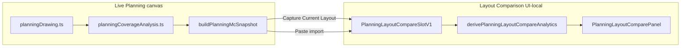

# Planning Layout Comparison V1

Status: **frozen**

Registry ID: **PLAT-RT-PLAN-COMPARE1**

**Parent freezes:** [rt_planning_mode_evolution_v1.md](rt_planning_mode_evolution_v1.md), [coverage_analysis_v2.md](coverage_analysis_v2.md), [planning_mc_integration_v2.md](planning_mc_integration_v2.md), [rt_large_area_planning_world_v1.md](rt_large_area_planning_world_v1.md)

---

## Scope

Planning Layout Comparison V1 adds **read-only**, **snapshot-based** side-by-side review of up to three Planning layouts (Slot A / B / C) inside RT Sandbox Planning Mode. This wave completes the comparison surface only — it does not execute Monte Carlo runs, mutate runtime or bridge state, render Cesium overlay diffs, or score planning layouts against MC outcomes.

Included:

- `planningLayoutComparison.ts` — compare slot model, row/analytics derivation, delta labels, snapshot JSON validation/import helpers.
- `PlanningLayoutComparePanel.tsx` — read-only compare table, delta table, blind-spot/recommendation side-by-side, snapshot paste-import.
- Planning Mode workstation wiring in `AppWorkstationSlots.tsx` (immutable slot captures, no localStorage).
- Vitest coverage for model, panel, workstation rendering, and golden fixture parity.
- Golden fixture [planning_layout_compare_golden_v1.json](../../fixtures/rt_sandbox/planning_layout_compare_golden_v1.json).

Excluded:

- Cesium multi-layout ghost/overlay comparison on the globe.
- Runtime or bridge mutation.
- Monte Carlo execution, job enqueue, or maintainer MC CLI wiring.
- Filesystem-backed snapshot loading (paste JSON only).
- localStorage / session persistence of compare slots.
- Planning-vs-MC outcome scoring or ranking.
- Automatic layout selection or recommendation authority.
- Parser, telemetry, capture, or replay schema changes.

---

## Architecture summary

Layout Comparison sits entirely inside `platform/rt-sandbox-ui/` Planning Mode. It consumes frozen `rt_planning_mc_snapshot_v1` artifacts produced by [planning_mc_integration_v2.md](planning_mc_integration_v2.md) and derives read-only comparison analytics for maintainer review.



Relevant UI path:

`AppWorkstationSlots → PlanningModePanel → PlanningLayoutComparePanel`

No arrow crosses into bridge commands, runtime entity state, MC execution, or evaluation parsers.

---

## Snapshot-based comparison model

Comparison slots wrap existing **`PlanningMcSnapshotV1`** records (`rt_planning_mc_snapshot_v1`). No new snapshot schema version was introduced.

| Identifier | Role in comparison |
|------------|-------------------|
| `planning_snapshot_id` | Frozen capture identity per slot |
| `planning_geometry_id` | Layout content identity (polygon + radar geometry); used for duplicate detection |
| `planning_extent_id` | Compatibility gate; cross-extent compare emits advisory warning |

Slot builder: `buildPlanningLayoutCompareSlot(slotLabel, snapshot, options?)`.

Capture flow: `buildPlanningMcSnapshot()` → `capturePlanningLayoutCompareSlot()` into next available slot (A, then B, then C).

Import flow: pasted JSON → `parsePlanningMcSnapshotJson()` → `setPlanningLayoutCompareSlot()` for selected slot label.

Captured slots are **immutable** — live canvas edits do not mutate stored snapshots.

---

## Compare slots

| Slot | Label | Max count |
|------|-------|-----------|
| A | Baseline for delta derivation | 1 |
| B | Comparison target | 1 |
| C | Comparison target | 1 |

Helpers:

- `capturePlanningLayoutCompareSlot()` — append to next free slot
- `removePlanningLayoutCompareSlot()` — remove one slot
- `clearPlanningLayoutCompareSlots()` — clear all
- `setPlanningLayoutCompareSlot()` — import/replace by slot label

Governance copy: `PLANNING_LAYOUT_COMPARE_GOVERNANCE_COPY` — UI-local, non-authoritative.

---

## Metrics table

Derived by `derivePlanningLayoutCompareRows()` from snapshot `analytics_summary` and geometry:

| Column | Source |
|--------|--------|
| Coverage % | `analytics_summary.coverage_percent` |
| Overlap % | `analytics_summary.overlap_percent` |
| Redundancy % | `analytics_summary.redundancy_percent` |
| Radar count | `radars.radar_sites.length` |
| Extent | `planning_extent.planning_extent_id` |
| Snapshot id | `planning_snapshot_id` |

Advisory warnings (non-blocking):

- **Duplicate geometry** — two or more slots share `planning_geometry_id`
- **Extent mismatch** — slots differ in `planning_extent_id`

---

## Delta model

When Slot A is present, `derivePlanningLayoutCompareDeltas()` computes display-only deltas vs baseline:

| Metric | Deltas |
|--------|--------|
| Coverage % | B − A, C − A |
| Overlap % | B − A, C − A |
| Redundancy % | B − A, C − A |
| Radar count | B − A, C − A |

Advisory labels via `planningLayoutCompareDeltaLabel()`:

| Label | Rule |
|-------|------|
| Unchanged | Percent metrics: \|delta\| < 0.1; radar count: delta = 0 |
| Improved | Positive delta |
| Reduced | Negative delta |

Labels are heuristic and explanatory only — **not** scoring, ranking, or operational readiness.

Unified entry point: `derivePlanningLayoutCompareAnalytics()` returns rows, warnings, deltas, and side-by-side summaries.

---

## Blind spot side-by-side

`derivePlanningLayoutCompareSideBySide()` exposes `blind_spot_summary` per slot from snapshot analytics. The panel renders each slot's summary in a read-only list — **no diff engine**, no ranking.

---

## Recommendation side-by-side

Same side-by-side derivation exposes `recommendation_summary` (suggested radar, position, reason) per slot. Display-only — **no auto-selection**, no ranking, no runtime apply.

---

## Snapshot import

Planning Mode supports paste-import of `rt_planning_mc_snapshot_v1` JSON into a selected slot (A / B / C):

- Validator: `parsePlanningMcSnapshotJson(text)`
- Errors are advisory only (invalid JSON, wrong schema, missing fields)
- No filesystem reads, no server persistence, no localStorage

---

## Golden fixture

[fixtures/rt_sandbox/planning_layout_compare_golden_v1.json](../../fixtures/rt_sandbox/planning_layout_compare_golden_v1.json):

- Three canonical snapshots (Slots A / B / C) with known metric differences
- `expected_deltas` array for deterministic analytics regression
- Validated by `PlanningLayoutComparePanel.test.tsx` golden test

---

## Governance audit

| Boundary | Verdict |
|----------|---------|
| Planning-only | **Pass** — gated by `workspaceMode === "planning"` |
| UI-local | **Pass** — React state in workstation shell only |
| Read-only comparison | **Pass** — no layout apply, no entity commands |
| Snapshot-based | **Pass** — uses `rt_planning_mc_snapshot_v1` only |
| No runtime mutation | **Pass** — no bridge entity/spawn/move/delete paths |
| No bridge coupling | **Pass** — compare modules do not import bridge command dispatch |
| No MC execution | **Pass** — no job creation or MC CLI invocation |
| No Cesium overlay diff | **Pass** — panel/table UI only |
| No localStorage persistence | **Pass** — slot state is ephemeral React state |
| No planning-vs-MC scoring | **Pass** — deltas are planning heuristic only; MC result link not used for compare scoring |

---

## Limitations

- Comparison metrics are **heuristic** (Coverage V2 estimates), not validated sensing or runtime authority.
- Cross-extent comparison is allowed with an explicit compatibility warning; metrics are not directly comparable across Planning World sizes.
- Delta labels (Improved / Reduced / Unchanged) are deterministic but **not** operational recommendations.
- Snapshot import accepts pasted JSON only; no corpus or filesystem integration.
- No Cesium ghost rendering of multiple layouts on the globe.
- Separate from Grid Mode `rt_layout_mc_handoff_v1` / layout MC execution tracks.

---

## Validation

| Check | Command / surface |
|-------|-------------------|
| Model tests | `planningLayoutComparison.test.ts` |
| Panel tests | `PlanningLayoutComparePanel.test.tsx` |
| Workstation tests | `AppWorkstationSlots.test.tsx` |
| Golden fixture | `planning_layout_compare_golden_v1.json` |
| Typecheck + build | `npm run build` in `platform/rt-sandbox-ui/` |

Recorded regression (Step 5):

```bash
cd platform/rt-sandbox-ui && npm test
cd platform/rt-sandbox-ui && npm run build
git diff --check
```

---

## Future work (not authorized by this freeze)

- Cesium multi-layout ghost/overlay comparison (visual diff on globe).
- Compare analytics export/copy JSON from Planning Mode.
- Optional per-slot MC link status chip (status label only; still no MC scoring).
- Maintainer CLI to validate compare golden fixtures in CI lint hooks.
- Explicit PLAN wave for planning layout compare → layout MC handoff bridge (separate from Grid layout MC).
- Planning-vs-MC outcome comparison analytics — separate evaluation frontier per PLAT-RT-PLAN-MC2.

---

## Freeze verdict

**Frozen** as UI-local Planning Layout Comparison V1. Snapshot-based Slot A / B / C comparison, metrics table, delta vs A, advisory labels, blind-spot/recommendation side-by-side, and snapshot paste-import are stable for maintainer review. Runtime authority, bridge contracts, MC execution, Cesium overlay diff, persistence, and parser/telemetry surfaces remain unchanged.
