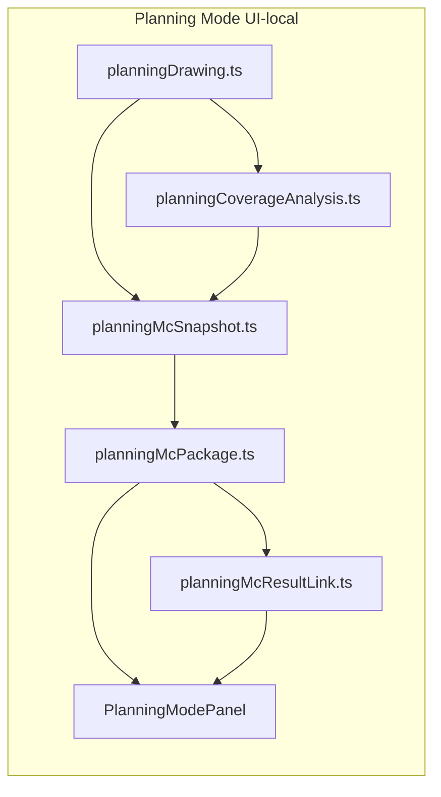

# Planning → Monte Carlo Integration V2

Status: **frozen**

Registry ID: **PLAT-RT-PLAN-MC2**

## Scope

Planning → Monte Carlo Integration V2 adds UI-local artifact export, package preview,
and read-only result linkage between RT Sandbox Planning Mode and future Monte Carlo
workflows. This wave completes the V2 integration **planning surface only** — it does
not execute Monte Carlo runs, create jobs, or couple to runtime, bridge, SA, or
filesystem-backed MC loaders.

Included:

- `rt_planning_mc_snapshot_v1` — browser-exportable planning geometry + analytics snapshot.
- `rt_planning_mc_package_v1` — deterministic MC preparation package derived from snapshot.
- `planning_result_link_v1` — linkage record between package identifiers and optional result ref.
- `rt_planning_mc_result_ref_v1` — pasted/imported MC result metadata (no file load).
- Planning Mode package preview panel with stale-state advisory.
- Planning Mode result linkage panel with metadata import placeholder and mock ref.
- Vitest coverage for snapshot, package, linkage, and workstation rendering.

Excluded:

- Monte Carlo execution, job enqueue, or maintainer MC CLI wiring from Planning Mode.
- Filesystem reads of MC result artifacts.
- Runtime or bridge mutation.
- LOS, sensor-truth, or terrain-coupled MC semantics.
- Telemetry, parser, capture, or replay schema changes.
- SA promotion or automatic SA import.
- Comparison analytics between planning coverage and MC outcomes.

## Architecture summary

Planning MC Integration V2 sits entirely inside `platform/rt-sandbox-ui/` Planning Mode.
It consumes existing UI-local planning state from Coverage Analysis V2 and produces
exportable JSON artifacts for **maintainer handoff review only**.



Relevant UI path:

`AppWorkstationSlots → PlanningModePanel → planning-mc-package-preview / planning-mc-result-link-preview`

No arrow crosses into bridge commands, runtime entity state, or evaluation parsers.

## Snapshot model (`rt_planning_mc_snapshot_v1`)

Built by `buildPlanningMcSnapshot()` in `planningMcSnapshot.ts`.

| Field | Role |
|-------|------|
| `planning_snapshot_id` | Content hash over snapshot canonical fields (schema, geometry id, created UTC, optional source ids). |
| `planning_geometry_id` | Stable fingerprint over defense polygon vertices + radar site geometry (sorted canonical form). |
| `polygon.defense_area_vertices` | Completed planning polygon vertices. |
| `radars.radar_sites` | UI-local radar sites with preset + range metadata. |
| `analytics_summary` | Coverage/overlap/redundancy/blind-spot/recommendation summaries from Coverage V2. |
| `presentation` | Terrain mode + location preset (display context only). |
| `provenance` | `authority: rt_planning_ui`, optional `source_layout_id` / `source_geometry_id`. |

Export helpers: copy/download JSON via browser clipboard and blob download only.

## Package model (`rt_planning_mc_package_v1`)

Built by `buildPlanningMcPackage()` in `planningMcPackage.ts`.

| Field | Role |
|-------|------|
| `planning_snapshot_id` | Copied from snapshot. |
| `planning_geometry_id` | Copied from snapshot. |
| `planning_summary` | Radar count + coverage/overlap/redundancy summaries. |
| `mc_preparation` | **Suggestions only**: scenario label, suggested run count, suggested seed base. |
| `metadata.package_version` | Package revision (`"1"`). |

`planningPackageLinkId(pkg)` returns `rt_planning_package:{planning_snapshot_id}`.

MC preparation fields are advisory labels — they do not enqueue runs or mutate runtime state.

## Result-link model

### `planning_result_link_v1`

Built by `buildPlanningResultLink()` / `buildEmptyPlanningResultLink()` in `planningMcResultLink.ts`.

| Field | Role |
|-------|------|
| `linked_package_id` | Derived package link id. |
| `linked_planning_snapshot_id` | Package snapshot id. |
| `linked_planning_geometry_id` | Package geometry id at link time. |
| `linked_source_layout_id` | Optional layout lineage (when present on package). |
| `linked_source_geometry_id` | Optional geometry lineage (when present on package). |
| `result_ref` | Optional `rt_planning_mc_result_ref_v1` or `null`. |
| `status` | Linkage validation state (see below). |

### `rt_planning_mc_result_ref_v1`

Metadata-only MC result reference. Imported via pasted JSON validation or mock builder.

| Field | Required | Role |
|-------|----------|------|
| `linked_package_id` | yes | Must match current package link id when linked. |
| `linked_planning_geometry_id` | yes | Must match package geometry when linked. |
| `mc_run_label` | yes | Human/maintainer run label. |
| `mc_result_id` | yes | Opaque result identifier (not loaded from disk). |
| `imported_utc` | yes | Import timestamp. |
| `summary.success_rate` | no | Optional aggregate metric. |
| `summary.miss_distance_p95` | no | Optional aggregate metric. |
| `summary.intercept_time_mean` | no | Optional aggregate metric. |

## Identifier lineage

```
Planning polygon + radar sites
  └─ planning_geometry_id  (geometry fingerprint)
       └─ planning_snapshot_id  (+ created_utc, source ids)
            └─ linked_package_id = rt_planning_package:{planning_snapshot_id}
                 └─ result_ref.linked_package_id (must match)
                 └─ result_ref.linked_planning_geometry_id (must match package geometry)
```

Optional provenance fields (`source_layout_id`, `source_geometry_id`) propagate from snapshot → package → link when present. They are **lineage hints only**, not runtime authority.

## Stale-state handling

Two independent stale signals:

1. **Package stale** — `planningMcPackage.planning_geometry_id !== currentPlanningGeometryId` (live planning edits after package generation). UI shows “Package may be stale. Regenerate.”
2. **Link stale** — imported `result_ref` identifiers match the package, but `currentPlanningGeometryId` has drifted since import. Link `status` becomes `stale`.

Regenerating a package clears imported result ref state in the workstation shell.

## Linkage validation states

Evaluated by `validatePlanningResultLink()`:

| Status | Meaning |
|--------|---------|
| `unlinked` | No `result_ref` imported. |
| `linked` | Ref identifiers match package and current geometry. |
| `stale` | Ref matches package but current planning geometry drifted. |
| `mismatch` | Ref `linked_package_id` or `linked_planning_geometry_id` does not match package. |

Preview panel (`buildPlanningResultLinkPreview()`) is display-only — no comparison analytics.

## Governance audit

| Boundary | Verdict |
|----------|---------|
| UI-local only | **Pass** — all state in Planning Mode React state; artifacts are JSON export/import placeholders. |
| No runtime mutation | **Pass** — no entity commands, scenario apply, or session mutation. |
| No bridge coupling | **Pass** — layout modules and tests assert no bridge calls. |
| No MC execution | **Pass** — no job creation, script invocation, or `monte_carlo.py` paths. |
| No filesystem access | **Pass** — metadata import parses pasted JSON only; no `readFile` in planning MC modules. |
| No LOS logic | **Pass** — uses Coverage V2 heuristic analytics only. |
| No sensor logic | **Pass** — planning radar sites remain UI-local overlays. |
| No terrain coupling | **Pass** — terrain/location fields are presentation metadata on snapshot only. |
| No telemetry/schema changes | **Pass** — new schemas are Planning UI artifacts only. |
| No SA promotion | **Pass** — no SA import, corpus commit, or replay bundle paths. |

## Limitations

- MC preparation fields are **suggestions**, not executable job specs.
- Result summaries are **declarative metadata** — not loaded from MC output files.
- Mock result ref uses `rt_mc_result:mock:planning-ui` for UI-local testing only.
- Package/snapshot export does not persist to server or corpus.
- Stale/mismatch detection is identifier-based only — no geometric diff or outcome comparison.
- Separate from Grid Mode `rt_layout_mc_handoff_v1` / layout MC execution tracks.

## Golden fixture

[fixtures/rt_sandbox/planning_mc_result_link_golden_v1.json](../../fixtures/rt_sandbox/planning_mc_result_link_golden_v1.json) provides a stable linked example (canonical test polygon + single radar site) for maintainer review and future lint hooks. Vitest remains the primary regression gate; the golden documents expected identifier shapes and linked status.

## Validation

| Check | Command / surface |
|-------|-------------------|
| Snapshot tests | `planningMcSnapshot.test.ts` |
| Package tests | `planningMcPackage.test.ts` |
| Result link tests | `planningMcResultLink.test.ts` |
| Workstation panel tests | `AppWorkstationSlots.test.tsx` |
| Typecheck + build | `npm run build` in `platform/rt-sandbox-ui/` |

## Future work (not authorized by this freeze)

- Maintainer CLI to validate planning MC artifacts against golden fixtures.
- Optional linkage JSON export/copy from Planning Mode.
- Explicit PLAN wave for Planning → layout MC handoff bridge (separate from Grid layout MC).
- MC execution wiring — requires new scoped PLAN + PLAT wave with full governance checklist.
- Planning vs MC outcome comparison analytics — separate evaluation frontier.

## Freeze verdict

**Frozen** as UI-local Planning → Monte Carlo Integration V2. Snapshot, package, and result-link schemas are stable for maintainer handoff review. Runtime authority, bridge contracts, MC execution, filesystem-backed result loading, SA promotion, and parser/telemetry surfaces remain unchanged.
