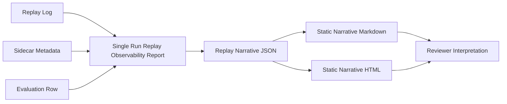

# PHASE 2 Replay Narrative UX Plan

## Scope

This phase is documentation-first and replay-side only. `AGENTS.md` remains the primary authority for repository direction, frozen governance, and forbidden scope.

Replay Narrative UX improves reviewer comprehension of existing replay evidence by grouping events, windows, warnings, and static summaries into deterministic narrative artifacts. It does not redefine runtime topics, parser-visible summaries, lifecycle semantics, tactical authority, readiness, certification, governance approval, or robustness claims.

Allowed scope:

- additive evaluation-side documentation and tooling;
- deterministic JSON, Markdown, and HTML artifacts generated from existing replay observability outputs;
- static narrative reports and optional static visual summaries;
- event taxonomies that preserve raw lineage and source artifact references;
- focused tests and freeze audits for deterministic generation and governance labels.

Forbidden scope:

- runtime architecture changes;
- launch, topic, schema, parser-contract, tracker, fusion, MHT/JPDA, or tactical control changes;
- live dashboards, websocket coupling, ROS subscriptions, operator control surfaces, or approval workflows;
- HITL/operator authority semantics;
- readiness, certification, field performance, or composite robustness scoring;
- AI causal explanation systems or causal overclaim generation;
- governance automation expansion beyond existing lint patterns.

## Existing Artifacts To Reuse

- [`scripts/evaluation/replay_observability.py`](../../scripts/evaluation/replay_observability.py) for evidence bundles, divergence traces, lifecycle timelines, matched-seed reports, topology indexes, governance linting, and static renderers.
- [`scripts/evaluation/README.md`](../../scripts/evaluation/README.md) for parser-visible summary boundaries and reviewer artifact commands.
- [`reviewer_interpretation_guide.md`](reviewer_interpretation_guide.md) for layer vocabulary, loaded terms, causal-language guidance, and reviewer checklist.
- [`replay_observability_freeze_audit.md`](replay_observability_freeze_audit.md) for the current freeze baseline.
- [`meta_governance_maturity_review_r1.md`](meta_governance_maturity_review_r1.md) for the frozen layer map and structural risk framing.

## Minimal Additive Architecture

Replay Narrative UX layers on top of existing replay observability artifacts:

The derived narrative artifact should include:

- `artifact_type`: narrative artifact identity;
- `narrative_schema_version`: additive narrative schema version;
- `governance`: existing non-authoritative governance block;
- `lineage`: copied source lineage, not certification;
- `source_artifacts`: names and paths of consumed replay artifacts;
- `events`: deterministic event list with category, event type, label, source, line/block reference, and caveat;
- `windows`: deterministic divergence/lifecycle/ambiguity windows when supported by existing artifacts;
- `summary`: counts and headline review cues;
- `warnings`: missing provenance and visibility limitations;
- `interpretation_caveats`: explicit anti-claims.

## Suggested Waves

### Wave 0: Documentation And Registry

Create this documentation page and link it from evaluation docs. Freeze the allowed/forbidden scope before implementation expands.

### Wave 1: Narrative Artifact Contract

Define `replay_narrative_v1` as a derived evaluation artifact. It consumes existing single-run replay observability JSON and does not become a parser contract or runtime authority surface.

### Wave 2: Deterministic Event Extraction

Extract narrative events from existing lifecycle, divergence, canonical summary, and lineage fields. Preserve raw line provenance when present. Sort by parsed timestamp when available, then source line, source artifact, category, event type, and event id.

### Wave 3: Static Narrative Report

Render deterministic Markdown and HTML from narrative JSON. Keep reports static and precomputed. Static visuals may use simple timeline tables or standalone HTML from existing JSON, but no live runtime coupling is allowed.

### Wave 4: Visual Summary Refinement

Add optional static timeline bands, event markers, divergence overlays, lifecycle overlays, and target-switch markers only after the narrative artifact contract is stable.

### Wave 5: Freeze Audit And Regression

Audit the completed phase for deterministic output, governance caveats, missing-provenance warnings, and absence of runtime/parser/schema/topic changes.

## Event Taxonomy

- `detection`: first observed target, track, candidate, or interceptor-relevant evidence.
- `selection`: selected-id evidence, selection blocks, selected/oracle mismatch starts, and target-switch markers.
- `commitment`: reviewer-facing shorthand only when sourced from existing selected-id evidence; it is not tactical authority.
- `ambiguity`: fragmented gap, ghost, dropout, stale, or delay evidence.
- `lifecycle`: candidate, coast, recovery, continuity, persistence, observer, and churn overlays.
- `divergence`: divergence class, mismatch window, first mismatch block, and mismatch-after-fragmentation markers.
- `outcome`: hit, miss, min miss, intercept time, time margin, and layer-at-hit summaries copied from existing parser-visible fields.
- `provenance_warning`: missing metadata, missing seed lineage, dirty git state, absent observer markers, visibility limits, or governance lint issues.

Recommended wording: `co-occurs with`, `localized near`, `adjacent to`, `consistent with`, and `associated with`.

Forbidden wording unless separately governed: `caused`, `proved`, `certified`, `readiness`, `operator decision`, `approval`, `truth`, and `authority` as unqualified conclusions.

## Static UX Structure

- Header: artifact type, run id, source artifacts, lineage, warnings, and non-authoritative notice.
- Summary panel: replay-local event counts, divergence class, lifecycle event counts, and outcome summary.
- Narrative timeline: chronological event bullets or rows with stable labels.
- Window panel: divergence and ambiguity windows derived from existing trace and lifecycle evidence.
- Detail panel: grouped events with source artifact, line/block reference, category, evidence role, and caveat.
- Interpretation footer: reviewer interpretation guide link and anti-claims.

## Deterministic Artifact Guidance

- Use sorted JSON keys and stable indentation.
- Do not include wall-clock generation timestamps.
- Generate stable event ids from source artifact, line/block reference, category, and event type.
- Preserve missing lineage as warnings.
- Render Markdown and HTML byte-identically for identical inputs.
- Do not call LLMs or causal heuristic models during artifact generation.

## Freeze Boundaries

Phase 2 can freeze only if:

- no runtime, launch, topic, schema, parser-visible field, tracker, fusion, or tactical authority files change;
- narrative artifacts remain derived evaluation artifacts;
- static reports have no live runtime coupling or control inputs;
- warnings and caveats remain visible;
- generated outputs are deterministic from identical inputs;
- tests cover artifact contract, extraction, rendering, governance lint, and deterministic generation;
- documentation keeps `AGENTS.md`, reviewer interpretation guidance, and replay observability freeze boundaries visible.
