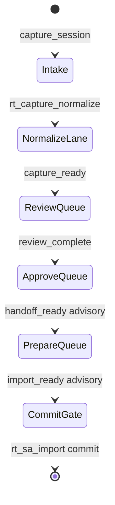

# RT Advisory Maintainer Workflow (`rt_advisory_maintainer_workflow_v1`)

**Phase:** PLAN-RT-F7 — maintainer ergonomics (docs only)  
**Prerequisite:** [rt_sa_workflow_automation_v1.md](rt_sa_workflow_automation_v1.md) (F6 frozen); PLAT-RT-F6 P0–P2 frozen  
**Authority:** [rt_manual_sa_import_workflow_v1.md](rt_manual_sa_import_workflow_v1.md); [rt_advisory_contamination_gates_v1.md](rt_advisory_contamination_gates_v1.md)

Normative maintainer-facing workflow for **advisory triage and bulk operations**. Composes F6 per-capture derive and F6 P2 batch CLIs — does **not** replace SA1 write paths.

---

## 1. Core invariant

```text
queue_priority ≠ approval authority
triage_lane ≠ automated CLI execution
bulk_report ≠ batch commit
```

Maintainer CLIs remain authority for review, approve, prepare, and commit. F7 ordering and lanes are **cognition aids only**.

---

## 2. Review queue prioritization

### 2.1 Purpose

When N captures are staged, maintainers need a **stable, repeatable sort** for daily stand-up and batch `report` output. Priority does not invoke CLIs or change advisory ladder rungs.

### 2.2 Priority bands (ascending rank = higher urgency)

| Band | Rank range | Inclusion rule |
|------|------------|----------------|
| **P0_block** | 0–99 | `blocked: true` with `handoff_rejected` or `handoff_import_deferred` in `block_reasons` |
| **P1_error** | 100–199 | Derive `error` or missing staging (`staging_not_found`) |
| **P2_normalize** | 200–299 | Advisory below `capture_ready` (normalization / validation fail) |
| **P3_review** | 300–399 | `capture_ready` or `review_complete` (review queue) |
| **P4_approve** | 400–499 | `approval_ready` |
| **P5_package** | 500–599 | `handoff_ready` (advisory post-approve packaging) |
| **P6_import** | 600–699 | `import_ready` (advisory — commit still manual) |
| **P7_terminal** | 900+ | `terminal: handoff_import_committed` — informational only |

Within a band, sort by **oldest** `candidate.json` `generated_at` (or staging mtime fallback) ascending — stale work surfaces first.

### 2.3 Tie-breakers

1. Reject before defer when both signals present (reject is P0_block sub-rank 0, defer sub-rank 10)
2. Same band + same timestamp: `capture_candidate_id` lexicographic ascending
3. F5 experiment `handoff_eligibility: eligible` does **not** increase priority rank

### 2.4 Output fields (PLAT reference)

Per row in batch documents:

```json
{
  "queue_priority": {
    "rank": 320,
    "band": "P3_review",
    "rationale": "capture_ready; oldest in review queue"
  }
}
```

---

## 3. Blocker grouping

### 3.1 Taxonomy

Map `block_reasons` and checklist `fail`/`warn` items to **groups** for rollup reports:

| Group ID | Label | Typical signals |
|----------|-------|-----------------|
| `normalization` | Normalization / validation | `normalization_invalid`, missing `normalization_validation`, checklist `normalization` fail |
| `review_attestation` | Review / attestation | missing `handoff_reviewed`, checklist `pose_cognition` warn/fail, `review_pending` |
| `approval_gate` | Approval gate | missing approve events, `approval_status` not approved when required |
| `packaging` | Packaging / conversion | missing `conversion.json`, conversion step failures |
| `lineage` | Lineage / boundary | lineage lint fail, `session_id` parent hints — see [rt_advisory_contamination_gates_v1.md](rt_advisory_contamination_gates_v1.md) |
| `experiment_warn` | Experiment advisory | F5 `handoff_eligibility` warn-only; never sole blocker for commit |
| `terminal_block` | Reject / defer | `handoff_rejected`, `handoff_import_deferred` |

A capture may appear in **multiple groups** when multiple signal classes apply; primary group for queue band is the **lowest** rung blocker (normalization before review before approval).

### 3.2 Alignment with F6 P2 filters

| P2 CLI flag | Maps to group / band |
|-------------|----------------------|
| `--blocked-only` | Any group + `blocked: true` |
| `--reject-only` | `terminal_block` |
| `--defer-only` | `terminal_block` |
| `--state` | Advisory rung filter (orthogonal to group) |

PLAT-RT-F7 may add `report --group-by <group_id>` — not required in PLAN wave.

---

## 4. Capture triage flow

### 4.1 Triage lanes

Overlay on [rt_manual_sa_import_workflow_v1.md](rt_manual_sa_import_workflow_v1.md):



| Lane | Advisory states | Maintainer focus |
|------|-----------------|------------------|
| **Intake** | pre-`capture_ready` | Staging exists? normalize viable? |
| **Normalize** | normalization failures | Run/fix normalize + validation |
| **Review queue** | `capture_ready`, `review_complete` | `rt_handoff_review.py` ready → reviewed |
| **Approve queue** | `approval_ready` | `rt_capture_approve.py` |
| **Prepare queue** | `handoff_ready` | `rt_sa_import prepare` / pipeline steps |
| **Commit gate** | `import_ready` | Explicit `commit --corpus-dest` only |

### 4.2 Multi-session note (M3)

Local single-bridge cap=3 ([rt_multi_session_governance_v1.md](rt_multi_session_governance_v1.md)):

- Each session may produce independent captures under `runs/rt_sandbox/captures/<id>/`
- Triage is **per capture_id**, not merged across sessions
- Background session polls do not change advisory authority or queue rules

### 4.3 Escalation (manual only)

| Situation | Maintainer action | Forbidden |
|-----------|-------------------|-----------|
| Blocked reject | Fix → new review cycle | Auto-clear reject from batch report |
| Blocked defer | Clear defer via review | Auto-import on defer lift |
| Partial pipeline failure | Re-run failing `run-step` | Batch commit siblings |

---

## 5. Bulk advisory workflow

### 5.1 Normative sequence

1. **`scan`** — `rt_handoff_batch_advisory.py scan` (optional `--capture-id` / `--ids-file`)
2. **`report`** — apply filters; emit `rt_handoff_batch_review_v1` or F7 `rt_advisory_batch_summary_v1` (see [rt_advisory_aggregation_v1.md](rt_advisory_aggregation_v1.md))
3. **Preview (optional)** — `corpus-preview` or `rt_sa_import_dry_run.py` per capture — **read-only**
4. **Act (manual)** — run SA1 CLIs per capture from `next_cli` hints — never chained auto-commit

### 5.2 Defaults and guards

| Rule | Requirement |
|------|-------------|
| Dry-run default | `rt_sa_import_dry_run` and P2 pipeline wrappers default `--dry-run` |
| Per-capture commit | Each `commit --corpus-dest` is explicit |
| Partial batch | F6 §5.4 — one failure does not commit siblings |
| No `--commit-all` | Forbidden in all bulk paths |
| Annotate-review | Gated write only; not batch auto-review |

### 5.3 Maintainer stand-up checklist

1. Run `report` with queue sort (PLAT: `--sort queue`)
2. Review `blocker_groups` top 3 by count
3. Triage P0_block + P1_error first
4. For `import_ready` rows, confirm lineage lint before commit
5. Ignore F5 experiment `eligible` as commit signal

---

## 6. Governance

| Rule | Enforcement |
|------|-------------|
| Queue ≠ authority | Fixed banner on all bulk outputs |
| No browser bulk actions | RT UI read-only for F7 panels |
| Forbidden lexicon | No `readiness_score`, `auto_import`, `operational_ready` |

---

## 7. Related

- [rt_advisory_aggregation_v1.md](rt_advisory_aggregation_v1.md)
- [rt_advisory_contamination_gates_v1.md](rt_advisory_contamination_gates_v1.md)
- [rt_sa_workflow_automation_v1.md](rt_sa_workflow_automation_v1.md)
- [rt_f6_handoff_contamination_review_r1.md](rt_f6_handoff_contamination_review_r1.md)
