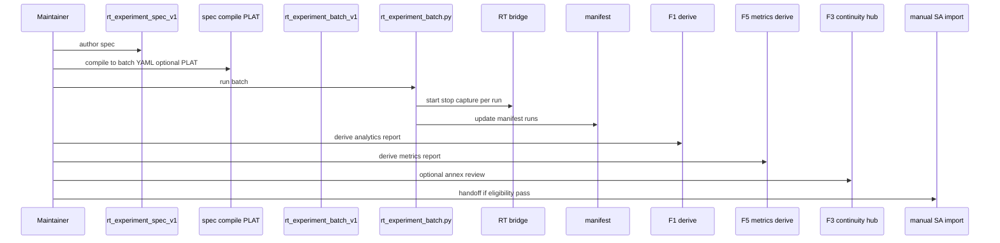

# RT Experiment Workflow Contract (`rt_experiment_workflow_v1`)

**Phase:** PLAN-RT-F5 — maintainer experiment pipeline (docs only)  
**Prerequisite:** PLAT-RT-X1, PLAT-RT-F1, PLAT-RT-F3, PLAT-RT-SA1 frozen  
**Authority:** [rt_f5_advanced_runtime_experiments_plan.md](../platform/rt_f5_advanced_runtime_experiments_plan.md)

End-to-end **maintainer** workflow from experiment spec through analytics, annex review, and **SA handoff eligibility** (not import). Browser does **not** execute capture or batch.

---

## 1. Governance

| Rule | Detail |
|------|--------|
| Actor | Maintainer with local RT bridge CLI access |
| Browser | Read-only cognition; CLI command display for batch/capture/metrics |
| SA import | Phases C–E of [rt_manual_sa_import_workflow_v1.md](rt_manual_sa_import_workflow_v1.md) remain **manual CLIs only** |
| Queue | **Sequential** batch runs only — no distributed workers, no parallel bridge sessions for one batch |
| Multi-session | ≤3 sessions may exist on workstation; batch still runs one session at a time per X1 |

---

## 2. Workflow phases

| Phase | Name | Actor | Artifact / action |
|-------|------|-------|-------------------|
| A | **Build spec** | Maintainer | Author `rt_experiment_spec_v1` under `runs/rt_sandbox/experiments/<experiment_id>/spec.json` |
| B | **Compile queue** | Maintainer or PLAT CLI | Spec → `rt_experiment_batch_v1` at `compile_to_batch_path` |
| C | **Execute** | Maintainer | `python scripts/rt/rt_experiment_batch.py <batch.yaml>` — existing X1; **no new bridge subcommands** in PLAN-RT-F5 |
| D | **Collect captures** | Batch CLI | Per run: `capture_session` via CLI; manifest `capture_candidate_id`, `capture_staging_ref` |
| E | **Pin snapshots** | Batch / manifest | `snapshot`, `terrain_context`, `visibility_context`, F5 supplements on `runs[]` |
| F | **Analytics** | Maintainer | F1: `deriveExperimentAnalytics` → `rt_experiment_analytics_report_v1` |
| G | **Metrics** | Maintainer | F5: `deriveExperimentMetrics` → `rt_experiment_metrics_report_v1` |
| H | **Annex review** | Maintainer UI | Optional F3 continuity hub + annex cache — [rt_experiment_continuity_review_v1.md](rt_experiment_continuity_review_v1.md) unchanged |
| I | **Handoff eligibility** | Maintainer | Read `handoff_eligibility` on metrics report; if `eligible`, proceed to SA1 manual workflow **separately** |

---

## 3. Phase details

### A. Build spec

- Choose `experiment_class` per [rt_experiment_model_v1.md](rt_experiment_model_v1.md).  
- Set `hypothesis_label` for maintainer notes only.  
- For matrix: define `matrix_axes[]`. For repeat: `repeat_config`. For simple compares: `spec_entries[]`.

### B. Compile queue

- Output must validate against `rt_experiment_batch_v1`.  
- `run_id` stable and unique; matrix order: lexicographic by `axis_signature` (see matrix plan).  
- Sweep catalog groups may be referenced as **templates** for spec authoring — compile is spec-authoritative, not catalog-authoritative.

### C–D. Execute and collect

Per [rt_experiment_workbench_v1.md](rt_experiment_workbench_v1.md) §2:

`start_session` → optional `apply_runtime_template` → `dwell_s` → `stop_session` → `capture_session` → manifest update.

**Forbidden:** browser-initiated capture; subprocess from RT UI without maintainer shell.

### E. Pin snapshots

After each run, manifest records:

- X1 required channels in `snapshot`  
- Optional `terrain_context` (V2), `visibility_context` (F4 cognition at pin)  
- F5: `experiment_class`, `matrix_coords`, `repeat_index`, `spec_fingerprint`

### F–G. Analytics and metrics

| Step | Command / surface (PLAT advisory) |
|------|-----------------------------------|
| F1 derive | `scripts/rt/rt_experiment_analytics.py` or UI import |
| F5 derive | `scripts/rt/rt_experiment_metrics.py` or UI import |
| Order | F1 before F5 — metrics consumes F1 report |

### H. Annex review

- Load manifest into experiment workbench.  
- Open continuity hub when `tactical_annex_summary` or annex cache present.  
- Full timeline scrubber remains **not** SA replay authority.

### I. SA handoff eligibility

| Condition | Action |
|-----------|--------|
| `handoff_eligibility.experiment_level` = `eligible` | Maintainer may start SA1 phase B checklist on each capture |
| `ineligible` | Resolve gates (captures, normalization, lifecycle) before approve |
| `partial` | Per-run gates — import only eligible runs |

**Explicit:** Eligibility **≠** `rt_capture_approve.py`. Approval and corpus commit remain manual.

---

## 4. Path conventions

| Artifact | Path |
|----------|------|
| Spec | `runs/rt_sandbox/experiments/<experiment_id>/spec.json` |
| Batch | `runs/rt_sandbox/experiments/<experiment_id>/batch.yaml` |
| Manifest | `runs/rt_sandbox/experiments/<experiment_id>/manifest.json` |
| F1 report | `runs/rt_sandbox/experiments/<experiment_id>/analytics_report.json` |
| F5 report | `runs/rt_sandbox/experiments/<experiment_id>/metrics_report.json` |
| Captures | `runs/rt_sandbox/captures/<capture_candidate_id>/` |
| Example specs | `fixtures/rt_experiments/f5_spec_examples/` |

---

## 5. Class-specific workflow notes

| Class | Build emphasis | Review emphasis |
|-------|----------------|-----------------|
| `terrain_comparison` | Vary `terrain_profile_ref` / `f4_layer_preset` | `terrain_rollup`, `terrain_context_diff` badges |
| `sensor_range_comparison` | Vary `template_id` only | Entity count contrast in F1 per_run |
| `tactical_mode_comparison` | `tactical_mode_hint` + capture in each mode | `mode_changed` badges vs hints |
| `repeatability_sweep` | Same `spec_fingerprint`, `repeat_index` | `repeatability_rollup`, trend strip |
| `parameter_matrix` | Cartesian compile | Matrix panel, `matrix_rollup` |

---

## 6. Related

- [rt_experiment_model_v1.md](rt_experiment_model_v1.md)
- [rt_experiment_metrics_v1.md](rt_experiment_metrics_v1.md)
- [rt_experiment_workbench_v1.md](rt_experiment_workbench_v1.md)
- [rt_experiment_analytics_v1.md](rt_experiment_analytics_v1.md)
- [rt_experiment_continuity_review_v1.md](rt_experiment_continuity_review_v1.md)
- [rt_manual_sa_import_workflow_v1.md](rt_manual_sa_import_workflow_v1.md)
- [rt_sa_import_bridge_v1.md](rt_sa_import_bridge_v1.md)
