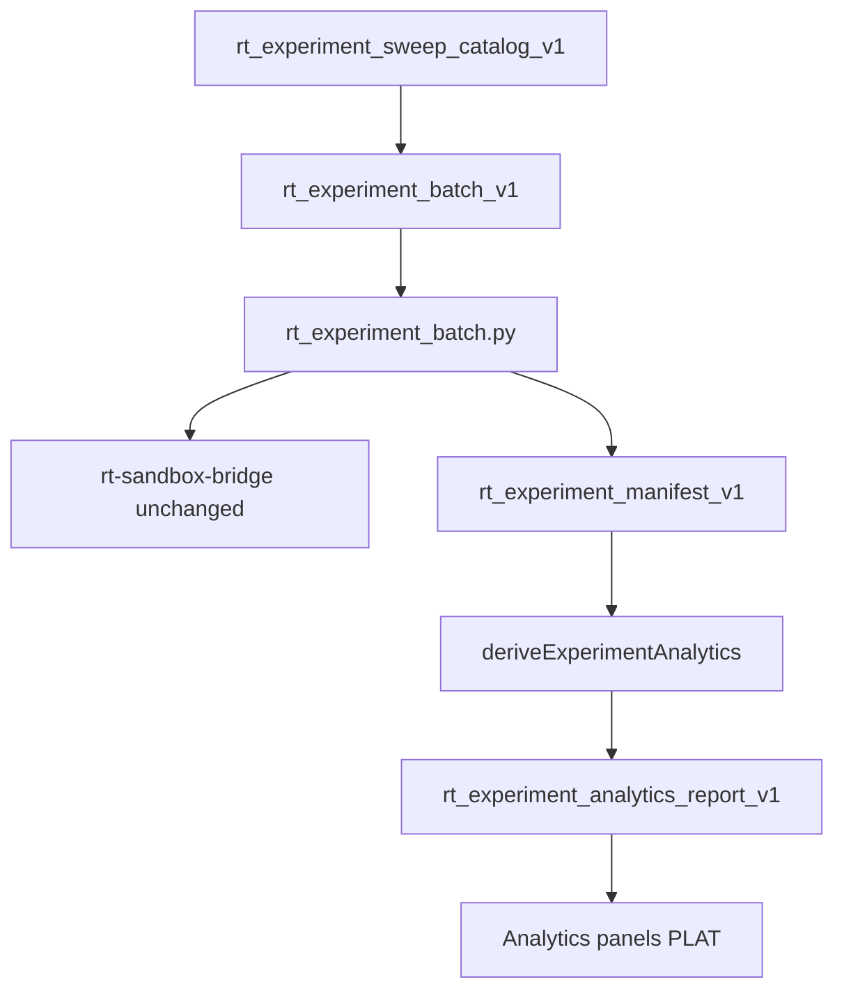

# RT-F1 — Architecture Review R1

**Phase:** PLAN-RT-F1 — experiment analytics & sweep catalog (docs only)  
**Plan:** [rt_f1_experiment_analytics_plan.md](../platform/rt_f1_experiment_analytics_plan.md), [rt_f1_template_sweep_catalog_plan.md](../platform/rt_f1_template_sweep_catalog_plan.md)  
**Freeze audit:** [rt_f1_freeze_audit.md](rt_f1_freeze_audit.md)

No runtime code was modified for this review.

---

## Executive summary

| Item | Verdict |
|------|---------|
| Layering on X1 | **Pass** |
| No bridge protocol changes | **Pass** |
| Deterministic derive boundary | **Pass** |
| Sweep catalog RT-local only | **Pass** |
| SA/orchestration isolation | **Pass** |

**Recommendation:** Freeze **PLAN-RT-F1** (docs). Authorize **PLAT-RT-F1** only via separate implementation wave after freeze.

---

## 1. Data flow review

| Finding ID | Verdict | Summary |
|------------|---------|---------|
| F1-ARCH-01 | Pass | Analytics sit above manifest; no new bridge commands |
| F1-ARCH-02 | Pass | Batch CLI reuse from X1; sweep compiles to same batch schema |
| F1-ARCH-03 | Pass | Optional staging read is file-based; not SA packager |
| F1-ARCH-04 | Pass-with-conditions | `normalization_status_ref` requires PLAT file reader — document unavailable default |

---

## 2. Subsystem boundaries

| Subsystem | PLAN-RT-F1 touch | Bridge impact |
|-----------|------------------|---------------|
| `template_catalog.py` | Reference ids only | None |
| `rt_experiment_batch.py` | Reuse | None |
| `experimentStore` / compare (X1) | Extend via report import | None |
| `session_manager` | None | None |
| SA viewer | None | None |

| Finding ID | Verdict | Summary |
|------------|---------|---------|
| F1-ARCH-05 | Pass | [rt_session_manager_ownership_v1.md](rt_session_manager_ownership_v1.md) unchanged |
| F1-ARCH-06 | Pass | Tactical controller unchanged |
| F1-ARCH-07 | Pass | Multi-session cap=3 unaffected |

---

## 3. Session isolation

| Rule | Status |
|------|--------|
| Rollups keyed by manifest `experiment_id` | Documented |
| No cross-manifest session merge | Documented |
| Per-run `session_id` retained for traceability only | Documented |

| Finding ID | Verdict | Summary |
|------------|---------|---------|
| F1-ARCH-08 | Pass | Session isolation preserved in analytics contract |

---

## 4. Template sweep architecture

| Check | Result |
|-------|--------|
| Builtin template ids only | Pass — 8 templates in catalog |
| `assert_template_ref_blocked` cited | Pass |
| Fixture groups compile to explicit_list batch | Pass |
| Not SA orchestration | Pass |

| Finding ID | Verdict | Summary |
|------------|---------|---------|
| F1-ARCH-09 | Pass | Sweep catalog orthogonal to SA H3/I1 |
| F1-ARCH-10 | Pass-with-conditions | `tactical_mode_hint` is metadata only — PLAT UI must not imply enforcement |

---

## 5. UI architecture (planned)

| Component | Tier | Verdict |
|-----------|------|---------|
| `ExperimentAnalyticsPanel` | Workbench footer | Pass-with-conditions — avoid `App.tsx` growth; prefer workbench child |
| `SweepCatalogBrowser` | Workbench footer | Pass |
| `ExperimentTrendStrip` | Analytics child | Pass |
| `BANNER_ANALYTICS` | Additive | Pass |

| Finding ID | Verdict | Summary |
|------------|---------|---------|
| F1-ARCH-11 | Pass | UI plan does not invoke capture or federation |
| F1-ARCH-12 | Pass-with-conditions | Defer `App.tsx` wiring to smallest workbench hook (R2 debt note) |

---

## 6. Architecture verdict

**Pass** — PLAN-RT-F1 architecture is additive, docs-only, and correctly layered on PLAT-RT-X1 without bridge or SA viewer changes.

**Stop line:** No PLAT-RT-F1 code until PLAN-RT-F1 frozen and implementation roadmap accepted.
