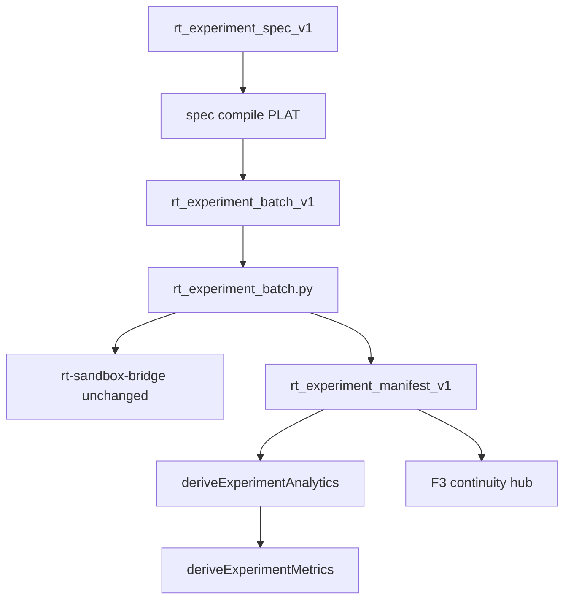

# RT-F5 — Architecture Review R1

**Phase:** PLAN-RT-F5 — advanced runtime experiments (docs only)  
**Plan:** [rt_f5_advanced_runtime_experiments_plan.md](../platform/rt_f5_advanced_runtime_experiments_plan.md), [rt_f5_experiment_matrix_plan.md](../platform/rt_f5_experiment_matrix_plan.md)  
**Freeze audit:** [rt_f5_freeze_audit.md](rt_f5_freeze_audit.md)

No runtime code was modified for this review.

---

## Executive summary

| Item | Verdict |
|------|---------|
| Layering on X1/F1/F3/F4 | **Pass** |
| No bridge protocol changes | **Pass** |
| Separate F5 metrics schema (F1 stable) | **Pass** |
| Spec compile → existing batch CLI | **Pass** |
| SA/orchestration isolation | **Pass** |
| Multi-session serial batch | **Pass** |

**Recommendation:** Freeze **PLAN-RT-F5** (docs). Authorize **PLAT-RT-F5** only via separate implementation wave after freeze.

---

## 1. Data flow review

| Finding ID | Verdict | Summary |
|------------|---------|---------|
| F5-ARCH-01 | Pass | F5 sits above manifest + F1 report; no new bridge commands |
| F5-ARCH-02 | Pass | Batch CLI reuse from X1; compile outputs same batch schema |
| F5-ARCH-03 | Pass | Metrics derive uses stored snapshots only — no live pull |
| F5-ARCH-04 | Pass-with-conditions | `handoff_eligibility` requires PLAT staging reader — document `unavailable` default |
| F5-ARCH-05 | Pass | Matrix compile must block SA template refs at PLAT time |

---

## 2. Subsystem boundaries

| Subsystem | PLAN-RT-F5 touch | Bridge impact |
|-----------|------------------|---------------|
| `rt_experiment_batch.py` | Reuse | None |
| `template_catalog.py` | Reference ids at compile | None |
| `analyticsDerive.ts` (F1) | Input to F5 derive | None |
| `sa-r0-viewer/` | None | None |
| Gazebo adapter | None in PLAN | None |

---

## 3. Session isolation

| Finding ID | Verdict | Summary |
|------------|---------|---------|
| F5-ARCH-MS-01 | Pass | Matrix/repeat runs may use different `session_id` values — comparison uses manifest pins, not session authority |
| F5-ARCH-MS-02 | Pass | Batch remains serial — no parallel bridge sessions per batch |

---

## 4. Terrain / visibility cognition

| Finding ID | Verdict | Summary |
|------------|---------|---------|
| F5-ARCH-TR-01 | Pass | F4/V2 fields labeled cognition in contracts |
| F5-ARCH-TR-02 | Pass | F5 does not claim sensor truth — distinct from deferred fidelity coupling frontier |

---

## 5. UI architecture (planned)

| Surface | Data source | Live bridge? |
|---------|-------------|--------------|
| Extended compare | manifest + F1 + F5 reports | No |
| Matrix panel | manifest supplements + metrics rollup | No |
| Filter bar | client-side on imported manifest | No |
| Handoff strip | metrics `handoff_eligibility` | No |

---

## 6. Architecture verdict

**Pass** — PLAN-RT-F5 may freeze as docs-only wave. PLAT-RT-F5 requires separate implementation plan and regression evidence.
