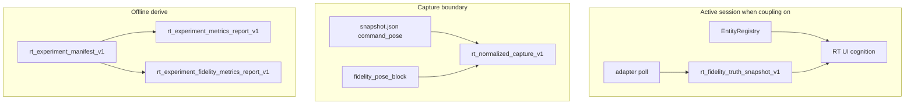

# RT-F5b — Architecture Review R1

**Phase:** PLAN-RT-F5b — runtime fidelity coupling (docs only)  
**Plan:** [rt_f5b_runtime_fidelity_coupling_plan.md](../platform/rt_f5b_runtime_fidelity_coupling_plan.md)  
**Freeze audit:** [rt_f5b_freeze_audit.md](rt_f5b_freeze_audit.md)

No runtime code was modified for this review.

---

## Executive summary

| Item | Verdict |
|------|---------|
| Three-layer authority (command / truth-attested / explanatory) | **Pass** |
| Default-off coupling (`enable_fidelity_coupling`) | **Pass** |
| No bridge HTTP contract changes in PLAN | **Pass** |
| F1 + F5 metrics schemas unchanged | **Pass** |
| Separate fidelity metrics report | **Pass** |
| SA / parser / topic isolation | **Pass** |
| Multi-session truth scoping | **Pass** |
| F4 fictional terrain boundary preserved | **Pass** |

**Recommendation:** Freeze **PLAN-RT-F5b** (docs). Authorize **PLAT-RT-F5b** only via separate implementation wave after freeze.

---

## 1. Data flow review

| Finding ID | Verdict | Summary |
|------------|---------|---------|
| F5b-ARCH-01 | Pass | Truth flows adapter → capture → derive; no live bridge pull in metrics derive |
| F5b-ARCH-02 | Pass | Registry never overwritten by sim truth |
| F5b-ARCH-03 | Pass | F5 metrics derive path unchanged — fidelity is optional third report |
| F5b-ARCH-04 | Pass | IPC extension documented for PLAT only — not HTTP bridge routes |

---

## 2. Authority stack

| Finding ID | Verdict | Summary |
|------------|---------|---------|
| F5b-ARCH-TR-01 | Pass | Truth-attested ≠ SA replay authority |
| F5b-ARCH-TR-02 | Pass | Truth-attested ≠ operational sensor truth |
| F5b-ARCH-TR-03 | Pass | `command_pose` remains sole authoritative pose for export |
| F5b-ARCH-TR-04 | Pass | Cognition/truth divergence is explanatory-only mismatch |

---

## 3. Coupling and stub path

| Finding ID | Verdict | Summary |
|------------|---------|---------|
| F5b-ARCH-STUB-01 | Pass | `enable_fidelity_coupling=false` default — stub path unchanged |
| F5b-ARCH-STUB-02 | Pass | `enable_gazebo_adapter=false` — no truth fields required |

---

## 4. Metrics layering

| Finding ID | Verdict | Summary |
|------------|---------|---------|
| F5b-ARCH-MET-01 | Pass | `rt_experiment_analytics_report_v1` untouched |
| F5b-ARCH-MET-02 | Pass | `rt_experiment_metrics_report_v1` fields unchanged — §11 additive |
| F5b-ARCH-MET-03 | Pass | `truth_fingerprint` in repeatability rollup — no success rates |

---

## 5. Multi-session and capture

| Finding ID | Verdict | Summary |
|------------|---------|---------|
| F5b-ARCH-MS-01 | Pass | Truth scoped per `session_id` |
| F5b-ARCH-CAP-01 | Pass | Export semantics unchanged — fidelity blocks `replay_boundary_scoped` |
| F5b-ARCH-CAP-02 | Pass | Normalization must not fail on divergence flags |

---

## Related

- [rt_f5b_governance_review_r1.md](rt_f5b_governance_review_r1.md)
- [rt_runtime_fidelity_coupling_v1.md](rt_runtime_fidelity_coupling_v1.md)
