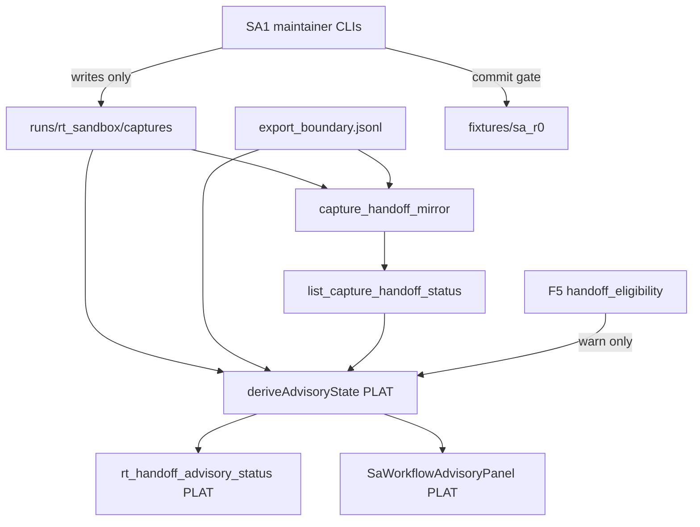

# RT-F6 — Architecture Review R1

**Phase:** PLAN-RT-F6 — SA workflow automation advisory (docs only)  
**Plan:** [rt_f6_sa_workflow_automation_advisory_plan.md](../platform/rt_f6_sa_workflow_automation_advisory_plan.md)  
**Contracts:** [rt_sa_workflow_automation_v1.md](rt_sa_workflow_automation_v1.md), [rt_sa_workflow_advisory_ui_v1.md](rt_sa_workflow_advisory_ui_v1.md)  
**Freeze audit:** [rt_f6_freeze_audit.md](rt_f6_freeze_audit.md)

No runtime code was modified for this review.

---

## Executive summary

| Item | Verdict |
|------|---------|
| Layering on SA1/SA2/F5 | **Pass** |
| No bridge protocol changes in PLAN | **Pass** |
| Advisory ladder distinct from export events | **Pass-with-conditions** — UI disambiguation required at PLAT |
| SA/orchestration isolation | **Pass** |
| Derive is read-only | **Pass** |
| Multi-session mirror reuse | **Pass** |

**Recommendation:** Freeze **PLAN-RT-F6** (docs). Authorize **PLAT-RT-F6 P0** only via separate implementation wave after freeze.

---

## 1. Data flow review

| Finding ID | Verdict | Summary |
|------------|---------|---------|
| F6-ARCH-01 | Pass | F6 sits above frozen SA1 pipeline — no replacement of handoff CLIs |
| F6-ARCH-02 | Pass | Advisory derive has no write path to staging or corpus |
| F6-ARCH-03 | Pass | PLAN introduces no new bridge HTTP routes |
| F6-ARCH-04 | Pass-with-conditions | Export `handoff_ready` vs advisory `handoff_ready` naming collision — contract §2.1 + UI copy rule required at PLAT |
| F6-ARCH-05 | Pass | F5 eligibility joined as warn-only — cannot block per-capture advisory incorrectly |
| F6-ARCH-06 | Pass | Optional mirror `advisory_state` field is additive read-only — separate PLAT IPC audit if added |

---

## 2. Subsystem boundaries

| Subsystem | PLAN-RT-F6 touch | Bridge impact |
|-----------|------------------|---------------|
| `sa_handoff.py` | Reference only — derive reads same signals | None in PLAN |
| `capture_handoff_mirror.py` | Reference only | None in PLAN |
| `rt_handoff_review.py` / `rt_sa_import.py` | Unchanged authority | None |
| `sa-r0-viewer/` | None | None |
| `ExperimentHandoffEligibilityStrip` | Adjacent import advisory — read-only | None |
| Gazebo / tactical | None | None |

---

## 3. Session isolation

| Finding ID | Verdict | Summary |
|------------|---------|---------|
| F6-ARCH-MS-01 | Pass | Advisory derive scoped per `capture_candidate_id` — SA2 session filter unchanged |
| F6-ARCH-MS-02 | Pass | Multi-session overview aggregates counts — no cross-session authority merge |
| F6-ARCH-MS-03 | Pass | P2 batch report lists per-ID state — no batch commit |

---

## 4. Advisory state machine

| Finding ID | Verdict | Summary |
|------------|---------|---------|
| F6-ARCH-SM-01 | Pass | Five rungs + terminal commit documented with rollback |
| F6-ARCH-SM-02 | Pass | Reject/defer resets downstream advisory — aligns with `is_handoff_blocked()` |
| F6-ARCH-SM-03 | Pass-with-conditions | PLAT must implement derive precedence §2.2 exactly — golden fixtures required |

---

## 5. UI architecture (planned)

| Surface | Data source | Live bridge? | Writes? |
|---------|-------------|--------------|---------|
| Workbench advisory badge | mirror + derive | Optional poll | No |
| Staging mirror column | `list_capture_handoff_status` | Yes — existing | No |
| Checklist panel | derive checklist | Via mirror | No |
| Import advisory strip | derive + F5 report | No | No |

---

## 6. Architecture verdict

**Pass** — PLAN-RT-F6 may freeze as docs-only wave. PLAT-RT-F6 P0 should land derive + read-only CLI before P1 UI. P2 batch helpers require contamination re-check per [rt_f6_handoff_contamination_review_r1.md](rt_f6_handoff_contamination_review_r1.md).
