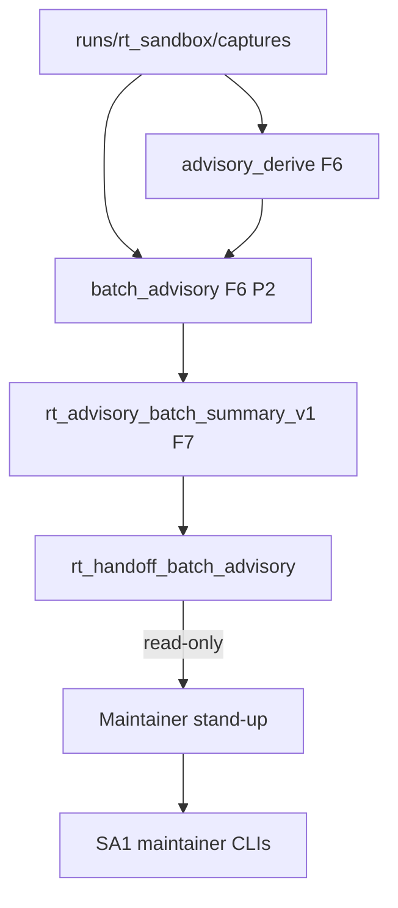

# RT-F7 — Architecture Review R1

**Phase:** PLAN-RT-F7 — post-F6 advisory expansion (docs only)  
**Plan:** [rt_f7_post_f6_advisory_expansion_plan.md](../platform/rt_f7_post_f6_advisory_expansion_plan.md)  
**Contracts:** [rt_advisory_maintainer_workflow_v1.md](rt_advisory_maintainer_workflow_v1.md), [rt_advisory_contamination_gates_v1.md](rt_advisory_contamination_gates_v1.md), [rt_advisory_aggregation_v1.md](rt_advisory_aggregation_v1.md)  
**Freeze audit:** [rt_f7_freeze_audit.md](rt_f7_freeze_audit.md)

No runtime code was modified for this review.

---

## Executive summary

| Item | Verdict |
|------|---------|
| Layers on F6 derive + P2 batch | **Pass** |
| No bridge protocol changes in PLAN | **Pass** |
| Queue priority non-authoritative | **Pass** |
| M3 per-capture isolation preserved | **Pass** |
| Experiment rollup warn-only | **Pass** |
| SA viewer untouched | **Pass** |

**Recommendation:** Freeze **PLAN-RT-F7** (docs). Authorize **PLAT-RT-F7 P0** only via separate implementation wave after freeze.

---

## 1. Data flow review

| Finding ID | Verdict | Summary |
|------------|---------|---------|
| F7-ARCH-01 | Pass | F7 extends F6 batch summary — no replacement of per-capture ladder |
| F7-ARCH-02 | Pass | Queue sort is derived metadata — no CLI side effects |
| F7-ARCH-03 | Pass | PLAN introduces no new bridge HTTP routes |
| F7-ARCH-04 | Pass | F5 experiment rollup joined as warn-only — precedence matches F6 §2.2 |
| F7-ARCH-05 | Pass-with-conditions | `readiness_cohort` labels require PLAT copy discipline — not `readiness_score` |
| F7-ARCH-06 | Pass | Lineage warnings are detect-only — do not replace export_boundary validators |

---

## 2. Subsystem boundaries

| Subsystem | PLAN-RT-F7 touch | Bridge impact |
|-----------|------------------|---------------|
| `batch_advisory.py` | Normative extension spec | None in PLAN |
| `advisory_derive.py` | Optional `lineage_warnings` field (PLAT) | None in PLAN |
| `rt_handoff_batch_advisory.py` | CLI flags spec (`--sort`, `--group-by`) | None in PLAN |
| `sa-r0-viewer/` | None | None |
| Multi-session UI | Triage per capture — no cross-session authority | None in PLAN |

---

## 3. Session isolation (M3)

| Finding ID | Verdict | Summary |
|------------|---------|---------|
| F7-ARCH-MS-01 | Pass | Queue and cohorts keyed by `capture_candidate_id` |
| F7-ARCH-MS-02 | Pass | No merged advisory queue across sessions |
| F7-ARCH-MS-03 | Pass | Background poll unchanged — no new authority surfaces |

---

## 4. Aggregation architecture

| Finding ID | Verdict | Summary |
|------------|---------|---------|
| F7-ARCH-AGG-01 | Pass | `rt_advisory_batch_summary_v1` superset of F6 review doc |
| F7-ARCH-AGG-02 | Pass | `blocker_groups` maps to maintainer workflow taxonomy |
| F7-ARCH-AGG-03 | Pass-with-conditions | PLAT must preserve F6 `aggregate_report()` fields for compatibility |

---

## 5. UI architecture (planned PLAT)

| Surface | Data source | Writes? |
|---------|-------------|---------|
| Triage queue panel | batch summary + sort | No |
| Cohort chips | `readiness_cohort` | No |
| Grouped blocker strip | `blocker_groups` | No |

---

## 6. Architecture verdict

**Pass** — PLAN-RT-F7 may freeze as docs-only wave. **PLAT-RT-F7 P0** should land schema + CLI extensions before P1 UI. P2 bulk hardening requires contamination re-check per [rt_f7_handoff_contamination_review_r1.md](rt_f7_handoff_contamination_review_r1.md).
