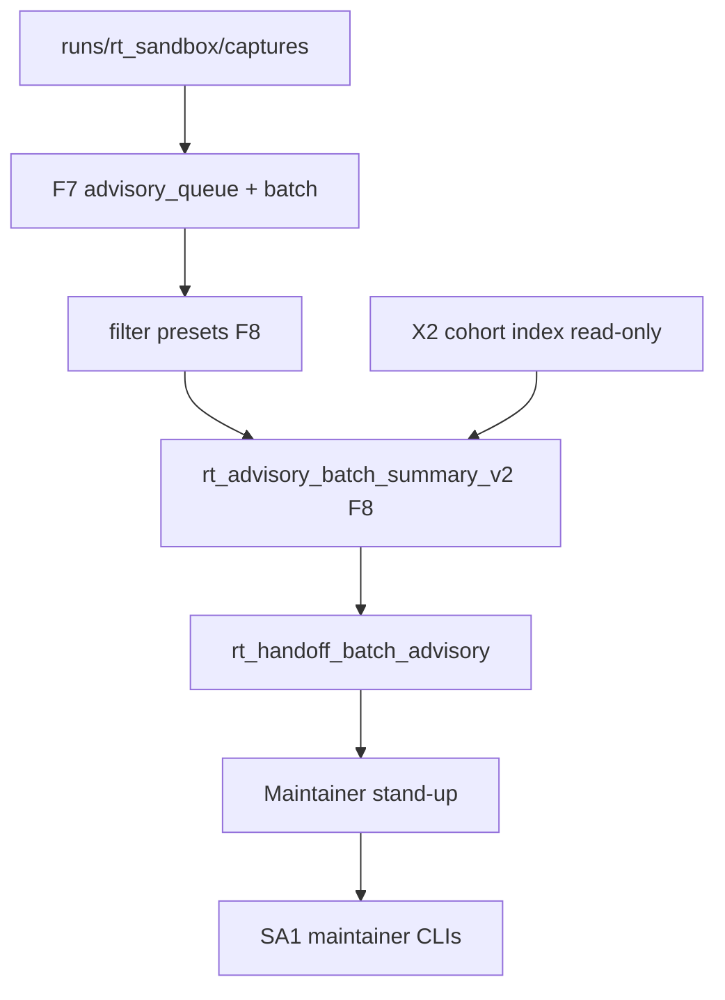

# RT-F8 — Architecture Review R1

**Phase:** PLAN-RT-F8 — post-F7 advisory maintainer expansion (docs only)  
**Plan:** [rt_f8_post_f7_advisory_maintainer_expansion_plan.md](../platform/rt_f8_post_f7_advisory_maintainer_expansion_plan.md)  
**Contracts:** [rt_advisory_maintainer_workflow_v2.md](rt_advisory_maintainer_workflow_v2.md), [rt_advisory_contamination_gates_v2.md](rt_advisory_contamination_gates_v2.md), [rt_advisory_aggregation_v2.md](rt_advisory_aggregation_v2.md)  
**Freeze audit:** [rt_f8_freeze_audit.md](rt_f8_freeze_audit.md)

No runtime code was modified for this review.

---

## Executive summary

| Item | Verdict |
|------|---------|
| Layers on F7 PLAT deliverables | **Pass** |
| No bridge protocol changes in PLAN | **Pass** |
| Filter presets non-authoritative | **Pass** |
| Aggregation v2 additive to v1 | **Pass** |
| X2 rollup read-only adjacency | **Pass** |
| M3 per-capture isolation preserved | **Pass** |
| SA viewer untouched | **Pass** |

**Recommendation:** Freeze **PLAN-RT-F8** (docs). Do not start **PLAT-RT-F8** without implementation plan + per-phase reviews.

---

## 1. Data flow review

| Finding ID | Verdict | Summary |
|------------|---------|---------|
| F8-ARCH-01 | Pass | v2 summary superset of v1 — backward compatible default |
| F8-ARCH-02 | Pass | Presets apply filter/sort only — no CLI side effects |
| F8-ARCH-03 | Pass | PLAN introduces no new bridge HTTP routes |
| F8-ARCH-04 | Pass | `experiment_handoff_rollup` warn-only — F6 precedence preserved |
| F8-ARCH-05 | Pass-with-conditions | `readiness_cohort_v2` requires PLAT copy discipline |
| F8-ARCH-06 | Pass | Template packs render-only at depth 3 |
| F8-ARCH-07 | Pass | Focus set narrows rows — no cross-session authority merge |

---

## 2. Subsystem boundaries

| Subsystem | PLAN-RT-F8 touch | Bridge impact |
|-----------|------------------|---------------|
| `batch_advisory.py` | v2 builder spec | None in PLAN |
| `advisory_queue.py` | Preset + v2 cohort spec | None in PLAN |
| `rt_handoff_batch_advisory.py` | `--preset`, `--schema v2` spec | None in PLAN |
| X2 cohort / review packet | Read-only paths in rollup | None in PLAN |
| `sa-r0-viewer/` | None | None |
| Multi-session UI | Focus per capture — no merged queue | None in PLAN |

---

## 3. Session isolation (M3)

| Finding ID | Verdict | Summary |
|------------|---------|---------|
| F8-ARCH-MS-01 | Pass | v2 rollups keyed by capture_id |
| F8-ARCH-MS-02 | Pass | Focus set may span sessions — no merged advisory authority |
| F8-ARCH-MS-03 | Pass | F8-CONT-09 — background poll does not merge queue |

---

## 4. X2 adjacency

| Finding ID | Verdict | Summary |
|------------|---------|---------|
| F8-ARCH-X2-01 | Pass | `experiment_handoff_rollup` does not invoke packet export |
| F8-ARCH-X2-02 | Pass | Cohort index ref is path metadata only |
| F8-ARCH-X2-03 | Pass-with-conditions | Combined UX (packet + rollup) needs P1 copy discipline |

---

## 5. Verdict

**Pass** — PLAN-RT-F8 architecture is additive to frozen PLAT-RT-F7 and does not expand bridge authority. **PLAT-RT-F8 P0** is the advisory next implementation wave after PLAN freeze (not authorized by this review alone).
