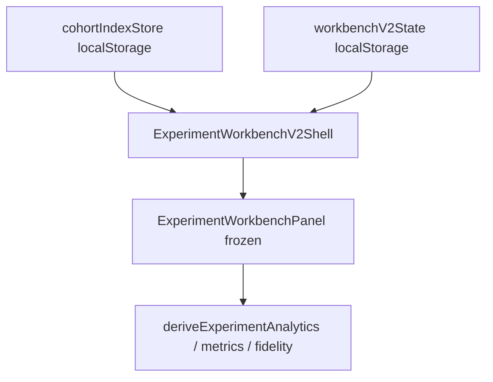

# RT-X2 P0 — Architecture Review R1

**Phase:** PLAT-RT-X2 P0  
**Plan:** [rt_plat_x2_p0_cohort_index_plan.md](../platform/rt_plat_x2_p0_cohort_index_plan.md)  
**Freeze audit:** [rt_plat_x2_p0_freeze_audit.md](rt_plat_x2_p0_freeze_audit.md)

---

## Executive summary

| Item | Verdict |
|------|---------|
| Cohort index references-only | **Pass** |
| No bridge protocol changes | **Pass** |
| Reuses frozen derive outputs (read-only mirrors) | **Pass** |
| `run_id` join scoped per manifest | **Pass** |
| X1/F panels unchanged | **Pass** |
| V2 shells read-only in P0 | **Pass** |

**Recommendation:** Freeze **PLAT-RT-X2 P0**.

---

## Data flow

| Finding | Verdict |
|---------|---------|
| X2-P0-ARCH-01 | Pass — cohort map holds references only |
| X2-P0-ARCH-02 | Pass — no new HTTP routes or subcommands |
| X2-P0-ARCH-03 | Pass — report dock shows presence from existing state |
| X2-P0-ARCH-04 | Pass — primary/secondary manifest refs are UI-local pointers |

---

## Verdict

**Pass** — PLAT-RT-X2 P0 suitable for freeze.
