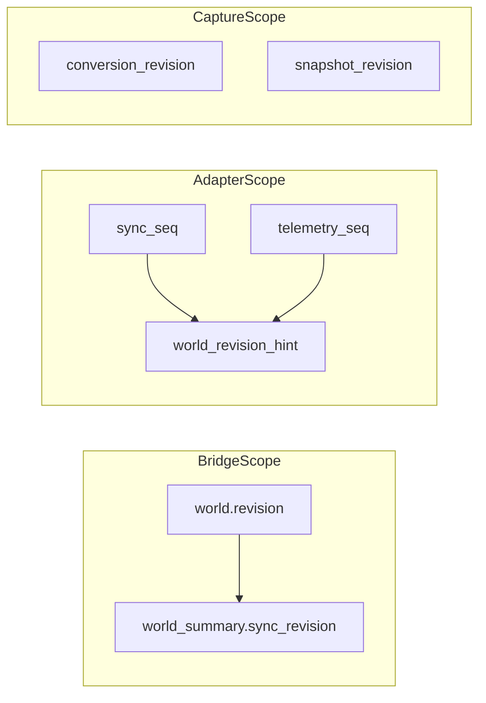

# RT Revision Vocabulary (`rt_revision_vocabulary_v1`)

**Phase:** PLAT-RT-R1a — revision counter glossary; PLAT-RT-R3d divergence policy  
**Authority:** [rt_r1a_runtime_vocabulary_hardening_plan.md](../platform/rt_r1a_runtime_vocabulary_hardening_plan.md); [rt_world_revision_hint_policy_v1.md](rt_world_revision_hint_policy_v1.md)

Canonical definitions for revision counters across the RT interactive sandbox line. Counters are **not** replay authority unless explicitly noted.

---

## 1. Counter glossary

| Counter | Owner | Mutates when | Authority meaning |
|---------|-------|--------------|-------------------|
| `world.revision` | `WorldStateStore` | Registry spawn/move/delete, template apply | Bridge command mutation counter |
| `bridge_revision` | Adapter IPC alias | Same as `world.revision` at command time | Bridge command mutation counter (IPC field name) |
| `sync_revision` (per-entity) | `EntitySyncEntry` | Command recorded in mirror | Snapshot of `world.revision` at command time (explanatory) |
| `sync_revision` (world_summary) | `pose_sync.summary()` | Each summary build | **Current** `world.revision` — equals `world_summary.revision` |
| `sync_seq` | Adapter worker / `PoseSyncMirror` | Feedback poll | Adapter feedback generation (explanatory) |
| `telemetry_seq` | Adapter worker | Telemetry poll | Adapter telemetry bundle generation |
| `telemetry_revision` | `TelemetryMirror` | Copy of last poll `telemetry_seq` | Explanatory telemetry generation counter |
| `registry_revision` | Normalization entity history | From snapshot entity state | Entity revision at capture (alias of registry revision) |
| `conversion_revision` | Normalization pipeline | Re-normalize with new input hash | Replay-boundary scoped pipeline version |
| `world_revision_hint` | Telemetry bundle | Adapter poll | `{telemetry_seq, sync_seq}` — non-authoritative; may diverge from `world.revision` |

---

## 2. Lifecycle rules

| Counter | Resets on |
|---------|-----------|
| `world.revision` | New session world (`start_session`, `reset_session` world clear) |
| `sync_revision` / mirror entries | Pose sync clear on adapter teardown |
| `sync_seq` | Adapter worker reset / detach |
| `telemetry_revision` | Telemetry mirror clear |
| `conversion_revision` | Per staging dir; monotonic within capture candidate |

---

## 3. Reading guidance

- **Command truth:** `world.revision` + registry poses at command time.
- **Explanatory only:** `sync_seq`, `telemetry_revision`, `world_revision_hint`.
- **Capture-scoped:** `conversion_revision`, `registry_revision` in normalized manifests.

Mirrors ≠ authority. See [rt_authority_model_v1.md](rt_authority_model_v1.md).

---

## 4. Divergence policy (PLAT-RT-R3d)

Full policy: [rt_world_revision_hint_policy_v1.md](rt_world_revision_hint_policy_v1.md).

| Relationship | Valid? |
|--------------|--------|
| `world_revision_hint` ≠ `world.revision` numerically | **Yes** — different counter domains |
| `telemetry_revision` ≠ `world.revision` | **Yes** — poll generation vs command counter |
| `world_summary.sync_revision` == `world.revision` | **Yes** — by implementation design |
| Per-entity `sync_revision` ≤ `world.revision` | **Yes** — command-time snapshot |
| Using hint for `SYNC_STALE` / `SYNC_MISMATCH` | **No** — pose drift / ref map only |

---

## Related

- [rt_world_revision_hint_policy_v1.md](rt_world_revision_hint_policy_v1.md)
- [rt_runtime_synchronization_v1.md](rt_runtime_synchronization_v1.md)
- [rt_adapter_feedback_v1.md](rt_adapter_feedback_v1.md)
- [rt_adapter_telemetry_v1.md](rt_adapter_telemetry_v1.md)
- [rt_capture_normalization_v1.md](rt_capture_normalization_v1.md)
