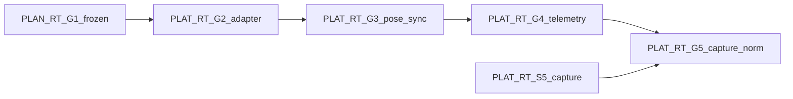

# RT Roadmap RT-G2 through RT-G5 (`rt_roadmap_g2_g5_v1`)

**Phase:** PLAN-RT-G1 — future Gazebo/ROS integration waves (docs only)  
**Prerequisite:** PLAN-RT-G1 frozen; PLAT-RT-S6 frozen per [rt_s6_freeze_audit.md](rt_s6_freeze_audit.md)

---

## Cross-wave dependencies

PLAT-RT-S5 capture boundary remains authoritative for export; G5 aligns sim snapshots with existing staging schema.

---

## RT-G2 — Local Gazebo adapter prototype

| Allowed | Forbidden |
|---------|-----------|
| `RT Runtime Adapter` subprocess on localhost | Distributed runtime / remote DDS |
| Adapter spawn/teardown wired to session lifecycle | Browser→ROS authority |
| Deny-by-default ROS proxy; minimal one-way pose push | Bidirectional stale-sync (G3) |
| `send_runtime_command` adapter sub-commands in wave audit | SA viewer integration |
| Replace `RuntimeStub` when adapter attached | Auto SA replay import |
| Maintainer flag: adapter off → stub fallback | rosbridge / `web/` extension |

**Stop line:** No bidirectional stale-sync; no full telemetry bridge (G4); no capture schema normalization (G5).

---

## RT-G3 — Transient pose synchronization

| Allowed | Forbidden |
|---------|-----------|
| Bridge-authoritative pose apply to sim entities | Sim feedback overwriting bridge registry without policy |
| `entity_id` ↔ `sim_entity_ref` map in adapter | Cross-session sim entity reuse |
| Stale sync detection + `INVALID_POSE` / `reset_session` | Parser topic publish |
| Resync maintainer CLI (optional) | Operational engage/intercept semantics |

**Stop line:** No SA viewer live hooks; no full ROS telemetry fan-in (G4).

---

## RT-G4 — Runtime telemetry bridge

| Allowed | Forbidden |
|---------|-----------|
| Adapter-fed `entity_pose_mirror` and sim health | WebSocket in `platform/sa-r0-viewer/` |
| Read-only ROS mirrors within PLAT-RT-S4 channel table | `/tracks/state` as live ops truth |
| Topic timeout → degraded mirror | Tactical dashboards |
| 10 Hz aggregate cap enforcement | Federation/orchestration writes |

**Stop line:** No capture normalization (G5); no auto corpus promotion.

---

## RT-G5 — Runtime capture normalization

| Allowed | Forbidden |
|---------|-----------|
| `runtime_to_replay_conversion_v1` manifest alignment with sim snapshots | Auto SA import |
| Additive capture report fields (sim provenance) | `session_id` as lineage parent |
| Maintainer approval + existing export boundary | Auto federation index update |
| Bridge-staged capture still requires SA packager chain | Operational readiness scoring |

**Stop line:** No production deployment/security infra; no tactical autonomy; no HITL semantics.

---

## Global forbidden (all G waves)

- rosbridge and legacy `web/` for RT
- Browser→ROS direct control
- Federation/orchestration authority from RT sessions
- Parser/topic contract changes
- Cloud/multi-user RT bridge
- Production OAuth/RBAC/security infra
- Military C2 / HITL / fleet operational semantics

---

## Related

- [rt_g1_gazebo_ros_integration_plan.md](../platform/rt_g1_gazebo_ros_integration_plan.md)
- [rt_roadmap_s2_s6_v1.md](rt_roadmap_s2_s6_v1.md)
- [rt_sa_export_boundary_v1.md](rt_sa_export_boundary_v1.md)
