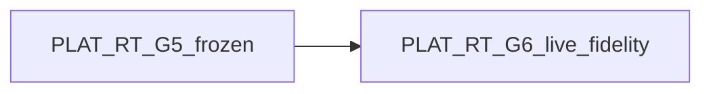

# RT Roadmap RT-G6 (`rt_roadmap_g6_v1`)

**Phase:** PLAT-RT-G6 — Gazebo runtime visual fidelity & real runtime sync  
**Prerequisite:** PLAT-RT-G5 frozen; post-G5 consolidation (R1–R3d, T1–T5, SA1) closed

---

## Dependency

---

## RT-G6 — Live Gazebo coupling & visual fidelity

| Allowed | Forbidden |
|---------|-----------|
| Dedicated `rt_sandbox_gz` ROS package (flat world, proxy models) | Counter-UAS target/interceptor scenario coupling |
| Worker subprocess rclpy on session allow-list topics | Browser→ROS; rosbridge |
| Real spawn/set_pose/delete in Gazebo via bridge node | Registry overwrite from sim feedback |
| Sync lag/stale/missing-entity audit hardening | SA viewer / replay ingestion |
| Additive UI sync cognition on existing payloads | WebSocket push; new HTTP channels |
| Mock-by-default adapter (`enable_gazebo_adapter=false`) | Live-default without separate audit |
| Maintainer `rt_adapter_inspect` extensions | Multi-session; distributed runtime |

**Stop line:** No multi-session UI; no deeper SA workflow UX; no bridge staging API; no autonomous runtime.

---

## Post-G6 frontiers (plan-only)

| Frontier | Notes |
|----------|-------|
| Multi-session planning | Not authorized |
| Deeper SA workflow UX | Manual import only (SA1 frozen) |
| Bridge staging status API | Deferred from T4/T5 |

---

## Global forbidden (unchanged)

- Parser/topic contract changes
- Federation/corpus writes from RT sessions
- Tactical/HITL/C2 semantics
- Production security / cloud infra
