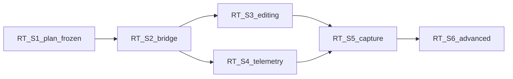

# RT Roadmap RT-S2 through RT-S6 (`rt_roadmap_s2_s6_v1`)

**Phase:** PLAN-RT-S1 — future scoped waves (docs only)  
**Prerequisite:** PLAN-RT-S1 frozen; PLAT-RT-S2 frozen per [rt_s2_freeze_audit.md](rt_s2_freeze_audit.md)

---

## RT-S2 — Runtime bridge prototype

| Allowed | Forbidden |
|---------|-----------|
| Local bridge process implementing [rt_bridge_contract_v1.md](rt_bridge_contract_v1.md) allow-list | SA viewer integration |
| Loopback/unix transport | Public network exposure |
| Rate limits + resource caps from governance doc | Multi-session / multi-user |
| `rt_session_audit_log_v1` append | Federation/orchestration writes |

**Stop line:** No SA viewer changes; no cloud deployment.

---

## RT-S3 — Interactive world editing

| Allowed | Forbidden |
|---------|-----------|
| `spawn_entity`, `move_entity`, `delete_entity` prototype | Operational entity catalogs |
| World bounds enforcement | Fleet-scale spawning |
| Session-scoped entity IDs | Corpus promotion from edits |

**Stop line:** No federation; no orchestration queue from RT UI.

---

## RT-S4 — Realtime telemetry

| Allowed | Forbidden |
|---------|-----------|
| `subscribe_telemetry` mirrors in **RT UI only** | WebSocket in `platform/sa-r0-viewer/` |
| 10 Hz cap enforcement | Live merge into SA compare clock |
| Session-bound topics | Operational dashboards |

**Stop line:** Telemetry read-only; no subscription write path.

---

## RT-S5 — Runtime → replay capture workflows

| Allowed | Forbidden |
|---------|-----------|
| `capture_session` → staging → conversion manifest | Auto SA import |
| Maintainer approval record CLI | Auto corpus promotion |
| Alignment with SA packager chain | RT session ID as lineage parent |
| `runtime_to_replay_conversion_v1` | Federation index auto-update |

**Stop line:** Explicit maintainer gates at each pipeline stage.

---

## RT-S6 — Advanced sandbox workflows

| Allowed | Forbidden |
|---------|-----------|
| Multi-step sandbox scenarios (still session-scoped) | Tactical autonomy |
| Richer prototype entity catalogs | HITL command semantics |
| Session templates (RT-local) | Operational deployment |
| Improved failure recovery UX | Production security infra (OAuth/RBAC) |

**Stop line:** No cloud orchestration; no multi-user collaboration; no military C2 semantics.

---

## Cross-wave dependencies

---

## Related

- [rt_s1_interactive_sandbox_architecture_plan.md](../platform/rt_s1_interactive_sandbox_architecture_plan.md)
