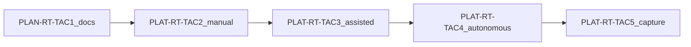

# RT Tactical Controller Roadmap (`rt_roadmap_tac1_tac5_v1`)

**Phase:** PLAN-RT-TAC1 — tactical controller roadmap (docs only)  
**Authority:** [rt_tac1_tactical_controller_architecture_plan.md](../platform/rt_tac1_tactical_controller_architecture_plan.md); [rt_roadmap_post_g5_v1.md](rt_roadmap_post_g5_v1.md)

Roadmap for RT sandbox tactical controller waves. **No wave listed here may start without** its own plan (if PLAN), governance review, and freeze audit.

---

## Cross-wave dependencies

---

## PLAN-RT-TAC1 — Tactical Controller Architecture

| Allowed | Forbidden |
|---------|-----------|
| Tactical modes, layer, reuse, governance contracts | Bridge/UI/runtime code |
| Future telemetry + capture continuity docs | Bridge allow-list extension |
| Architecture + governance reviews | SA viewer integration |
| Freeze audit + registry row | Parser/topic/schema changes |
| Additive authority/audit/bridge supplements | Operational C2 / HITL semantics |
| Roadmap TAC1→TAC5 | Autonomous loop implementation |

**Stop line:** End after [rt_tac1_freeze_audit.md](rt_tac1_freeze_audit.md). Do **not** start PLAT-RT-TAC2.

---

## PLAT-RT-TAC2 — Manual Sandbox Assignment (blocked)

**Prerequisite:** PLAN-RT-TAC1 frozen

| Allowed | Forbidden |
|---------|-----------|
| `set_tactical_mode` (manual only), `select_candidate`, `assign_candidate`, `clear_assignment`, `get_tactical_state` | Assisted auto-apply |
| Tactical controller module (manual path) | Autonomous scheduling loop |
| Per-session tactical state on `SessionRecord` | Cross-session assignment |
| UI: mode selector (Manual enabled), candidate review panel | Forbidden operational lexicon |
| Vendored `guidance_lib` for TTI display (explanatory) | SA viewer hooks |
| Bridge integration tests: deny undeclared verbs | Parser/topic changes |
| Telemetry channel `tactical_state` (pull) | Federation writes |

**Stop line:** No PLAT-RT-TAC3 without TAC2 freeze audit.

---

## PLAT-RT-TAC3 — Assisted Recommendations (implemented)

**Prerequisite:** PLAT-RT-TAC2 frozen

| Allowed | Forbidden |
|---------|-----------|
| `request_recommendation`, `approve_recommendation`, `reject_recommendation` | Autonomous apply without approval |
| Assisted mode in UI + bridge | Autonomous loop |
| `tactical_recommendation` telemetry events | SA auto-import |
| Approval gate before adapter motion intent | Engine node authority merge |
| Audit `event_kind: tactical` for recommendations | |

**Stop line:** No PLAT-RT-TAC4 without TAC3 freeze audit.

---

## PLAT-RT-TAC4 — Autonomous Sandbox Loop (implemented)

**Prerequisite:** PLAT-RT-TAC3 frozen

| Allowed | Forbidden |
|---------|-----------|
| Autonomous mode + `pause_autonomous_loop` / `resume_autonomous_loop` | SA integration |
| Controller-authoritative assign within session caps | Distributed multi-bridge tactical sync |
| Scheduler tick (bounded rate) | Cloud / multi-user |
| Revert-to-Manual UX | Weapon/engage ROS topics |
| Governance banners for autonomous loop | Parser changes |

**Stop line:** No PLAT-RT-TAC5 without TAC4 freeze audit.

---

## PLAT-RT-TAC5 — Tactical Capture Continuity (frozen)

**Prerequisite:** PLAT-RT-TAC4 frozen — met

| Delivered | Forbidden (unchanged) |
|-----------|------------------------|
| `rt_tactical_capture_annex_v1` in normalized capture + sidecar | SA auto-import |
| `TacticalCaptureBuffer` + capture-time audits | Parser-visible field additions |
| `rt_capture_inspect tactical-continuity` | SA viewer tactical replay UI |
| Normalization validation hooks | Federation index updates |

Freeze: [rt_tac5_freeze_audit.md](rt_tac5_freeze_audit.md)

**Stop line:** No PLAT-RT-SA3 / RT-V2 without explicit new wave audit.

---

## Global forbidden (all TAC waves)

Unchanged from [rt_roadmap_post_g5_v1.md](rt_roadmap_post_g5_v1.md) and [AGENTS.md](../../AGENTS.md):

- SA viewer live hooks
- Automatic replay ingestion
- Federation/orchestration authority from RT
- Distributed multi-bridge
- Operational C2 / HITL / weapon-release semantics
- Parser/topic/schema changes (unless separate registry wave)

---

## Related

- [rt_tac1_tactical_controller_architecture_plan.md](../platform/rt_tac1_tactical_controller_architecture_plan.md)
- [rt_tac1_tactical_governance_v1.md](rt_tac1_tactical_governance_v1.md)
- [rt_tac1_tactical_capture_continuity_v1.md](rt_tac1_tactical_capture_continuity_v1.md)
- [freeze_registry_r1.md](freeze_registry_r1.md)
