# RT↔SA Bridge Handoff (`rt_rt_sa_bridge_handoff_v1`)

**Phase:** PLAN-RT-R2f — RT→SA bridge architecture (docs only)  
**Authority:** [rt_r2f_rt_sa_bridge_plan.md](../platform/rt_r2f_rt_sa_bridge_plan.md); [rt_sa_export_boundary_v1.md](rt_sa_export_boundary_v1.md)

Defines the governance-safe handoff from transient RT capture to SA replay consumption. **Does not authorize** automatic import or bridge-invoked SA packaging.

---

## 1. Core invariant

```
capture_session ≠ SA replay import
```

RT bridge authority ends before SA packaging. SA replay authority begins only after explicit maintainer corpus import.

---

## 2. Handoff model

```mermaid
flowchart LR
  subgraph rtSide [RT authority]
    Cap[capture_session]
    Norm[normalization G5]
    Cogn[capture_pose_cognition R2e]
    Valid[capture_validated]
  end
  subgraph maintainer [Maintainer human gate]
    Ready[handoff_ready]
    Review[handoff_reviewed]
    Approve[rt_capture_approve]
    Conv[conversion.json]
  end
  subgraph saSide [SA tooling external to bridge]
    Val[validate_scenario]
    Obs[replay_observability]
    Pack[replay_sa_bundle_pack]
    Lint[governance_lint]
    Import[corpus commit]
  end
  Cap --> Norm --> Cogn --> Valid --> Ready
  Ready --> Review --> Approve --> Conv
  Conv --> Val --> Obs --> Pack --> Lint --> Import
```



| Step | Owner | RT writes? |
|------|-------|------------|
| 1. `capture_session` | RT bridge | Yes — raw S5 staging |
| 2. Normalization | RT bridge / `rt_capture_normalize.py` | Yes — normalized/provenance/validation |
| 3. Maintainer review | Human | Optional `rt_handoff_review_v1` sidecar (see workflow contract) |
| 4. Approval + conversion manifest | Maintainer via `rt_capture_approve.py` | Yes — `approval.json`, `conversion.json` only |
| 5. SA validation + packaging | SA tooling | **No** — maintainer-run CLI |
| 6. Corpus import | Maintainer | **No** — commits bundle to corpus path |

No step may auto-trigger step 5 or 6 from RT events.

---

## 3. Authority stop line

| Boundary | RT authority | SA authority |
|----------|--------------|--------------|
| Staging under `runs/rt_sandbox/captures/` | Yes | No |
| `rt_normalized_capture_v1` | Replay-ready RT artifact only | No |
| `rt_capture_approval_v1` | Maintainer gate record in staging | No |
| `runtime_to_replay_conversion_v1` | Declares **external** pipeline steps | No execution |
| `validate_scenario.py` / observability / bundle pack | None | Tooling produces validation artifacts |
| SA replay bundle in corpus | None until import | Yes **after** maintainer commit |
| Federation index | Never from RT | SA F2A CLIs only |

**Stop line:** RT authority stops **before** `replay_sa_bundle_pack`. Bridge must not invoke SA packagers or write under `fixtures/sa_r0/`, `platform/sa-r0-viewer/`, or federation paths ([export_boundary.py](../../platform/rt-sandbox-bridge/rt_sandbox/export_boundary.py) `BLOCKED_WRITE_PREFIXES`).

---

## 4. Artifact ownership

| Schema / file | Written by | Replay authority |
|---------------|------------|------------------|
| `rt_capture_candidate_v1` | RT `capture_session` | No |
| `sandbox_session_snapshot_v1` | RT capture | No |
| `runtime_capture_report_v1` | RT capture | Explanatory |
| `rt_normalized_capture_v1` | RT normalization | RT staging only |
| `rt_capture_provenance_v1` | RT normalization | Explanatory |
| `rt_normalization_validation_v1` | RT normalization | Boundary lint only |
| `capture_pose_cognition` (block) | RT normalization (R2e) | Explanatory |
| `rt_capture_approval_v1` | Maintainer CLI | Gate record — not corpus lineage |
| `runtime_to_replay_conversion_v1` | Maintainer CLI | Pipeline declaration only |
| SA bundle / `index.json` | `replay_sa_bundle_pack` | Yes **after** import |

See [rt_runtime_export_semantics_v1.md](rt_runtime_export_semantics_v1.md) for layer detail.

---

## 5. Separation from H3 offline capture

RT interactive `capture_session` is a **separate entrypoint** from frozen H3 `run_experiment_queue.py --allow-runtime-capture` ([rt_sa_export_boundary_v1.md](rt_sa_export_boundary_v1.md) §6). Do not merge queue semantics into bridge capture without a new wave audit.

---

## 6. Handoff audit semantics (specified)

Export-boundary `handoff_*` events are defined in [rt_audit_event_vocabulary_v1.md](rt_audit_event_vocabulary_v1.md) §5. **PLAN-RT-R2f does not emit them** — mapping to today's events:

| R2f concept | Current signal |
|-------------|----------------|
| `handoff_ready` | `capture_validated` + `normalization_status: normalized` |
| `handoff_reviewed` + approved | `capture_approved`, `approval.json` |
| Conversion declared | `conversion_manifest_written`, `conversion.json` |
| `handoff_rejected` | Documented workflow decision (see manual import contract) |
| `handoff_import_deferred` | Documented defer sidecar — no SA packaging |

Future PLAT implementation wave may emit `handoff_*` explicitly.

---

## 7. Out of scope (R2f)

- Bridge-invoked `replay_sa_bundle_pack`
- SA viewer live session hooks
- Automatic federation / publication collection updates
- `handoff_*` code in `ExportAuditLog` or `audit_vocabulary.py`

---

## Related

- [rt_manual_sa_import_workflow_v1.md](rt_manual_sa_import_workflow_v1.md)
- [rt_sa_lineage_protection_v1.md](rt_sa_lineage_protection_v1.md)
- [rt_capture_pose_cognition_v1.md](rt_capture_pose_cognition_v1.md)
- [rt_capture_continuity_v1.md](rt_capture_continuity_v1.md)
