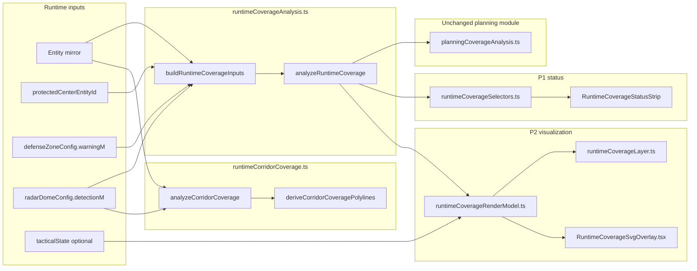

# RT Runtime Coverage Analysis V1

Freeze ID: `PLAT-RT-RADAR-COVERAGE1`

Status: **FROZEN**

## Purpose

Runtime Coverage Analysis V1 adds **UI-local, read-only, heuristic 2D** radar
coverage analytics and visualization for live RT sandbox Grid Mode. It adapts
existing Planning Mode coverage algorithms to runtime entity mirrors without
changing bridge, telemetry, ROS, schema, or Gazebo behavior.

Deliverables:

- **P0** — pure analytics modules, golden fixture, Vitest
- **P1** — `RuntimeCoverageStatusStrip`, governance banner, workstation wiring
- **P2** — Cesium layer, SVG parity, visual layer registry toggle (default off)

## Architecture



Entry points:

| Phase | Module |
|-------|--------|
| P0 analytics | `platform/rt-sandbox-ui/src/coverage/runtimeCoverageAnalysis.ts` |
| P0 corridor | `platform/rt-sandbox-ui/src/coverage/runtimeCorridorCoverage.ts` |
| P1 status | `platform/rt-sandbox-ui/src/coverage/runtimeCoverageSelectors.ts`, `RuntimeCoverageStatusStrip.tsx` |
| P2 render | `platform/rt-sandbox-ui/src/coverage/runtimeCoverageRenderModel.ts` |
| P2 Cesium | `platform/rt-sandbox-ui/src/coverage/runtimeCoverageLayer.ts` |
| P2 SVG | `platform/rt-sandbox-ui/src/coverage/RuntimeCoverageSvgOverlay.tsx` |

Golden fixture:

- `fixtures/rt_sandbox/runtime_coverage_golden_v1.json`

## Runtime input mapping

| Planning input | Runtime equivalent | Source |
|----------------|-------------------|--------|
| Defense polygon vertices | Warning-disc vertex ring (72 segments) | Protected center pose + `defenseZoneConfig.sizes.warningM` |
| Planning radar site | Runtime radar entity | Entity mirror, `entity_type === "radar"` |
| `detection_range_m` | `radarDomeConfig.detectionM` | Session UI config (single radius for all radars in V1) |
| Site `id` | `entity_id` | Entity mirror |

Adapter function: `buildRuntimeCoverageInputs()`.

V1 supports **circle** defense shapes only. Rectangle defense returns
`unsupported_defense_shape`.

Missing or unresolved protected center returns `protected_center_unavailable`.

## Metric definitions

All metrics are heuristic, horizontal 2D disc geometry.

| Metric | Function / field | Notes |
|--------|------------------|-------|
| Protected center covered | `isProtectedCenterCovered()` | True when center inside ≥1 radar disc |
| Covering radar count | `getCoveringRadarCount()` | Integer |
| Nearest radar edge distance | `getNearestRadarEdgeDistanceM()` | 0 inside disc; `null` when no radars |
| Defended disc coverage % | `analysis.estimate.coveragePercent` | Grid-sampled warning disc |
| Overlap % | `analysis.overlapPercent` | Within warning disc |
| Redundancy % | `analysis.redundancyPercent` | Covered cells with ≥2 radars |
| Blind spot sectors | `analysis.blindSpotV2` | Quadrant summaries (NE/NW/SE/SW) |
| Corridor covered / uncovered % | `analyzeCorridorCoverage()` | Length-weighted midpoint sampling |

Corridor helper input: tactical corridor polyline (`EnuPoint[]`) + runtime radar
discs. Pure geometry — no terrain, LOS, or detection probability.

## P1 status strip contract

`RuntimeCoverageStatusStrip` is wired in Grid Mode only
(`showRuntimeCoverageStrip={!workspaceModeShowsPlanningPlaceholder(...)}`).

Governance banner: `BANNER_RUNTIME_COVERAGE` — *"RUNTIME COVERAGE — heuristic 2D
geometry only; not sensor truth or detection probability"*.

Strip surfaces:

- Protected center covered (yes / no / unavailable)
- Covering radar count
- Coverage % and overlap %
- Nearest radar edge distance
- Top blind-spot sector label
- Corridor uncovered % (when corridor geometry exists)

Strip does **not** dispatch commands, spawn entities, or recommend radar
placement.

## P2 visualization contract

### Visual layer registry

| Field | Value |
|-------|-------|
| `layer_id` | `runtime_coverage_cells` |
| `visibility_key` | `showRuntimeCoverageCells` |
| `cognition_group` | `sensor_context` |
| `default_on` | **false** — explicit user toggle required |
| `display_only` | true |
| Disclaimer | Heuristic 2D geometry only — not sensor truth or detection probability |

Registry anchor: `platform/rt-sandbox-ui/src/cesium/visualLayerRegistry.ts`
(`RUNTIME_COVERAGE_LAYERS`).

When enabled, Cesium map chrome shows `BANNER_RUNTIME_COVERAGE`.

### Cesium layer (`runtimeCoverageLayer.ts`)

Entity prefix: `rt-runtime-coverage-*`.

| Entity kind | ID pattern | Color vocabulary |
|-------------|------------|------------------|
| Covered sample cell | `rt-runtime-coverage-covered-{n}` | Green (planning parity) |
| Uncovered sample cell | `rt-runtime-coverage-uncovered-{n}` | Red (planning parity) |
| Blind spot hint point | `rt-runtime-coverage-blind-spot-{n}` | Display-only marker |
| Uncovered sector wedge | `rt-runtime-coverage-sector-{n}` | Sector geometry |
| Sector label | `rt-runtime-coverage-sector-label-{n}` | Top uncovered sectors only |
| Covered corridor segment | `rt-runtime-coverage-corridor-covered-{n}` | Distinct polyline |
| Uncovered corridor segment | `rt-runtime-coverage-corridor-uncovered-{n}` | Distinct polyline |

Sync entry: `syncRuntimeCoverageLayer(viewer, { enabled, params })`.
When `enabled: false` or analytics unavailable, layer clears all prefixed entities.

Render scope: cells sampled inside the protected-center **warning disc** only.

### SVG parity (`RuntimeCoverageSvgOverlay.tsx`)

Lightweight Grid Mode SVG overlay mirrors Cesium geometry types:

- Covered / uncovered cells (same green/red vocabulary)
- Blind spot hint points
- Top uncovered sector labels
- Covered / uncovered corridor polylines

No new geometry types beyond those rendered in Cesium. Visibility gated by
`runtimeCoverageVisible` (Grid Mode + `showRuntimeCoverageCells` toggle).

### Render model fail-closed

`deriveRuntimeCoverageRenderModel()` returns `{ ready: false, reason }` when:

| Reason | Behavior |
|--------|----------|
| `protected_center_unavailable` | No cells, sectors, or corridor overlays rendered |
| `unsupported_defense_shape` | No overlays (rectangle defense) |

Missing corridor geometry: corridor polylines empty; strip shows `null` corridor
uncovered % — analytics and cell overlays still render when center is available.

No radars: zero coverage metrics; guidance copy only — no spawn recommendations.

## Fail-closed states (summary)

| Condition | Strip | Cesium/SVG overlay |
|-----------|-------|-------------------|
| No protected center | Unavailable + guidance | Cleared / not rendered |
| Rectangle defense | Unavailable + guidance | Cleared / not rendered |
| No radars | Ready with zero metrics + guidance | Cells show full uncovered disc |
| No corridor | Ready; corridor % null | Corridor polylines omitted |
| Layer toggle off | Strip still visible (P1) | No overlay entities |

## Limitations

- **Single global radar radius** — all runtime radars share `detectionM`.
- **Circle defense only** — rectangle zones disable analytics in V1.
- **2D horizontal discs** — no terrain mesh, LOS, or sensor truth coupling.
- **Grid sampling** — coverage percents are approximate (default 28 steps; tests may override).
- **Protected center UI cache** — analytics consume explicit `protectedCenterEntityId`; may diverge from backend session until future pull-sync.
- **No radar placement recommendation** — runtime wave does not invoke planning recommendation presets.
- **Corridor sampling** — 25 m midpoint slices; approximate for long polylines.
- **Display-only blind spots** — sector hints are explanatory; not engagement or placement guidance.
- **Grid Mode only** — Planning Mode coverage workflows unchanged.

## Governance boundaries

Included (P0–P2):

- UI-local read-only analytics, status strip, and visualization overlays.
- Golden fixture and Vitest coverage (`npm test coverage`).
- Adapter over frozen `planningCoverageAnalysis.ts` (read-only import).
- Visual layer registry entry with default-off toggle and disclaimer.
- Governance banner on strip and Cesium map chrome.

Excluded:

- Bridge, telemetry, ROS, schema, capture, parser changes.
- Runtime entity mutation or radar spawn recommendations.
- Tactical assign / engage / autonomy coupling.
- SA viewer or replay export.
- Terrain, LOS, probability of detection, Monte Carlo integration.
- Modifications to `planningCoverageAnalysis.ts` or Planning Mode UX.

Authority: all outputs are **explanatory heuristics**, not sensor coverage proof
or operational readiness.

## Validation

Commands (from `platform/rt-sandbox-ui/`):

```bash
npm test coverage   # 41 tests (P0 + P1 + P2)
npm run build
git diff --check
```

Step 6 record (2026-06-07):

- `npm test coverage` — 41 passed
- `npm run build` — pass
- `git diff --check` — pass
- `planningCoverageAnalysis.ts` — no diff
- `platform/rt-sandbox-bridge/` — no coverage-related changes

## Future work (separate waves)

- Pull-sync hydration of `protected_center_entity_id` from session state.
- Per-radar detection range fields (requires separate bridge wave).
- Rectangle defense adapter (requires scoped PLAN wave).

Future work must remain additive and separately frozen.
