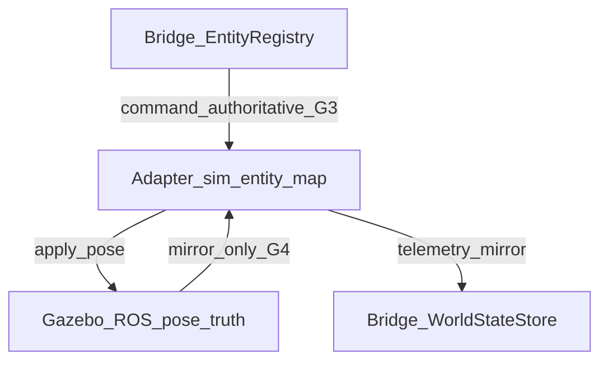

# RT Runtime Synchronization Model (`rt_runtime_synchronization_v1`)

**Phase:** PLAN-RT-G1 — Gazebo/ROS integration synchronization (docs only)  
**Authority:** [rt_g1_gazebo_ros_integration_plan.md](../platform/rt_g1_gazebo_ros_integration_plan.md); [rt_gazebo_ros_boundary_v1.md](rt_gazebo_ros_boundary_v1.md); [rt_session_lifecycle_v1.md](rt_session_lifecycle_v1.md)

Synchronization semantics between **RT Backend Bridge**, **RT Runtime Adapter** (future), and **Gazebo/ROS2**. No implementation in RT-G1.

---

## 1. Synchronization overview

| Sync direction | Phase | Authority |
|----------------|-------|-----------|
| Bridge → Sim | G3+ | Bridge command poses |
| Sim → Bridge | G4+ | Mirror only — not replay |
| Bridge internal (current) | S3–S6 | `WorldStateStore` without sim |

---

## 2. Entity pose sync model

### 2.1 Pre-G3 (PLAT-RT-S3–S6)

- `spawn_entity`, `move_entity`, `delete_entity` update **bridge registry only**.
- `entity_pose_mirror` telemetry reflects bridge state.
- `RuntimeStub` does not apply poses to Gazebo.

### 2.2 G3 target (transient pose synchronization)

| Rule | Description |
|------|-------------|
| Command authority | Bridge pose on `move_entity` / `spawn_entity` is **authoritative** for RT session |
| Apply path | Bridge → Adapter → sim entity |
| Feedback | Sim pose may differ transiently during physics step; adapter reports mirror |
| Conflict | Sim feedback **does not** overwrite bridge command registry without explicit resync policy |
| Stale sync | If mirror diverges beyond threshold → `INVALID_POSE` or `reset_session` |
| ID map | `entity_id` (bridge UUID) ↔ `sim_entity_ref` (adapter handle) — 1:1 per session |

### 2.3 Forbidden sync patterns

- Browser directly setting sim pose
- Sim pose auto-promoting to SA replay bundle
- Cross-session entity ID reuse in sim

---

## 3. Runtime clock semantics

| Clock | Role | Authority |
|-------|------|-----------|
| **Wall clock** | Session timeouts, cleanup timers | Bridge governance constants |
| **Sim clock** | Gazebo physics step | Sim while `running`; frozen on `paused` |
| **Replay clock** | SA viewer / compare mode | **Never** driven by RT live telemetry |

| Bridge command | Sim effect (G2+) |
|----------------|------------------|
| `pause_session` | Freeze sim clock via adapter |
| `resume` | Resume sim clock |
| `reset_session` | Reset sim + bridge world; sim time re-init per G2 audit |

`clock_mirror` telemetry channel reports `paused` derived from session state — not authoritative for SA compare.

---

## 4. Telemetry propagation boundaries

| Channel | Source (current) | Source (G4 target) | Replay authority |
|---------|------------------|--------------------|------------------|
| `session_health` | Bridge + stub | Bridge + adapter | No |
| `entity_pose_mirror` | Bridge registry | Adapter-fed mirror | No |
| `world_summary` | Bridge registry | Bridge + optional sim metadata | No |
| `clock_mirror` | Session state | Session + sim | No |

**Caps (unchanged):** aggregate ≤ `telemetry_update_rate_cap_hz` (10 Hz); max 5 channels per subscription; SA viewer has **no** pull endpoint.

**Rule:** Telemetry mirrors are **explanatory** — they do not update parser-visible summaries or federation indexes.

---

## 5. World-state synchronization rules

| Event | Bridge world | Adapter / sim |
|-------|--------------|---------------|
| `start_session` | Empty registry | Launch or attach (G2) |
| `spawn_entity` | Add entity | Create sim entity (G3) |
| `move_entity` | Update pose | Apply pose (G3) |
| `delete_entity` | Remove entity | Remove sim entity (G3) |
| `reset_session` | Clear registry | Reset sim world |
| `stop_session` | Quiesce; retain until cleanup | Stop sim clock |
| `discard_session` | Clear | Teardown sim |

**World bounds:** Prototype units `x,y ∈ [-500, 500]`, `z ∈ [0, 200]` — out-of-bounds → `INVALID_POSE` before adapter apply.

---

## 6. Disconnect and cleanup behavior

### 6.1 Happy-path teardown

1. `stop_session` or `discard_session` from UI/CLI
2. Bridge transitions to `stopped` or `discarded`
3. Adapter receives teardown RPC
4. Adapter kills Gazebo/ROS children
5. Bridge clears telemetry subscriptions and world state
6. Audit append `session_stopped` / `session_discarded`

### 6.2 Failure-path teardown

| Trigger | Bridge transition | Adapter action | Orphan policy |
|---------|-------------------|----------------|---------------|
| Gazebo launch failure | `failed` → `cleanup_pending` | Exit; report error | Bridge kills adapter PID tree |
| ROS node crash | `runtime_crashed` | Watchdog exit | Same |
| Topic timeout (G4) | Degraded → optional `failed` | Unsubscribe stale mirrors | Same |
| Stale entity sync (G3) | Command error or `reset_session` | Resync or partial reset | No SA write |
| Adapter IPC disconnect | `bridge_disconnected` → `failed` | Reconnect window then kill | `bridge_disconnected_reconnect_timeout` (30 s) |
| Cleanup timeout | `cleanup_pending` → `discarded` | Force kill | `cleanup_pending_max_age` (300 s) |

### 6.3 Non-authoritative failure state

- Failure records in `rt_session_audit_log_v1` are **not** replay evidence.
- No automatic `capture_session` from `failed` or `runtime_crashed`.
- Partial sim state after failure is **discarded** — never merged into SA corpus.

---

## 7. Capture and provenance sync (G5 pointer)

Until PLAT-RT-G5:

- Capture bundles snapshot **bridge world** + audit + telemetry summary.
- Sim-only state not in bridge registry may be **omitted** unless G5 normalization adds `runtime_to_replay_conversion_v1` fields.

Rule: **Gazebo runtime state is transient** — only normalized, maintainer-approved capture artifacts may enter SA pipeline per [rt_sa_export_boundary_v1.md](rt_sa_export_boundary_v1.md).

---

## Related

- [rt_session_lifecycle_v1.md](rt_session_lifecycle_v1.md)
- [rt_capture_continuity_v1.md](rt_capture_continuity_v1.md)
- [rt_runtime_governance_v1.md](rt_runtime_governance_v1.md)
