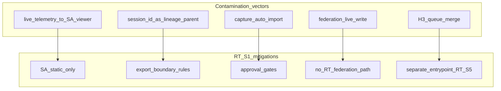

# RT-S1 — Architecture Readiness Review R1

**Phase:** PLAN-RT-S1 freeze / pre-RT-S2 readiness (review-only)  
**Checkpoint:** `6965336` (PLAT-SA-F2A frozen)  
**Worktree:** `/home/neociel/drone/codex-a01-phase2` — branch `feature/rt-s1-sandbox-architecture`  
**Authority:** [rt_s1_interactive_sandbox_architecture_plan.md](../platform/rt_s1_interactive_sandbox_architecture_plan.md); [rt_s1_freeze_audit.md](rt_s1_freeze_audit.md)

This review validates PLAN-RT-S1 documentation before any realtime/runtime implementation. **No code was created or modified** as part of this review wave except documentation clarifications and freeze promotion.

---

## 1. Executive summary

| Item | Verdict |
|------|---------|
| PLAN-RT-S1 architecture completeness | **Pass** (with documented ambiguities A1–A7) |
| SA authority contamination | **Pass** — no SA viewer/orchestration/federation changes |
| Replay-boundary safety | **Pass with residual** — lineage lint enforcement deferred to RT-S5 |
| Operational semantics drift | **Pass** — lexicon and blocked commands adequate |
| RT-S2 implementation readiness | **Conditional proceed** — narrow bridge + session manager only |
| Freeze verdict | **PLAN-RT-S1 docs frozen** — see [rt_s1_freeze_audit.md](rt_s1_freeze_audit.md) |

**Stop line:** Do not start RT-S2 runtime bridge implementation until a new PLAT-RT-S2 wave plan and freeze audit are authorized.

---

## 2. Architecture review (six focus areas)

### 2.1 Bridge contract completeness

| Element | Assessment | Result |
|---------|------------|--------|
| Command allow-list | Session, entity, telemetry, capture/discard defined | **Pass** |
| Blocked commands | Operational, HITL, federation, orchestration, parser, browser→ROS | **Pass** |
| Authority ownership | Browser intent-only; bridge gate; SA viewer excluded | **Pass** |
| Telemetry scope | Read-only subscribe; rate cap; allow-list v0 added (A4) | **Conditional pass** |
| Rate limits | 5/1 cmd/s, 10 Hz telemetry | **Pass** |
| Resource caps | Cross-linked in governance doc | **Pass** |
| Prototype boundaries | Deny-by-default; local-only security assumptions | **Pass** |
| Transport (A1) | HTTP/unix in S1; RT-S2 profile clarifies loopback RPC | **Conditional pass** |

**Finding:** Contract is sufficient for RT-S2 **session control prototype**. Entity catalog v0 and telemetry allow-list v0 stubs close gaps for S3/S4 planning.

### 2.2 Runtime session lifecycle safety

| Element | Assessment | Result |
|---------|------------|--------|
| Happy-path clarity | created → running ↔ paused → stopped → captured/discarded | **Pass** |
| Failure states | failed, runtime_crashed, bridge_disconnected, cleanup_pending | **Pass** |
| Cleanup semantics | Timeouts and cleanup_pending → discarded | **Pass** |
| Capture from failure | Forbidden in failure vs capture table | **Pass** |
| State precedence (A2) | Capture only from stable stopped; not during cleanup_pending | **Pass** (after clarification) |
| created failure (A3) | bridge_ready timeout → failed | **Pass** (after clarification) |
| Session isolation | 1 active session per bridge | **Pass** |
| Transient guarantees | All states non-authoritative for SA | **Pass** |

**Finding:** Lifecycle is governance-safe. Recovery UX remains deferred to RT-S2+ as intended.

### 2.3 RT↔SA contamination risk

| Vector | Mitigation in docs | Residual risk |
|--------|-------------------|---------------|
| Live telemetry → SA viewer | SA static JSON only | **Low** if S2 respects boundary |
| session_id as lineage parent | Export rules + A6 field semantics | **Medium** until RT-S5 lint |
| capture → auto import | Approval record + pipeline | **Low** |
| Federation live write | No RT path | **Low** |
| H3 queue merge | Separate entrypoint (RT-S5) | **Low** if implementers read boundary doc |
| Persistence bypass | Snapshots blocked; conversion manifest | **Low** |

**Verdict:** **Pass with conditions** — contamination controls are documented; automated enforcement awaits RT-S5.

### 2.4 Runtime governance separation

| Criterion | Result |
|-----------|--------|
| RT authority bounded to bridge session | **Pass** |
| SA replay authority preserved | **Pass** |
| Browser escalation risk | **Pass** — no ROS credentials; deny-by-default |
| Hidden SA coupling | **Pass** — sa-r0-viewer excluded; legacy web/ not extended |
| Future governance split | **Pass** — third frontier in AGENTS.md |

### 2.5 UX drift risk

| Risk | Control | Result |
|------|---------|--------|
| Tactical/operator wording | Forbidden lexicon + banners | **Pass** |
| Command-center semantics | Forbidden layers aligned with PLAN-SA-R1 | **Pass** |
| Mission-control drift | No HITL commands in allow-list | **Pass** |
| Live dashboard behavior | 10 Hz cap; RT-only UI in S4 roadmap | **Conditional** — S4 needs UI governance review |
| Runtime cognition boundaries | Mirrors ≠ authority | **Pass** |

### 2.6 Future RT-S2 readiness

| RT-S2 candidate | Ready? | Notes |
|-----------------|--------|-------|
| Local bridge prototype | **Yes** (conditional) | After PLAT-RT-S2 wave audit |
| Transient session manager | **Yes** (conditional) | Implement lifecycle + caps |
| Limited telemetry | **Deferred** | RT-S4; allow-list v0 doc only in S1 |
| spawn/move/delete | **Deferred** | RT-S3 |
| Runtime isolation primitives | **Yes** (conditional) | Process cleanup per governance timeouts |

| Forbidden in RT-S2 | Blocked |
|---------------------|---------|
| Distributed runtime infra | Yes |
| Cloud orchestration | Yes |
| Operational semantics | Yes |
| browser→ROS authority | Yes |
| federation/runtime coupling | Yes |

---

## 3. Risk analysis

| ID | Risk | Likelihood | Impact | Mitigation |
|----|------|------------|--------|------------|
| R1 | Rosbridge/legacy web/ reuse for “bridge” | Med | High | A1 transport profile; RT-S2 audit forbids |
| R2 | session_id written as corpus parent_ref | Med | High | A6/A7; RT-S5 lint |
| R3 | capture_session wired to auto bundle import | Low | High | Export boundary + no capture in S2 scope |
| R4 | Telemetry UI resembles ops dashboard | Med | Med | 10 Hz cap; RT-only UI; forbidden lexicon |
| R5 | Orphan Gazebo after crash | Med | Med | cleanup_pending_max_age; S2 must implement |
| R6 | SA sandbox vs RT sandbox naming confusion | Low | Med | Mandatory qualifiers (documented) |
| R7 | Scope creep: multi-session bridge | Low | High | max_concurrent_sessions = 1 |
| R8 | WebSocket added to sa-r0-viewer | Low | High | Explicit forbidden in S2 prerequisites |

---

## 4. Contamination analysis

| Vector | Status |
|--------|--------|
| Replay contamination | **Mitigated** (docs) |
| Lineage corruption | **Mitigated** (docs); enforcement RT-S5 |
| Capture/import conflation | **Mitigated** |
| Federation isolation | **Mitigated** |
| Persistence bypass | **Mitigated** |

---

## 5. Governance readiness assessment

Cross-check against [rt_s1_governance_review_r1.md](rt_s1_governance_review_r1.md) and frozen SA platform (F2A, H1–H5, I1–I3, A1–A2):

| Check | Result |
|-------|--------|
| No SA authority contamination | **Pass** |
| No parser/topic changes in RT-S1 | **Pass** |
| No operational semantics in RT docs | **Pass** |
| Third frontier documented | **Pass** |
| PLAN-RT-S1 separate from RT-1..7 realism | **Pass** |
| Implementation absence verified | **Pass** |

---

## 6. RT-S2 readiness verdict

### 6.1 Verdict: **Conditional proceed**

The repository is mature enough for a **narrow PLAT-RT-S2** prototype **after**:

1. New [PLAT-RT-S2 wave plan](rt_roadmap_s2_s6_v1.md) + scoped freeze audit (not this review alone)
2. A1 transport resolution documented in [rt_bridge_contract_v1.md](rt_bridge_contract_v1.md)
3. Implementation limited to scope table below

### 6.2 RT-S2 allowed scope

| In scope | Out of scope |
|----------|--------------|
| Local bridge process (loopback HTTP or WS to bridge only) | SA viewer integration |
| Session manager (lifecycle + resource caps) | capture_session / SA import |
| start/stop/pause/resume/discard_session | spawn_entity / move_entity (RT-S3) |
| rt_session_audit_log_v1 append | subscribe_telemetry UI (RT-S4) |
| Orphan process cleanup per timeouts | rosbridge, legacy web/ extension |
| | Federation/orchestration writes |

### 6.3 RT-S2 block conditions

Implementation **must not proceed** if any of:

- Transport uses rosbridge or browser→ROS
- Browser stores ROS/DDS credentials
- Multi-session or remote/public bridge
- capture auto-writes to corpus or federation
- `platform/sa-r0-viewer/` is modified for RT

### 6.4 Explicit criteria evaluation

| Criterion | Verdict |
|-----------|---------|
| Bridge authority isolated from SA replay authority | **Pass** |
| Transient IDs contaminating replay lineage | **Pass with A6/A7** |
| Telemetry → operational dashboard semantics | **Conditional** (A4 + RT-only UI) |
| Capture gated before replay import | **Pass**; no capture in S2 |
| Persistence bypassing deterministic packaging | **Pass** |

---

## 7. Recommended hardening (applied in RT-S1 review wave)

| ID | Action | Status |
|----|--------|--------|
| A1 | RT-S2 transport profile in bridge contract | Applied |
| A2 | State precedence in lifecycle doc | Applied |
| A3 | created → failed on bridge_ready timeout | Applied |
| A4 | Telemetry allow-list v0 stub | Applied |
| A5 | Entity catalog v0 stub | Applied |
| A6 | parent_session_id non-lineage note in export boundary | Applied |
| A7 | Document enforcement at RT-S5 (no S2 import tooling) | In this review |
| A8 | Promote freeze audit draft → final | Applied |

---

## 8. Freeze verdict

**PLAN-RT-S1 is docs frozen** as of this readiness review.

- Freeze audit: [rt_s1_freeze_audit.md](rt_s1_freeze_audit.md)
- Registry: PLAN-RT-S1 row in [freeze_registry_r1.md](freeze_registry_r1.md)
- Readiness: this document

RT-S2 implementation remains **unauthorized** until a separate PLAT-RT-S2 wave is opened.

---

## 9. Validation sign-off

| Review | Result |
|--------|--------|
| Governance review | **Pass** |
| Architecture review | **Pass** |
| Replay-boundary review | **Pass** (residual A7) |
| No SA authority contamination | **Pass** |
| No operational semantics drift | **Pass** |
| No replay lineage contamination (docs) | **Pass** |

---

## 10. Closeout summaries

### 10.1 Architectural strengths

- Clear **SA Platform / RT Sandbox / Gazebo** separation with AGENTS third frontier
- Strong **capture_session ≠ SA import** model with approval gates
- **Failure and cleanup states** prevent silent replay promotion
- **Prototype resource caps** limit ops/distributed drift
- **Deny-by-default bridge** with explicit blocked command categories
- **UX lexicon** reduces tactical/C2 language risk

### 10.2 Unresolved risks

- Lineage rejection for `session_id` is **not yet automated** (RT-S5)
- Telemetry and entity catalogs are **v0 stubs** only
- RT-S4 telemetry UI must undergo separate UX governance review
- Process supervision for orphan cleanup is **specified but not implemented**

### 10.3 RT-S2 prerequisites

1. Author PLAT-RT-S2 implementation plan + freeze audit
2. Implement local bridge + session manager only (commands in §6.2)
3. Enforce A1 transport rules (no rosbridge; no SA viewer WS)
4. Defer capture, spawn/move, full telemetry, SA integration
5. Run scoped regression appropriate to RT-S2 code touch (new wave)

### 10.4 Stop line

**End of RT-S1 readiness review.** No runtime bridge, websocket server, rosbridge adapter, or browser runtime API implementation was performed or authorized.

---

## 11. Related

- [rt_s1_governance_review_r1.md](rt_s1_governance_review_r1.md)
- [rt_s1_freeze_audit.md](rt_s1_freeze_audit.md)
- [rt_roadmap_s2_s6_v1.md](rt_roadmap_s2_s6_v1.md)
