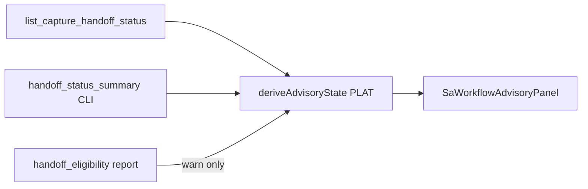

# RT SA Workflow Advisory UI Contract (`rt_sa_workflow_advisory_ui_v1`)

**Phase:** PLAN-RT-F6 — advisory automation surfaces (docs only)  
**Prerequisite:** PLAT-RT-T4, PLAT-RT-SA2, PLAT-RT-F5 P1 frozen  
**Authority:** [rt_sa_workflow_automation_v1.md](rt_sa_workflow_automation_v1.md); [rt_sa2_multi_session_handoff_ui_v1.md](rt_sa2_multi_session_handoff_ui_v1.md)

Normative contract for **read-only / advisory-only** UI surfaces planning deeper RT→SA workflow cognition. **No write paths.** **No SA viewer changes.**

---

## 1. Scope

| In scope | Out of scope |
|----------|--------------|
| Workbench handoff status badges | SA viewer panels or live RT hooks |
| Staging readiness mirror extensions | Browser approve / import / capture |
| Review checklist state chips | Federation / orchestration UI |
| Import advisory strip | Tactical redesign |
| Governance banners | Bridge HTTP write commands |

All surfaces **poll or derive** from existing bridge mirror and local manifest imports — never trigger maintainer CLIs.

---

## 2. Advisory surfaces

### 2.1 Workbench handoff status (PLAT P1)

**Location:** Extend `ExperimentWorkbenchPanel` — per-run row adjacent to F5 handoff eligibility strip.

| Element | Source | Behavior |
|---------|--------|----------|
| Advisory badge | `capture_staging_ref` → derive `advisory_state` | Pill: `capture_ready` … `import_ready` or `blocked` |
| CLI map link | Static `CAPTURE_PIPELINE_STEPS` | Opens maintainer command reference — no execution |
| F5 cross-link | `handoff_eligibility.experiment_level` | Show warn when experiment partial/ineligible — does not override per-capture badge |
| Experiment run ref | `rt_experiment_manifest_v1` run entry | Join capture ID when `has_capture` |

**Rules:**

- Badge tone: `neutral` for advisory rungs; `warn` for blocked/defer; `error` for rejected
- No "Import now" or "Approve" buttons
- Retain `BANNER_MANUAL_HANDOFF_ONLY` and `BANNER_EXPERIMENT_F5`

### 2.2 Staging readiness mirror (PLAT P1)

**Location:** Extend `CaptureHandoffWorkflowPanel` — additive column on session capture table.

| Element | Source | Behavior |
|---------|--------|----------|
| Advisory column | `list_capture_handoff_status` rows + PLAT derive | One advisory state per capture row |
| Multi-session overview | Existing SA2 overview + advisory counts | e.g. "2 approval_ready · 1 blocked" |
| Session lifecycle row | `captureReadinessFromLifecycle` | Unchanged — session explanatory only |
| Poll interval | Existing 1 Hz mirror poll | No new bridge commands in PLAN |

**Rules:**

- Mirror remains authoritative for `workflow_phase`; advisory column is additive cognition
- Display disambiguation: post-approve state labeled **"packaging ready (advisory)"**

### 2.3 Review checklist state (PLAT P1)

**Location:** New read-only region in workstation pipeline footer — `SaWorkflowAdvisoryPanel` (planned component name).

| Checklist item | ID | Derive rule (from manual workflow §2) |
|----------------|-----|----------------------------------------|
| Normalization | `normalization` | `normalization_status === normalized` |
| Validation doc | `validation_doc` | `normalization_validation.json` → `valid: true` |
| Pose cognition | `pose_cognition` | Review notes or maintainer attestation flag (warn default) |
| Origin | `origin` | `origin` includes `rt_sandbox_capture_v1` |
| Session state | `session_state` | Lifecycle not failed/discarded |
| Scenario pack | `scenario_pack` | Ref exists when present |
| Export audit | `export_audit` | Required events present |
| Lineage | `lineage` | No `session_id` as planned `parent_ref` |

| Chip status | Meaning |
|-------------|---------|
| `pass` | Derive satisfied |
| `warn` | Incomplete attestation — maintainer action required |
| `fail` | Blocking — advisory capped below next rung |
| `unknown` | Staging unreadable — mirror error |

**Rules:**

- No approve button; checklist is cognition only
- Selected capture drives checklist — default to active session's most recent capture

### 2.4 Import advisory strip (PLAT P1)

**Location:** Adjacent to `ExperimentHandoffEligibilityStrip` in experiment workbench tier.

| Element | Behavior |
|---------|----------|
| Import readiness pill | Shows `import_ready` advisory when per-capture derive passes |
| Corpus diff placeholder | P1: static copy "corpus diff — maintainer CLI only (P2)"; P2: read-only summary from CLI export |
| Blockers list | Enumerate `block_reasons` from advisory derive |
| Commit reminder | Fixed copy: "SA lineage begins only at `rt_sa_import commit --corpus-dest`" |

**Rules:**

- Retain `BANNER_MANUAL_HANDOFF_ONLY`
- No corpus path picker that writes
- F5 `eligible` experiment level does **not** imply `import_ready`

---

## 3. Governance banners

### 3.1 Additive banner (PLAT P1)

| Constant | Text (normative) |
|----------|------------------|
| `BANNER_SA_WORKFLOW_ADVISORY` | SA WORKFLOW ADVISORY — explanatory only; maintainer CLIs are authority |

Wiring: workstation pipeline footer + experiment workbench when advisory panels visible.

### 3.2 Retained banners

| Constant | When shown |
|----------|------------|
| `BANNER_MANUAL_HANDOFF_ONLY` | Always on handoff surfaces |
| `BANNER_EXPERIMENT_F5` | F5 experiment tier |
| Mirror governance from SA2 | `HANDOFF MIRROR — read-only; not SA replay authority` |

### 3.3 Forbidden lexicon

Must not appear in advisory UI copy, badges, or tooltips:

- `readiness_score`
- `auto_import` / `automatic import`
- `operational_ready` / `operational readiness`
- `tactical readiness`
- `winner` / `success_rate` (F5 parity)
- One-click import phrasing

---

## 4. Data sources (no new authority)

| Source | Bridge / CLI | Live pull? |
|--------|--------------|------------|
| Capture handoff mirror | `list_capture_handoff_status` | Yes — existing SA2 poll |
| Handoff status summary | `rt_capture_inspect handoff-status` | CLI only — not browser subprocess |
| Experiment metrics | Imported JSON / local report | No live bridge |
| Advisory derive | PLAT pure function | No side effects |

---

## 5. Component map (PLAT advisory)

| Component | Phase | File (planned) |
|-----------|-------|----------------|
| `SaWorkflowAdvisoryPanel` | P1 | `platform/rt-sandbox-ui/src/handoff/SaWorkflowAdvisoryPanel.tsx` |
| `deriveAdvisoryState.ts` | P0 | `platform/rt-sandbox-ui/src/handoff/deriveAdvisoryState.ts` |
| `advisoryChecklist.ts` | P1 | `platform/rt-sandbox-ui/src/handoff/advisoryChecklist.ts` |
| Workbench badge | P1 | extend `ExperimentWorkbenchPanel.tsx` |
| Mirror column | P1 | extend `CaptureHandoffWorkflowPanel.tsx` |
| Import advisory strip | P1 | `ExperimentImportAdvisoryStrip.tsx` (planned) |

Do not create these files in PLAN wave.

---

## 6. Accessibility and cognition

- Advisory badges must include full state in `aria-label` (e.g. "Advisory state: approval ready — not SA authority")
- Blocked states expose `block_reasons` in expandable detail region
- Checklist chips use text + icon — not color-only outcome semantics

---

## 7. Validation (PLAT)

- `tier0-rt-ui` gate when P1 lands
- Vitest golden tests from [fixtures/rt_handoff/f6_advisory_examples/](../../fixtures/rt_handoff/f6_advisory_examples/)
- No new bridge subcommands required for P1 (derive client-side from mirror payload)

Optional P0 additive IPC (separate PLAT audit if implemented):

- Mirror row field `advisory_state` — read-only passthrough from bridge derive

---

## 8. Related

- [rt_sa_workflow_automation_v1.md](rt_sa_workflow_automation_v1.md)
- [rt_runtime_workstation_ui_v1.md](rt_runtime_workstation_ui_v1.md)
- [rt_experiment_advanced_ui_v1.md](rt_experiment_advanced_ui_v1.md) — §2.5 handoff strip
- [rt_f6_handoff_contamination_review_r1.md](rt_f6_handoff_contamination_review_r1.md)
