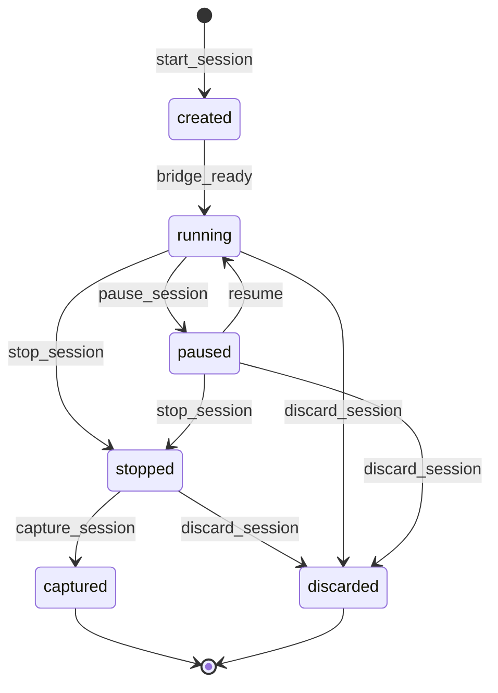
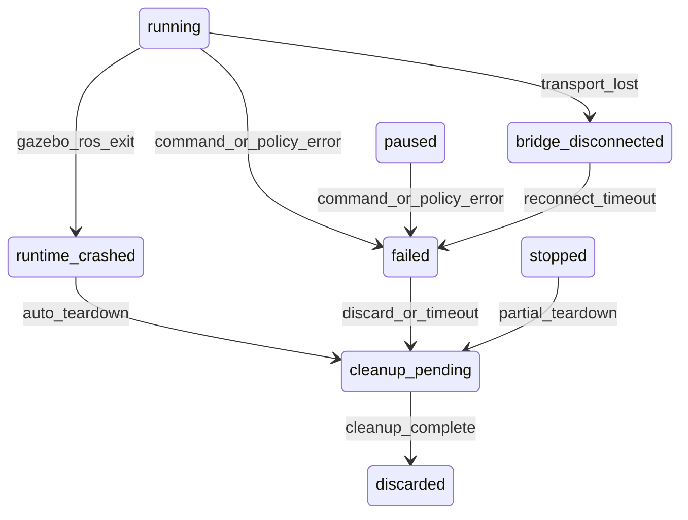

# RT Session Lifecycle (`rt_session_lifecycle_v1`)

**Phase:** PLAN-RT-S1 — interactive runtime sandbox (docs only)  
**Authority:** [AGENTS.md](../../AGENTS.md); [rt_s1_interactive_sandbox_architecture_plan.md](../platform/rt_s1_interactive_sandbox_architecture_plan.md)

Conceptual lifecycle for **RT interactive sandbox** sessions. No bridge or runtime implementation in RT-S1.

---

## 1. Session identity

| Field | Role |
|-------|------|
| `session_id` | Ephemeral UUID issued at `start_session` |
| `bridge_instance_id` | Local bridge process identity (prototype) |
| `scenario_pack_ref` | Optional read-only `scenario_topology_v1` ref — **not** SA corpus authority |
| `created_utc` | Session start timestamp |

RT `session_id` values are **transient** and must never appear as authoritative parents in SA corpus or federation lineage graphs.

---

## 2. Happy-path state machine

| State | Meaning | Authoritative? |
|-------|---------|----------------|
| `created` | Session record exists; bridge allocating runtime | No |

**Bridge ready timeout:** If `created` does not reach `running` within **60 s** (prototype), bridge transitions to `failed` → `cleanup_pending` → `discarded`. No capture from `created`.
| `running` | Gazebo/ROS child active; commands accepted | No (runtime truth only while active) |
| `paused` | Simulation clock frozen; entities retained | No |
| `stopped` | User/maintainer halt; runtime quiesced | No |
| `captured` | Capture candidate emitted; awaiting SA export pipeline | No (candidate only) |
| `discarded` | Session torn down; no SA artifact | No |

---

## 3. Failure and cleanup states

| State | Meaning | Authoritative? |
|-------|---------|----------------|
| `failed` | Command rejected, resource limit exceeded, or unrecoverable bridge error | No |
| `runtime_crashed` | Gazebo/ROS child exited unexpectedly | No |
| `bridge_disconnected` | UI lost bridge transport; runtime may continue until cleanup policy fires | No |
| `cleanup_pending` | Teardown in progress; only `discard_session` permitted | No |

### 3.1 Transient failure semantics

- All failure states remain **non-authoritative** — no SA replay bundle, corpus index update, or federation visibility.
- **No automatic replay promotion** from `failed`, `runtime_crashed`, or `bridge_disconnected`.
- Recovery workflows (reconnect bridge, resume world, restart session) are **deferred** to RT-S2+; RT-S1 names states and cleanup rules only.
- `cleanup_pending` → `discarded` is terminal for failed paths.

### 3.2 Cleanup rules

| Trigger | Action |
|---------|--------|
| `discard_session` | Immediate transition toward `cleanup_pending` → `discarded` |
| `stop_session` then idle | After `session_cleanup_timeout` (see [rt_runtime_governance_v1.md](rt_runtime_governance_v1.md)), auto `cleanup_pending` |
| `failed` / `runtime_crashed` | Enter `cleanup_pending`; force discard after `cleanup_pending_max_age` |
| `bridge_disconnected` | If reconnect not restored within timeout → `failed` → `cleanup_pending` |

Orphan ROS/Gazebo processes must not survive past `cleanup_pending_max_age`.

---

## 4. State precedence

When multiple transitions are possible, the bridge applies this order:

1. **Cleanup wins over capture** — from `cleanup_pending`, only `discard_session` is valid; `capture_session` → `INVALID_STATE`.
2. **Capture only from stable `stopped`** — `stopped` means runtime quiesced and teardown not started; not `cleanup_pending`.
3. **Failure blocks capture** — `failed`, `runtime_crashed`, `bridge_disconnected` cannot reach `captured`.
4. **`captured` is terminal** for the capture path — no return to `running`; further work uses SA export pipeline only.
5. **Concurrent commands** — bridge serializes; later conflicting command gets `INVALID_STATE`.

## 5. Failure vs capture

| Session state | `capture_session` allowed? | SA import possible? |
|---------------|---------------------------|---------------------|
| `running` | **No** | No |
| `paused` | **No** | No |
| `failed` | **No** | No |
| `runtime_crashed` | **No** | No |
| `bridge_disconnected` | **No** | No |
| `cleanup_pending` | **No** | No |
| `stopped` | **Yes** (explicit maintainer intent) | Only after export pipeline — see [rt_sa_export_boundary_v1.md](rt_sa_export_boundary_v1.md) |
| `captured` | N/A (terminal for capture path) | Candidate only until validation + packaging + audit |
| `discarded` | **No** | No |

`capture_session` produces a **capture candidate**, not an SA replay artifact.

---

## 6. Persistence boundaries

| Data | Persisted where | SA-visible? |
|------|-----------------|-------------|
| Live telemetry | Bridge session buffer only | No |
| `sandbox_session_snapshot_v1` | Optional RT-local debug file | No (blocked from SA viewer import) |
| Capture candidate | Staging path post-`capture_session` | After explicit export pipeline only |
| Audit log | `rt_session_audit_log_v1` (future) | Explanatory if exported with capture |

Live telemetry must never be written to federation indexes or SA viewer stores.

---

## 7. Authority ownership

| Actor | May transition states |
|-------|----------------------|
| RT Browser UI | Request via bridge commands only |
| RT Backend Bridge | Enforce transitions; reject illegal commands |
| SA viewer | **None** — read-only frozen artifacts |
| SA orchestration CLIs | **None** — separate maintainer capture path |
| Federation tooling | **None** |

---

## 8. Related

- [rt_s1_architecture_readiness_review_r1.md](rt_s1_architecture_readiness_review_r1.md)

- [rt_bridge_contract_v1.md](rt_bridge_contract_v1.md)
- [rt_runtime_governance_v1.md](rt_runtime_governance_v1.md)
- [rt_sa_export_boundary_v1.md](rt_sa_export_boundary_v1.md)
- [rt_capture_continuity_v1.md](rt_capture_continuity_v1.md)
