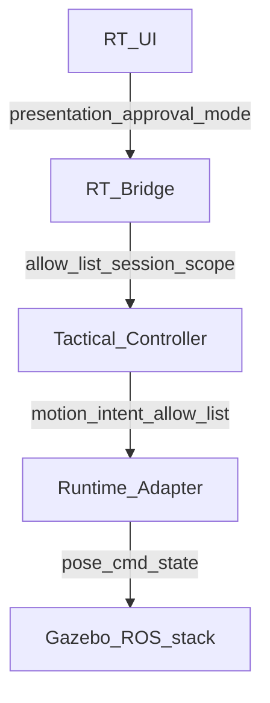

# RT Tactical Controller Layers (`rt_tac1_tactical_controller_layers_v1`)

**Phase:** PLAN-RT-TAC1 — tactical controller architecture (docs only)  
**Authority:** [rt_tac1_tactical_controller_architecture_plan.md](../platform/rt_tac1_tactical_controller_architecture_plan.md); [rt_bridge_contract_v1.md](rt_bridge_contract_v1.md); [rt_gazebo_ros_boundary_v1.md](rt_gazebo_ros_boundary_v1.md)

Defines the five-layer flow RT UI → RT Bridge → Tactical Controller → Runtime Adapter → Gazebo and authority at each hop. **No implementation in PLAN-RT-TAC1.**

---

## 1. Layer flow



**Data rule:** User intent and mode flow **down**; authoritative registry truth flows **up** to UI as snapshots only. SA handoff reads capture at bridge boundary — never live tactical controller internals.

---

## 2. Per-layer authority

| Layer | Owns | Does not own | Authority label |
|-------|------|--------------|-----------------|
| **RT UI** | Mode selector, approval affordances (future), cognition banners, candidate presentation | ROS topics, parser contracts, SA corpus, bridge allow-list | *(none — not authoritative)* |
| **RT Bridge** | Session scope, command allow-list, editing lock, resource caps, capture/handoff boundary, `SessionRecord` registry | Tactical geometry solver, Gazebo physics, engine selection policy | `command_authoritative` (entity/world commands); session `tactical_mode` (future) |
| **Tactical Controller** | Candidate selection policy, TTI ranking, recommendation packets, autonomous tick scheduling (sandbox only) | Bridge registry truth, SA import, federation, parser fields | Mode-dependent — see [rt_tac1_tactical_modes_v1.md](rt_tac1_tactical_modes_v1.md) |
| **Runtime Adapter** | Pose sync mirror, telemetry mirrors, adapter poll, ROS allow-list I/O | Selection policy, user approval state | `explanatory_sync`, `explanatory_telemetry` |
| **Gazebo / ROS stack** | Physics simulation; optional `interception_logic_node` when launched outside RT tactical path | RT `session_id` registry; SA lineage | Engine truth — **not** replay authority |

---

## 3. Insertion point

The tactical controller is a **logical module** inside the bridge process (future PLAT waves):

```
Client POST → BridgeSessionManager.dispatch
           → [TacticalController] (policy + recommendations)
           → EntityRegistry / RuntimeHandle / AdapterWorker
```

| Property | Rule |
|----------|------|
| Position | After allow-list validation; before adapter motion dispatch |
| Session binding | One controller state object per `SessionRecord` |
| Cross-session | **Forbidden** — no shared assignment or recommendation queue |
| Threading | Same constraints as `ThreadingHTTPServer` session registry (M2) |
| Teardown | Controller state cleared in `session_teardown` with mirrors and audit |

---

## 4. Command and intent boundaries

| Direction | Content | Validator |
|-----------|---------|-----------|
| UI → Bridge | JSON commands (`spawn_entity`, future `tactical_*`) | Bridge allow-list + editing session |
| Bridge → Controller | Normalized intent: select candidate, request recommendation, set mode | Bridge only — controller cannot call HTTP |
| Controller → Bridge | Motion intent proposals (not direct HTTP) | Bridge re-validates allow-list |
| Bridge → Adapter | Existing adapter commands (`entity_pose_cmd`, poll ticks) | [rt_gazebo_ros_boundary_v1.md](rt_gazebo_ros_boundary_v1.md) |
| Adapter → Gazebo | ROS topics on session `ros_domain_id` | ROS allow-list |

Controller **must not** open new ROS topics or bypass adapter allow-list.

---

## 5. Authority vs engine stack

When Gazebo runs `interception_logic_node` **independently** of RT tactical mode:

| Source | Scope | RT reading |
|--------|-------|------------|
| `/interceptor/selected_id`, `assigned_target` (engine) | Engine/replay tooling when node active | Optional mirror input — **not** RT command authority |
| RT `assigned_candidate_id` (future) | RT session sandbox | `command_authoritative` or `tactical_controller_authoritative` per mode |
| `[TACTICAL_*]` log lines | Explanatory evidence | Never bridge registry authority |

RT tactical controller **does not** replace engine node authority in replay logs — it parallels sandbox semantics only.

---

## 6. Multi-session interaction

| Concern | Rule |
|---------|------|
| Editing session | Tactical commands only on `editing_session_id` |
| Background session | Tactical mode frozen; no UI recommendations; diagnostics may show last snapshot |
| Capture | `capture_session` reads tactical state from target session only |
| Handoff | Staging mirrors exclude live controller queues — [rt_sa2_multi_session_handoff_ui_v1.md](rt_sa2_multi_session_handoff_ui_v1.md) |

---

## 7. Out of scope

- Python module file layout (deferred to PLAT-RT-TAC2+)
- New HTTP routes beyond future documented verbs
- SA viewer integration
- Distributed controller replicas

---

## Related

- [rt_tac1_tactical_modes_v1.md](rt_tac1_tactical_modes_v1.md)
- [rt_tac1_tactical_logic_reuse_v1.md](rt_tac1_tactical_logic_reuse_v1.md)
- [rt_session_manager_ownership_v1.md](rt_session_manager_ownership_v1.md)
- [rt_multi_session_governance_v1.md](rt_multi_session_governance_v1.md)
