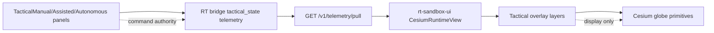

# RT Tactical Visualization V1

**Freeze ID:** PLAT-RT-TACTICAL-VIS1  
**Status:** frozen  
**Surface:** `platform/rt-sandbox-ui/src/cesium/` (tactical overlay layers only)

Tactical Visualization V1 adds display-only Cesium overlays for the unified ±7000 m RT sandbox world. Overlays consume existing `tactical_state` and entity mirror telemetry; they do not issue commands, assign intercepts, or enable autonomous engagement.

## Architecture



**Authority split:** Tactical command panels (PLAT-RT-TAC2–TAC4) remain the only UI paths that mutate bridge tactical state. Tactical visualization layers are read-only consumers of pulled telemetry and entity mirrors.

**Unified world context:**

| Ring / bound | Radius (m) |
|--------------|------------|
| City | 1000 |
| Defense | 3000 |
| Warning | 5000 |
| Spawn band | 5000–7000 |
| World half-extent | ±7000 |

## Tactical layers

All layers register in `visualLayerRegistry.ts`, default **off**, grouped under tactical visualization.

| Layer ID | Visibility key | Purpose |
|----------|----------------|---------|
| `tactical_predicted_path` | `showTacticalPredictedPath` | Dashed defender→solution path |
| `tactical_intercept_point` | `showTacticalInterceptPoint` | Solution-point marker + label |
| `tactical_timing_labels` | `showTacticalTimingLabels` | TTI / ETA explanatory labels |
| `tactical_threat_corridor` | `showTacticalThreatCorridor` | Attacker→solution threat ribbon |
| `tactical_selection_emphasis` | `showTacticalSelectionEmphasis` | Target halo / emphasis label |
| `tactical_ranking_cues` | `showTacticalRankingCues` | Rank or recommendation cue labels |
| `tactical_compare_overlay` | `showTacticalCompareOverlay` | Background-session compare ghosts |

**Implementation modules:**

- `tacticalTrajectoryLayer.ts` — predicted path + intercept marker
- `tacticalCorridorLayer.ts` / `tacticalThreatCorridor.ts` — corridor geometry
- `tacticalTimingLabels.ts` — timing block formatting
- `tacticalSelectionEmphasisLayer.ts` — target emphasis
- `tacticalRankingCueLayer.ts` — ranking cues
- `tacticalCompareOverlay.ts` — multi-session compare overlay
- `CesiumRuntimeView.tsx` — layer sync wiring
- `CesiumRuntimePanel.tsx` — Enable Tactical View + governance strip

## Telemetry assumptions

Overlays read `TacticalStatePayload` from telemetry pull (no schema changes in this wave):

| Field | Use |
|-------|-----|
| `assigned_interceptor_id` / `selected_interceptor_id` | Defender entity resolution |
| `assigned_target_id` / `selected_target_id` | Attacker entity resolution |
| `predicted_path_enu_m` | Telemetry path mode (bridge dict `{x,y,z}` or legacy tuple) |
| `last_intercept_pose` | Solution point when present |
| `tti_s`, `eta_s` | Timing labels |
| `threat_path_enu_m` / `attacker_path_enu_m` / `target_path_enu_m` | Corridor telemetry when present |
| `ranked_candidates` | Explicit ranking cues when present |
| `tactical_recommendation` (via separate payload) | Recommendation fallback cue |

**Provisional geometry:** When `last_intercept_pose` is absent, intercept derives from the last point of `predicted_path_enu_m`. Corridor falls back to direct attacker pose → solution segment when threat path telemetry is absent.

## Geometry normalization

`tacticalGeometry.ts` normalizes bridge path telemetry:

- Accepts `{x,y,z}` dict points (bridge format) and legacy `[x,y,z]` tuples
- Requires ≥2 valid points for path/corridor modes
- `deriveDisplayInterceptPose()` prefers `last_intercept_pose`, else path endpoint

## Scale-aware rendering

`tacticalVisualScale.ts` scales overlays for world-fit (~10150 m) and city-core (~2200 m) cameras:

- Corridor half-width from camera height + corridor leg length
- Trajectory polyline width and dash length
- Timing label, ranking cue, and selection halo pixel offsets
- Path decimation for long telemetry paths (`MAX_TACTICAL_TRAJECTORY_RENDER_POINTS`)

Constants anchor to `WORLD_FIT_CAMERA_HEIGHT_M` from `@/world/bounds`.

## Tactical preset bundle

`tacticalPreset.ts` defines **Enable Tactical View** — a one-click preset enabling six layers (excludes compare overlay):

```
tactical_predicted_path, tactical_intercept_point, tactical_timing_labels,
tactical_threat_corridor, tactical_selection_emphasis, tactical_ranking_cues
```

Governance copy (toolbar + registry):

> Tactical visualization overlays are display-only — no command authority, no intercept assignment authority, and no autonomous engagement authority.

`resolveTacticalTargetEntityId()` wires display-only target emphasis into entity markers without mutating bridge state.

## Golden fixture

Integration validation artifact:

- [fixtures/rt_visualization/tactical_view_7km_golden_v1.json](../../fixtures/rt_visualization/tactical_view_7km_golden_v1.json)
- Loader/helpers: `tacticalViewGoldenFixture.ts`
- Tests: `tacticalViewGoldenFixture.test.ts`

Scenario: defender `(400, -200)` inside defense ring; attacker `(6000, 3500)` in spawn band; intercept `(2800, 1800)`; bridge-format path; TTI/ETA 142.5s; ranked target cue. Includes `camera_validation` for world-fit and city-core scaling expectations.

Manual companion: [rt_tactical_visualization_smoke_checklist_v1.md](rt_tactical_visualization_smoke_checklist_v1.md)

## Governance audit

| Check | Verdict |
|-------|---------|
| Display-only overlays | **Pass** — layers render Cesium primitives only |
| No command authority | **Pass** — no bridge POST/command calls from tactical layer modules |
| No engagement authority | **Pass** — no autonomous loop or assign mutations from visualization |
| No bridge mutation | **Pass** — no changes under `platform/rt-sandbox-bridge/` |
| No runtime mutation | **Pass** — no Gazebo/ROS/adapter changes |
| No MC coupling | **Pass** — no layout MC or experiment orchestration changes |
| No SA coupling | **Pass** — no `platform/sa-r0-viewer/` changes |

Command authority remains with PLAT-RT-TAC2–TAC4 panels and bridge handlers. Visualization does not replace or extend tactical controller semantics.

## Limitations

- `last_intercept_pose` on live bridge is set on assign; selection-only sessions rely on path-endpoint derivation.
- Live bridge may not publish `threat_path_enu_m` or `ranked_candidates`; UI uses direct-fallback corridor and recommendation fallback cues.
- Compare overlay is not included in the preset bundle (manual toggle).
- Tactical preset toggle state is not persisted to localStorage (session-local only).
- Overlays are heuristic/explanatory — not weapon geometry, not validated intercept feasibility proof.

## Future work (not authorized)

- Optional compare overlay in preset bundle
- Layer memory persistence for tactical preset state
- Bridge enrichment for `threat_path_enu_m` / ranked arrays on live `tactical_state` (requires separate scoped bridge wave)
- CI golden-scaling parity lint

## Validation evidence

| Suite | Result |
|-------|--------|
| `npm test -- tactical` | 80 passed (19 files) |
| `npm run build` | pass |
| `git diff --check` | pass |

## Freeze verdict

**PLAT-RT-TACTICAL-VIS1 frozen.** Tactical visualization is a display-only Cesium overlay wave on the unified ±7000 m world. Bridge contracts, runtime, tactical controller authority, MC, and SA surfaces remain unchanged.

## Stop line

Do not extend tactical visualization without a new scoped plan, governance review, validation, and freeze audit. Do not conflate display overlays with PLAT-RT-TAC2–TAC4 command authority.
