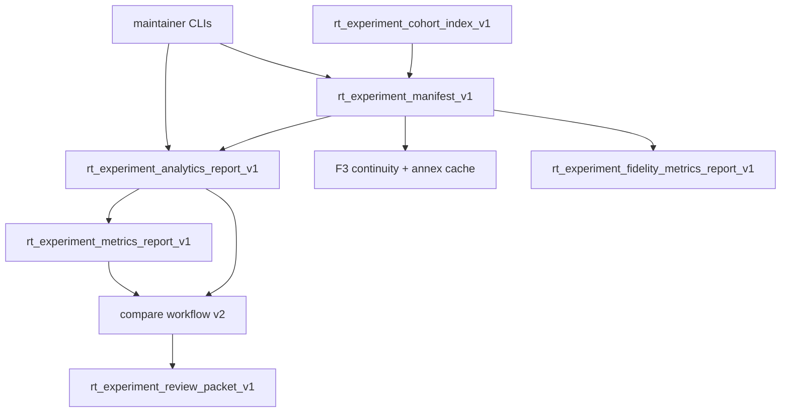

# RT-X2 — Architecture Review R1

**Phase:** PLAN-RT-X2 — experiment workbench v2 (docs only)  
**Plan:** [rt_x2_experiment_workbench_v2_plan.md](../platform/rt_x2_experiment_workbench_v2_plan.md)  
**Contracts:** [rt_experiment_workbench_v2_v1.md](rt_experiment_workbench_v2_v1.md), [rt_experiment_cohort_v1.md](rt_experiment_cohort_v1.md), [rt_experiment_unified_review_v1.md](rt_experiment_unified_review_v1.md), [rt_experiment_compare_workflow_v2_v1.md](rt_experiment_compare_workflow_v2_v1.md)  
**Freeze audit:** [rt_x2_freeze_audit.md](rt_x2_freeze_audit.md)

No runtime code was modified for this review.

---

## Executive summary

| Item | Verdict |
|------|---------|
| Layers on X1 + F1/F3/F5/F5b | **Pass** |
| No bridge protocol changes in PLAN | **Pass** |
| Cohort index references-only | **Pass** |
| `run_id` join scoped per manifest | **Pass** |
| Review packet ≠ SA import | **Pass** |
| `experiment/` surface modularized by intent | **Pass-with-conditions** |

**Recommendation:** Freeze **PLAN-RT-X2** (docs). Authorize **PLAT-RT-X2 P0** only via separate implementation wave after freeze.

---

## 1. Data flow review

| Finding ID | Verdict | Summary |
|------------|---------|---------|
| X2-ARCH-01 | Pass | Cohort index holds references only — no merged manifest authority |
| X2-ARCH-02 | Pass | Unified review reuses frozen derive outputs — no new bridge pull for pinned runs |
| X2-ARCH-03 | Pass | PLAN introduces no new HTTP routes or subcommands |
| X2-ARCH-04 | Pass | `multi_manifest_diff` compares metadata only |
| X2-ARCH-05 | Pass-with-conditions | PLAT must keep `App.tsx` integration thin per C2 debt when implementing P2 |

---

## 2. Join key discipline

| Join | Key | Verdict |
|------|-----|---------|
| Reports ↔ manifest runs | `run_id` within one manifest | Pass |
| Cross-manifest | `experiment_id` + `manifest_ref` metadata | Pass |
| Cohort ↔ manifests | Ordered `manifest_refs[]` | Pass |

**Risk (PLAT):** UI must not auto-pair runs with colliding `run_id` across manifests — enforce manifest scope in selectors.

---

## 3. Coexistence with frozen PLAT panels

| Panel | X2 relationship | Verdict |
|-------|-----------------|--------|
| X1 compare | Default `pairwise_pinned` | Pass |
| F5 extended/matrix | Hosted from compare stage | Pass |
| F3 continuity | Optional review step | Pass |
| F6/F7 handoff | Footer display only — no F8 queue in X2 | Pass |

---

## 4. Residual risks (PLAT backlog)

| ID | Risk | Mitigation in PLAT |
|----|------|-------------------|
| X2-ARCH-R1 | `experiment/` subtree growth | P2 refactor zones; avoid duplicate report docks |
| X2-ARCH-R2 | Large cohort import | Warn above 8 manifests (advisory cap) |
| X2-ARCH-R3 | Review packet mistaken for SA bundle | Banner + forbidden fields in schema |

---

## Recommended next

**PLAT-RT-X2 P0** per [rt_roadmap_plat_rt_x2_v1.md](rt_roadmap_plat_rt_x2_v1.md). **Alternate:** **PLAN-RT-F8** if maintainer advisory is binding constraint ([rt_roadmap_next_frontiers_v6.md](rt_roadmap_next_frontiers_v6.md)).
