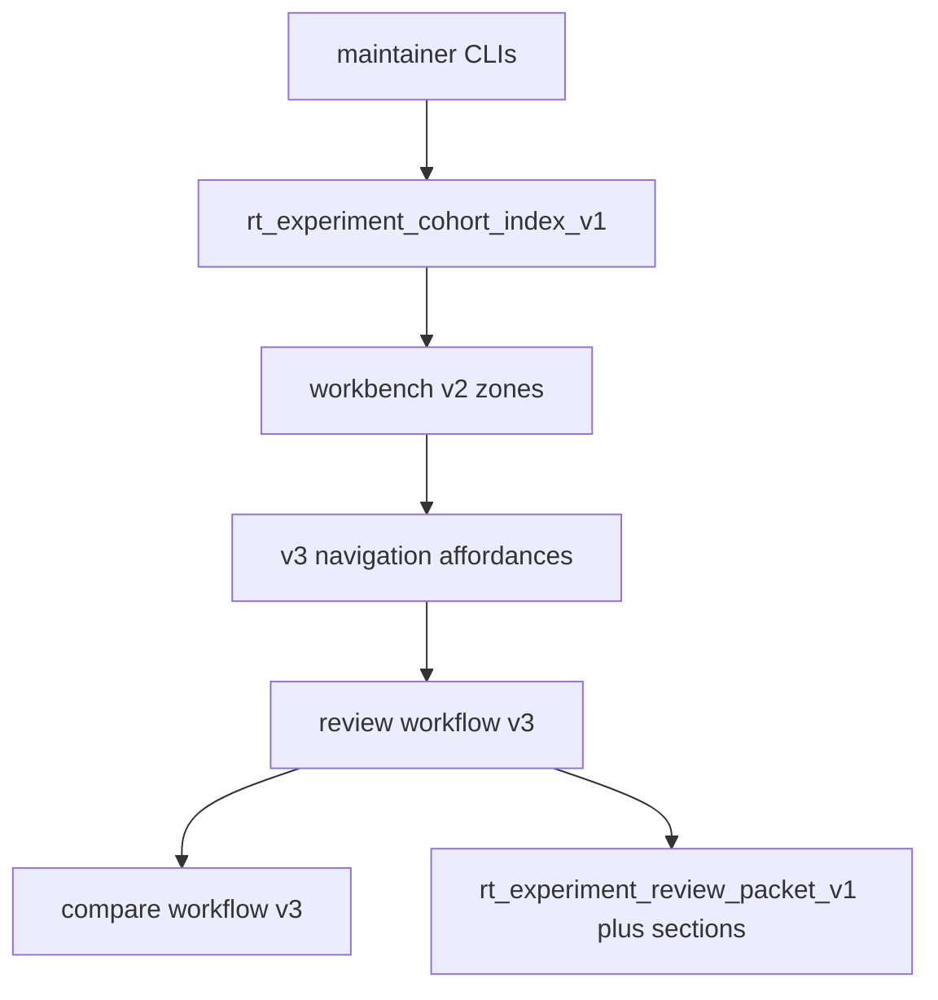

# RT-X3 — Architecture Review R1

**Phase:** PLAN-RT-X3 — experiment workbench v3 (docs only)  
**Plan:** [rt_x3_experiment_workbench_v3_plan.md](../platform/rt_x3_experiment_workbench_v3_plan.md)  
**Contracts:** [rt_experiment_workbench_v3_v1.md](rt_experiment_workbench_v3_v1.md), [rt_experiment_review_workflow_v3_v1.md](rt_experiment_review_workflow_v3_v1.md), [rt_experiment_compare_workflow_v3_v1.md](rt_experiment_compare_workflow_v3_v1.md)  
**Freeze audit:** [rt_x3_freeze_audit.md](rt_x3_freeze_audit.md)

No runtime code was modified for this review.

---

## Executive summary

| Item | Verdict |
|------|---------|
| Layers on X2 + C4 decomposition | **Pass** |
| No bridge protocol changes in PLAN | **Pass** |
| Cohort index schema unchanged | **Pass** |
| Packet `sections[]` additive on v1 schema id | **Pass-with-conditions** |
| Compare modes and join keys unchanged | **Pass** |
| `experiment/` concentration post-C4 | **Pass-with-conditions** |

**Recommendation:** Freeze **PLAN-RT-X3** (docs). Authorize **PLAT-RT-X3 P0** only via separate implementation wave after freeze.

---

## 1. Data flow review

| Finding ID | Verdict | Summary |
|------------|---------|---------|
| X3-ARCH-01 | Pass | v3 is presentation/navigation only — no new derive algorithms |
| X3-ARCH-02 | Pass | PLAN introduces no HTTP routes or subcommands |
| X3-ARCH-03 | Pass | Multi-manifest drill-down loads manifests separately — no merge authority |
| X3-ARCH-04 | Pass-with-conditions | PLAT P1 must extend `reviewPacketSchema` for optional `sections[]` without breaking strict export consumers |
| X3-ARCH-05 | Pass | C4 extractions (`ExperimentCompareSection`, `ExperimentF5MetricsSection`, toolbar) remain compatible with v3 coach/roster overlays |

---

## 2. Layer boundary assessment

| Layer | Status | X3 impact |
|-------|--------|-----------|
| Runtime / bridge | Stable | None |
| Replay / SA | Manual handoff only | None |
| Advisory | F6/F7 display refs in packet sections only | Adjacency at PLAT P1 |
| Experiment | Derived artifacts | UI ergonomics |
| Visualization | V4 display-only | Compare-status vocabulary may align with session compare chips |

---

## 3. Concentration assessment (post-C4)

| Surface | Observation |
|---------|-------------|
| `ExperimentWorkbenchPanel` | Reduced by C4 P1 sections; v3 PLAT should prefer new subcomponents over parent growth |
| `ExperimentCohortNavigator` | Primary target for P0 roster/breadcrumb |
| `ExperimentReportDockPanel` | Primary target for P1 dock grouping |
| `ExperimentCompareStagePanel` | Primary target for P2 mode coach |

**Condition X3-ARCH-C1:** PLAT phases should add files under `experiment/` rather than expanding `App.tsx`.

---

## Architecture verdict

**Pass — suitable for freeze (docs only).**
