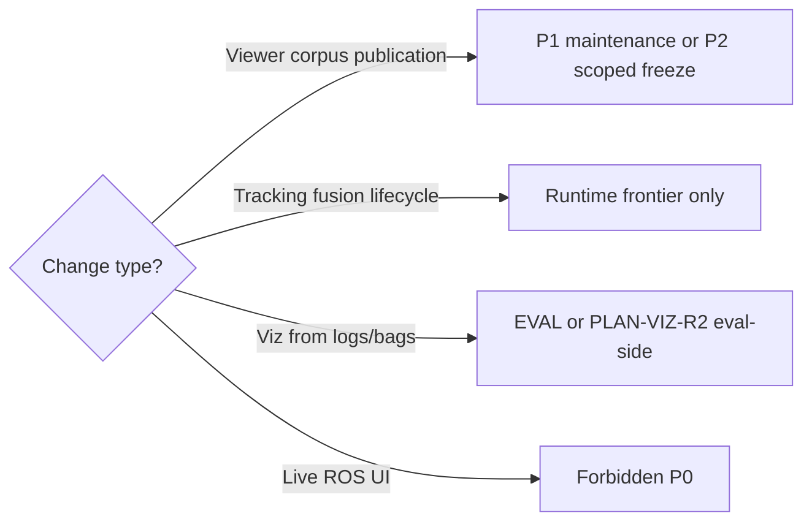

# SA Platform Frontier Review R1 (G1)

**Phase:** G1 — Platform Governance & Frontier Review  
**Checkpoint:** `75ea6d5`  
**Build recommendation:** no-build. **No implementation** authorized by this document.

**Companion:** [sa_platform_governance_review_r1.md](sa_platform_governance_review_r1.md), [sa_platform_maturity_assessment_r1.md](sa_platform_maturity_assessment_r1.md)

---

## 1. Purpose

Evaluate **candidate future directions** after PLAT-SA-F1a–F1d without opening a new implementation frontier. Each candidate receives:

- Architectural fit (1–5)
- Governance compatibility (pass / conditional / fail)
- Risk level (low / medium / high)
- Maintenance cost (low / medium / high)
- Replay-first alignment (1–5)
- Recommended priority (P0–P3; P0 = defer/not now)
- Explicit cautions

**Priority legend:**

| Priority | Meaning |
|----------|---------|
| P0 | Do not pursue now; stabilize or forbidden |
| P1 | Next acceptable **planning-only** or **narrow maintenance** candidate |
| P2 | Medium-term; requires scoped freeze wave |
| P3 | Long-term or runtime-frontier only |

---

## 2. Frontier candidate matrix

### Platform frontier candidates

| Candidate | Fit | Gov | Risk | Maint | Replay | Pri | Cautions |
|-----------|-----|-----|------|-------|--------|-----|----------|
| **Platform maintenance / hygiene** | 5 | Pass | Low | Med | 5 | **P1** | Regen order mandatory; no feature smuggling |
| **`corpus_ref` backfill on manifests** | 5 | Pass | Low | Low | 5 | **P1** | Info drift only; no schema breaking |
| **Second corpus release `r2`** | 5 | Pass | Low | Med | 5 | **P1** | Use `--parent-release`; exercises F1d multi-release |
| **Multi-corpus federation** | 4 | Conditional | Med | High | 5 | P2 | Needs index schema wave, registry IDs, orphan policy; not ad hoc folders |
| **Richer static publication HTML** | 4 | Pass | Med | Med | 5 | P2 | Stay offline; no CDN authority; lint banners |
| **Corpus scaling (more sweeps/entries)** | 4 | Pass | Med | High | 5 | P2 | CI time, regen chain, index size — policy first |
| **PLAN-VIZ-R2 (bag overlays, paired figures, Plotly opt-in)** | 3 | Conditional | Med | Med | 4 | P2 | Forbidden: live ROS, unified battle state; bag ≠ authority |
| **Reviewer cognition research (panels, taxonomy UX)** | 3 | Conditional | Med | High | 4 | P2 | Easy to slip into scoring/ranking language |
| **Static figure/report pipeline automation** | 4 | Pass | Low | Med | 5 | P2 | Extend existing `gen_presentation_assets.py` patterns |
| **Automated release promotion workflow** | 3 | Conditional | Med | High | 5 | P2 | Must not auto-publish to live URLs; maintainer gate |
| **F2 “corpus operations v2” (unspecified)** | 2 | Conditional | High | High | 4 | P0 | Do not open without G1-approved scope doc |
| **Live SA dashboard** | 1 | **Fail** | High | High | 1 | P0 | Violates replay-only + WebSocket ban |
| **Collaborative realtime review** | 1 | **Fail** | High | High | 1 | P0 | Infrastructure + authority creep |
| **ML tactical recommendation from replay** | 1 | **Fail** | High | High | 1 | P0 | Explicit non-goal |
| **HITL / operator workflows** | 1 | **Fail** | High | High | 1 | P0 | Explicit non-goal |
| **Readiness / robustness scoring UX** | 1 | **Fail** | High | Med | 2 | P0 | Forbidden semantics |
| **Parser/topic changes for “better replay”** | 1 | **Fail** | High | High | 3 | P0 | Breaks historical comparability |

### Runtime research frontier candidates (separate track)

| Candidate | Fit | Gov | Risk | Maint | Replay | Pri | Cautions |
|-----------|-----|-----|------|-------|--------|-----|----------|
| **Runtime realism deepening (Wave 8+)** | 4 | Conditional | Med | High | 4 | P2 | Default-off; parser-safe; no platform PR merge |
| **Lifecycle threshold activation** | 4 | Conditional | High | High | 4 | P2 | Dormant counters ≠ robustness proof |
| **Topology experimentation (runtime)** | 3 | Conditional | Med | Med | 4 | P2 | Keep on `/tracks/state` path; no tracker redesign |
| **Propagation quality refinement** | 4 | Pass | Med | Med | 4 | P2 | Wave 2 succeeded; narrow scope |

**Rule:** Runtime candidates must **never** be bundled with platform viewer/corpus PRs.

### Cross-cutting / meta candidates

| Candidate | Fit | Gov | Risk | Maint | Replay | Pri | Cautions |
|-----------|-----|-----|------|-------|--------|-----|----------|
| **G1 governance review (this doc set)** | 5 | Pass | Low | Low | 5 | Done | Repeat after next major checkpoint |
| **Freeze registry hygiene** | 5 | Pass | Low | Low | 5 | **P1** | One row per freeze; no narrative duplication |
| **Reviewer guide caveat centralization** | 5 | Pass | Low | Low | 5 | **P1** | Documentation only |
| **Regen orchestrator ergonomics** | 4 | Pass | Low | Med | 5 | P2 | CLI flags/dry-run UX — not viewer regen |
| **Machine-readable freeze manifest** | 3 | Conditional | Med | Med | 5 | P3 | META-GOV noted premature for R1 |

---

## 3. Detailed candidate notes

### P1 — Recommended near-term (maintenance / planning)

#### Platform maintenance / hygiene

- **Architectural fit:** Extends STAB + F1 without new semantics.
- **Governance:** Fully compatible.
- **Actions:** Audit fixes, regen, quickstart URLs, optional `r2` snapshot, `corpus_ref` backfill.
- **Caution:** Do not label hygiene PRs as “F2 feature wave.”

#### `corpus_ref` backfill

- Clears info-level `corpus_ref_missing` / `unindexed_file` drift in audits.
- Additive optional field already in F1a producers.
- **Caution:** Backfill is regen-heavy; batch via `gen_f1_corpus_fixtures.py`.

#### Second release snapshot (`sa_r0_corpus_r1_r2`)

- Validates multi-release browser and evolution chronology with real data.
- **Caution:** Doubles snapshot storage; document parent chain.

---

### P2 — Medium-term (require new scoped freeze)

#### Multi-corpus federation

- **Fit:** Natural extension of F1 index; deferred explicitly in F1a audit.
- **Requirements:** Corpus ID registry, index partitioning, release naming convention, cross-corpus diff rules.
- **Risks:** Orphan entries, confused lineage vs linkage, maintainer cognitive load.
- **Replay-first:** High if corpora remain offline fixtures.
- **Caution:** Do not implement as multiple unindexed directories.

#### PLAN-VIZ-R2

- Plan exists: [replay_static_visualization_r2_plan.md](replay_static_visualization_r2_plan.md).
- **Allowed:** evaluation-side Python, opt-in Plotly HTML, bag trajectory with banners.
- **Forbidden:** live dashboards, unified replay battle state, CI certification via viz.
- **Caution:** Bag overlays must be labeled non-authoritative; do not mutate Comprehension R1 profile in place.

#### Richer publication workflows

- Static HTML packets, cross-release comparison pages, print CSS — all offline.
- **Caution:** HTML must pass `governance_lint_sa.py`; no “approved for engagement” copy.

#### Corpus scaling

- More sweeps, larger MC grids, more index entries.
- **Prerequisite:** CI time budget doc, pagination design for corpus browser >200 entries.
- **Caution:** Regen chain runtime grows; consider split corpora vs monolith.

#### Reviewer cognition research

- UX experiments: panel layout, chronology defaults, pattern taxonomy presentation.
- **Governance:** Conditional — requires freeze audit and lint on all new copy.
- **Caution:** Avoid winner/loser annotations in compare views; no composite scores.
- **Planning:** Addressed at architecture level by [h1_sandbox_ux_architecture_plan.md](../platform/h1_sandbox_ux_architecture_plan.md) (PLAN-SA-H1, docs frozen); implementation deferred to PLAT-SA-H2.

---

### P0 — Defer or forbidden

| Candidate | Reason |
|-----------|--------|
| Live SA dashboard | AGENTS.md forbidden |
| WebSocket / rosbridge eval | Forbidden |
| HITL / operator semantics | Forbidden |
| ML recommendation | Forbidden |
| Readiness scoring | Forbidden |
| Parser/topic change | Frozen boundary |
| F2 vague expansion | Scope creep without plan |
| Unified replay battle state | PLAN-VIZ-R2 explicit forbidden |

---

## 4. Runtime vs platform decision matrix

---

## 5. Recommended sequencing (planning only)

If the project resumes implementation after stabilization:

1. **Maintenance window** — `corpus_ref` backfill, `r2` snapshot, registry/doc links (no new panels).
2. **Choose one planning wave** (docs + scope only, not combined implementation):
   - **Option A:** Multi-corpus federation plan (F2a)
   - **Option B:** PLAN-VIZ-R2 scope refinement + freeze audit prep
   - **Option C:** Publication HTML enhancement plan (static only)
3. **Runtime research** — parallel track, separate branch, realism README alignment.

**Do not sequence:** VIZ-R2 + multi-corpus + viewer cognition in one wave.

---

## 6. Frontier review verdict

| Question | Answer |
|----------|--------|
| Safe to expand platform features now? | **No** — stabilize first |
| Safest next work? | P1 maintenance + optional `r2` |
| Highest-value P2? | Multi-corpus **planning** OR VIZ-R2 **if** viz debt blocks reviewers |
| Highest danger? | Live ops UI, ML recommenders, parser changes |
| Runtime default? | Continue only via explicit realism waves |

This matrix is the authoritative G1 frontier assessment until superseded by a scoped plan approved under freeze-before-expansion discipline.
