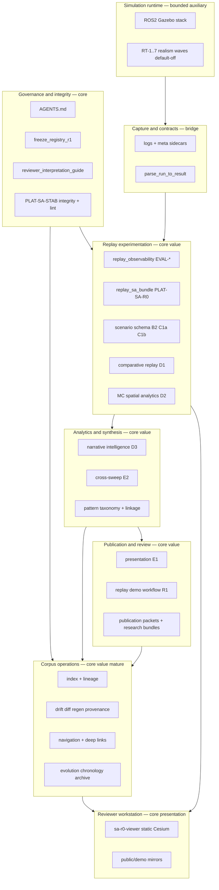

# SA Platform Governance Review R1 (G1)

**Phase:** G1 — Platform Governance & Frontier Review  
**Checkpoint:** `75ea6d5` — Freeze PLAT-SA-F1a–F1d corpus operations checkpoint  
**Build recommendation:** **no-build**. Documentation and consolidation only. Does not authorize runtime, parser, topic, viewer feature, or corpus capability changes.

**Authority:** [AGENTS.md](../../AGENTS.md) remains primary governance. This review indexes and assesses frozen state; it does not replace freeze audits or parser contracts.

**Companion deliverables:**

- [sa_platform_maturity_assessment_r1.md](sa_platform_maturity_assessment_r1.md) — coherence, determinism, debt, sustainability
- [sa_platform_frontier_review_r1.md](sa_platform_frontier_review_r1.md) — candidate frontier matrix and priorities
- [h1_sandbox_ux_architecture_plan.md](../platform/h1_sandbox_ux_architecture_plan.md) — PLAN-SA-H1 sandbox UX architecture (plan-only; post-G1)

---

## 1. Platform identity review

### What the platform is now

After evolution from early replay observability (EVAL-*) through SA-R0 → F1d, the repository’s **primary project value** is no longer “a Gazebo stack with evaluation scripts.” It is a **governance-aware, deterministic, offline replay experimentation and corpus-operations platform** riding on a **bounded** ROS 2 / Gazebo simulation substrate.

| Identity pillar | Meaning in practice |
|-----------------|-------------------|
| Governance-aware | Freeze registry, scoped audits, interpretation guide, SA integrity gate, governance lint |
| Replay-first | All platform UX and artifacts consume recorded or synthetic replay bundles, not live topics |
| Deterministic | Scripted regen, `--check` modes, corpus reproducibility verify, matched-seed discipline |
| Explanatory-only | Narratives, linkage, evolution rollups, drift badges — never operational authority |
| Parser-safe | Platform waves do not rename or subsume `parse_run_to_result` contracts |
| Additive-only | Optional fields, mirrors, new artifact types; compatibility paths preserved |

The simulation runtime remains **necessary but subordinate**: it produces evidence; the platform **curates, compares, synthesizes, and publishes** that evidence for reviewers and researchers.

### Layer map (consolidated)

### Core vs auxiliary layers

| Layer | Role | Core vs auxiliary | Primary value contribution |
|-------|------|-------------------|---------------------------|
| Governance / integrity | Boundaries, freeze index, lint, CI gates | **Core** | Prevents authority creep and documents what is frozen |
| Replay experimentation | Bundles, scenarios, compare, MC sweeps | **Core** | Primary reviewer and researcher interaction surface |
| Analytics / synthesis | Narratives, patterns, linkage, cross-sweep | **Core** | Turns many runs into reviewable knowledge |
| Publication / review | Presentation, demo workflow, HTML/MD exports | **Core** | Mentor/demo and publication-grade static output |
| Corpus operations | Index, lineage, drift, releases, evolution | **Core** (newly mature) | Long-horizon maintainability and reproducible corpora |
| Reviewer workstation (viewer) | Static Cesium + panels; mirrors fixtures | **Core presentation** | Cognition UX; must stay decoupled from runtime |
| Evaluation tooling (pre-SA) | Observability, static viz, narrative tooling | **Core foundation** | Feeds SA platform; frozen independently |
| Capture / parser contracts | Stable aggregate statistics | **Core bridge** | Separates runtime from derived interpretation |
| Simulation runtime | Gazebo, tracking path, realism overlays | **Auxiliary substrate** | Evidence generation only; not the product identity |
| Runtime research frontier | Lifecycle threshold refinement | **Separate frontier** | Must not merge with platform waves |

**Primary project value today:** the **replay experimentation + analytics/synthesis + publication + corpus operations** stack (PLAT-SA-R0 through F1d, on EVAL-* foundations), governed by **integrity and interpretation layers**.

### How layers relate

1. **Runtime → capture:** Runs produce logs and `.meta.json`; parser summaries are the stable statistical contract.
2. **Capture → replay:** Bundles and sweeps package replay evidence for offline consumption; no live ROS in eval tooling.
3. **Replay → analytics:** Derived JSON/MD (narratives, linkage, synthesis) classifies and connects evidence — not authority.
4. **Analytics → publication:** Static HTML/MD, storyboards, research bundles — export for humans, not operational systems.
5. **Publication + analytics → corpus:** F1 index ingests fixture tree; lineage DAG records derivation; releases snapshot state.
6. **Corpus → UX:** Viewer mirrors read-only; regen stays CLI-side per maintainer checklist.
7. **Governance wraps all:** Every layer is subject to freeze audits, integrity checks, and non-operational wording rules.

**Runtime/UI separation:** The viewer never executes regen, never subscribes to ROS, and never promotes mirrors to authority. Three-tier sync (source → `public/demo` → research bundle) is structural separation with scripted dual-write.

---

## 2. Governance boundary review (re-affirmed)

G1 **re-documents** boundaries; it does **not** widen or narrow them. Source of truth: [AGENTS.md](../../AGENTS.md), per-wave freeze audits, [reviewer_interpretation_guide.md](reviewer_interpretation_guide.md).

### Fixed postures (must remain)

| Boundary | Requirement |
|----------|-------------|
| Replay-only | Platform artifacts from logs, bundles, fixtures — no live battle management |
| Explanatory-only | Labels, badges, evolution narratives, drift — not tactical truth or readiness |
| Additive-only | New optional blocks, new artifact types; no parser renames or topic changes |
| Offline / static-first | HTML/PNG/JSON committed or generated offline; Plotly/server only if explicitly scoped and opt-in |
| Mirrors ≠ authority | `fixtures/sa_r0/`, viewer `public/demo/`, research bundles are derived convenience |
| No runtime/UI coupling | Viewer changes do not change tracking, fusion, or launch graphs |
| No WebSocket / rosbridge in eval | Legacy `web/` pages not extended; SA viewer is static file + fetch |
| Dual frontiers | Platform and runtime research never merged in one implementation wave |

### Forbidden expansion directions

- Live operational dashboards, C2, or battle management
- Realtime collaborative review (shared cursors, live annotation sync)
- HITL authority semantics, operator workflows, engagement approval UX
- Readiness scoring, certification, robustness rankings, composite “health” scores
- ML tactical recommendation, prediction, or autonomous engagement suggestions
- Parser-contract changes, topic/schema changes, tracker/fusion/MHT redesign
- PX4, MAVLink, hardware bringup, HITL simulation semantics
- CDN-hosted “live corpus” that blurs fixture authority with deployment state
- CI that treats visualization or lint `ok` as pass/fail certification of system safety

### Acceptable future directions (planning only; see frontier doc)

- Documentation and governance index maintenance (this G1 review)
- Maintainer-only corpus regen hardening, optional `corpus_ref` backfill
- Additional **frozen** release snapshots (`r2`) via existing scripts
- PLAN-VIZ-R2 **if** scoped as evaluation-side, opt-in, static export
- Runtime realism waves **only** on runtime frontier, default-off, parser-safe
- Static figure/report pipeline refinements with same governance banners

### Frontier types that would violate posture

| Frontier type | Violation |
|---------------|-----------|
| Live SA dashboard | Breaks replay-only, risks authority collapse |
| WebSocket viewer | Breaks static-first and eval/rosbridge ban |
| “Engagement recommender” from replay patterns | ML + operational semantics |
| Corpus-driven auto-tuning of tracker thresholds | Runtime coupling via derived artifacts |
| Multi-user realtime review room | Collaborative realtime infrastructure |
| Unified replay battle state merging bag + live + narrative | Authority merge called out forbidden in PLAN-VIZ-R2 |

---

## 3. Freeze and consolidation recommendations

### Remain frozen (high confidence)

| Subsystem | IDs | Rationale |
|-----------|-----|-----------|
| Parser and topic contracts | GOV-0 boundaries | Any change breaks MC matrices and historical comparability |
| Pre-SA evaluation freezes | EVAL-RO, EVAL-RI, EVAL-RN-*, EVAL-VIZ-* | Stable inputs to SA platform; rework is high churn |
| SA platform stack | PLAT-SA-R0 … F1d | Checkpoint `75ea6d5`; 22+ integrity checks green |
| STAB integrity model | PLAT-SA-STAB | Regen order and audit mapping are now operational doctrine |
| Demo workflow docs | EVAL-DEMO-R1 | Mentor path depends on frozen copy |
| PLAN-SA-R1 | docs-only boundaries | Prevents live SA scope creep |
| Freeze registry + meta-gov | META-GOV-R1, registry | Index discipline pays off; keep updating rows only |

### Partial stabilization (maintain, allow hygiene only)

| Area | Posture |
|------|---------|
| F1 corpus fixtures | Maintenance mode: regen via orchestrators, no new corpus features until next scoped wave |
| Viewer panels | Bugfix and copy/lint only; no new cognition modes without freeze audit |
| Maintainer docs | Continue quickstart/checklist updates; no feature creep |
| PNG / binary assets | Regen on demand; byte parity not CI-gated (documented limitation) |

### Highest expansion risk (if discipline slips)

1. **Viewer feature creep** — panels become scoring, ranking, or “recommended action” surfaces  
2. **Corpus scale without federation design** — single `sa_r0_corpus_r1` index at 57 entries is manageable; unplanned multi-corpus without registry discipline will sprawl  
3. **Regen complexity** — ordered 10+ step regen is correct but fragile for new contributors  
4. **Linkage vs lineage conflation** — similarity edges mistaken for derivation authority  
5. **Evolution narratives** — rule-based rollups read as causal lifecycle management  
6. **PLAN-VIZ-R2** — bag overlays and Plotly opt-in can imply continuous authority if banners slip  

### Governance hardening sufficient today

- Freeze registry with PLAT-SA-R0–F1d rows
- `audit_sa_platform_integrity.py --all` + `tier0-sa-r0`
- `governance_lint_sa.py` on fixture copy
- F1 reproducibility and release verify scripts
- Reviewer interpretation guide + demo workflow

### Additional stabilization still warranted (no new features)

- Optional index backfill for meta-corpus JSON (`unindexed_file` info drift)
- Second release snapshot (`r2`) when index revision changes — exercises F1d multi-release path
- Centralize repeated caveat blocks via links to reviewer guide (documentation debt)
- Document corpus entry budget / CI time policy before scaling sweep count

---

## 4. Future roadmap posture (planning assessment)

### Short-term safe directions (0–3 months, planning or maintenance)

- **Platform maintenance mode:** regen, audit fixes, doc links, `corpus_ref` backfill
- **G1-style governance reviews** after major checkpoint merges
- **Release `r2` snapshot** using existing `build_replay_corpus_release.py --parent-release`
- **Demo/reviewer doc polish** — URLs, storyboard parity (post-STAB pattern)
- **Runtime research** — narrow default-off realism only on runtime frontier

### Medium-term directions (acceptable with scoped freeze; higher coordination)

- Multi-corpus registry IDs (explicit schema wave, not ad hoc folders)
- Richer static publication HTML (still offline, no CDN authority)
- PLAN-VIZ-R2 implementation wave (evaluation-side only)
- Topology/scenario library expansion under C1a/B2 patterns
- Corpus scaling to additional sweep families with regen orchestrator updates

### High-risk / non-aligned directions (should not become)

| Direction | Why dangerous |
|-----------|---------------|
| Live battle management / C2 | Operational semantics; defeats replay-only |
| Realtime multi-reviewer infrastructure | WebSocket + authority collapse |
| Engagement recommender / ML tactics | Forbidden autonomy + operational read |
| Tracker redesign “informed by” corpus dashboards | Derived → runtime coupling |
| Hardware / PX4 / HITL integration | Explicit non-goals in AGENTS.md |
| Parser-visible “readiness” or “certified” fields | Governance violation |
| Continuous deployment of viewer as operational UI | Blurs fixture mirror with live state |

### Explicit “should not become” statements

The platform **should not become**:

1. An operator console or HITL approval system  
2. A live situational-awareness product tied to ROS bridges  
3. A robustness certification or readiness scoring engine  
4. A collaborative realtime lab notebook with authoritative annotations  
5. A monolithic “digital twin” whose viewer state overrides parser contracts  
6. A corpus-driven autopilot for changing runtime tracking without a runtime freeze wave  

---

## 5. Risks and sustainability (summary)

| Risk | Severity | Mitigation already in place |
|------|----------|----------------------------|
| Derived artifacts read as authority | High | Layer map, reviewer guide, lint, freeze audits |
| Regen drift / contributor confusion | Medium | Maintainer checklist, `run_replay_corpus_regen.py`, integrity checks |
| Documentation duplication | Medium | Registry + link-don’t-copy discipline |
| Corpus fixture growth / CI time | Medium | tier0-sa-r0 scoped gate; PNG not byte-gated every run |
| Viewer cognition creep | Medium | Frozen panels; governance checks on copy |
| Dual-frontier merge in one PR | High | AGENTS.md explicit separation |
| Single-corpus assumption | Low now | Document before multi-corpus |

Sustainability verdict: **maintainable** with disciplined maintenance mode. Expansion is sustainable only in **narrow frozen waves**; unfrozen feature accretion would outpace regen and interpretation governance.

---

## 6. Recommended next-step decision posture

| Question | G1 recommendation |
|----------|-------------------|
| Start new platform frontier immediately? | **No** — hold until explicit scope approval after this review |
| Continue platform expansion? | **Defer** — prefer **stabilization + maintenance** for 1–2 cycles |
| Runtime research? | **Separate track only** — do not bundle with platform PRs |
| Architecture freeze? | **Partial** — freeze PLAT-SA-R0–F1d features; allow maintenance/hygiene/docs |
| Next gated activity | Optional: **F2 planning wave** (multi-corpus OR publication refinement) as docs-only; OR **PLAN-VIZ-R2** scoping; NOT both in one wave |

**Decision posture for maintainers:** Treat checkpoint `75ea6d5` as a **platform maturity plateau**. Default actions: run pre-merge gate, regen on audit failure, update registry row when a *new* freeze closes. Default non-actions: viewer features, parser changes, live integrations, operational language.

---

## 7. Validation of this review

This review is documentation-only. Validation:

- No contradictions with [freeze_registry_r1.md](freeze_registry_r1.md) PLAT-SA rows
- Aligns with [sa_platform_release_checkpoint.md](sa_platform_release_checkpoint.md) F1 gate
- Does not authorize implementation
- Cross-check: [meta_governance_maturity_review_r1.md](meta_governance_maturity_review_r1.md) structural risks still apply; G1 adds post-F1 corpus-specific risks

**Verdict:** G1 review complete — **consolidate and stabilize** before the next platform implementation frontier.
