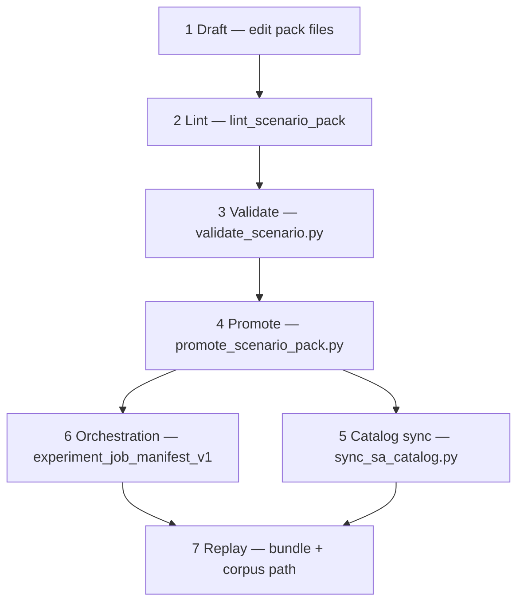

# Scenario Authoring Workflow (v1)

**Phase:** PLAN-SA-A1 — authoring workstation foundations  
**Authority:** [AGENTS.md](../../AGENTS.md); [scenario_schema_v1.md](scenario_schema_v1.md)

Maintainer-facing workflow for `scenario_topology_v1` packs: **draft → lint → validate → promote → optional orchestration → replay bundle**. CLI is authoritative; the SA sandbox viewer observes read-only mirrors.

**Core rule:** *Viewer observes; CLI promotes.*

---

## Workflow ladder



| Stage | Authority | Command / artifact | Output |
|-------|-----------|-------------------|--------|
| **1. Draft** | Maintainer | Edit `fixtures/scenarios/<pack_id>/` | `metadata.json`, `topology.json`, `overlays.json`, `annotations.json`, optional `terrain.json` |
| **2. Lint** | CLI | `python3 scripts/evaluation/validate_scenario.py <pack_dir>` | Exit 0; issues/warnings JSON with `--json` |
| **3. Validate** | CLI | Same command; records snapshot | `experiment_validation_mirror_v1`; updates `validation_snapshot_ref` in manifest (PLAT-SA-A1) |
| **4. Promote** | CLI | `promote_scenario_pack.py` (PLAT-SA-A1) | `authoring_manifest.json` with `promotion_status >= promoted` |
| **5. Catalog sync** | CLI | `sync_sa_catalog.py` | `fixtures/scenarios/index.json`, `platform/sa-r0-viewer/public/demo/catalog.json` |
| **6. Orchestration** | CLI | `lint_experiment_manifest.py`, `run_experiment_queue.py` | Queue + validation mirrors under `fixtures/orchestration/` |
| **7. Replay bundle** | CLI | Per [experiment_workflow_scenario_to_replay_v1.md](experiment_workflow_scenario_to_replay_v1.md) | `replay_sa_bundle_v1`, corpus index updates |

---

## Stage details

### 1. Draft

- Create or fork pack under `fixtures/scenarios/<pack_id>/`.
- For variants, set `metadata.provenance.baseline_pack_id` (C1b) and plan `parent_pack_id` in authoring manifest (A1).
- Optional: create `authoring_manifest.json` with `promotion_status: draft` and `authoring_notes`.
- **Forbidden:** committing prohibited keys (`los_segments`, `engage`, `readiness_score`, etc.) per [scenario_schema_v1.md](scenario_schema_v1.md).

### 2. Lint

```bash
python3 scripts/evaluation/validate_scenario.py fixtures/scenarios/<pack_id>
python3 scripts/evaluation/validate_scenario.py --json fixtures/scenarios/<pack_id>
python3 scripts/evaluation/validate_scenario.py --strict fixtures/scenarios/<pack_id>
```

- Uses `lint_scenario_pack()` in `scripts/evaluation/replay_sa_scenario.py`.
- On success with manifest present: may set `promotion_status: linted` via promote helper (PLAT-SA-A1).

### 3. Validate

- Requires lint pass (`ok: true`).
- Writes or updates `experiment_validation_mirror_v1` at path recorded in `validation_snapshot_ref`.
- Records `validation_pack_fingerprint` (SHA-256 of canonical pack files — PLAT-SA-A1).
- Sets `promotion_status: validated`.

### 4. Promote

```bash
# PLAT-SA-A1 (documented; not yet implemented until implementation wave)
python3 scripts/evaluation/promote_scenario_pack.py fixtures/scenarios/<pack_id> \
  --status promoted --notes "ready for catalog"
```

- Appends `promotion_lineage` event.
- Does **not** run simulation or modify topology files.
- Idempotent: re-run with same status is no-op unless `--force`.

**Promotion means:** fixture pack is catalog-eligible and orchestration-referenceable.

**Promotion does not mean:** corpus release, live URL publish, Gazebo readiness, or effectiveness scoring.

### 5. Catalog sync (policy)

```bash
python3 scripts/evaluation/sync_sa_catalog.py
```

- **Policy (PLAT-SA-A1):** catalog entries for new packs SHOULD be added only when `promotion_status >= promoted` (enforce in script).
- Existing catalog entries grandfathered until manifest backfill.
- Three-tier sync unchanged: source packs → `public/demo/` → research bundles.

### 6. Orchestration manifest (optional)

```bash
python3 scripts/evaluation/lint_experiment_manifest.py fixtures/orchestration/manifests/
python3 scripts/evaluation/run_experiment_queue.py \
  --manifest fixtures/orchestration/manifests/<manifest>.json --dry-run
```

- Jobs reference `scenario_pack_id` matching `pack_id`.
- **Readiness (PLAT-SA-A1):** lint SHOULD warn if `promotion_status < promoted` or validation stale.
- First pipeline step remains `validate_scenario` per [experiment_job_manifest_v1.md](experiment_job_manifest_v1.md).
- Runtime capture requires `--allow-runtime-capture` on runner.

### 7. Replay bundle

Follow [experiment_workflow_scenario_to_replay_v1.md](experiment_workflow_scenario_to_replay_v1.md):

- Synthetic path: validation → synthetic regen → bundle → catalog (no Gazebo in default CI).
- Capture path: maintainer-only with explicit flag.

---

## Stale validation policy

When any canonical pack file changes after `validation_pack_fingerprint` was recorded:

1. Set `promotion_status` to `linted` (if lint still passes) or `draft` (if not re-linted).
2. Clear or mark `validation_snapshot_ref` as stale in viewer copy.
3. Require re-run of **Validate** before **Promote**.

Canonical files: `metadata.json`, `topology.json`, `overlays.json`, `annotations.json`, `terrain.json` if present.

Deterministic check (PLAT-SA-A1): `promote_scenario_pack.py --check-stale`.

---

## Dry-run and idempotency

| Command | Dry-run flag |
|---------|--------------|
| `run_experiment_queue.py` | `--dry-run` |
| `promote_scenario_pack.py` | `--dry-run` (PLAT-SA-A1) |
| `sync_sa_catalog.py` | preview via integrity audit before commit |

Promotion and catalog sync SHOULD be repeatable without duplicate lineage events (`event_id` deduplication).

---

## Viewer role (read-only)

The viewer MUST NOT:

- Edit topology JSON or manifest
- Call `promote_scenario_pack.py`, `sync_sa_catalog.py`, or `run_experiment_queue.py`
- Launch Gazebo or `run_capture.py`
- Change `promotion_status`

The viewer MAY:

- Display `authoring_manifest.json` mirrors under `public/demo/` (PLAT-SA-A1 sync)
- Show validation mirror `ok` / `issues` / `warnings`
- Link to orchestration manifest and queue mirror ids
- Navigate to replay bundle when catalog entry exists

---

## Validation / promotion lifecycle summary

| `promotion_status` | Maintainer action required |
|--------------------|----------------------------|
| `draft` | Lint + validate |
| `linted` | Validate |
| `validated` | Promote |
| `promoted` | Catalog sync; optional orchestration |
| `orchestration_ready` | Run queue (CLI); inspect mirrors in viewer |

---

## Related

- [scenario_authoring_manifest_v1.md](scenario_authoring_manifest_v1.md)
- [scenario_lineage_provenance_v1.md](scenario_lineage_provenance_v1.md)
- [authoring_workflow_continuity_v1.md](authoring_workflow_continuity_v1.md)
- [sa_c1b_scenario_authoring_refinement_plan.md](sa_c1b_scenario_authoring_refinement_plan.md)

*End of scenario authoring workflow v1.*
