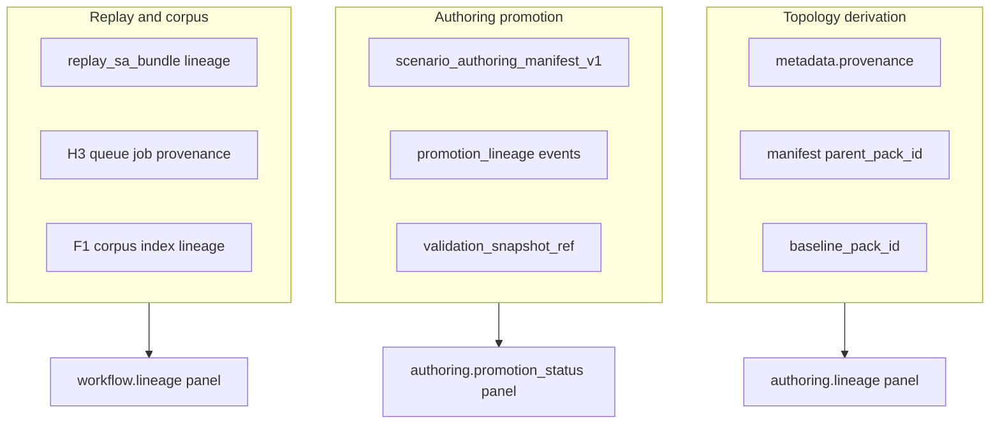

# Scenario Lineage and Provenance (v1)

**Phase:** PLAN-SA-A1 — authoring workstation foundations  
**Authority:** [AGENTS.md](../../AGENTS.md); [reviewer_interpretation_guide.md](reviewer_interpretation_guide.md)

Rules for **explanatory** lineage across scenario packs, authoring promotion, and replay/corpus artifacts. Lineage informs maintainer and reviewer cognition; it is **not** operational authority.

**Governance:** mirrors ≠ authority; explanatory evidence ≠ authoritative state.

---

## 1. Three lineage planes

Do not merge these planes in UI copy, lint messages, or documentation.



| Plane | Authority | Primary identifiers | Typical sources |
|-------|-----------|---------------------|-----------------|
| **Topology derivation** | `scenario_topology_v1` metadata + manifest | `baseline_pack_id`, `parent_pack_id`, `topology_variant_class` | Human/tool edits under `fixtures/scenarios/` |
| **Authoring promotion** | `scenario_authoring_manifest_v1` | `promotion_status`, `promotion_lineage[]`, `validation_snapshot_ref` | CLI `promote_scenario_pack.py`, `validate_scenario.py` |
| **Replay / corpus** | F1 index, bundle packager, H3 runner | `corpus_entry_id`, `run_id`, `log_path`, `bundle_path` | `replay_sa_bundle.py`, `run_experiment_queue.py`, corpus regen |

---

## 2. Topology derivation plane

### Sources

- `metadata.provenance.baseline_pack_id` — canonical baseline for compare/sweep cognition (PLAT-SA-C1b).
- `metadata.provenance.fixture_source` — repo path disclaimer.
- `authoring_manifest.parent_pack_id` — immediate authoring parent (PLAN-SA-A1).

### Rules

1. **Derivation is explanatory** — does not imply operational effectiveness or deployment readiness.
2. **Directed acyclic graph preferred** — `parent_pack_id` chains must not cycle; lint error at PLAT-SA-A1.
3. **Baseline vs parent** — baseline may be an ancestor not equal to parent (see [scenario_authoring_manifest_v1.md](scenario_authoring_manifest_v1.md)).
4. **Linkage ≠ derivation** — D1 compare `comparison_hints` express similarity for review; they do not replace derivation records ([comparison_foundations.md](comparison_foundations.md)).

### Example chain (fixtures)

```
valley_ingress (baseline)
  └── valley_ingress_radar_shifted_north (parent_pack_id: valley_ingress)
  └── valley_ingress_extra_valley_sensor (parent_pack_id: valley_ingress)
```

---

## 3. Authoring promotion plane

### Sources

- `fixtures/scenarios/<pack_id>/authoring_manifest.json`
- `fixtures/orchestration/validation_mirrors/*_validation_mirror.json`
- Optional `experiment_validation_mirror_v1` inline snapshots

### Rules

1. **CLI writes; viewer reads** — promotion events recorded only by maintainer scripts.
2. **Stale validation** — when pack fingerprint disagrees with `validation_pack_fingerprint`, downgrade `promotion_status` and surface “stale validation” in viewer (not “invalid pack”).
3. **Validation mirror linkage** — `validation_snapshot_ref` points to frozen mirror; mirror `ok: false` does not delete pack files.
4. **Orphan packs** — manifest exists but no `catalog.json` entry → label **not catalog-synced**, not **corrupt**.

### Promotion lineage events

Append-only list in manifest. Each event records `from_status`, `to_status`, `actor`, optional `notes`. Used for audit trail only.

---

## 4. Replay / corpus plane

### Sources

- Bundle `lineage` / `comparison_hints` (PLAT-SA-R0, D1)
- H3 queue job `provenance` (`scenario_pack_id`, `bundle_path`, `corpus_ref`)
- F1 `replay_corpus_index_v1` structural lineage and release snapshots

### Rules

1. **Separate from pack promotion** — corpus release (`sa_r0_corpus_r1_r*`) is F1d maintainer gate; pack `promoted` does not auto-release corpus.
2. **ExperimentLineagePanel** — continues to show replay/corpus hops (PLAT-SA-H4); A1 adds authoring panels, does not replace.
3. **Queue → viewer navigation** — unchanged URL precedence ([authoring_workflow_continuity_v1.md](authoring_workflow_continuity_v1.md)).

---

## 5. Cross-plane linking (explanatory only)

| Link | From | To | Mechanism |
|------|------|-----|-----------|
| Pack → demo bundle | topology pack | `fixtures/sa_r0/demo_<pack_id>/` | `replay_sa_bundle.py pack --scenario-pack` |
| Pack → catalog | pack_id | `fixtures/scenarios/index.json` | `sync_sa_catalog.py` after promotion policy |
| Pack → orchestration | `pack_id` | `experiment_job_manifest_v1` job | `scenario_pack_id` field |
| Bundle → corpus | `corpus_entry_id` | F1 index entry | regen workflow |

Links are **references** for navigation. No plane overrides another.

---

## 6. Viewer display rules (PLAT-SA-A1)

| Panel ID | Plane | Must not claim |
|----------|-------|----------------|
| `authoring.lineage` | Topology derivation | Operational deployment |
| `authoring.promotion_status` | Authoring promotion | Simulation ready / GO status |
| `authoring.validation_mirror` | Authoring promotion | Parser certification |
| `authoring.orchestration_handoff` | Cross-link | Live job execution |
| `workflow.lineage` | Replay / corpus | Topology edit authority |

Banner when authoring mirrors loaded:

`AUTHORING — fixture topology only; CLI promotes; not live configuration`

---

## 7. Anti-patterns (forbidden)

- Merging corpus release DAG with pack parent chain in a single “lineage tree” without plane labels
- Treating `promotion_status: orchestration_ready` as permission to launch Gazebo from browser
- Using `baseline_pack_id` as `parent_pack_id` without documenting intentional collapse
- Inferring tracker robustness from promotion status

---

## Related

- [scenario_authoring_manifest_v1.md](scenario_authoring_manifest_v1.md)
- [scenario_authoring_workflow_v1.md](scenario_authoring_workflow_v1.md)
- [sa_f1a_corpus_indexing_plan.md](sa_f1a_corpus_indexing_plan.md) — corpus structural lineage
- [experiment_workflow_scenario_to_replay_v1.md](experiment_workflow_scenario_to_replay_v1.md)

*End of scenario lineage and provenance v1.*
