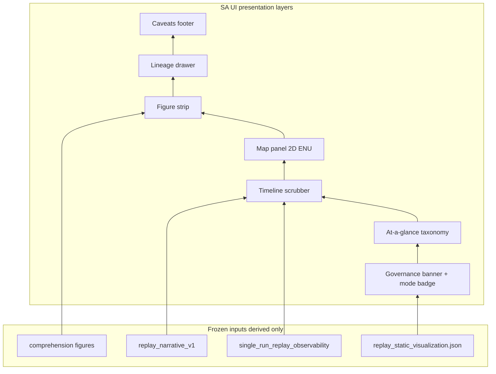

# Situational Awareness UI Planning R1

Phase name: **Situational Awareness UI Planning R1**

Build recommendation: **plan-only documentation**. This wave does not authorize live UI, rosbridge dashboards, runtime topic changes, HITL workflows, engagement authority, or any frontend implementation.

`AGENTS.md` remains the primary authority. Frozen replay tooling contracts are defined in scoped freeze audits; see [freeze_registry_r1.md](freeze_registry_r1.md).

## 1. Scope, authority, and references

### Purpose

Define governance-safe concepts for **replay-derived situational awareness** before any interactive UI code, and bound future work relative to frozen static replay visualization.

### References

- [reviewer_interpretation_guide.md](reviewer_interpretation_guide.md) — evidence layers and causal-language rules
- [replay_static_visualization_comprehension_r1_freeze_audit.md](replay_static_visualization_comprehension_r1_freeze_audit.md) — frozen `scan_guide`, `key_windows`, figure semantics
- [replay_demo_review_workflow_r1.md](replay_demo_review_workflow_r1.md) — mentor/demo replay review path
- [replay_static_visualization_r2_plan.md](replay_static_visualization_r2_plan.md) — deferred bag/paired/Plotly candidates
- [freeze_registry_r1.md](freeze_registry_r1.md) — maintained freeze index
- Legacy [web/](../../web/) Cesium + rosbridge stack — **out of scope** until explicitly re-governed

### Goal

Specify how a future reviewer-facing SA presentation could layer **radar/map concepts**, **synchronized views**, and **entity boundaries** on top of existing replay artifacts — while preserving:

- mirrors ≠ authority
- replay-only default mode
- no operational command semantics
- no readiness or robustness scoring

---

## 2. Definition (this repository)

**Situational Awareness UI (SA UI)** in this repository means: a **read-only, replay-derived, governance-labeled presentation layer** that helps reviewers orient in **space and time** over existing evaluation artifacts. It is **not** a tactical display, not runtime state, and not an operator console.

Align wording with [reviewer_interpretation_guide.md](reviewer_interpretation_guide.md): SA UI is an **explanatory visualization** layer above derived artifacts, never authoritative state.

| In scope (conceptual) | Out of scope |
|----------------------|--------------|
| Spatial projection of log/bag-evidenced positions | Live ROS/rosbridge subscriptions |
| Timeline-linked views (global/local, incident windows) | Engagement / weapon / approval controls |
| Entity layers (target, interceptor, selection id) as **mirrors** | Readiness, certification, robustness scoring |
| Reuse of comprehension `scan_guide` / banner copy | Causal mechanism or “why it failed” AI |
| Optional future scrubbing over **frozen** manifest data | Cesium/geodetic operational maps |
| Event localization (association language only) | Unified “battle state” merging replay + live |

### What SA UI IS

- Replay-first, static-first, read-only, analysis-oriented
- Mentor/reviewer orientation over frozen evaluation artifacts
- Governance-contained spatial and temporal presentation
- Extension of (not replacement for) frozen static replay visualization

### What SA UI IS NOT

- Operational command and control (C2)
- Real-time battle management or tactical command system
- Live telemetry platform or operational dashboard
- HITL/operator workflow surface
- Readiness / certification / composite scoring system
- Causal AI explanation engine
- Military operational system breadth

### Allowed presentation layers

Governance chrome, at-a-glance taxonomy strip, timeline scrubber, 2D ENU map panel, figure strip (links to frozen PNGs), lineage drawer, caveats footer.

### Forbidden presentation layers

Command palette, engage/disengage controls, readiness gauge, live topic merge into map/timeline, multi-user C2 layout, autonomous engagement authority UI, operator approval chains.

---

## 3. SA UI layer map (deliverable 3)

Presentation stack distinct from the evidence layer map in [freeze_registry_r1.md](freeze_registry_r1.md). All SA UI layers are **non-authoritative**.



### Mapping to reviewer evidence layers

| SA UI layer | Primary inputs | Reviewer evidence layer | Correct reading |
|-------------|----------------|-------------------------|-----------------|
| L1 Governance banner + mode badge | Manifest comprehension `scan_guide` | Replay artifact / explanatory viz | Framing only; not authority |
| L2 At-a-glance taxonomy | Manifest, narrative taxonomy fields | Derived interpretation | Labels classify evidence; not rankings |
| L3 Timeline scrubber | Narrative `key_windows`, observability bands | Derived / explanatory | Temporal localization; not causal proof |
| L4 Map panel | `sparse_topdown`, log-evidenced samples | Explanatory evidence | Sparse/dashed; not continuous track truth |
| L5 Figure strip | Frozen PNG paths from manifest | Replay artifact | Links to static figures; not live feed |
| L6 Lineage drawer | Observability `bundle.lineage`, sidecar meta | Mirrored / provenance | Traceability; not validity certification |
| L7 Caveats footer | Fixed governance template + lint hints | Governance lint | Negations only; `ok` ≠ approval |

Optional R2 additions (see [replay_static_visualization_r2_plan.md](replay_static_visualization_r2_plan.md)): bag trajectories, paired-run split map, Plotly scrubbing — each requires its own sub-banner and must not merge into a single authoritative picture.

---

## 4. Replay vs live semantics matrix (deliverable 4)

| Mode | Data source | UI chrome (required) | Authorized in R1 plan | Notes |
|------|-------------|----------------------|-------------------------|-------|
| `replay_static` | Frozen JSON, logs, optional recorded bags | `REPLAY — derived summary` | **Default; only R0 prototype mode** | Same pipeline as [replay_demo_review_workflow_r1.md](replay_demo_review_workflow_r1.md) |
| `analysis_static` | Same as `replay_static` | `ANALYSIS — non-authoritative` | Yes | Pedagogical label for current comprehension HTML workflow; no new data plane |
| `live_observation` | ROS/live topics | `LIVE — not replay truth` | **Forbidden** until HITL boundary wave | No blending with replay positions |
| `tactical_command` | Runtime control APIs | C2-style controls | **Permanently forbidden** in eval platform | Outside repository identity |
| `blended_picture` | Replay + live merged | Single map/timeline | **Forbidden** | Explicit anti-pattern |
| `readiness_certification` | Scoring pipelines | Pass/fail badges | **Forbidden** | No readiness scoring |

**Rule:** Mutually exclusive applications or unmistakable mode chrome (banner, color band, or separate application). No toggle that overlays live positions on replay-derived geometry into one “current picture.”

---

## 5. Authority-boundary matrix (deliverable 5)

| Surface | UI may display | UI must not imply |
|---------|----------------|-------------------|
| Parser-visible summaries | Labeled parser-local fields | Extend or rewrite parser contract |
| Observability JSON | Divergence trace, lifecycle timeline, warnings | Tactical orders, causal proof, runtime truth |
| Narrative `events` | Sequence, incidents, `key_windows` | Runtime truth, engagement authority |
| Comprehension manifest | `scan_guide`, headline, figure order | Re-score, rank, or certify runs |
| `sparse_topdown` / map panel | Dashed sparse XY samples | Continuous track truth |
| Selection / engagement series | Replay-local ids, thresholds | Engage/disengage or assign controls |
| Rosbag (future VIZ-R2) | Labeled bag-derived geometry | Live state, parser authority |
| Camera (future) | Thumbnails synced to master clock | Engagement truth from imagery lag |

### Auto vs manual (conceptual only)

Any future **manual override** UI belongs to **HITL Boundary Concepts R0** (separate plan wave), not SA Planning R1. SA R1 defines **read-only mirrors** only. Display separation between automated and manual engagement evidence may be planned later; no approval-chain or command semantics here.

### Visualization vs command authority

| Concern | SA UI (this plan) | Future HITL wave (not authorized) |
|---------|-------------------|-------------------------------------|
| Show selection id timeline | Allowed (labeled replay-local) | — |
| Change selection / engagement | Forbidden | Would require separate authority contract |
| Show divergence labels | Allowed (taxonomy only) | — |
| Act on divergence | Forbidden | — |

---

## 6. Future UI concepts (architecture level only)

Architecture concepts only. No implementation authorized by this document.

### Radar / map visualization

| Option | Use case | Governance default |
|--------|----------|-------------------|
| 2D top-down (ENU) | Primary replay map; aligns with `sparse_topdown` semantics | Sparse samples; dashed segments; “not continuous path” label |
| Range–bearing strip | Sensor-centric review | Derived from log/bag allowlist; no operational radar claim |
| Altitude panel | Secondary axis | Optional; not required for R0 |

**R0 planning decision:** 2D top-down only, same frame as static viz `sparse_topdown`, no geodetic datums or mission map tiles that imply deployed geography.

### Global vs local synchronized views

- **Time index:** monotonic from log timestamps or narrative `key_windows` — single master clock.
- **Global:** full scenario extent, incident markers, divergence bands.
- **Local:** zoom to selected incident window; linked crosshair on timeline.
- **No** unified battle-state object — views are projections of the same derived artifacts.

### Interceptor / target visualization

| Entity | Source | Visual rules |
|--------|--------|--------------|
| Target | Log/bag position samples | Neutral color; no threat score glyph |
| Interceptor | Log/bag + engagement metrics series | Distinct layer; non-authoritative |
| Selection id | Replay-local tactical evidence | Label `replay-local`; no assign command |

Do not imply identification confidence, classification authority, or WEZ validity.

### Timeline synchronization

Single monotonic clock index. Incident markers from narrative and observability divergence bands. Scrubbing moves all linked panels (map, figure strip, optional future camera strip) to the same index — still replay-derived only.

### Camera feed synchronization

| Status | Notes |
|--------|-------|
| **Not in R0** | No media contract in `replay_narrative_v1` or comprehension manifest |
| Future | Optional thumbnail strip synced to master clock from recorded image topics |
| Risk | Camera lag must not be read as engagement truth |

Any prototype must state explicitly: **camera sync not implemented.**

### Event localization

Use association language per [reviewer_interpretation_guide.md](reviewer_interpretation_guide.md): `associated with`, `co-occurs with`, `localized near`. Avoid causal mechanism or operational certainty wording.

### Read-only interaction concepts

Allowed: scrub timeline, zoom/pan map, select incident window, open lineage drawer, link figure strip to PNG assets.

Forbidden: writes to runtime, engagement parameters, selection assignment, approval actions, readiness submission.

---

## 7. Governance-safe UI layering

Binding rules for any future SA implementation:

1. Every view shows **mode badge + governance banner** before spatial content.
2. Map panel uses the same frame and dashed semantics as [`render_sparse_topdown`](../../scripts/evaluation/replay_viz_figures.py).
3. Engagement visuals cite `[METRICS]` / narrative markers — non-authoritative.
4. Reuse comprehension `scan_guide` where possible; do not invent new scoring or ranking copy.

Recommended stack (bottom to top on screen):

1. **Governance banner** — derived replay summary; not authority
2. **At-a-glance strip** — taxonomy labels only
3. **Timeline scrubber** — master clock; incident markers
4. **Map panel** — 2D `replay_static` geometry
5. **Figure strip** — thumbnails linking to static PNG assets or inline comprehension panel
6. **Lineage drawer** — paths, seed, profile_id, warnings
7. **Caveats footer** — causal, readiness, HITL negations

---

## 8. Relationship to existing web/

The [web/](../../web/) directory contains experimental Cesium + rosbridge pages (`index.html`, `cesium_rosbridge.html`). They are **not** governed evaluation surfaces.

SA Planning R1 does **not** extend that stack. A future implementation wave must either:

- fork a new replay-only static viewer under evaluation governance, or
- explicitly re-govern `web/` with a separate freeze audit — not assumed here.

---

## 9. Future mode definitions (deliverable 6)

### Authorized modes (planning)

| Mode ID | Summary |
|---------|---------|
| `replay_static` | Default; frozen artifacts only |
| `analysis_static` | Same data plane; emphasizes cross-artifact reading order |

### Conditionally authorized (future waves only)

| Mode ID | Prerequisite wave |
|---------|-------------------|
| `live_observation` | HITL Boundary R0 + separate implementation freeze audit |

### Forbidden operational modes (never in eval platform identity)

| Mode ID | Reason |
|---------|--------|
| `tactical_command` | C2 / command authority outside scope |
| `blended_picture` | Replay + live merge — authority ambiguity |
| `readiness_certification` | Scoring / certification forbidden |
| `autonomous_engagement_authority` | Engagement authority forbidden |
| `operator_approval_chain` | HITL semantics not authorized in SA R1 |

---

## 10. “Do not cross yet” boundaries (deliverable 7)

Until a separate scoped wave + freeze audit authorizes otherwise:

- Live ROS subscriptions in eval or demo tooling
- Websockets to runtime or default rosbridge in eval CI
- Multi-user C2 layouts
- Weapon release, approval, or engage/disengage UI
- Readiness / field performance / certification claims
- Causal mechanism narratives beyond localization language
- Merging manifest fields into runtime node parameters
- CI gates on SA HTML without explicit non-certification labels
- Military/tactical operational framing in UI copy
- Extending legacy `web/` without re-governance audit
- React/Vue platform or live map SDK (Cesium, etc.) as default eval path
- Unified “replay battle state” merging narrative + bag + live topics

---

## 11. Governance risk inventory (deliverable 8)

SA-specific risks; complements [meta_governance_maturity_review_r1.md](meta_governance_maturity_review_r1.md).

| Risk | Manifestation | Mitigation in this plan |
|------|---------------|-------------------------|
| Frontend sprawl | React/Vue platform before replay contract stable | Static-first; optional SA-R0 HTML mock only |
| Runtime coupling | Websocket/rosbridge in eval tooling | Forbidden in R0/R1; separate HITL wave |
| Authority ambiguity | Dashboard mistaken for truth | Mode badge + layer map + `scan_guide` reuse |
| Replay/live confusion | Blended map showing live + replay | Mutually exclusive modes; `blended_picture` forbidden |
| Operator overtrust | Polished UI implies readiness | Caveats footer; no scoring |
| Tactical overclaim | Map tiles, weapon symbology | ENU only; neutral entity styling |
| Governance drift | `web/` extended without audit | Explicit legacy exclusion |
| Parser creep | UI-only fields become parser contract | R0 consumes existing schemas only |
| Determinism loss | Live scrub without frozen inputs | Log-timestamp index only for R0 |
| Platform sprawl | SA UI absorbs VIZ-R2 scope | VIZ-R2 remains separate wave per static viz plan |

---

## 12. Static-first progression strategy (deliverable 10)

1. **Today (frozen):** static PNG + comprehension HTML — primary mentor surface per demo workflow
2. **VIZ-R2 (planned):** bag trajectories, paired composite, Plotly opt-in — still static export, no server
3. **SA-R0 (optional spike, post-freeze):** standalone HTML/JS reading manifest JSON only; governance lint on inputs
4. **SA-R1 impl (future wave):** replay-only map + timeline sync; tests + implementation freeze audit
5. **HITL-R0 (plan only):** boundary concepts doc — manual vs auto **display** separation
6. **`live_observation`:** not before HITL-R0 + separate implementation audit

Prefer additive manifest fields and frozen artifact inputs at each step. Do not skip static comprehension surfaces for interactive UI.

---

## 13. Suggested implementation ordering (deliverable 9)

| Order | Wave | Type | Prerequisite |
|-------|------|------|--------------|
| 0 | Freeze SA Planning R1 docs | documentation | This plan + freeze audit |
| 1 | VIZ-R2 | eval Python | SA plan frozen; no geospatial conflict |
| 2 | SA-R0 mock (optional) | static HTML spike | Manifest-only conceptual contract |
| 3 | SA-R1 replay map UI | implementation | VIZ-R2 bag semantics if dense trajectories needed |
| 4 | HITL-R0 concepts | plan only | Never merged with SA-R1 in one wave |
| 5 | `live_observation` | implementation | HITL boundary + audit; forbidden by default |

| Phase | Content | Type |
|-------|---------|------|
| SA-R0 | Static HTML/JS mock reading manifest JSON only | optional spike |
| VIZ-R2 | Bag trajectory, paired composite, Plotly | per [replay_static_visualization_r2_plan.md](replay_static_visualization_r2_plan.md) |
| SA-R1 impl | Replay-only map + timeline sync | implementation + audit |
| HITL-R0 | Boundary concepts doc | plan only |

---

## 14. Minimal R0 data contract — conceptual only (deliverable 11)

**Not a new `artifact_type`.** Conceptual read-only consumer shape for a future SA-R0 spike. No schema implementation authorized in Planning R1.

```yaml
# Conceptual SA-R0 view model (documentation only)
sa_view_contract_r0:
  mode: replay_static  # required
  governance:
    banner_text: manifest.comprehension.scan_guide[0] or fixed template
    mode_label: REPLAY_DERIVED
  clock:
    index: log_line | time_s | narrative.key_windows
    markers: narrative.incidents + observability divergence bands
  map:
    frame: scenario_enu
    layers:
      - id: sparse_positions
        source: manifest figures.sparse_topdown | log-evidenced samples
        style: dashed
        caveat: not_continuous_path
  entities:
    target:
      source: log/bag allowlist
      authoritative: false
    interceptor:
      source: log/bag allowlist
      authoritative: false
    selection_id:
      source: narrative | observability
      label: replay_local
  prohibited_inputs:
    - live_ros_topic
    - runtime_parameter_write
    - readiness_score
```

### Allowed inputs (R0)

- `replay_static_visualization.json` manifest + comprehension block
- `replay_narrative_v1` JSON (`artifact_type: replay_narrative_report`)
- `single_run_replay_observability_report` JSON (optional)
- PNG assets referenced by manifest paths

### Prohibited inputs (R0)

- New runtime topics
- Websocket or ROS bridge connections
- Parser contract extensions
- Live telemetry streams
- Readiness or scoring pipelines

---

## 15. Freeze boundaries for future UI implementation

When an implementation wave is authorized, it must freeze:

| Boundary | Intent |
|----------|--------|
| Data source | Replay artifacts + parser summaries only in R0 |
| Authority | Read-only; no writes to engagement/selection |
| Modes | `replay_static` / `analysis_static` vs `live_observation` mutually exclusive chrome |
| Sync | Log timestamp index only |
| Geospatial | Local ENU / scenario frame; no operational map datums |
| Entities | Log-evidenced positions; dashed = non-continuous |
| Engagement viz | `[METRICS]` / markers — non-authoritative |
| Comprehension | Reuse digest fields; no derived scoring |
| Tech stack | Plotly/WebGL opt-in; no default rosbridge in eval CI |
| Governance | Banner + `scan_guide` on every page |

---

## 16. Future HITL boundary concepts (plan-only pointers)

Reserved for **HITL Boundary Concepts R0** (separate plan wave):

- Manual vs automated engagement lanes (display separation only)
- No approval-chain semantics in SA R1
- No operator workload or readiness metrics

---

## 17. Validation strategy (for future implementation)

- Governance lint on source JSON before render (`governance-lint`)
- Deterministic render tests (fixed manifest fixture; patterns in [replay_narrative_minimal.json](../../src/counter_uas/test/fixtures/replay_narrative_minimal.json))
- Visual regression optional; not required for R0 mock
- Manual review against [reviewer_interpretation_guide.md](reviewer_interpretation_guide.md) checklist

---

## 18. Plan status

**Plan-only — not implemented.** Freeze of this planning document is recorded in [situational_awareness_ui_planning_r1_freeze_audit.md](situational_awareness_ui_planning_r1_freeze_audit.md).

Interactive UI implementation requires a separate scoped wave, regression evidence, and implementation freeze audit.
