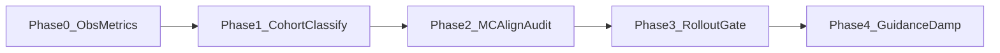

# GNC implementation roadmap (completed replay, low regression)

**Current status:** the branch replayed Phases 0–4. This file is the canonical repo copy; the matching Cursor plan under `.cursor/plans/` should remain a convenience mirror, not a second source of truth.

**Principles:** observability first; small diffs; keep [`guidance_lib.solve_intercept_time`](../src/gazebo_target_sim/gazebo_target_sim/guidance_lib.py) / [`compute_intercept`](../src/gazebo_target_sim/gazebo_target_sim/guidance_lib.py) unless A/B tests prove fault; reuse existing [`simulate_intercept_once`](../src/gazebo_target_sim/gazebo_target_sim/interception_logic_node.py), [`_monte_carlo_kinematic_hit_rollout`](../src/gazebo_target_sim/gazebo_target_sim/interception_logic_node.py), [`estimate_hit_probability`](../src/gazebo_target_sim/gazebo_target_sim/interception_logic_node.py), and [`filter_t_go`](../src/gazebo_target_sim/gazebo_target_sim/guidance_lib.py) / in-node `t_go_filter_alpha` (see ~L1534, ~L4528 in [`interception_logic_node.py`](../src/gazebo_target_sim/gazebo_target_sim/interception_logic_node.py)).

---

## Phase 0 — Structured metrics and logs (no control-law change)

**Goal:** Every Gazebo run produces machine-parseable rows for range, closing velocity, raw vs filtered `t_go`, feasibility flags, and “large replan jump” events — without changing guidance output yet.

| Item | Exact locations |
|------|------------------|
| Add periodic structured lines | [`interception_logic_node.py`](../src/gazebo_target_sim/gazebo_target_sim/interception_logic_node.py) in the main control/guidance tick path where you already compute `t_hit` / feasibility (`FeasibilityVizState`, `[FEAS_WARN]` ~L3119+). Prefer a single helper e.g. `_log_eng_snapshot(...)` to avoid scatter. |
| Reuse existing warnings | `[FEAS_WARN]`, `[FEAS_GUARD]`, `[HIT]` parsing in [`scripts/analyze_run.py`](../scripts/analyze_run.py) / [`scripts/summarize_run.py`](../scripts/summarize_run.py). |
| Optional JSONL sidecar | Extend [`scripts/run_capture.py`](../scripts/run_capture.py) `RunMeta` or post-hook — **lower priority** than stdout tags (eval pipeline already greps logs). |

**Metrics to log first (minimum set):** `range_m`, `v_closing` (if available or derive from `r_hat` and relative vel), `t_go_raw`, `t_go_filt` (from `_t_go_filtered` / effective `t_go_eff`), `feasible_geom` (from `is_intercept_feasible` or existing feas object), `selected_iid`, `omega_cmd` / `speed_cmd` if already computed before saturation.

**Suggested log format:** one line per period, stable prefix e.g. `[ENG_METRIC] key=value ...` so Phase 1 classifier can grep without ROS bag.

**Safe vs risky:** **Safe** (logging only; gate behind `declare_parameter('eng_metrics_period_s', 0.0)` default 0 = off).

**Tests after phase:** `./scripts/ci_eval.sh tier0`; one `tier1` smoke; grep new tag count = 0 when param off.

**Success criteria:** With param enabled, a single log contains non-empty `[ENG_METRIC]` lines; no change in default `hit` / `success` distribution within statistical noise on 5× tier1 runs.

---

## Phase 1 — Evaluation cohorts + failure classification (offline first)

### 1.1 Clean evaluation cohorts

| Action | Files |
|--------|--------|
| **Tag cohort at capture time** | [`scripts/run_capture.py`](../scripts/run_capture.py): add optional `--cohort <string>` written into `RunMeta.notes` or new `cohort` field in `.meta.json` (backward compatible: old readers ignore unknown keys). |
| **Matrix CSV column** | Already have `notes_meta` / scenario_id in [`scripts/run_scenario_matrix.py`](../scripts/run_scenario_matrix.py); document convention: e.g. `cohort=matrix_v1` in `extra_launch_args` or dedicated column if you add one to CSV reader. |
| **Aggregate by cohort** | [`scripts/monte_carlo.py`](../scripts/monte_carlo.py) `aggregate`: add optional `--notes-substring` / `--meta-cohort` filter: include log only if paired `.meta.json` contains cohort OR log header contains `cohort=`. |
| **CI wrapper** | [`scripts/ci_eval.sh`](../scripts/ci_eval.sh) `tier3-aggregate`: change **documented default** example to `--pattern` date-scoped or require `COHORT=` env — avoid `*.log` mixing diagnose runs (root cause of misleading 30% success). |

**Success criteria:** Running aggregate with `--meta-cohort pipeline_202605` yields stable `n_runs` matching only that cohort; mean miss no longer dominated by unrelated tails.

### 1.2 Failure classification

| Action | Files |
|--------|--------|
| **Offline classifier (preferred first)** | New small module e.g. [`scripts/evaluation/classify_run.py`](../scripts/evaluation/classify_run.py): input `log_path` + optional `meta.json`; output JSON with `failure_class` in `{F1_timeout,F2_geom_not_dyn,F3_track_instability,F4_assignment,F5_unknown}` using rules: |
| **F1** | No `[HIT]` and log contains `=== TIMEOUT ===` or `capture_rc` 124 in matrix row + final range huge — combine with [`summarize_run.parse_log`](../scripts/summarize_run.py) `min_miss_m`. |
| **F2** | `[HIT]` false but periodic lines show `feasible_geom=true` once Phase 0 metrics exist; or geometry feasible from existing feasibility prints. |
| **F3** | High variance: many `[ENG_METRIC] delta_t_go` or manual rule: stdev of `t_go_raw` over window (after Phase 0). |
| **F4** | grep selection / reassignment keywords already in node logs (search `"reassign"` / `assignment` in node). |
| **F5** | default bucket. |
| **Integrate with matrix** | Optional column from `classify_run` invoked at end of [`run_scenario_matrix.py`](../scripts/run_scenario_matrix.py) row build (like `evaluation_row`). |

**Safe vs risky:** **Safe** (offline only). Slightly **risky** if matrix always shells out to classifier — mitigate with try/except and empty class.

**Tests:** Unit tests with 2–3 synthetic log fixtures (timeout-only, hit, feasible-warn) under `src/counter_uas/test/` or `scripts/evaluation/test_*.py`.

**Success criteria:** CSV from matrix includes `failure_class`; distribution interpretable; tier0 still green.

---

## Phase 2 — Align Monte Carlo / heatmap with Gazebo dynamics (audit + small fixes)

**Current state:** Heatmap path with `intercept_heatmap_prob_use_kinematic_rollout` already calls [`estimate_hit_probability`](../src/gazebo_target_sim/gazebo_target_sim/interception_logic_node.py) with `use_kinematic_rollout=True` and `rollout_max_turn_rate_rad_s=self._max_turn_rate`, `rollout_max_accel_m_s2=self._max_accel` (~L2392–L2410). Misalignment risk is **offline tools** and **light model** branch.

| Item | Files |
|------|--------|
| **Audit offline heatmap** | [`scripts/render_intercept_heatmap_prob_offline.py`](../scripts/render_intercept_heatmap_prob_offline.py) uses hardcoded `rollout_max_turn_rate_rad_s=1.5` — replace with CLI args defaulting to **same launch params** as [`gazebo_target.launch.py`](../src/gazebo_target_sim/launch/gazebo_target.launch.py) for `interceptor_max_turn_rate_rad_s` / accel, or read a small YAML snippet. |
| **Document / assert** | [`scripts/evaluation/README.md`](../scripts/evaluation/README.md): table “heatmap MC model vs Gazebo” + one-line invariant: rollout limits must match node `_max_turn_rate` / `_max_accel`. |
| **Deprecate light path for eval** | Keep `intercept_mc_use_light_hit_model` for speed debug only; eval docs say: official P(hit) uses rollout branch. |

**Safe vs risky:** **Low risk** (offline script + docs); **medium** if changing default offline defaults shifts published heatmaps — version the export filename or metadata.

**Tests:** Dry-run heatmap export on fixture; compare P(hit) delta with/without matched limits (expect non-trivial change only if limits were wrong).

**Success criteria:** Single documented command reproduces heatmap P(hit) within expected tolerance vs live node for same cell (spot-check 3 cells).

---

## Phase 3 — Dynamics-aware feasibility gating (parameterized, default OFF)

**Reuse:** [`simulate_intercept_once`](../src/gazebo_target_sim/gazebo_target_sim/interception_logic_node.py) with `use_kinematic_rollout=True` and same `rollout_max_*` as heatmap (~L932–L941 pattern).

| Item | Files |
|------|--------|
| **New ROS params** | `eng_rollout_feasibility_gate` (bool, default `false`), `eng_rollout_gate_horizon_s` (float, default = `_t_hit_max` or conservative). |
| **Call site** | Where you already compute `is_intercept_feasible` / commit engage for selected interceptor (~feasibility + selection block near `finalize_feasibility_viz_state` / selection prints). **If gate on:** require `simulate_intercept_once(..., use_kinematic_rollout=True, ...)` **or** thin wrapper calling `_monte_carlo_kinematic_hit_rollout` with current state snapshot. |
| **Observability** | Log `[ENG_GATE] rollout_ok=false reason=...` — pairs with Phase 0. |

**Safe vs risky:** **Medium risk** (behavior): default **false** preserves legacy; enable only on dev branch first.

**Tests:** Unit test rollout gate on synthetic states (feasible geom, unreachable dyn); 5× Gazebo tier1 with gate off vs on (expect no change when off).

**Success criteria:** With gate on in stress scenario, fewer “false engage” oracle mismatches; baseline scenario success not regressed >5% on N=20 cohort-tagged runs.

---

## Phase 4 — Guidance damping / terminal blending (incremental)

**Existing:** `t_go_filter_alpha` + `_t_go_filtered` in node; [`filter_t_go`](../src/gazebo_target_sim/gazebo_target_sim/guidance_lib.py) available for reuse in shared math.

| Item | Files |
|------|--------|
| **Aim vector slew** | In guidance command assembly (same region as `align_speed_after_saturation` usage — search `align_speed` / `compute_intercept` consumers in [`interception_logic_node.py`](../src/gazebo_target_sim/gazebo_target_sim/interception_logic_node.py)), add max angle per tick between previous `u_cmd` and new `u_pred` param `guidance_u_max_step_rad` (default π = no-op). |
| **Terminal blend** | New params: `guidance_terminal_range_m`, `guidance_terminal_pn_weight` — inside terminal sphere blend toward pure pursuit / reduce predictive weight (reuse existing PN path `_true_pn_acceleration` / PN enable flags). |
| **Optional:** import [`filter_t_go`](../src/gazebo_target_sim/gazebo_target_sim/guidance_lib.py) for any **secondary** time constant if node filter duplicated — refactor only if duplication causes bugs (nice-to-have). |

**Safe vs risky:** **Medium–high** (flight path changes). Mitigation: ship with **no-op defaults**; A/B via cohort-tagged runs.

**Tests:** tier0; replay/compare logs for `delta_heading_rate` variance (Phase 0 metrics) before/after.

**Success criteria:** Reduced `[ENG_METRIC]` `delta_t_go` / heading jerk; median miss unchanged or better; P95 miss not worse on cohort `matrix_v1` N≥30.

---

## Safe vs risky summary

| Change class | Risk |
|--------------|------|
| `[ENG_METRIC]` logging, meta `cohort`, offline `classify_run`, `monte_carlo` filter flags | Low |
| Offline heatmap CLI alignment | Low–medium |
| Rollout feasibility gate (default off) | Medium |
| `u` slew + terminal blend | Medium–high |

---

## 9. Exact commands/tests after each phase

| After | Commands |
|-------|----------|
| Phase 0 | `./scripts/ci_eval.sh tier0`; `./scripts/ci_eval.sh tier1 --timeout-s 120`; `rg '\[ENG_METRIC\]' runs/logs/<latest>.log` |
| Phase 1 | `python3 scripts/evaluation/classify_run.py runs/logs/<run>.log`; `./scripts/ci_eval.sh tier3-aggregate --label cohort_test --pattern '*2026-05-04*_single.log'` (example); `pytest` for new classifier tests |
| Phase 2 | `python3 scripts/render_intercept_heatmap_prob_offline.py --help` + fixture dry-run; optional compare to node export |
| Phase 3 (rollout gate) | tier0; tier2-smoke with gate off/on; compare `pipeline_matrix_latest.csv` columns |
| Phase 4 (guidance damping) | Same + manual review of `[ENG_METRIC]` jerk |

---

## 10. Expected success criteria per phase (measurable)

| Phase | KPI |
|-------|-----|
| 0 | New metrics present; default behavior unchanged (A/B 5 runs). |
| 1 | Cohort-filtered aggregate: `n_runs` matches intent; `failure_class` column populated; classifier tests pass. |
| 2 | Offline heatmap limits match launch; spot-check P(hit) vs live ≤ agreed tolerance. |
| 3 | On stress cohort: ↑ success or ↓ oracle-mismatch without baseline regression (cohort-tagged N≥20). |
| 4 | ↓ heading-rate variance / ↓ `delta_t_go`; P95 miss not worse on same cohort. |

---

## Phase mapping

The replay uses Phases 0–4 consistently. Earlier working notes that used later rollout/guidance labels map to Phase 3 rollout gating and Phase 4 guidance damping here.

No large rewrites: avoid touching [`guidance_lib.solve_intercept_time`](../src/gazebo_target_sim/gazebo_target_sim/guidance_lib.py) core; prefer parameters + offline tooling until metrics prove solver fault.
