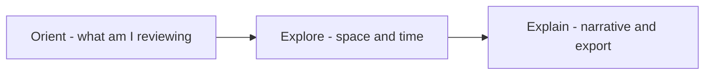
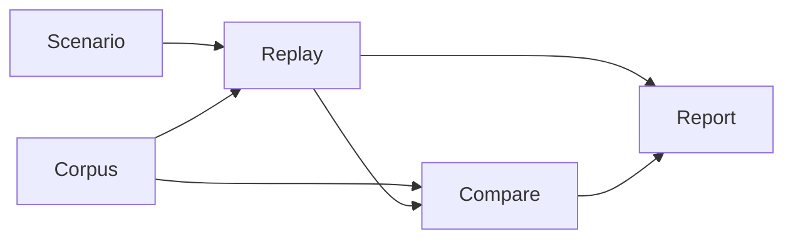
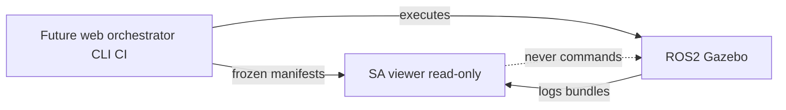

# PHASE H1 — Sandbox UX Architecture (PLAN-SA-H1)

**Phase:** H1 — Sandbox UX Architecture & Information Hierarchy  
**Checkpoint:** `75ea6d5` (PLAT-SA-F1a–F1d + G1 consolidation)  
**Build recommendation:** plan-only documentation — no viewer implementation  
**Authority:** [AGENTS.md](../../AGENTS.md) remains primary governance. This document extends [situational_awareness_ui_planning_r1.md](../evaluation/situational_awareness_ui_planning_r1.md) (PLAN-SA-R1) and indexes frozen PLAT-SA-* behavior; it does not replace freeze audits or parser contracts.

**Companion artifacts:**

- [h1_workspace_layout_notes.md](h1_workspace_layout_notes.md) — layout concept sketches (ASCII + mermaid)
- [sa_h1_sandbox_ux_freeze_audit.md](../evaluation/sa_h1_sandbox_ux_freeze_audit.md) — docs-only freeze audit (PLAN-SA-H1)
- G1 trio: [sa_platform_governance_review_r1.md](../evaluation/sa_platform_governance_review_r1.md), [sa_platform_maturity_assessment_r1.md](../evaluation/sa_platform_maturity_assessment_r1.md), [sa_platform_frontier_review_r1.md](../evaluation/sa_platform_frontier_review_r1.md)

---

## 1. Purpose and scope

### 1.1 Purpose

Define a **governance-safe UX architecture** that gradually reframes the frozen SA-R0 viewer from accretive **replay tooling** toward a **replay-first experimentation sandbox workstation**, without violating platform boundaries or redesigning the Web ↔ Gazebo split.

H1 is **architecture and information hierarchy only**. It produces planning artifacts that constrain future implementation waves (H2, H3) and preserves all existing deep links, artifact contracts, and deterministic regen discipline.

### 1.2 What this document governs

| In scope (H1) | Out of scope (H1) |
|---------------|-------------------|
| Workspace philosophy and layout concepts | React/Vite/Cesium implementation |
| Five-segment navigation model | New `artifact_type` or bundle schema fields |
| Panel taxonomy and declutter strategy | Live ROS, WebSocket, rosbridge |
| Replay vs authoring separation (conceptual) | Runtime orchestration execution |
| Orchestration integration **hooks** (contracts only) | HITL, C2, readiness scoring, ML recommenders |
| Reviewer cognition principles | Parser/topic/fusion/tracker changes |
| Governance-safe UX language rules | Legacy `web/` rosbridge extension |
| H2/H3 boundary definitions | Tactical/operator console aesthetics |

### 1.3 Platform identity context

After PLAT-SA-R0 → F1d, the repository’s primary value is a **governance-aware, deterministic, offline replay experimentation and corpus-operations platform** on a bounded ROS 2 / Gazebo substrate (see G1 governance review §1).

**Long-term architecture (unchanged by H1):**

| Layer | Role |
|-------|------|
| **Web platform** | Scenario authoring + orchestration + replay/research ecosystem |
| **Gazebo / ROS 2** | Runtime simulation engine |

The viewer remains a **read-only consumer** of frozen replay artifacts. H1 improves how reviewers **orient, explore, and explain** evidence — not how simulations are commanded.

### 1.4 References

| Document | Role |
|----------|------|
| [AGENTS.md](../../AGENTS.md) | Primary governance |
| [freeze_registry_r1.md](../evaluation/freeze_registry_r1.md) | Freeze index |
| [situational_awareness_ui_planning_r1.md](../evaluation/situational_awareness_ui_planning_r1.md) | PLAN-SA-R1 — SA UI layers, mode matrix |
| [reviewer_interpretation_guide.md](../evaluation/reviewer_interpretation_guide.md) | Evidence layers, wording |
| [replay_demo_review_workflow_r1.md](../evaluation/replay_demo_review_workflow_r1.md) | Mentor/demo path |
| [sa_r0_reviewer_quickstart.md](../evaluation/sa_r0_reviewer_quickstart.md) | 15-minute guided review |
| [sa_platform_usability_findings.md](../evaluation/sa_platform_usability_findings.md) | URL friction log |
| [platform/sa-r0-viewer/](../../platform/sa-r0-viewer/) | Frozen implementation surface (read-only audit input) |

---

## 2. Problem statement

### 2.1 Platform maturity vs presentation gap

G1 maturity assessment rates **architectural coherence** and **replay-first consistency** highly (4–5/5), and **reviewer usability** at 4/5 for **guided** demo paths. The **presentation layer** has not kept pace:

- Viewer chrome still reads as **“SA-R0 Replay Viewer”** (internal tooling label) rather than an experimentation sandbox.
- Backend capabilities (corpus index, sweeps, compare, synthesis, presentation, publication) are **mature**; the **workspace model** is **accretive** — features added per wave without a unified shell or panel registry.

### 2.2 Structural UX debt (viewer audit)

Evidence from frozen implementation at `platform/sa-r0-viewer/`:

| Symptom | Location / cause | Reviewer impact |
|---------|------------------|-----------------|
| Monolithic left rail | `App.tsx` stacks 15+ panels in single-replay mode | High scroll cost; hard to scan |
| God-container catalog | `ScenarioCatalogPicker.tsx` embeds corpus, compare, sweep, scenario | Unclear task focus |
| Duplicated layout shells | 12-column grids copied in App, Compare, Filmstrip, Presentation | Inconsistent spatial rhythm |
| Overlapping corpus UI | Lineage spread across Evolution, LineageNav, Provenance; unused `CorpusLineagePanel` | Redundant cognition load |
| Compare clock bridge | `CompareView` pushes focus slot into `useClockStore` for mock panes | Hidden state coupling |
| Mode asymmetry | Presentation/filmstrip drop right rail; compare keeps mock sensors | Unpredictable panel sets |
| URL param friction | Documented in usability findings (`?pair=` vs `?compare=`, walkthrough vs storyboard) | Mentor onboarding friction |

### 2.3 Target vs current experience

| Current (accurate) | Target (H1 direction) |
|------------------|----------------------|
| Internal replay tooling | Replay-first **experimentation sandbox** |
| Feature-stacked panels | **Segment-scoped** panel profiles |
| Mode switch via URL + stores | **Workspace segment** + preserved deep links |
| “Everything visible” default | **Progressive disclosure** with governance always visible |

### 2.4 What we are not fixing in H1

- Regen chain complexity (maintainer debt — docs/orchestrator ergonomics, separate track)
- Static HTML vs viewer dual onboarding (workflow doc issue)
- Missing `corpus_ref` backfill (P1 hygiene, not UX architecture)

---

## 3. UX goals

| # | Goal | Success criterion (for H2+) |
|---|------|-----------------------------|
| G1 | **Sandbox workstation** | Reviewer describes session as “experiment review,” not “ops console” |
| G2 | **Scannable hierarchy** | Primary canvas + temporal spine visible without scrolling past analytics |
| G3 | **Workflow clarity** | Five segments (Scenario, Replay, Compare, Corpus, Report) map to distinct panel profiles |
| G4 | **Governance continuity** | T0/T7 never hidden; all panels traceable to evidence layer |
| G5 | **Deterministic artifacts only** | No UI implying live state or execution authority |
| G6 | **Future-safe shell** | `WorkspaceShell` + panel registry + orchestration hooks without H3 execution |
| G7 | **Deep link preservation** | All existing query params resolve to correct segment + context |

---

## 4. Non-goals

H1 and any H2 implementation governed by this plan **must not** pursue:

- Live ROS / WebSocket / rosbridge integration in eval tooling
- HITL / operator / command-control / engage-disengage UX
- Readiness, certification, robustness, or composite scoring displays
- ML tactical recommendations or winner/loser compare semantics
- Runtime orchestration **execution** from the viewer (launch sim, queue jobs)
- Parser/topic/schema/`/tracks/state` semantic changes
- Tracker, fusion, or MHT/JPDA redesign
- Tactical HUD, game UI, military C2 dashboard aesthetics
- Unified “battle state” blending replay + live (`blended_picture` — PLAN-SA-R1 §4)
- Major UI implementation in the H1 wave itself
- Redesign of Web ↔ Gazebo runtime split

---

## 5. Workspace philosophy

### 5.1 Definition: replay-first experimentation sandbox

A **sandbox** here means: a **read-only workstation** where researchers and mentors **load frozen experiments**, **compare topology outcomes**, **navigate corpus lineage**, and **export explanatory narratives** — with no implication of operational authority.

Contrast with forbidden surfaces:

| Sandbox (in scope) | Not sandbox (forbidden) |
|--------------------|-------------------------|
| Simulation **experiment** review | Live **mission** management |
| Topology / outcome **divergence** | Dominance or ranking framing |
| Corpus **index mirror** | Fielding or go-live gate |
| Presentation **story** | Operator **approval** chain |

### 5.2 Three attention zones

Every segment organizes panels into three cognitive zones:



| Zone | Question answered | Typical tiers |
|------|-------------------|---------------|
| **Orient** | What artifact family is loaded? | T3 discover, corpus metadata |
| **Explore** | Where and when did evidence occur? | T1 canvas, T2 temporal spine |
| **Explain** | How do derived summaries relate? | T4 insight, T6 export |

**Rule:** Explain panels must never occupy first paint above Explore unless segment is **Report** (presentation-first).

### 5.3 Relationship to PLAN-SA-R1

PLAN-SA-R1 defines SA UI presentation layers L1–L7 (governance → caveats). H1 adds **workspace tiers T0–T6** that map **physical layout** to those layers. Both stacks remain **non-authoritative**.

---

## 6. Information hierarchy

### 6.1 Workspace tier model (T0–T6)

| Tier | Name | Role | Collapsible | PLAN-SA-R1 map |
|------|------|------|-------------|----------------|
| **T0** | Governance chrome | Mode badge, segment banner, replay-only framing | **Never** | L1 |
| **T1** | Primary canvas | Cesium map, dual compare maps, filmstrip grid | No (segment may fullscreen) | L4 |
| **T2** | Temporal spine | Scrubber, narrative timeline, chapter markers | Partial (compact in Report) | L3 |
| **T3** | Context rail | Catalog, corpus browser, compare controls, metadata | Yes (segment profiles) | L2, L6 |
| **T4** | Insight stack | Sweep workstation, synthesis, patterns, analytics | **Default collapsed** except sweep-heavy segments | L2, L5 |
| **T5** | Mock / illustrative | Radar, EO/IR, camera mocks; bundle telemetry/threat | **Default collapsed** in Replay | L4 adjunct |
| **T6** | Export / publish | Storyboard, walkthrough, review pack links | Segment Report primary | L5, L6 |

### 6.2 Priority rules

1. **T0 + footer caveats (T7 analog)** — always visible; never behind “More panels.”
2. **T1 + T2** — must be visible in first viewport on laptop (≥1280px) without scrolling past T4.
3. **T4** — expand on user intent or segment default (e.g. sweep context opens subset).
4. **T5** — collapsed by default in **Replay**; expandable with explicit “illustrative sync only” label.
5. **T6** — primary in **Report** segment; secondary elsewhere.

### 6.3 Evidence layer mapping

Every panel in H2 registry must declare `evidence_layer`:

| Layer | UI may | UI must not imply |
|-------|--------|-------------------|
| `artifact` | Link to bundle, manifest, PNG | Parser authority |
| `derived` | Show taxonomy, counts, divergence | Causal proof, operational truth |
| `explanatory` | Sparse map, LOS overlays, narrative | Continuous track truth |
| `mirror` | Corpus index, lineage, provenance | Field doctrine or policy truth |
| `governance` | Caveats, lint hints | Approval or go-live scoring |

Cross-reference: [reviewer_interpretation_guide.md](../evaluation/reviewer_interpretation_guide.md).

### 6.4 Cognitive load budget

**≤7 visible panel section headers** per viewport (expanded accordions count toward budget). Additional panels live under **“More panels”** with segment-specific allowlists.

---

## 7. Workspace layout concepts

Three layout concepts are specified for H2 evaluation. Detailed ASCII and mermaid: [h1_workspace_layout_notes.md](h1_workspace_layout_notes.md).

| Concept | Summary | Best for |
|---------|---------|----------|
| **A — Segment shell** | Fixed 3 \| 6 \| 3 grid + segment tabs; tier profile per segment | Default H2 implementation |
| **B — Focus mode** | Full-width T1; T3/T5 as slide-over drawers | Laptop / mentor demo |
| **C — Publication mode** | No T5; T3 story-only; aligns with E1 presentation | Report segment |

**H2 requirement:** All concepts share one **`WorkspaceShell`** component contract replacing four duplicated 12-column grids (`App`, `CompareView`, `CohortFilmstripView`, `PresentationLayoutShell`).

### 7.1 WorkspaceShell contract (conceptual)

```typescript
// Conceptual only — not implemented in H1
type WorkspaceSegment = "scenario" | "replay" | "compare" | "corpus" | "report";

interface WorkspaceShellProps {
  segment: WorkspaceSegment;
  t0: ReactNode;           // governance header
  t3?: ReactNode;          // left context rail
  t1: ReactNode;           // primary canvas
  t2?: ReactNode;          // temporal spine (position: bottom | under t1)
  t4t5?: ReactNode;        // right rail (insight + mock)
  t6?: ReactNode;          // export strip
  t7: ReactNode;           // caveats footer
  layoutVariant?: "segment" | "focus" | "publication";
}
```

---

## 8. Navigation structure

### 8.1 Five workspace segments

Segments are **reviewer task contexts**, not operational modes. They use **mutually exclusive chrome** (no `blended_picture`).

| Segment | User intent | Maps to frozen viewer | Default tier profile |
|---------|-------------|----------------------|----------------------|
| **Scenario** | Discover topology packs, read fixture metadata | `ScenarioCatalogPicker`, preview card, `scenario_topology_v1` | T3 heavy; optional T1 preview; no sweep workstation |
| **Replay** | Single-bundle spatial-temporal review | Default `App` single mode | T1+T2 dominant; T5 collapsed; minimal T4 |
| **Compare** | A/B topology/outcome cognition | `CompareView`, compare catalog | T1 dual; T3 compare panels; documented scrubber policy |
| **Corpus** | Index, lineage, drift, evolution navigation | Corpus browser, F1c/F1d panels | T3 corpus-first; T1 on entry load |
| **Report** | Presentation, walkthrough, publication export | `PresentationView`, export surfaces | Concept C; chapter rail; no T5 |

### 8.2 Navigation levels

| Level | Control | Behavior |
|-------|---------|----------|
| **Primary** | Segment selector (tabs or rail) | Switches panel allowlist + chrome copy; does not blend replay/live |
| **Secondary** | URL deep links | Preserved; auto-select segment (table below) |
| **Tertiary** | Panel accordions | Registry-driven IDs; persist collapse in sessionStorage (H2 optional) |

### 8.3 URL → segment mapping (compatibility)

Existing deep links **must** resolve after H2. H1 defines mapping for implementers:

| Query param(s) | Segment | Notes |
|----------------|---------|-------|
| `bundle`, `demo` | Replay | Default single-bundle |
| `sweep` | Replay or Corpus | Corpus if entry-only browse; Replay when scrubbing |
| `compare`, `pair` | Compare | Prefer catalog `pair` when available |
| `filmstrip` | Replay | Cohort sub-mode within Replay profile |
| `presentation`, `walkthrough`, `chapter` | Report | Mutually exclusive walkthrough vs storyboard per usability findings |
| `corpus_entry` | Corpus | F1c deep link |

**H2 regression checklist item:** All URLs in [sa_r0_reviewer_quickstart.md](../evaluation/sa_r0_reviewer_quickstart.md) resolve with unchanged semantics.

### 8.4 Segment transition graph



Transitions are **navigational**, not state merges — loading a new artifact may reset clocks per segment policy.

---

## 9. Panel taxonomy

### 9.1 Registry namespace (H2)

Panels receive stable IDs: `{domain}.{panel}`.

| Domain prefix | Examples (current component → ID) |
|---------------|-----------------------------------|
| `governance.*` | `governance.chrome`, `governance.caveats`, `governance.replay_badge` |
| `discover.*` | `discover.scenario_catalog`, `discover.compare_catalog`, `discover.sweep_catalog` |
| `spatial.*` | `spatial.map`, `spatial.layers`, `spatial.compare_map_a/b` |
| `temporal.*` | `temporal.scrubber`, `temporal.narrative`, `temporal.compare_slot` |
| `analytics.*` | `analytics.outcome_dist`, `analytics.variability`, `analytics.spatial_agg` |
| `corpus.*` | `corpus.browser`, `corpus.lineage`, `corpus.evolution`, `corpus.provenance` |
| `narrative.*` | `narrative.timeline`, `narrative.annotations`, `narrative.patterns` |
| `mock.*` | `mock.radar`, `mock.eoir`, `mock.camera`, `mock.telemetry` |
| `export.*` | `export.review_pack`, `export.publication`, `export.research_bundle` |
| `workstation.*` | `workstation.sweep_shell`, `workstation.synthesis`, `workstation.linkage` |

### 9.2 Segment panel allowlists (summary)

Full matrix in §9.3. Principle: **if not in allowlist, do not mount.**

| Panel domain | Scenario | Replay | Compare | Corpus | Report |
|--------------|:--------:|:------:|:-------:|:------:|:------:|
| discover.scenario_catalog | ● | ○ | ○ | ○ | ○ |
| discover.sweep_catalog | ○ | ○ | ○ | ● | ○ |
| discover.compare_catalog | ○ | ○ | ● | ○ | ○ |
| corpus.* | ○ | ○ | ○ | ● | ○ |
| workstation.* | ○ | ○* | ○ | ○ | ○ |
| spatial.map | ○ | ● | ● | ○ | ● |
| temporal.* | ○ | ● | ● | ○ | ● |
| analytics.* | ○ | ○ | ○ | ○ | ○ |
| mock.* | ○ | ○** | ○** | ○ | ○ |
| narrative.* | ○ | ● | ● | ○ | ● |
| export.* | ○ | ○ | ○ | ○ | ● |

\* `workstation.*` only when `sweep` context active within Replay (sub-profile).  
\** mock collapsed by default.

### 9.3 Current → target consolidation

| Issue | H2 action |
|-------|-----------|
| `CorpusLineagePanel` unused | Remove or merge into `corpus.lineage` |
| Overlapping lineage panels | Single `corpus.lineage` per segment; evolution → Corpus only |
| `ScenarioCatalogPicker` god-container | Split into `discover.*` per segment |
| Sweep panels in default Replay | gated behind sweep sub-profile |

---

## 10. Declutter strategy

### 10.1 Principles

1. **Segment profiles** — mount only allowlisted panels (§9.2).
2. **Progressive disclosure** — extend `spatialDeclutter` / collapsible section pattern platform-wide.
3. **Default collapsed T4/T5** in Replay segment.
4. **Cap expanded sections** — max 4 in left rail; remainder under “More panels.”
5. **Deduplicate corpus surfaces** — one lineage UX per Corpus segment session.
6. **Decompose catalog** — no cross-segment catalog stacking in one column.
7. **Compare clock policy (H2 decision)** — document and implement **one** of:
   - **Option A:** Dedicated compare clock store; mock panes read focus slot only (remove `useClockStore` bridge).
   - **Option B:** Keep bridge but label focus slot in T0 chrome (minimal change).
   - **Recommendation:** Option A for long-term clarity.

### 10.2 Visual rhythm

| Element | Guideline |
|---------|-----------|
| Section headers | Single typographic scale; segment accent color only on T0/T3 header |
| Density | Prefer 12–14px helper text for governance; 10px only for tertiary hints |
| Color | Reduce violet/cyan/teal competition — one accent per segment |
| Map | Minimum 50% viewport width in Replay/Compare |

### 10.3 Sweep spatial declutter

Retain existing sweep `spatialDeclutter` modes; integrate as `spatial.layer_profile` in registry rather than ad hoc toggles.

---

## 11. Replay vs authoring separation

### 11.1 Two shell profiles

| Profile | Segment home | Data plane | Authority |
|---------|--------------|------------|-----------|
| **Replay sandbox** | Replay, Compare, Corpus, Report | `replay_sa_bundle_v1`, corpus index, sweeps, exports | Derived / explanatory only |
| **Authoring workstation** | Scenario (future split) | `scenario_topology_v1`, validation CLI output mirrors | Fixture topology only; no runtime |

### 11.2 Separation rules

1. **Distinct chrome copy** — Replay: `REPLAY — derived summary`; Authoring: `AUTHORING — fixture topology only` (no “deploy” or “launch”).
2. **No shared edit controls** — viewer never mutates scenario packs or parser fields.
3. **Preview geometry** — read-only map preview optional in Scenario; full spatial review in Replay.
4. **Validation mirrors** — CLI `validate_scenario.py` results as read-only status panel (H3); H1 stubs panel ID `discover.validation_status`.
5. **Execution stays off-viewer** — regen, sim launch, orchestration jobs remain CLI/CI ([sa_c1b plan](../evaluation/sa_c1b_scenario_authoring_refinement_plan.md)).

### 11.3 Scenario segment in H1 vs H3

| Capability | H1 | H3 |
|------------|----|----|
| Catalog browse | Documented | Implement |
| Topology preview | Optional read-only | Implement |
| Inline YAML edit | **Forbidden** | **Forbidden** without new wave |
| Orchestration launch | **Forbidden** | **Forbidden** |

---

## 12. Future orchestration integration hooks

H1 defines **`sandbox_orchestration_context_v0`** — a **conceptual contract** for future read-only integration. **No implementation** in H1 or H2.

### 12.1 Hook table

| Hook | Type | Description | H1 | H2 | H3 |
|------|------|-------------|----|----|-----|
| `job_manifest_ref` | URI/path | Frozen JSON describing batch job metadata | Document | Hidden slot in Corpus | Read-only mirror |
| `run_provenance_ref` | URI/path | Link to bundle lineage / corpus entry | Align with F1 provenance | Display in Corpus | Display |
| `orchestration_panel` | UI region ID | Reserved panel `discover.job_status` | Placeholder hidden | Placeholder hidden | Read-only timeline |
| `launch_action` | — | Start sim, queue regen | **Forbidden** | **Forbidden** | **Forbidden** without governance wave |

### 12.2 Conceptual schema (v0)

```json
{
  "schema": "sandbox_orchestration_context_v0",
  "job_manifest_ref": "fixtures/orchestration/example_job_manifest.json",
  "run_provenance_ref": "corpus:sa_r0_corpus_r1/entries/demo_ridge_defense",
  "status_mirror": {
    "phase": "completed",
    "label": "Regen batch — explanatory status only",
    "artifact_refs": []
  },
  "governance_banner": "ORCHESTRATION MIRROR — not live execution state"
}
```

### 12.3 Integration boundary



**Rule:** Web platform orchestrates; Gazebo runs; viewer **never** launches simulations or subscribes to topics.

---

## 13. Reviewer cognition principles

1. **Evidence layering first** — every panel declares `evidence_layer`; mentor training references interpretation guide.
2. **Spatial before narrative** — map establishes geometry; narrative localizes time windows.
3. **No ranking language** — compare uses “divergence,” “difference,” not “winner,” “failure,” “defeat.”
4. **One clock truth per segment** — filmstrip/compare exceptions documented in segment profile.
5. **Mentor path preservation** — quickstart maps to Replay → Compare → Report without relearning URLs.
6. **Session intent** — segment choice signals task (browse corpus vs tell story).
7. **Explanatory-only synthesis** — cross-sweep panels never imply statistical validation of outcomes or comparative dominance framing.
8. **Sparse geometry** — dashed tracks, fictional georef called out in map legend (existing governance).

### 13.1 Mentor workflow mapping

| Quickstart step | Segment | Panels emphasized |
|-----------------|---------|-------------------|
| Load demo bundle | Replay | spatial.map, temporal.scrubber |
| Compare topology pair | Compare | spatial.compare, discover.compare |
| Open sweep + patterns | Replay (sweep sub-profile) | workstation.*, narrative.patterns |
| Presentation walkthrough | Report | narrative.story, export.publication |

---

## 14. Governance-safe UX language and rules

### 14.1 Required segment banners

| Segment | Banner text (template) |
|---------|-------------------------|
| Replay | `REPLAY — derived summary; not operational state` |
| Compare | `COMPARE — divergence review; not ranking` |
| Corpus | `CORPUS — index mirror; not deployment catalog` |
| Scenario | `SCENARIO — fixture topology; not live configuration` |
| Report | `REPORT — explanatory presentation; not certification` |

### 14.2 Forbidden phrasing (lint-aligned)

Aligned with `scripts/evaluation/governance_lint_sa.py` (`FORBIDDEN_MD_RE` and `FORBIDDEN_SUBSTRINGS`). UI copy must **not** use affirmative operational claims that imply:

- fielding or go-live readiness claims
- statistically proven effectiveness or outcome probability in affirmative voice
- dominance framing or doctrine-style recommendations
- intercept or fielding recommendations stated as imperative
- certification or operational sign-off without explicit negation in the same sentence

**Lint rule:** If a forbidden concept must be discussed in docs, prefix with `not ` so batch lint passes (see `governance_lint_sa.py`). H2 UI strings must avoid lint patterns entirely or use approved alternatives in §14.3.

### 14.3 Approved comparative language

| Use | Avoid |
|-----|-------|
| divergence, difference, mismatch | failure, defeat, loss |
| ambiguous association window | tracker error (causal) |
| explanatory synthesis | proven or certified conclusion |
| corpus index entry | approved configuration |

### 14.4 Mock pane disclaimer (template)

> Illustrative sensor layout synchronized to replay clock. **Not** live sensor truth or engagement authority.

### 14.5 Export surfaces

Label as **“explanatory packet”** or **“research handoff”** — never certification-style, approval-style, or go-live scoring labels.

---

## 15. H2 and H3 integration boundaries

### 15.1 Phase matrix

| Phase | ID | Scope | Build |
|-------|-----|-------|-------|
| **H1** | PLAN-SA-H1 | This document + layout notes + freeze audit | plan-only |
| **H2** | PLAT-SA-H2 (future) | `WorkspaceShell`, panel registry, segment nav, declutter defaults, catalog split | scoped implementation + audit |
| **H3** | PLAT-SA-H3 (future) | Authoring profile, orchestration read-only panel, focus/drawer layouts | scoped implementation + audit |

### 15.2 H2 allowed (when approved)

- Refactor viewer layout without new artifact types
- Panel registry and segment allowlists
- Session collapse persistence (local only)
- Compare clock Option A/B
- Catalog decomposition
- Chrome rename toward “Experimentation Sandbox” with governance lint on strings

### 15.3 H2 forbidden

- New bundle fields required for layout
- Orchestration execution
- Live ROS
- Scoring or ranking UX

### 15.4 H3 allowed (when approved)

- `discover.validation_status` mirror panel
- `discover.job_status` read-only orchestration mirror
- Concept B focus/drawer layout variant
- Scenario segment split from Replay discover

### 15.5 Deferred other tracks

| Track | Doc | Relation to H1 |
|-------|-----|----------------|
| PLAN-VIZ-R2 | [replay_static_visualization_r2_plan.md](../evaluation/replay_static_visualization_r2_plan.md) | Eval-side; link from Report segment |
| Multi-corpus federation | F1a limitations | Corpus segment scaling |
| Runtime realism | AGENTS.md runtime frontier | **Never** same PR as H2 |

---

## 16. Freeze boundaries (PLAN-SA-H1)

| Boundary | Rule |
|----------|------|
| Implementation | **None** in H1 |
| Viewer code | **No changes** until PLAT-SA-H2 wave |
| Parser / topics | **No changes** |
| Registry | Add PLAN-SA-H1 row only; do not alter PLAT-SA-* frozen rows |
| AGENTS.md | Optional one-line pointer **after** docs frozen; no wave narrative duplication |
| Legacy web/ | Still excluded |

---

## 17. Risks and failure modes

| Risk | Likelihood | Impact | Mitigation |
|------|------------|--------|------------|
| Segment nav mimics live/tactical mode toggle | Med | High | Mutually exclusive replay chrome; no blended_picture |
| Declutter hides governance | Low | Critical | T0/footer never collapsible |
| Authoring segment implies deploy | Med | High | AUTHORING banner; read-only-only |
| H2 scope creep into orchestration | Med | High | H2 plan limits to shell/registry; hooks → H3 |
| Deep link breakage | Med | Med | URL table §8.3 + quickstart regression |
| Panel registry drift from components | Med | Med | CI check: registry IDs ⊆ mounted set (H2) |
| Winner/loser compare copy | Low | High | governance_lint + §14.3 |
| Cognitive overload returns via “More panels” | Med | Med | §6.4 budget enforced in H2 QA |

---

## 18. Deliverables checklist (H1)

| ID | Deliverable | Status |
|----|-------------|--------|
| D1 | [h1_sandbox_ux_architecture_plan.md](h1_sandbox_ux_architecture_plan.md) (this file) | H1 |
| D2 | [h1_workspace_layout_notes.md](h1_workspace_layout_notes.md) | H1 |
| D3 | [sa_h1_sandbox_ux_freeze_audit.md](../evaluation/sa_h1_sandbox_ux_freeze_audit.md) | H1 |
| D4 | Registry row PLAN-SA-H1 | H1 |
| D5 | G1/maintainer cross-links | H1 |

**Not in H1:** viewer code, PLAT-SA-H2 implementation plan (requires separate approval).

---

## 19. Validation strategy (future H2 implementation)

When PLAT-SA-H2 opens:

```bash
python3 -m pytest src/counter_uas/test/ -q --tb=short
(cd platform/sa-r0-viewer && npm ci && npm test && npm run build)
scripts/ci_eval.sh tier0-sa-r0
python3 scripts/evaluation/audit_sa_platform_integrity.py --all
python3 scripts/evaluation/governance_lint_sa.py
```

Manual: all [sa_r0_reviewer_quickstart.md](../evaluation/sa_r0_reviewer_quickstart.md) URLs; segment allowlist spot-check; governance banner presence per segment.

---

## 20. Related frozen implementation map

| PLAT-SA-* | Viewer relevance to H1 segments |
|-----------|--------------------------------|
| R0 | Replay segment core |
| B1/B2 | Scenario spatial overlays → Replay |
| C1a/C1b | Scenario segment |
| D1 | Compare segment |
| D2/D3 | Replay sweep sub-profile, workstation |
| E1/E2 | Report segment, synthesis |
| F1a–F1d | Corpus segment |
| STAB | governance_lint, integrity gate for H2 |

---

*End of PLAN-SA-H1. Implementation requires PLAT-SA-H2 scoped plan and freeze audit.*
