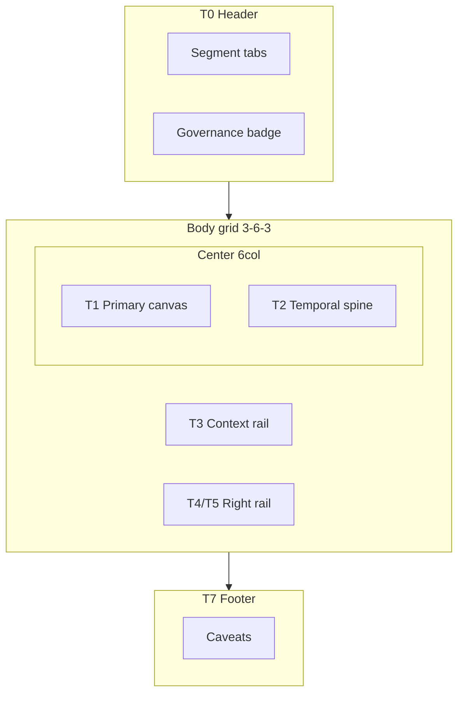
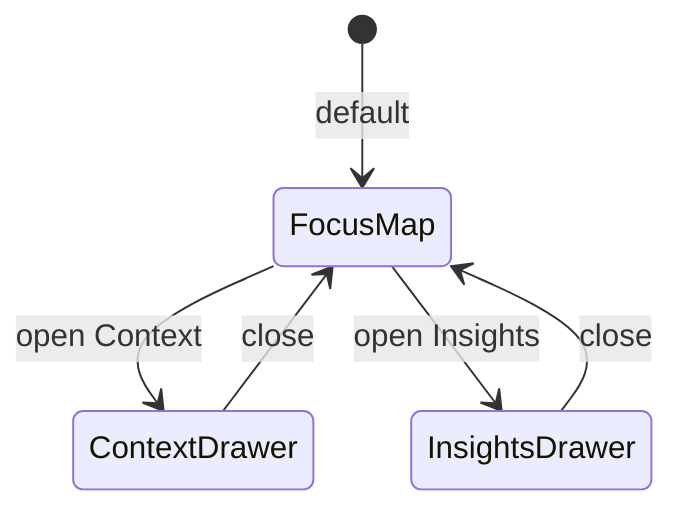

# H1 Workspace Layout Notes (PLAN-SA-H1)

**Status:** supporting sketches for [h1_sandbox_ux_architecture_plan.md](h1_sandbox_ux_architecture_plan.md)  
**Build recommendation:** plan-only — no implementation

These notes visualize three layout concepts for H2 evaluation. All share the **WorkspaceShell** contract defined in the main plan §7.

---

## Shared tier legend

```
T0 = governance header (segment tabs + mode badge)
T3 = left context rail
T1 = primary canvas (map / compare / filmstrip)
T2 = temporal spine (scrubber, narrative)
T4 = insight stack (analytics, workstation)
T5 = mock / illustrative sensors
T6 = export strip
T7 = caveats footer (paired with T0)
```

---

## Concept A — Segment shell (recommended H2 default)

Fixed 12-column grid; segment selector in T0 switches panel allowlist.

### ASCII (desktop ≥1024px)

```
+------------------------------------------------------------------+
| T0  [Scenario][Replay][Compare][Corpus][Report]  REPLAY — derived |
+----------+-------------------------------+-------------------------+
|          |                               |                         |
|   T3     |            T1                 |      T4 / T5            |
| context  |         primary map           |   (collapsed default    |
|  rail    |                               |    in Replay)           |
|          |                               |                         |
|          +-------------------------------+                         |
|          |            T2                 |                         |
|          |      scrubber / narrative     |                         |
+----------+-------------------------------+-------------------------+
| T7  Caveats — explanatory only; mirrors ≠ authority               |
+------------------------------------------------------------------+
```

### Column spans (Tailwind-aligned)

| Zone | `lg:col-span` |
|------|---------------|
| T3 | 3 |
| T1 + T2 stack | 6 |
| T4/T5 | 3 |

### Segment variants

| Segment | T3 | T1 | T2 | T4/T5 |
|---------|----|----|-----|-------|
| Replay | catalog minimal | single map | full | T5 collapsed |
| Compare | compare controls | dual map | shared or A/B | T5 collapsed, focus label |
| Corpus | browser + lineage | map on entry | optional | analytics hidden |
| Report | story / annotations | map or fullscreen | compact | T5 absent |
| Scenario | catalog + preview | optional preview | hidden | hidden |

### Mermaid



---

## Concept B — Focus mode (laptop / mentor demo)

T1 dominates; T3 and T4/T5 become slide-over drawers.

### ASCII

```
+------------------------------------------------------------------+
| T0  [Replay]  REPLAY — derived          [Context] [Insights]     |
+------------------------------------------------------------------+
|                                                                  |
|                         T1 full width                            |
|                      (map / compare)                             |
|                                                                  |
+------------------------------------------------------------------+
| T2  scrubber — pinned bottom                                     |
+------------------------------------------------------------------+
| T7  caveats                                                      |
+------------------------------------------------------------------+

  [Context drawer]     slides from left — T3 panels
  [Insights drawer]    slides from right — T4/T5 panels
```

### When to use

- Screen width &lt; 1280px
- Mentor live demo (minimize peripheral chrome)
- Optional H3 enhancement; H2 may ship A first with B as feature flag

### Mermaid



---

## Concept C — Publication mode (Report segment)

Aligns with existing `PresentationLayoutShell` — no mock column.

### ASCII

```
+------------------------------------------------------------------+
| T0  [Report]  REPORT — explanatory presentation                  |
+----------+-------------------------------------------+-----------+
|   T3     |              T1 map / fullscreen          |           |
|  story   |                                           |  (no T5)  |
|  or      +-------------------------------------------+           |
|  annot   |  T2 compact scrubber + chapter rail       |           |
+----------+-------------------------------------------+-----------+
| T6 export links — walkthrough, publication packet                  |
+------------------------------------------------------------------+
| T7 caveats                                                       |
+------------------------------------------------------------------+
```

### Column spans

| Layout | Left | Center |
|--------|------|--------|
| With story panel | 3 | 9 |
| Fullscreen map | 0 | 12 |

---

## Compare layout overlay (Concept A)

Compare keeps 3-6-3 but T1 splits:

```
+----------+---------------------------+---------+
| T3       |  T1a map    |  T1b map   | T4/T5   |
| compare  |   slot A    |   slot B   | focus   |
| controls |             |            | note    |
+----------+---------------------------+---------+
|          |     T2 shared or dual     |         |
+----------+---------------------------+---------+
```

Clock policy: see main plan §10.1 item 7 (Option A recommended).

---

## Filmstrip layout (Replay sub-profile)

Within Replay segment when `?filmstrip=` active:

```
+----------+-------------------------------------------+
| T3       |  T1: N-column mini-maps (N<=4)           |
| cohort   +-------------------------------------------+
| nav      |  T2 sync scrubber                       |
+----------+-------------------------------------------+
```

Uses dynamic `gridTemplateColumns` (existing `CohortFilmstripView` behavior); H2 wraps in WorkspaceShell with `layoutVariant: "filmstrip"`.

---

## Responsive collapse (all concepts)

| Breakpoint | Behavior |
|------------|----------|
| &lt; `lg` | Single column stack: T0 → T1 → T2 → T3 → T4/T5 → T7 |
| `lg+` | Concept A grid |
| `xl+` | Optional Concept B drawer triggers |

**H1 note:** Current viewer already collapses to one column; H2 should **reorder** stack to T0 → T1 → T2 → T3 → … for scan priority.

---

## Implementation notes for H2

1. Extract `WorkspaceShell` from duplicated grids in `App.tsx`, `CompareView.tsx`, `CohortFilmstripView.tsx`, `PresentationLayoutShell.tsx`.
2. Pass `layoutVariant: "segment" | "focus" | "publication" | "filmstrip" | "compare"`.
3. Panel registry drives `{t3, t1, t2, t4t5}` slot contents per segment.
4. Do not change bundle schema for layout.

---

*Companion to PLAN-SA-H1 §7. See [h1_sandbox_ux_architecture_plan.md](h1_sandbox_ux_architecture_plan.md).*
