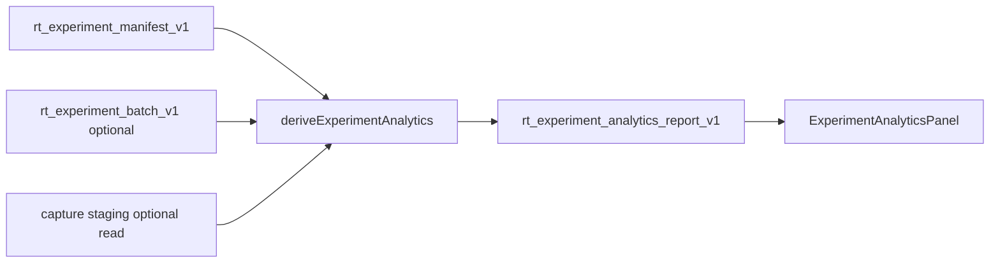

# RT-F1 — Experiment Analytics (PLAN-RT-F1)

**Phase:** PLAN-RT-F1 — experiment analytics architecture (docs only)  
**Prerequisite:** PLAN-RT-R2 frozen; PLAT-RT-X1 frozen  
**Contract:** [rt_experiment_analytics_v1.md](../evaluation/rt_experiment_analytics_v1.md)  
**UI contract:** [rt_experiment_analytics_ui_v1.md](../evaluation/rt_experiment_analytics_ui_v1.md)

## Goal

Define **deterministic, derived-only** experiment analytics on top of `rt_experiment_manifest_v1` — per-run, tactical, timing, capture, and compare summaries — without bridge changes or SA authority shifts.

## Architecture

## Allowed (PLAN wave)

- Contracts and reviews listed in [rt_f1_freeze_audit.md](../evaluation/rt_f1_freeze_audit.md)
- Cross-links to X1 compare semantics

## Forbidden

- Implementation under `platform/` or `scripts/rt/`
- New bridge telemetry or commands
- Parser/topic changes
- Readiness scoring or winner semantics

## PLAT-RT-F1 scope (advisory)

See [rt_roadmap_plat_rt_f1_v1.md](../evaluation/rt_roadmap_plat_rt_f1_v1.md):

- `analyticsDerive.ts` + tests
- `ExperimentAnalyticsPanel`, `ExperimentTrendStrip`
- Optional `rt_experiment_analytics.py` maintainer CLI

## Validation

Docs-only wave — regression evidence from existing X1/bridge tests cited in freeze audit.

## Stop line

PLAN-RT-F1 frozen. Do not start PLAT-RT-F1 without freeze + implementation governance review.

## Related

- [rt_f1_template_sweep_catalog_plan.md](rt_f1_template_sweep_catalog_plan.md)
- [rt_f1_architecture_review_r1.md](../evaluation/rt_f1_architecture_review_r1.md)
- [rt_f1_analytics_review_r1.md](../evaluation/rt_f1_analytics_review_r1.md)
