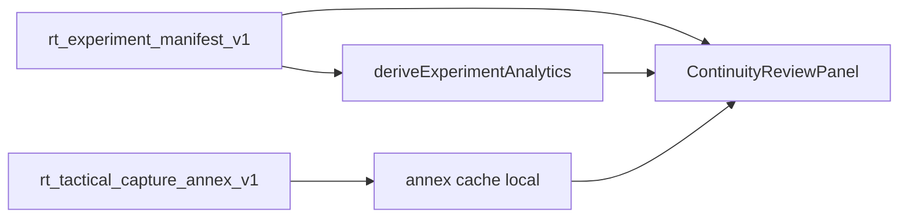

# RT-F3 — Experiment Annex Review (PLAN-RT-F3)

**Phase:** PLAN-RT-F3 — tactical annex & continuity review architecture (docs only)  
**Prerequisite:** PLAT-RT-F1 frozen; PLAT-RT-X1 frozen; PLAT-RT-TAC5 frozen  
**Contracts:** [rt_experiment_annex_review_ui_v1.md](../evaluation/rt_experiment_annex_review_ui_v1.md), [rt_experiment_continuity_review_v1.md](../evaluation/rt_experiment_continuity_review_v1.md)

## Goal

Define **read-only** RT workbench surfaces for full `rt_tactical_capture_annex_v1` timelines alongside F1 analytics and X1 compare — without bridge changes, SA viewer changes, or authority escalation.

## Architecture

## Allowed (PLAN wave)

- Contracts and reviews in [rt_f3_freeze_audit.md](../evaluation/rt_f3_freeze_audit.md)
- Cross-links to TAC5 annex schema and F1 analytics

## Forbidden

- Implementation under `platform/rt-sandbox-ui/` or `scripts/rt/` in PLAN wave
- Bridge command or telemetry changes
- SA viewer or auto-import scope
- Parser/topic changes
- Winner/readiness semantics

## PLAT-RT-F3 scope (advisory)

See [rt_roadmap_plat_rt_f3_v1.md](../evaluation/rt_roadmap_plat_rt_f3_v1.md).

## Stop line

PLAN-RT-F3 frozen. Do not start PLAT-RT-F3 without governance review + freeze audit.

## Related

- [rt_tac1_tactical_capture_continuity_v1.md](../evaluation/rt_tac1_tactical_capture_continuity_v1.md)
- [rt_f3_architecture_review_r1.md](../evaluation/rt_f3_architecture_review_r1.md)
- [rt_f3_governance_review_r1.md](../evaluation/rt_f3_governance_review_r1.md)
