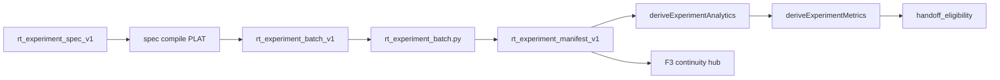

# RT-F5 — Advanced Runtime Experiments (PLAN-RT-F5)

**Phase:** PLAN-RT-F5 — advanced experiment architecture (docs only)  
**Prerequisite:** PLAT-RT-X1, PLAT-RT-F1, PLAT-RT-F3, PLAT-RT-F4 frozen  
**Contracts:** [rt_experiment_model_v1.md](../evaluation/rt_experiment_model_v1.md), [rt_experiment_metrics_v1.md](../evaluation/rt_experiment_metrics_v1.md), [rt_experiment_workflow_v1.md](../evaluation/rt_experiment_workflow_v1.md), [rt_experiment_advanced_ui_v1.md](../evaluation/rt_experiment_advanced_ui_v1.md)

## Goal

Define a **governed experiment taxonomy and maintainer workflow** on the stabilized RT sandbox stack: five experiment classes, extended metrics, end-to-end pipeline, and UI planning — **without** new runtime authority, bridge protocol changes, or SA automation.

## Architecture

| Layer | Role |
|-------|------|
| Model | [rt_experiment_model_v1.md](../evaluation/rt_experiment_model_v1.md) — classes, spec schema, manifest supplements |
| Metrics | [rt_experiment_metrics_v1.md](../evaluation/rt_experiment_metrics_v1.md) — extends F1; separate report schema |
| Workflow | [rt_experiment_workflow_v1.md](../evaluation/rt_experiment_workflow_v1.md) — phases A–I, SA eligibility ≠ import |
| UI | [rt_experiment_advanced_ui_v1.md](../evaluation/rt_experiment_advanced_ui_v1.md) — matrix, filters, extended compare |
| Matrix compile | [rt_f5_experiment_matrix_plan.md](rt_f5_experiment_matrix_plan.md) — cartesian / repeat_expand rules |

## Allowed (PLAN wave)

- Contracts, reviews, and freeze audit listed in [rt_f5_freeze_audit.md](../evaluation/rt_f5_freeze_audit.md)
- Reference fixtures: [fixtures/rt_experiments/f5_spec_examples/](../../fixtures/rt_experiments/f5_spec_examples/)
- Roadmap updates: [rt_roadmap_next_frontiers_v1.md](../evaluation/rt_roadmap_next_frontiers_v1.md), [rt_roadmap_plat_rt_f5_v1.md](../evaluation/rt_roadmap_plat_rt_f5_v1.md)
- Registry + AGENTS vocabulary row

## Forbidden

- Implementation under `platform/`, `scripts/rt/`, `platform/sa-r0-viewer/`, `src/counter_uas/`
- Bridge API / telemetry / subcommand changes
- Parser/topic/schema changes
- SA viewer changes; auto-import; federation writes
- Browser `capture_session` or subprocess batch from UI
- Distributed workers; PLAN-RT-M3 multi-bridge
- Tactical controller redesign
- Gazebo sensor-truth coupling (deferred — see roadmap **Runtime fidelity coupling**)

## PLAT-RT-F5 scope (advisory)

See [rt_roadmap_plat_rt_f5_v1.md](../evaluation/rt_roadmap_plat_rt_f5_v1.md):

- **P0:** `experimentSpecCompile.ts`, `metricsDerive.ts`, spec fixtures, `rt_experiment_spec_compile.py`
- **P1:** Extended compare, matrix panel, filter bar, handoff strip
- **P2:** `rt_experiment_metrics.py`, repeatability trend strip

## Validation

Docs-only wave — regression evidence from existing X1/F1/F4 tests cited in freeze audit:

- `lint_rt_runtime_subcommands`
- Bridge pytest
- `tier0-rt-ui`

## Stop line

PLAN-RT-F5 frozen. Do not start PLAT-RT-F5 without implementation plan + `rt_plat_f5_*` governance review + freeze audit.

## Related

- [rt_f5_experiment_matrix_plan.md](rt_f5_experiment_matrix_plan.md)
- [rt_f5_architecture_review_r1.md](../evaluation/rt_f5_architecture_review_r1.md)
- [rt_f5_governance_review_r1.md](../evaluation/rt_f5_governance_review_r1.md)
- [rt_f5_experiment_review_r1.md](../evaluation/rt_f5_experiment_review_r1.md)
- [rt_f5_freeze_audit.md](../evaluation/rt_f5_freeze_audit.md)
- [rt_experiment_workbench_v1.md](../evaluation/rt_experiment_workbench_v1.md)
- [rt_experiment_analytics_v1.md](../evaluation/rt_experiment_analytics_v1.md)
