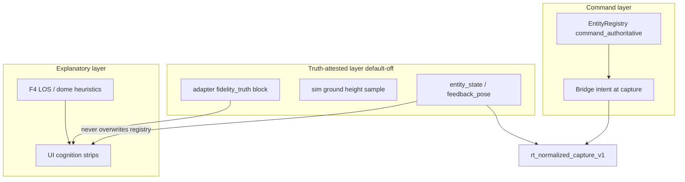

# RT-F5b — Runtime Fidelity Coupling (PLAN-RT-F5b)

**Phase:** PLAN-RT-F5b — Gazebo / sensor-truth fidelity coupling (docs only)  
**Prerequisite:** PLAT-RT-F5 P0/P1/P2, PLAT-RT-G6, PLAT-RT-F4, PLAT-RT-R2e frozen  
**Contracts:** [rt_runtime_fidelity_coupling_v1.md](../evaluation/rt_runtime_fidelity_coupling_v1.md), [rt_runtime_fidelity_cognition_v1.md](../evaluation/rt_runtime_fidelity_cognition_v1.md), [rt_experiment_metrics_v1.md](../evaluation/rt_experiment_metrics_v1.md) §11

## Goal

Define how the RT interactive sandbox can **couple more tightly** to Gazebo and sim-scoped sensor truth **safely** — with explicit authority layering, default-off coupling, and experiment fidelity metrics — **without** bridge HTTP changes, SA scope, parser/topic changes, or implementation in this wave.

**Vocabulary:** PLAN-RT-F5b / PLAT-RT-F5b are **not** registry RT-1..7 realism waves, **not** PLAN-RT-F5 experiment architecture, **not** operational sensor or C2 truth.

## Architecture

| Layer | Role |
|-------|------|
| Coupling | [rt_runtime_fidelity_coupling_v1.md](../evaluation/rt_runtime_fidelity_coupling_v1.md) — Gazebo pose, AGL, sensor-truth channels |
| Cognition | [rt_runtime_fidelity_cognition_v1.md](../evaluation/rt_runtime_fidelity_cognition_v1.md) — labels, stale truth, divergence |
| Metrics | [rt_experiment_metrics_v1.md](../evaluation/rt_experiment_metrics_v1.md) §11 — `rt_experiment_fidelity_metrics_report_v1` |
| Authority | [rt_authority_model_v1.md](../evaluation/rt_authority_model_v1.md) — command vs truth-attested vs explanatory |

## Allowed (PLAN wave)

- Contracts, reviews, and freeze audit listed in [rt_f5b_freeze_audit.md](../evaluation/rt_f5b_freeze_audit.md)
- Reference fixtures: [fixtures/rt_experiments/f5b_fidelity_examples/](../../fixtures/rt_experiments/f5b_fidelity_examples/)
- Roadmap updates: [rt_roadmap_next_frontiers_v1.md](../evaluation/rt_roadmap_next_frontiers_v1.md), [rt_roadmap_plat_rt_f5b_v1.md](../evaluation/rt_roadmap_plat_rt_f5b_v1.md)
- Registry + AGENTS vocabulary row
- Additive authority-label documentation (docs only; no runtime emission)

## Forbidden

- Implementation under `platform/`, `scripts/rt/`, `platform/sa-r0-viewer/`, `src/counter_uas/`
- [rt_bridge_contract_v1.md](../evaluation/rt_bridge_contract_v1.md) HTTP route or subcommand changes
- Parser/topic/schema changes (including `/tracks/state` and evaluation parser contracts)
- SA viewer changes; auto-import; federation writes
- Browser `capture_session` or subprocess batch from UI
- Distributed workers; PLAN-RT-M3 multi-bridge
- Tactical controller redesign
- Rewriting registry poses from sim or fictional terrain
- Claiming operational sensor truth, readiness, or effectiveness

## PLAT-RT-F5b scope (advisory)

See [rt_roadmap_plat_rt_f5b_v1.md](../evaluation/rt_roadmap_plat_rt_f5b_v1.md):

- **P0:** `enable_fidelity_coupling` flag; adapter IPC `fidelity_truth` block; capture `fidelity_pose_block`; audit events
- **P1:** Workstation + Cesium truth vs explanatory badges; stale/divergence strips
- **P2:** `fidelityMetricsDerive.ts`, `rt_experiment_fidelity_metrics.py`, experiment fidelity compare strip

## Validation

Docs-only wave — regression evidence from existing platform tests cited in freeze audit:

- `lint_rt_runtime_subcommands`
- Bridge pytest
- `tier0-rt-ui`

## Stop line

PLAN-RT-F5b frozen. Do not start PLAT-RT-F5b without implementation plan + `rt_plat_f5b_*` governance review + freeze audit.

## Related

- [rt_f5b_architecture_review_r1.md](../evaluation/rt_f5b_architecture_review_r1.md)
- [rt_f5b_governance_review_r1.md](../evaluation/rt_f5b_governance_review_r1.md)
- [rt_f5b_freeze_audit.md](../evaluation/rt_f5b_freeze_audit.md)
- [rt_adapter_live_sync_v1.md](../evaluation/rt_adapter_live_sync_v1.md)
- [rt_capture_pose_cognition_v1.md](../evaluation/rt_capture_pose_cognition_v1.md)
- [rt_runtime_realism_expansion_v1.md](../evaluation/rt_runtime_realism_expansion_v1.md)
- [rt_experiment_metrics_v1.md](../evaluation/rt_experiment_metrics_v1.md)
