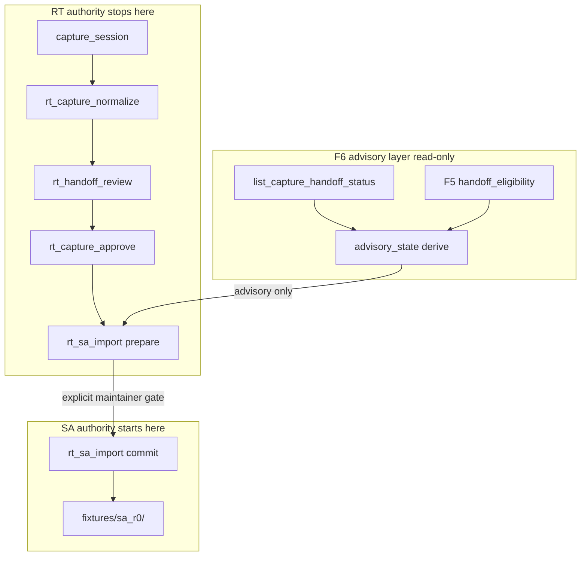

# RT-F6 — SA Workflow Automation Advisory (PLAN-RT-F6)

**Phase:** PLAN-RT-F6 — RT→SA workflow automation advisory (docs only)  
**Prerequisite:** PLAT-RT-SA1, PLAT-RT-SA2, PLAT-RT-SA3, PLAT-RT-F5 P0/P1/P2, PLAT-RT-F5b P0/P1/P2 frozen  
**Contracts:** [rt_sa_workflow_automation_v1.md](../evaluation/rt_sa_workflow_automation_v1.md), [rt_sa_workflow_advisory_ui_v1.md](../evaluation/rt_sa_workflow_advisory_ui_v1.md)

## Goal

Define the next safe frontier for **deeper RT→SA workflow automation** as an **advisory-only** model: five maintainer checkpoints (`capture_ready` → `review_complete` → `approval_ready` → `handoff_ready` → `import_ready`), explicit automation boundaries, failure/rollback rules, and PLAT advisory surfaces — **without** implementation, bridge protocol changes, SA viewer live hooks, or automatic replay import.

**Vocabulary:** PLAN-RT-F6 / PLAT-RT-F6 are **not** PLAT-RT-SA1/SA2/SA3 replacements, **not** registry RT-1..7 realism waves, **not** operational readiness or auto-import.

## Architecture

| Layer | Role |
|-------|------|
| Automation | [rt_sa_workflow_automation_v1.md](../evaluation/rt_sa_workflow_automation_v1.md) — advisory ladder, checkpoints, boundaries, rollback |
| Advisory UI | [rt_sa_workflow_advisory_ui_v1.md](../evaluation/rt_sa_workflow_advisory_ui_v1.md) — workbench, staging mirror, checklist, import advisory |
| Upstream | [rt_sa_import_bridge_v1.md](../evaluation/rt_sa_import_bridge_v1.md), [rt_manual_sa_import_workflow_v1.md](../evaluation/rt_manual_sa_import_workflow_v1.md) — frozen SA1 maintainer pipeline |
| Experiment | [rt_experiment_workflow_v1.md](../evaluation/rt_experiment_workflow_v1.md) — F5 eligibility ≠ import |

## Allowed (PLAN wave)

- Contracts, reviews, and freeze audit listed in [rt_f6_freeze_audit.md](../evaluation/rt_f6_freeze_audit.md)
- Reference fixtures: [fixtures/rt_handoff/f6_advisory_examples/](../../fixtures/rt_handoff/f6_advisory_examples/)
- Roadmap updates: [rt_roadmap_next_frontiers_v1.md](../evaluation/rt_roadmap_next_frontiers_v1.md), [rt_roadmap_plat_rt_f6_v1.md](../evaluation/rt_roadmap_plat_rt_f6_v1.md)
- Registry + AGENTS vocabulary row

## Forbidden

- Implementation under `platform/`, `scripts/rt/`, `platform/sa-r0-viewer/`, `src/counter_uas/`
- Bridge API / telemetry / subcommand changes (except future PLAT additive read-only fields audited separately)
- Parser/topic/schema changes
- SA viewer changes; **automatic import**; federation writes
- Browser `capture_session`, approve, import, or subprocess pipeline from UI
- Distributed workers; PLAN-RT-M3 multi-bridge
- Tactical controller redesign
- Operational readiness scoring; `readiness_score`; auto-import on capture or metrics

## PLAT-RT-F6 scope (advisory)

See [rt_roadmap_plat_rt_f6_v1.md](../evaluation/rt_roadmap_plat_rt_f6_v1.md):

- **P0:** Advisory state derive spec; `rt_handoff_advisory_status.py` (read-only); optional mirror `advisory_state` field
- **P1:** `SaWorkflowAdvisoryPanel`, checklist chips, workbench badges, import advisory strip; `BANNER_SA_WORKFLOW_ADVISORY`
- **P2:** Optional maintainer batch helpers (`--dry-run` default); corpus diff preview; no auto-commit

## Validation

Docs-only wave — regression evidence from existing platform tests cited in freeze audit:

- `lint_rt_runtime_subcommands`
- Bridge pytest (`test_rt_sandbox_bridge.py` SA1/SA2 paths)
- `tier0-rt-ui`

## Stop line

PLAN-RT-F6 frozen. Do not start PLAT-RT-F6 without implementation plan + `rt_plat_f6_*` governance review + freeze audit. Contamination re-check required before P2 helpers.

## Related

- [rt_f6_architecture_review_r1.md](../evaluation/rt_f6_architecture_review_r1.md)
- [rt_f6_governance_review_r1.md](../evaluation/rt_f6_governance_review_r1.md)
- [rt_f6_handoff_contamination_review_r1.md](../evaluation/rt_f6_handoff_contamination_review_r1.md)
- [rt_f6_freeze_audit.md](../evaluation/rt_f6_freeze_audit.md)
- [rt_rt_sa_bridge_handoff_v1.md](../evaluation/rt_rt_sa_bridge_handoff_v1.md)
- [rt_sa_lineage_protection_v1.md](../evaluation/rt_sa_lineage_protection_v1.md)
- [rt_sa2_multi_session_handoff_ui_v1.md](../evaluation/rt_sa2_multi_session_handoff_ui_v1.md)
