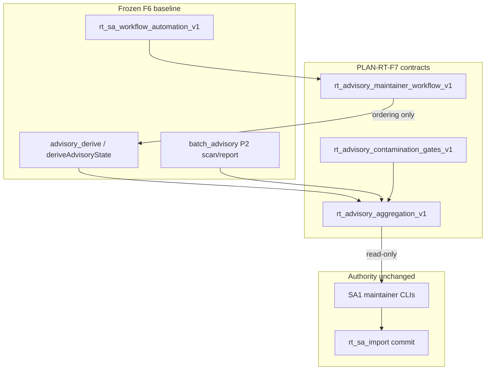

# RT-F7 — Post-F6 Advisory Expansion (PLAN-RT-F7)

**Phase:** PLAN-RT-F7 — post-F6 advisory expansion (docs only)  
**Prerequisite:** PLAT-RT-F6 P0–P2 frozen; PLAN-RT-F6 frozen; PLAT-RT-M3 complete; PLAN-RT-C1 frozen  
**Contracts:** [rt_advisory_maintainer_workflow_v1.md](../evaluation/rt_advisory_maintainer_workflow_v1.md), [rt_advisory_contamination_gates_v1.md](../evaluation/rt_advisory_contamination_gates_v1.md), [rt_advisory_aggregation_v1.md](../evaluation/rt_advisory_aggregation_v1.md)

## Goal

Define the next **advisory-only** frontier after PLAT-RT-F6: maintainer ergonomics (queue prioritization, blocker grouping, capture triage, bulk workflow), stronger RT↔SA contamination gates, and structured aggregation (multi-capture summaries, experiment rollups, readiness cohorts) — **without** bridge/runtime implementation, SA viewer changes, auto-import, or distributed multi-bridge.

**Vocabulary:** **PLAN-RT-F7** / **PLAT-RT-F7** are **not** PLAT-RT-F6 replacements, **not** registry RT-1..7 realism waves, **not** v1 “F7 = distributed”, and **not** operational readiness scoring. **Readiness grouping** means advisory cohort labels only.

## Architecture



| Layer | Role |
|-------|------|
| F6 baseline | [rt_sa_workflow_automation_v1.md](../evaluation/rt_sa_workflow_automation_v1.md) — five-rung ladder, per-capture derive |
| Maintainer workflow | [rt_advisory_maintainer_workflow_v1.md](../evaluation/rt_advisory_maintainer_workflow_v1.md) — queue, triage, bulk maintainer flow |
| Contamination gates | [rt_advisory_contamination_gates_v1.md](../evaluation/rt_advisory_contamination_gates_v1.md) — boundary checks, escalation limits |
| Aggregation | [rt_advisory_aggregation_v1.md](../evaluation/rt_advisory_aggregation_v1.md) — batch summary schema, rollups, cohorts |
| Upstream | F6 P2 `rt_handoff_batch_advisory.py`, [rt_manual_sa_import_workflow_v1.md](../evaluation/rt_manual_sa_import_workflow_v1.md) |

**F7 vs F6:** F6 defines per-capture ladder and minimal `aggregate_report()` counts. F7 **normativizes** prioritization, blocker taxonomy, triage lanes, and extended batch summary — it does not re-specify ladder rungs or replace P2 CLIs.

## Workstreams

| # | Workstream | Contract |
|---|------------|----------|
| 1 | Maintainer ergonomics | [rt_advisory_maintainer_workflow_v1.md](../evaluation/rt_advisory_maintainer_workflow_v1.md) |
| 2 | Advisory contamination gates | [rt_advisory_contamination_gates_v1.md](../evaluation/rt_advisory_contamination_gates_v1.md) |
| 3 | Advisory aggregation | [rt_advisory_aggregation_v1.md](../evaluation/rt_advisory_aggregation_v1.md) |
| 4 | Governance + validation | Reviews + [rt_f7_freeze_audit.md](../evaluation/rt_f7_freeze_audit.md) |

## Allowed (PLAN wave)

- Master plan, three contracts, reviews, freeze audit
- Reference fixtures: [fixtures/rt_handoff/f7_advisory_examples/](../../fixtures/rt_handoff/f7_advisory_examples/)
- [rt_roadmap_plat_rt_f7_v1.md](../evaluation/rt_roadmap_plat_rt_f7_v1.md), [rt_roadmap_next_frontiers_v3.md](../evaluation/rt_roadmap_next_frontiers_v3.md)
- [freeze_registry_r1.md](../evaluation/freeze_registry_r1.md) + [AGENTS.md](../../AGENTS.md) vocabulary row

## Forbidden

- Implementation under `platform/`, `scripts/rt/` (except fixture paths), `platform/sa-r0-viewer/`, `src/counter_uas/`
- Bridge API / telemetry / subcommand registry changes
- Parser/topic/schema changes
- SA viewer changes; **automatic import**; federation writes from RT
- Browser `capture_session`, approve, import, or subprocess pipeline from UI
- Distributed multi-bridge; tactical redesign
- Operational readiness scoring; `readiness_score`; auto-import on `import_ready` or F5 `eligible`
- Re-opening F6 ladder semantics or SA1/SA2/SA3 authority model

## PLAT-RT-F7 scope (advisory — not authorized by PLAN)

See [rt_roadmap_plat_rt_f7_v1.md](../evaluation/rt_roadmap_plat_rt_f7_v1.md):

- **P0:** Queue priority + blocker groups + `rt_advisory_batch_summary_v1` in derive/batch; CLI extensions; golden fixtures
- **P1:** Read-only triage queue UI, cohort chips, grouped blocker strip
- **P2:** Bulk workflow hardening (dry-run guards, stand-up export JSON)

## Validation

Docs-only wave — cite existing suites in freeze audit:

```bash
python3 scripts/rt/lint_rt_runtime_subcommands.py --check
python3 -m pytest src/counter_uas/test/test_rt_handoff_batch_advisory.py -q
scripts/ci_eval.sh tier0-rt-ui
```

## Stop line

**PLAN-RT-F7** freezes advisory expansion planning. Do not start **PLAT-RT-F7** without implementation plan + `rt_plat_f7_*` governance review + contamination review + freeze audit.

## Related

- [rt_f7_architecture_review_r1.md](../evaluation/rt_f7_architecture_review_r1.md)
- [rt_f7_governance_review_r1.md](../evaluation/rt_f7_governance_review_r1.md)
- [rt_f7_handoff_contamination_review_r1.md](../evaluation/rt_f7_handoff_contamination_review_r1.md)
- [rt_f7_freeze_audit.md](../evaluation/rt_f7_freeze_audit.md)
- [rt_f6_freeze_audit.md](../evaluation/rt_f6_freeze_audit.md)
- [rt_plat_m3_p2_freeze_audit.md](../evaluation/rt_plat_m3_p2_freeze_audit.md)
- [rt_sa_lineage_protection_v1.md](../evaluation/rt_sa_lineage_protection_v1.md)
