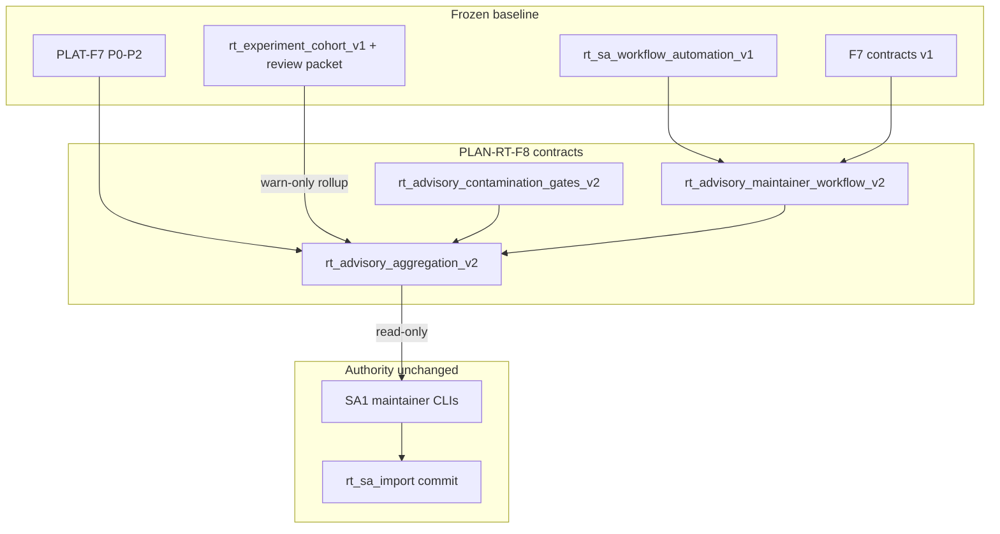

# RT-F8 — Post-F7 Advisory Maintainer Expansion (PLAN-RT-F8)

**Phase:** PLAN-RT-F8 — post-F7 advisory maintainer expansion (docs only)  
**Prerequisite:** PLAT-RT-F7 P0–P2 frozen; PLAN-RT-F7 frozen; PLAN-RT-C3 frozen; PLAT-RT-X2 complete  
**Contracts:** [rt_advisory_maintainer_workflow_v2.md](../evaluation/rt_advisory_maintainer_workflow_v2.md), [rt_advisory_contamination_gates_v2.md](../evaluation/rt_advisory_contamination_gates_v2.md), [rt_advisory_aggregation_v2.md](../evaluation/rt_advisory_aggregation_v2.md)

## Goal

Define the next **advisory-only** frontier after PLAT-RT-F7: broader maintainer queue ergonomics (filter presets, focus sets, review-lane templates), deeper cohort and experiment/handoff rollups, stronger RT↔SA contamination discipline (F8-CONT matrix, X2 adjacency), and aggregation v2 (`rt_advisory_batch_summary_v2`) — **without** bridge/runtime implementation, SA viewer changes, auto-import, federation writes, or distributed multi-bridge.

**Vocabulary:** **PLAN-RT-F8** / **PLAT-RT-F8** are **not** PLAT-RT-F7 replacements, **not** registry RT-1..7 realism waves, **not** distributed multi-bridge, and **not** operational readiness scoring. **Experiment cohort** (X2 `rt_experiment_cohort_v1`) is **not** **readiness_cohort** / **readiness_cohort_v2** (F7/F8 advisory buckets) is **not** F7 blocker groups.

## Architecture



| Layer | Role |
|-------|------|
| F6 + F7 baseline | [rt_sa_workflow_automation_v1.md](../evaluation/rt_sa_workflow_automation_v1.md), F7 v1 contracts, PLAT-F7 queue/summary/v2 export |
| Maintainer workflow v2 | [rt_advisory_maintainer_workflow_v2.md](../evaluation/rt_advisory_maintainer_workflow_v2.md) — presets, review lanes, templates |
| Contamination gates v2 | [rt_advisory_contamination_gates_v2.md](../evaluation/rt_advisory_contamination_gates_v2.md) — F8-CONT, X2 packet adjacency, escalation v2 |
| Aggregation v2 | [rt_advisory_aggregation_v2.md](../evaluation/rt_advisory_aggregation_v2.md) — `rt_advisory_batch_summary_v2`, multi-capture cohort + handoff rollups |
| Upstream (read-only audit) | `advisory_queue.py`, `batch_advisory.py`, `rt_handoff_batch_advisory.py`, `AdvisoryTriageQueuePanel.tsx`, X2 `cohortIndexStore.ts` |

**F8 vs F7:** F7 normativized queue bands (P0–P7), blocker taxonomy, `rt_advisory_batch_summary_v1`, and `rt_advisory_batch_review_v2` stand-up export. F8 **extends** maintainer ergonomics and rollups **without** re-opening F6 five-rung ladder semantics, F7 band ranks, or SA1 commit authority.

## Workstreams

| # | Workstream | Contract |
|---|------------|----------|
| 1 | Maintainer ergonomics v2 | [rt_advisory_maintainer_workflow_v2.md](../evaluation/rt_advisory_maintainer_workflow_v2.md) |
| 2 | Advisory contamination gates v2 | [rt_advisory_contamination_gates_v2.md](../evaluation/rt_advisory_contamination_gates_v2.md) |
| 3 | Advisory aggregation v2 | [rt_advisory_aggregation_v2.md](../evaluation/rt_advisory_aggregation_v2.md) |
| 4 | Governance + validation | Reviews + [rt_f8_freeze_audit.md](../evaluation/rt_f8_freeze_audit.md) |

## Allowed (PLAN wave)

- Master plan, three v2 contracts, reviews, freeze audit
- Reference fixtures: [fixtures/rt_handoff/f8_advisory_examples/](../../fixtures/rt_handoff/f8_advisory_examples/)
- [rt_roadmap_plat_rt_f8_v1.md](../evaluation/rt_roadmap_plat_rt_f8_v1.md), [rt_roadmap_next_frontiers_v8.md](../evaluation/rt_roadmap_next_frontiers_v8.md)
- [freeze_registry_r1.md](../evaluation/freeze_registry_r1.md) + [AGENTS.md](../../AGENTS.md) vocabulary row

## Forbidden

- Implementation under `platform/`, `scripts/rt/` (except fixture paths), `platform/sa-r0-viewer/`, `src/counter_uas/`
- Bridge API / telemetry / subcommand registry changes
- Parser/topic/schema changes
- SA viewer changes; **automatic import**; federation writes from RT
- Browser `capture_session`, approve, import, or subprocess pipeline from UI
- Distributed multi-bridge; tactical redesign
- Operational readiness scoring; `readiness_score`; auto-import on `import_ready` or F5 `eligible`
- Re-opening F6 ladder semantics, F7 P0–P7 band ranks, or SA1/SA2/SA3 authority model
- Authorizing PLAT-RT-F8, PLAN-RT-V4, or PLAN-RT-X3 implementation in this wave

## PLAT-RT-F8 scope (advisory — not authorized by PLAN)

See [rt_roadmap_plat_rt_f8_v1.md](../evaluation/rt_roadmap_plat_rt_f8_v1.md):

- **P0:** `rt_advisory_batch_summary_v2`, filter presets, extended golden fixtures
- **P1:** Read-only triage preset UI, cohort v2 chips, experiment-handoff rollup strip
- **P2:** Stand-up template packs, corpus-preview refinements (read-only), stricter v2 dry-run guards

## Validation

Docs-only wave — cite existing suites in freeze audit:

```bash
python3 scripts/rt/lint_rt_runtime_subcommands.py --check
python3 -m pytest src/counter_uas/test/test_advisory_queue.py \
  src/counter_uas/test/test_rt_handoff_batch_advisory.py -q
cd platform/rt-sandbox-ui && npm test && npm run build
scripts/ci_eval.sh tier0-rt-ui
```

## Stop line

**PLAN-RT-F8** freezes post-F7 advisory maintainer expansion planning. Do not start **PLAT-RT-F8** without implementation plan + `rt_plat_f8_*` governance review + contamination review + freeze audit.

## Related

- [rt_f8_architecture_review_r1.md](../evaluation/rt_f8_architecture_review_r1.md)
- [rt_f8_governance_review_r1.md](../evaluation/rt_f8_governance_review_r1.md)
- [rt_f8_handoff_contamination_review_r1.md](../evaluation/rt_f8_handoff_contamination_review_r1.md)
- [rt_f8_freeze_audit.md](../evaluation/rt_f8_freeze_audit.md)
- [rt_f7_freeze_audit.md](../evaluation/rt_f7_freeze_audit.md)
- [rt_plat_f7_p2_freeze_audit.md](../evaluation/rt_plat_f7_p2_freeze_audit.md)
- [rt_c3_platform_consolidation_freeze_audit.md](../evaluation/rt_c3_platform_consolidation_freeze_audit.md)
- [rt_roadmap_next_frontiers_v7.md](../evaluation/rt_roadmap_next_frontiers_v7.md)
