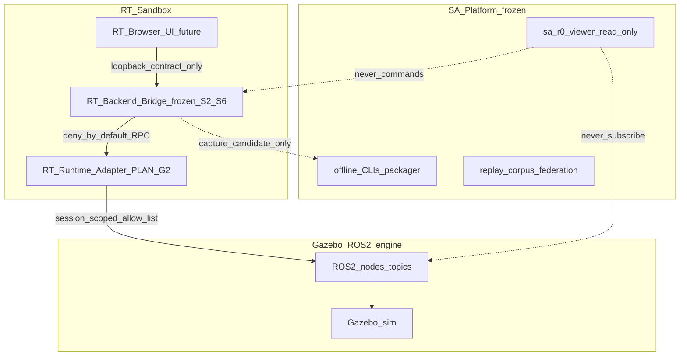

# RT-G1 — Gazebo/ROS Integration Boundary Planning (PLAN-RT-G1)

**Phase:** RT-G1 — Gazebo/ROS integration architecture (docs only)  
**Prerequisite:** PLAN-RT-S1 and PLAT-RT-S2 through PLAT-RT-S6 frozen at pushed commit `d650436` or later on `feature/rt-s1-sandbox-architecture`  
**Build recommendation:** plan-only documentation — **no Gazebo/ROS implementation**  
**Authority:** [AGENTS.md](../../AGENTS.md); frozen PLAT-RT-S* behavior unchanged

**Companion artifacts:**

- [rt_gazebo_ros_boundary_v1.md](../evaluation/rt_gazebo_ros_boundary_v1.md)
- [rt_runtime_synchronization_v1.md](../evaluation/rt_runtime_synchronization_v1.md)
- [rt_roadmap_g2_g5_v1.md](../evaluation/rt_roadmap_g2_g5_v1.md)
- [rt_g1_governance_review_r1.md](../evaluation/rt_g1_governance_review_r1.md)
- [rt_g1_freeze_audit.md](../evaluation/rt_g1_freeze_audit.md)

Additive updates: [rt_runtime_governance_v1.md](../evaluation/rt_runtime_governance_v1.md), [rt_bridge_contract_v1.md](../evaluation/rt_bridge_contract_v1.md), [rt_sa_export_boundary_v1.md](../evaluation/rt_sa_export_boundary_v1.md), [rt_capture_continuity_v1.md](../evaluation/rt_capture_continuity_v1.md)

---

## 1. Purpose and scope

### 1.1 Purpose

Define the **governance-safe architecture and isolation boundaries** for future **RT ↔ Gazebo/ROS2** integration after PLAT-RT-S6, without modifying launch files, Gazebo worlds, ROS nodes, or the existing bridge implementation.

RT-G1 constrains implementation waves **RT-G2 through RT-G5** and preserves:

- SA replay/governance platform freeze discipline
- RT↔SA export boundary (`capture_session ≠ SA import`)
- Deny-by-default ROS interaction
- Local loopback prototype assumptions

### 1.2 Vocabulary (mandatory)

| Term | Meaning |
|------|---------|
| **SA sandbox workstation** | Replay-first read-only UX (PLAN-SA-H*) |
| **RT interactive sandbox** | PLAT-RT-S* + future PLAT-RT-G* transient workflows |
| **RT-1..RT-7** (registry) | Runtime **realism** waves — unrelated to RT-G* |
| **RuntimeStub** | PLAT-RT-S2 sleep subprocess — **pre-G2 stand-in**; not Gazebo |
| **RT Runtime Adapter** | Future local process between bridge and Gazebo/ROS (G2+) |

### 1.3 In scope (RT-G1)

| In scope | Out of scope |
|----------|--------------|
| Four-layer stack (Browser → Bridge → Adapter → Gazebo/ROS) | Gazebo/ROS implementation |
| Authority and simulation ownership model | ROS launch / world / node changes |
| ROS/Gazebo boundary spec (docs) | Runtime adapter code |
| Synchronization semantics (docs) | rosbridge / legacy `web/` |
| Failure/cleanup semantics (docs) | SA viewer changes |
| Governance protections (docs) | Federation/orchestration writes |
| RT-G2–G5 roadmap (docs) | Production security infra |
| Freeze audit + governance review | Browser→ROS authority |

---

## 2. Architecture split (four layers)

### 2.1 Layer responsibilities

| Layer | Owns | Must not own |
|-------|------|----------------|
| **RT Browser UI** | Command intent via [rt_bridge_contract_v1.md](../evaluation/rt_bridge_contract_v1.md) | ROS credentials, DDS graph, Gazebo API |
| **RT Backend Bridge** | Session lifecycle, entity/world command authority (pre-G3), deny-by-default gate, audit, capture staging | Parser contracts, corpus/federation, replay truth |
| **RT Runtime Adapter** (G2+) | Child process lifecycle, ROS allow-list proxy, pose/clock translation, telemetry fan-in to bridge | SA import, operational semantics, persistent sim authority |
| **Gazebo/ROS2** | Physics/sim execution, topic truth while processes run | Replay lineage, corpus promotion, federation index |
| **SA Platform** | Replay bundles, validation, packaging, provenance, import | RT session commands, live ROS in viewer |

### 2.2 Simulation ownership

| Concern | Owner until G3 | Owner from G3 (planned) |
|---------|------------------|-------------------------|
| **Command authority** | Bridge `WorldStateStore` + entity registry | Bridge remains command authority; adapter applies poses to sim |
| **Physics truth** | N/A (RuntimeStub) | Gazebo while adapter session active |
| **Pose mirrors** | Bridge-generated telemetry | Adapter-fed mirrors; still non-authoritative for replay |
| **Session scope** | Single bridge instance, single active session | Unchanged |

**Pre-G2 stand-in:** [`runtime_stub.py`](../../platform/rt-sandbox-bridge/rt_sandbox/runtime_stub.py) satisfies session lifecycle without sim. G2 **supersedes stub per session** when adapter attaches; stub remains fallback when adapter disabled (maintainer flag).

### 2.3 Entity synchronization boundary (model only; G3 implements)

- Bridge assigns **session-scoped** `entity_id` (UUID).
- Adapter maintains **ephemeral sim handles** (`sim_entity_ref`) mapped 1:1 per session.
- Stale sync, topic timeout, and disconnect produce **non-authoritative** failure mirrors — never SA replay state.
- Details: [rt_runtime_synchronization_v1.md](../evaluation/rt_runtime_synchronization_v1.md).

---

## 3. Bridge ↔ adapter ↔ engine boundaries

| Boundary | Rule |
|----------|------|
| Browser ↔ Bridge | Loopback HTTP/WebSocket to bridge only — unchanged from PLAT-RT-S2 |
| Bridge ↔ Adapter | Local RPC/IPC; bridge holds adapter spawn credentials; browser does not |
| Adapter ↔ ROS | Deny-by-default topic allow-list; see [rt_gazebo_ros_boundary_v1.md](../evaluation/rt_gazebo_ros_boundary_v1.md) |
| Adapter ↔ Gazebo | Launch/teardown owned by adapter subprocess; not browser |
| Bridge ↔ SA | Capture candidate handoff only — [rt_sa_export_boundary_v1.md](../evaluation/rt_sa_export_boundary_v1.md) |
| SA viewer ↔ RT/ROS | **No connection** |

---

## 4. RT↔SA replay isolation (G1 reinforcement)

| Invariant | Rule |
|-----------|------|
| Live telemetry | Mirrors only — not replay clocks or parser summaries |
| Gazebo runtime state | Transient — dies with session or cleanup |
| `capture_session` | Emits candidate only — not SA import |
| Lineage | `session_id` / `sim_entity_ref` never authoritative parents |
| Federation/orchestration | SA-only entrypoints — RT sessions have zero write authority |

G5 (future) may normalize runtime provenance into capture manifests — still through maintainer gates.

---

## 5. Governance protections (summary)

Full rules: [rt_runtime_governance_v1.md](../evaluation/rt_runtime_governance_v1.md) § RT-G1; [rt_gazebo_ros_boundary_v1.md](../evaluation/rt_gazebo_ros_boundary_v1.md).

| Protection | RT-G1 rule |
|------------|------------|
| Deny-by-default ROS | Empty allow-list until PLAT-RT-G2 wave audit extends |
| No browser ROS credentials | Unchanged |
| Local-only prototype | Loopback bridge + localhost adapter |
| Process isolation | Adapter subprocess per session; bridge supervises teardown |
| Orphan cleanup | `cleanup_pending` + `cleanup_pending_max_age` (R5 mitigation) |
| Parser/topic freeze | No RT path may alter `/tracks/state` or parser contracts |

---

## 6. Failure and cleanup (summary)

| Failure class | Bridge tendency | Replay authority |
|---------------|-----------------|----------------|
| Gazebo launch failure | `failed` → `cleanup_pending` | None |
| ROS node crash | `runtime_crashed` → `cleanup_pending` | None |
| Topic timeout | Degraded mirror; may → `failed` | None |
| Stale entity sync | `INVALID_POSE` / resync / `reset_session` | None |
| Adapter disconnect | `bridge_disconnected` → `failed` after timeout | None |

Normative detail: [rt_runtime_synchronization_v1.md](../evaluation/rt_runtime_synchronization_v1.md) § 6; [rt_session_lifecycle_v1.md](../evaluation/rt_session_lifecycle_v1.md) § 3.

---

## 7. Deliverables (RT-G1)

| ID | Document |
|----|----------|
| G1.1 | This plan |
| G1.2 | [rt_gazebo_ros_boundary_v1.md](../evaluation/rt_gazebo_ros_boundary_v1.md) |
| G1.3 | [rt_runtime_synchronization_v1.md](../evaluation/rt_runtime_synchronization_v1.md) |
| G1.4 | [rt_roadmap_g2_g5_v1.md](../evaluation/rt_roadmap_g2_g5_v1.md) |
| G1.5 | [rt_g1_governance_review_r1.md](../evaluation/rt_g1_governance_review_r1.md) |
| G1.6 | [rt_g1_freeze_audit.md](../evaluation/rt_g1_freeze_audit.md) |
| G1.7 | Additive contract/governance updates (same commit) |

---

## 8. Validation checklist

| Check | Method |
|-------|--------|
| Governance review | [rt_g1_governance_review_r1.md](../evaluation/rt_g1_governance_review_r1.md) |
| RT↔ROS isolation | Boundary spec blocked-path table |
| Replay boundary | Export boundary + capture continuity cross-ref |
| No SA contamination | `platform/sa-r0-viewer/` untouched; no orchestration paths |
| No operational semantics | Forbidden lexicon in G1 docs |
| Implementation absence | G1 commit contains `docs/` + `AGENTS.md` + freeze registry only |

No pytest required for PLAN-RT-G1 (docs-only).

---

## 9. Stop line

**After PLAN-RT-G1 freeze:**

- Do **not** implement Gazebo adapter, ROS spawning, or launch/world/node changes without **PLAT-RT-G2** wave plan + freeze audit.
- Do **not** merge G1 planning with PLAT-RT-S3–S6 implementation commits.
- **RuntimeStub** remains default until G2 enables adapter per session.

**Next wave:** [rt_roadmap_g2_g5_v1.md](../evaluation/rt_roadmap_g2_g5_v1.md) — PLAT-RT-G2 local Gazebo adapter prototype.

---

## Related

- [rt_s1_interactive_sandbox_architecture_plan.md](rt_s1_interactive_sandbox_architecture_plan.md)
- [rt_s6_sandbox_workflow_plan.md](rt_s6_sandbox_workflow_plan.md)
- [rt_s6_freeze_audit.md](../evaluation/rt_s6_freeze_audit.md)
